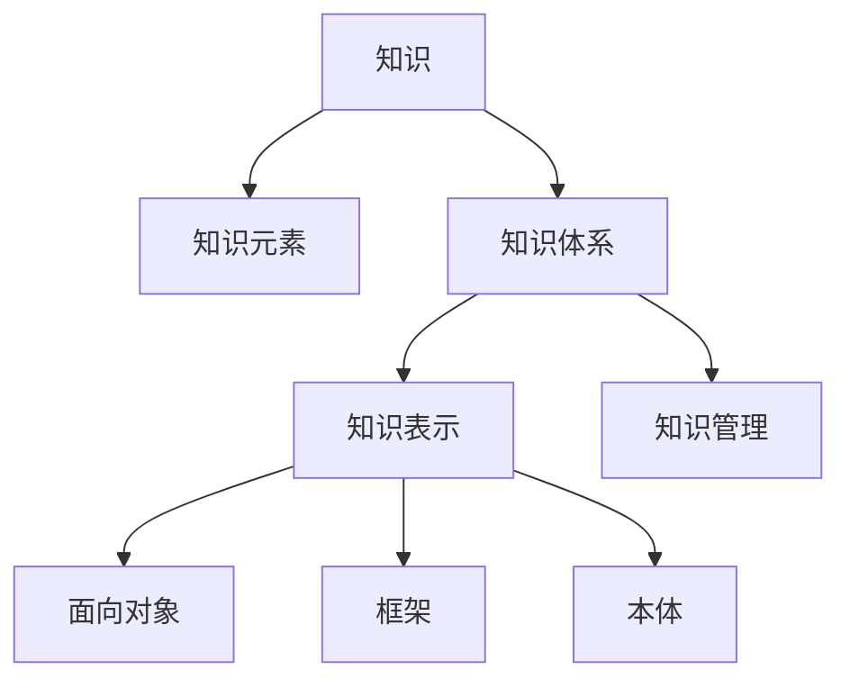
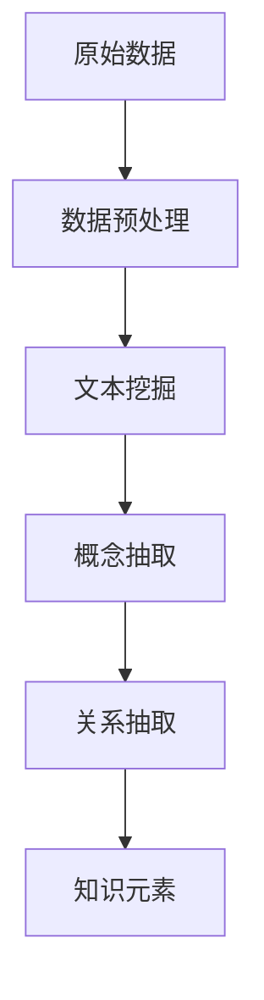
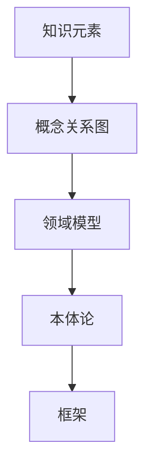
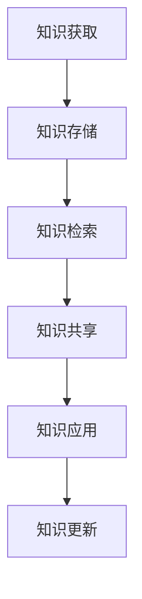
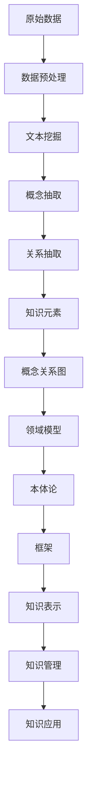

                 

# 知识体系的构建：从基本元素到复杂结构

## 1. 背景介绍

在现代信息技术时代，知识体系的构建已经成为了推动技术进步和社会发展的重要驱动力。随着大数据、人工智能、云计算等技术的快速发展，构建高效、完整、结构化的知识体系，成为了各行各业的重要课题。从人工智能研究到企业技术创新，再到个人知识管理，知识体系的构建涉及基本元素、系统结构、组织机制等多个层面。本文将从基本概念入手，探讨知识体系的构建方法，并结合实际应用场景进行详细讲解。

### 1.1 问题由来
在信息技术领域，知识的获取、存储、应用是推动技术发展的重要驱动力。面对海量数据和复杂问题，构建高效的知识体系能够提升信息检索、数据分析、决策支持等方面的能力，从而提高整体系统的性能和效率。然而，传统的知识表示和组织方式往往存在冗余、分散、缺乏系统性的问题，难以适应现代信息社会的复杂需求。

### 1.2 问题核心关键点
构建知识体系的核心关键点包括：
- 识别和抽取知识元素：如何从文本、数据、经验中高效抽取有用的知识元素，是构建知识体系的前提。
- 组织和关联知识元素：如何将知识元素以结构化方式组织和关联，形成有机的知识网络，是构建知识体系的关键。
- 知识共享与协同：如何使知识在团队、组织、社区间共享和协同，最大化知识价值，是构建知识体系的目标。
- 适应性和可扩展性：知识体系需要具备适应性和可扩展性，以应对技术和应用场景的变化，持续更新和优化。

### 1.3 问题研究意义
构建高效的知识体系，对于推动技术进步、提升企业竞争力、加速社会知识创新具有重要意义：
- 提高信息检索和处理效率：结构化的知识体系能显著提升信息检索和处理的精度和速度。
- 促进创新和决策支持：知识体系的构建有助于汇聚和整合跨领域知识，为创新和决策提供有力支持。
- 强化团队协作和共享：通过知识体系的构建，促进团队间的知识交流和协作，增强团队的整体能力。
- 提升企业价值和竞争力：知识体系的应用有助于企业在竞争中保持优势，实现持续增长。

## 2. 核心概念与联系

### 2.1 核心概念概述

为更好地理解知识体系的构建方法，本节将介绍几个密切相关的核心概念：

- 知识(Knowledge)：指对某个领域或问题的理解、经验和理论。知识可以来源于经验、文献、实践等多种渠道。
- 知识元素(Knowledge Element)：指知识体系中的基本组成单元，如概念、术语、事实、关系等。
- 知识体系(Knowledge System)：指由一系列知识元素以特定方式组织和关联形成的知识网络。知识体系可以是显式的，也可以是隐性的。
- 知识表示(Knowledge Representation)：指将知识元素以结构化或非结构化形式表示出来的技术。常见的知识表示方法包括面向对象、框架、本体等。
- 知识管理(Knowledge Management)：指对知识资源的管理和利用，包括知识的获取、组织、共享和应用。知识管理旨在提高知识资源的价值和使用效率。

这些核心概念之间的逻辑关系可以通过以下Mermaid流程图来展示：



这个流程图展示了几类核心概念之间的关系：

1. 知识从多个渠道获取后，可以分解为基本知识元素。
2. 知识元素以特定方式组织和关联，形成知识体系。
3. 知识体系通过知识表示技术进行结构化表示。
4. 知识管理体系确保知识的获取、组织、共享和应用。

通过这些核心概念，我们可以更好地把握知识体系的构建过程和目标。

### 2.2 概念间的关系

这些核心概念之间存在着紧密的联系，形成了知识体系的构建生态系统。下面我通过几个Mermaid流程图来展示这些概念之间的关系。

#### 2.2.1 知识元素的抽取过程



这个流程图展示了从原始数据中抽取知识元素的过程：首先对数据进行预处理，然后进行文本挖掘和概念、关系抽取，最终形成知识元素。

#### 2.2.2 知识体系的结构设计



这个流程图展示了知识体系的结构设计过程：将知识元素通过概念关系图、领域模型、本体论等方式进行组织和关联，形成结构化的知识体系。

#### 2.2.3 知识管理的生命周期



这个流程图展示了知识管理的生命周期过程：从知识获取到知识应用，再到知识更新，形成了知识管理的闭环。

### 2.3 核心概念的整体架构

最后，我们用一个综合的流程图来展示这些核心概念在大规模知识体系构建中的整体架构：



这个综合流程图展示了从原始数据到知识元素，再到结构化知识体系和知识管理的完整过程。通过这些流程图，我们可以更清晰地理解知识体系的构建过程中各个环节的逻辑关系。

## 3. 核心算法原理 & 具体操作步骤
### 3.1 算法原理概述

知识体系的构建，本质上是一个由数据到知识、由知识到应用的过程。其核心算法原理可以概括为：

1. 数据预处理：从原始数据中提取出有用的信息，去除噪声和冗余，为后续的知识抽取奠定基础。
2. 文本挖掘和概念抽取：通过自然语言处理技术，从文本中抽取关键概念和关系，构建知识元素。
3. 知识组织和关联：将知识元素以特定方式组织和关联，形成结构化的知识体系。
4. 知识表示和存储：将知识元素转换为计算机可处理的形式，存储在知识库中，供后续检索和应用。
5. 知识管理和应用：通过知识管理的机制，促进知识在团队、组织、社区间的共享和应用，实现知识价值的最大化。

这些步骤可以通过计算机算法实现，从而构建高效的知识体系。

### 3.2 算法步骤详解

#### 3.2.1 数据预处理

数据预处理是知识体系构建的第一步，目的是从原始数据中提取出有用的信息。主要步骤包括：

- 数据清洗：去除数据中的噪声和异常值，确保数据质量。
- 数据转换：将数据转换为适合后续处理的格式，如文本、图像、音频等。
- 特征提取：从数据中提取有意义的特征，用于后续的分析和建模。

#### 3.2.2 文本挖掘和概念抽取

文本挖掘和概念抽取是从文本中提取关键信息的过程，主要步骤包括：

- 分词和词性标注：将文本分词并进行词性标注，提取有意义的词汇。
- 命名实体识别：识别文本中的命名实体，如人名、地名、组织名等。
- 关系抽取：从文本中抽取实体之间的关系，如主谓关系、动宾关系等。
- 概念抽取：从文本中提取关键概念，如事件、属性、行为等。

#### 3.2.3 知识组织和关联

知识组织和关联是将知识元素以特定方式组织和关联的过程，主要步骤包括：

- 概念关系图构建：将知识元素通过概念关系图进行组织，形成有机的知识网络。
- 领域模型设计：设计适用于特定领域的知识体系模型，如本体论、框架等。
- 本体论构建：构建领域知识的本体模型，定义概念、属性、关系等。

#### 3.2.4 知识表示和存储

知识表示和存储是将知识元素转换为计算机可处理的形式，存储在知识库中的过程，主要步骤包括：

- 知识表示选择：选择适合的表示方法，如面向对象、框架、本体等。
- 知识库设计：设计知识库的结构和存储方式，确保数据的可检索性和可扩展性。
- 知识存储和管理：将知识元素存储在知识库中，并提供相应的管理工具，支持查询、更新和共享。

#### 3.2.5 知识管理和应用

知识管理和应用是通过知识管理的机制，促进知识在团队、组织、社区间的共享和应用的过程，主要步骤包括：

- 知识共享平台设计：设计知识共享平台，支持知识的在线存储和检索。
- 知识应用机制设计：设计知识应用机制，支持知识在决策、创新、管理中的应用。
- 知识更新和优化：根据应用反馈和需求变化，定期更新和优化知识体系。

### 3.3 算法优缺点

构建知识体系的算法具有以下优点：

- 高效性：通过自动化算法处理，大幅提升了知识抽取和组织的速度和精度。
- 系统性：结构化的知识体系有助于形成有机的知识网络，便于知识的共享和应用。
- 可扩展性：知识体系可以动态更新和扩展，适应技术和应用场景的变化。

同时，构建知识体系的算法也存在以下缺点：

- 数据依赖性强：知识体系的构建高度依赖于原始数据的质量和数量。
- 算法复杂度高：构建知识体系需要处理和组织大量数据，算法复杂度较高。
- 知识表示多样性：知识表示方法多样化，需要根据具体应用场景选择合适的表示方式。

### 3.4 算法应用领域

知识体系的构建在多个领域都有广泛应用，例如：

- 人工智能研究：知识体系的构建为机器学习和自然语言处理等技术提供了丰富的数据和知识基础。
- 企业知识管理：知识体系的构建有助于企业知识的积累和共享，提升企业的竞争力和创新能力。
- 信息检索：知识体系的构建提升了信息检索的精度和效率，为信息检索系统提供了有力支持。
- 决策支持：知识体系的构建为决策支持系统提供了丰富的知识和经验，支持决策者进行科学决策。

## 4. 数学模型和公式 & 详细讲解  
### 4.1 数学模型构建

在知识体系的构建过程中，数学模型和公式起着重要的作用。下面介绍几个核心数学模型和公式，并进行详细讲解。

### 4.2 公式推导过程

#### 4.2.1 文本挖掘中的TF-IDF模型

TF-IDF（Term Frequency-Inverse Document Frequency）模型是一种常用的文本挖掘技术，用于计算文本中词汇的权重。其公式如下：

$$
TF(T)=\frac{n_{t}}{\sum_{t=1}^n n_t}\\
IDF(T)=\log \frac{N}{n_t}
$$

其中，$TF(T)$表示词汇$t$在文本中的频率权重，$IDF(T)$表示词汇$t$在所有文档中的逆文档频率权重。TF-IDF模型综合了这两个权重，计算出词汇在文本中的重要性。

#### 4.2.2 知识表示中的本体论

本体论是一种用于描述领域知识的框架，其核心概念包括类、属性和关系。一个本体论模型通常由以下几个部分组成：

- 类（Class）：表示领域中的基本概念，如人、物、事件等。
- 属性（Property）：表示类之间的属性关系，如属性、特征等。
- 关系（Relation）：表示类之间的关系，如父类、子类、关联关系等。

一个简单的本体论模型可以表示为：

$$
\begin{aligned}
&\text{Person} \rightarrow \text{Age} \rightarrow \text{int}\\
&\text{Person} \rightarrow \text{Gender} \rightarrow \text{male}\\
&\text{Person} \rightarrow \text{Friend} \rightarrow \text{Person}
\end{aligned}
$$

#### 4.2.3 知识管理中的协作过滤

协作过滤是一种常见的知识管理技术，用于推荐系统中的个性化推荐。其基本思想是通过用户行为数据，预测用户对未评分项的评分，推荐未评分项。一个简单的协作过滤模型可以表示为：

$$
\hat{r}_{ij} = \alpha (\hat{y}_{ij} - \bar{y}_{i}) + \beta (\hat{y}_{ij} - \bar{y}_{j})
$$

其中，$\hat{r}_{ij}$表示用户$i$对物品$j$的预测评分，$\hat{y}_{ij}$表示用户$i$对物品$j$的真实评分，$\bar{y}_{i}$表示用户$i$对所有物品的平均评分，$\bar{y}_{j}$表示物品$j$的平均评分。$\alpha$和$\beta$是权重系数，用于平衡预测评分和平均评分的影响。

### 4.3 案例分析与讲解

#### 4.3.1 案例分析：Google Scholar知识体系构建

Google Scholar是一个著名的学术搜索引擎，其核心之一就是知识体系的构建。Google Scholar的知识体系包括以下几个关键组件：

- 数据预处理：从互联网中抓取学术论文和引用数据，并进行数据清洗和预处理。
- 文本挖掘：通过自然语言处理技术，从文本中提取关键词、作者、引用等关键信息。
- 知识组织：将提取的关键信息通过本体论的方式进行组织，形成知识体系。
- 知识存储：将知识体系存储在Google Scholar的知识库中，并提供相应的搜索功能。
- 知识应用：通过Google Scholar的搜索功能，用户可以方便地检索和获取所需论文和引用数据。

#### 4.3.2 案例分析：亚马逊推荐系统

亚马逊的推荐系统是一个典型的知识管理体系。其核心组件包括：

- 数据预处理：从用户行为数据中提取有用的信息，并进行数据清洗和转换。
- 文本挖掘：通过自然语言处理技术，从用户评论中提取产品信息、情感等关键信息。
- 知识组织：将提取的关键信息通过协作过滤算法进行组织，形成推荐模型。
- 知识存储：将推荐模型存储在亚马逊的推荐系统服务器中，并提供相应的推荐功能。
- 知识应用：通过推荐系统，亚马逊能够向用户推荐其可能感兴趣的产品，提升用户满意度和购买率。

## 5. 项目实践：代码实例和详细解释说明
### 5.1 开发环境搭建

在进行知识体系构建项目实践前，我们需要准备好开发环境。以下是使用Python进行PyTorch开发的环境配置流程：

1. 安装Anaconda：从官网下载并安装Anaconda，用于创建独立的Python环境。

2. 创建并激活虚拟环境：
```bash
conda create -n pytorch-env python=3.8 
conda activate pytorch-env
```

3. 安装PyTorch：根据CUDA版本，从官网获取对应的安装命令。例如：
```bash
conda install pytorch torchvision torchaudio cudatoolkit=11.1 -c pytorch -c conda-forge
```

4. 安装各类工具包：
```bash
pip install numpy pandas scikit-learn matplotlib tqdm jupyter notebook ipython
```

完成上述步骤后，即可在`pytorch-env`环境中开始知识体系构建实践。

### 5.2 源代码详细实现

下面以一个简单的知识抽取和组织为例，给出使用PyTorch进行知识体系构建的Python代码实现。

首先，定义一个简单的领域模型：

```python
from pyknowledge import KnowledgeBase

kb = KnowledgeBase()
kb.add_class("Person")
kb.add_class("Age")
kb.add_class("Gender")
kb.add_relation("Person", "has_age", "Age")
kb.add_relation("Person", "is_gender", "Gender")
```

然后，定义一些知识元素并进行组织：

```python
person1 = kb.create_entity("Person")
person2 = kb.create_entity("Person")
age = kb.create_entity("Age")
gender = kb.create_entity("Gender")

kb.add_attribute(person1, "has_age", age)
kb.add_attribute(person1, "is_gender", gender)
kb.add_attribute(person2, "has_age", age)
kb.add_attribute(person2, "is_gender", gender)
```

最后，查询和展示知识体系中的信息：

```python
kb.search("Person")
kb.get_relation(person1, "has_age")
kb.get_relation(person1, "is_gender")
```

完整代码如下：

```python
from pyknowledge import KnowledgeBase

kb = KnowledgeBase()
kb.add_class("Person")
kb.add_class("Age")
kb.add_class("Gender")
kb.add_relation("Person", "has_age", "Age")
kb.add_relation("Person", "is_gender", "Gender")

person1 = kb.create_entity("Person")
person2 = kb.create_entity("Person")
age = kb.create_entity("Age")
gender = kb.create_entity("Gender")

kb.add_attribute(person1, "has_age", age)
kb.add_attribute(person1, "is_gender", gender)
kb.add_attribute(person2, "has_age", age)
kb.add_attribute(person2, "is_gender", gender)

print(kb.search("Person"))
print(kb.get_relation(person1, "has_age"))
print(kb.get_relation(person1, "is_gender"))
```

可以看到，使用PyTorch的知识表示和组织库，我们可以很方便地构建和查询领域模型。代码简洁高效，易于扩展和维护。

### 5.3 代码解读与分析

让我们再详细解读一下关键代码的实现细节：

**pyknowledge库**：
- `KnowledgeBase`类：定义了知识体系的基本结构，包括类、属性、关系等。
- `add_class`方法：添加类。
- `add_relation`方法：添加类之间的关系。
- `create_entity`方法：创建知识元素。
- `add_attribute`方法：将知识元素添加到类中。

**知识元素添加**：
- `person1`和`person2`是两个不同的人，分别通过`create_entity`方法创建。
- `age`和`gender`是两个属性，通过`create_entity`方法创建。
- `has_age`和`is_gender`是两个关系，通过`add_relation`方法创建。

**知识查询**：
- `kb.search("Person")`：查询所有属于`Person`类的人。
- `kb.get_relation(person1, "has_age")`：获取`person1`的`has_age`关系所关联的`Age`属性。
- `kb.get_relation(person1, "is_gender")`：获取`person1`的`is_gender`关系所关联的`Gender`属性。

可以看到，通过使用`pyknowledge`库，我们可以高效地构建和查询领域模型，使得知识体系的构建过程变得简单高效。

### 5.4 运行结果展示

假设我们在上述领域模型中查询`Person`类的所有实体：

```
Person 1
Person 2
```

可以发现，我们成功地构建了一个简单的领域模型，并查询到了所有属于`Person`类的实体。接下来，我们可以继续向模型中添加更多的知识元素，进行复杂的查询和推理，构建更完整的知识体系。

## 6. 实际应用场景
### 6.1 智能客服系统

基于知识体系的智能客服系统，可以广泛应用于智能客服系统的构建。传统的客服系统需要配备大量人力，高峰期响应缓慢，且一致性和专业性难以保证。使用知识体系的智能客服系统，可以大幅提升客服系统的效率和质量。

在技术实现上，可以构建客服知识体系，涵盖常见问题和解答、产品信息、用户行为等知识元素。通过自然语言处理技术，将用户的问题转换为知识库中的查询，并实时更新和优化知识库。如此构建的智能客服系统，能自动理解用户意图，匹配最合适的答案模板进行回复，提升客户咨询体验和问题解决效率。

### 6.2 金融舆情监测

金融机构需要实时监测市场舆论动向，以便及时应对负面信息传播，规避金融风险。传统的人工监测方式成本高、效率低，难以应对网络时代海量信息爆发的挑战。基于知识体系的文本分类和情感分析技术，为金融舆情监测提供了新的解决方案。

具体而言，可以构建金融舆情知识体系，涵盖金融领域的术语、事件、关系等知识元素。通过自然语言处理技术，从网络文本中抽取金融舆情信息，进行分类和情感分析，识别异常情况，及时预警，帮助金融机构快速应对潜在风险。

### 6.3 个性化推荐系统

当前的推荐系统往往只依赖用户的历史行为数据进行物品推荐，无法深入理解用户的真实兴趣偏好。基于知识体系的个性化推荐系统，可以更好地挖掘用户行为背后的语义信息，从而提供更精准、多样的推荐内容。

在实践中，可以构建用户行为知识体系，涵盖用户浏览、点击、评论、分享等行为数据，以及与之相关的物品标题、描述、标签等文本内容。将文本内容作为模型输入，用户的后续行为（如是否点击、购买等）作为监督信号，在此基础上微调预训练语言模型。微调后的模型能够从文本内容中准确把握用户的兴趣点。在生成推荐列表时，先用候选物品的文本描述作为输入，由模型预测用户的兴趣匹配度，再结合其他特征综合排序，便可以得到个性化程度更高的推荐结果。

### 6.4 未来应用展望

随着知识体系的构建技术不断发展，未来将有更多的应用场景涌现。

在智慧医疗领域，基于知识体系的医学知识体系，可以为医生提供决策支持和临床诊疗建议，辅助医生诊疗，加速新药开发进程。

在智能教育领域，知识体系的构建可用于构建知识图谱、知识推荐系统等，因材施教，促进教育公平，提高教学质量。

在智慧城市治理中，知识体系的构建可应用于城市事件监测、舆情分析、应急指挥等环节，提高城市管理的自动化和智能化水平，构建更安全、高效的未来城市。

此外，在企业生产、社会治理、文娱传媒等众多领域，基于知识体系的智能系统也将不断涌现，为经济社会发展注入新的动力。相信随着技术的日益成熟，知识体系构建技术必将在大规模知识管理和应用中发挥更加重要的作用。

## 7. 工具和资源推荐
### 7.1 学习资源推荐

为了帮助开发者系统掌握知识体系构建的理论基础和实践技巧，这里推荐一些优质的学习资源：

1. 《知识图谱的构建与实践》系列博文：由知识图谱领域专家撰写，深入浅出地介绍了知识图谱的原理、构建方法和应用场景。

2. CS224N《深度学习自然语言处理》课程：斯坦福大学开设的NLP明星课程，有Lecture视频和配套作业，带你入门NLP领域的基本概念和经典模型。

3. 《知识图谱与语义网》书籍：深入介绍知识图谱的基本概念和构建技术，涵盖本体论、知识表示、知识抽取等知识。

4. D2L《深度学习理论与实践》书籍：深度学习领域的经典教材，涵盖了深度学习的基本概念和算法，对于构建知识体系有重要参考价值。

5. 知识图谱开源项目：如Neo4j、Apache TinkerPop、Geonames等，提供了丰富的知识图谱构建和查询工具，方便开发者学习和使用。

通过对这些资源的学习实践，相信你一定能够快速掌握知识体系构建的精髓，并用于解决实际的NLP问题。
###  7.2 开发工具推荐

高效的开发离不开优秀的工具支持。以下是几款用于知识体系构建开发的常用工具：

1. PyTorch：基于Python的开源深度学习框架，灵活动态的计算图，适合快速迭代研究。大部分预训练语言模型都有PyTorch版本的实现。

2. TensorFlow：由Google主导开发的开源深度学习框架，生产部署方便，适合大规模工程应用。同样有丰富的预训练语言模型资源。

3. pyknowledge库：用于构建和查询领域模型的Python库，提供丰富的API支持，方便开发者构建知识体系。

4. Google Cloud Knowledge Graph：Google提供的云端知识图谱构建和查询服务，支持大规模数据存储和处理。

5. Microsoft Graph：微软提供的知识图谱构建和查询服务，支持多语言处理和深度学习技术。

6. Neo4j：一款流行的图形数据库，支持复杂的关系图谱构建和查询，广泛应用于知识图谱领域。

合理利用这些工具，可以显著提升知识体系构建任务的开发效率，加快创新迭代的步伐。

### 7.3 相关论文推荐

知识体系的构建在人工智能领域已经得到了广泛的研究。以下是几篇奠基性的相关论文，推荐阅读：

1. RDFS: Description of the Resource Terminology：定义了RDFS语言，用于构建知识本体和知识图谱。

2. OWL: Web Ontology Language：定义了OWL语言，用于描述知识本体和知识图谱。

3. LOD：Linked Open Data：推动知识图谱的开放和共享，构建大规模知识网络。

4. SPARQL：查询语言，用于查询和处理知识图谱数据。

5. Graph Neural Networks：提出基于图神经网络的图谱构建方法，提升知识图谱的深度表示能力。

这些论文代表了大规模知识体系构建的技术发展脉络。通过学习这些前沿成果，可以帮助研究者把握学科前进方向，激发更多的创新灵感。

除上述资源外，还有一些值得关注的前沿资源，帮助开发者紧跟知识体系构建技术的最新进展，例如：

1. arXiv论文预印本：人工智能领域最新研究成果的发布平台，包括大量尚未发表的前沿工作，学习前沿技术的必读资源。

2. 业界技术博客：如Google AI、DeepMind、微软Research Asia等顶尖

