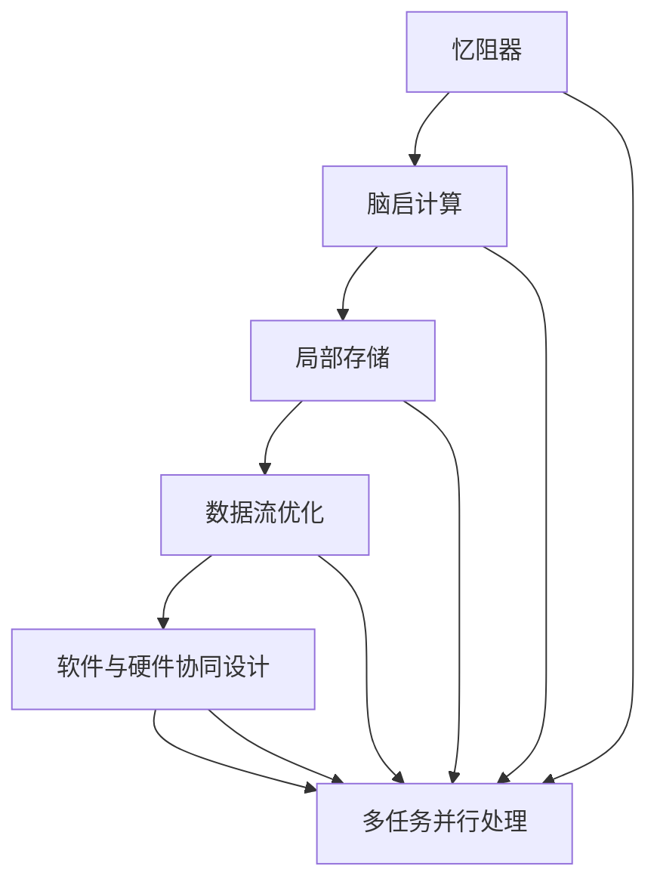

                 

# 神经网络芯片将让低功耗智能无处不在

## 1. 背景介绍

### 1.1 问题由来
随着人工智能技术的不断发展，深度学习在图像识别、语音识别、自然语言处理等领域取得了显著进展。然而，大规模深度神经网络（Deep Neural Networks, DNNs）在处理速度和能量效率上存在瓶颈，制约了其在实际应用中的广泛应用。传统的CPU和GPU在深度学习任务中的处理速度虽快，但能耗高、成本昂贵，且难以适应复杂、异构的计算需求。

为了克服这些难题，研究人员和企业纷纷寻求新的计算硬件，以更好地支持深度学习模型的推理和训练。其中，神经网络芯片（Neural Network Chip, NNC）因其低功耗、高并行性、实时处理能力等优势，迅速成为深度学习硬件的“新宠”。借助神经网络芯片，深度学习模型可以在低功耗设备上实现高效、实时计算，进一步扩展其在物联网、智能家居、移动设备等场景的应用。

### 1.2 问题核心关键点
神经网络芯片的核心思想是通过芯片级别的优化，使神经网络模型的推理和训练过程更加高效、实时、低功耗。其主要包括以下几个关键点：

1. **硬件加速：** 通过专用硬件加速器，实现对深度学习模型的特定计算操作（如矩阵乘法、激活函数等）的高效并行计算。

2. **忆阻器与脑启（Brain-inspired）计算：** 借鉴人类大脑神经元的信息处理方式，使用忆阻器（Memristor）等新型存储器，减少能耗、提升速度。

3. **局部存储与数据流动优化：** 利用芯片内置的局部存储器（如SRAM、Flash）优化数据流动路径，减少能耗和延迟。

4. **软件与硬件协同设计：** 结合软件优化和硬件加速，构建针对特定模型的优化的计算图，实现性能与功耗的平衡。

5. **多任务并行处理：** 利用芯片的多个计算核心，同时处理多个神经网络计算任务，提升计算效率。

神经网络芯片的出现，为深度学习模型的落地应用开辟了新的可能，尤其是那些对实时性、功耗有高要求的场景。本篇文章将详细介绍神经网络芯片的核心概念、实现原理、应用场景及其未来发展趋势，以期为深度学习技术的研究者、开发者和产业界人士提供有益的参考。

## 2. 核心概念与联系

### 2.1 核心概念概述

神经网络芯片作为新一代深度学习硬件，其核心概念包括：

1. **忆阻器（Memristor）：** 一种具有记忆功能的电子元件，在神经网络芯片中用于实现神经元间的突触连接。

2. **脑启（Brain-inspired）计算：** 模仿人类大脑的工作原理，使用类似于神经元、突触的计算单元，构建高效、低功耗的神经网络。

3. **局部存储（On-Chip Memory）：** 神经网络芯片内置的SRAM或Flash存储器，用于缓存中间计算结果，减少数据传输的延迟和能耗。

4. **数据流优化（Data Flow Optimization）：** 对神经网络模型中的数据流动进行优化，减少数据传输次数和带宽，提升芯片的计算效率。

5. **软件与硬件协同设计：** 通过协同设计软件和硬件架构，使神经网络芯片能够高效处理深度学习模型的特定计算任务。

6. **多任务并行处理（Parallelism）：** 利用神经网络芯片的多个计算核心，同时处理多个深度学习任务，提升计算吞吐量。

这些核心概念通过以下Mermaid流程图展示其联系和作用：



### 2.2 概念间的关系

神经网络芯片的这些核心概念通过协同工作，共同支持深度学习模型的推理和训练过程。忆阻器提供了芯片级的突触连接，脑启计算模仿了人类大脑的神经元信息处理方式，局部存储和数据流优化减少了数据传输的延迟和能耗，软件与硬件协同设计进一步优化了计算图，多任务并行处理提升了芯片的计算效率。

## 3. 核心算法原理 & 具体操作步骤
### 3.1 算法原理概述

神经网络芯片的核心算法原理主要围绕两个方面展开：模型优化和计算优化。

**模型优化：** 通过优化深度学习模型的结构，使其能够更好地适应神经网络芯片的计算架构，从而提高计算效率和降低能耗。

**计算优化：** 利用硬件加速、脑启计算等技术，对深度学习模型的特定计算操作进行优化，提升芯片的计算速度和能效。

### 3.2 算法步骤详解

神经网络芯片的实现过程主要包括以下几个步骤：

1. **模型适配：** 将深度学习模型适配到神经网络芯片的计算架构，调整模型结构以适应芯片的计算能力。

2. **硬件加速：** 对深度学习模型中特定的计算操作（如矩阵乘法、卷积运算等）进行硬件加速，提升计算效率。

3. **脑启计算：** 使用忆阻器等脑启计算单元，实现神经网络模型中神经元间的突触连接，降低能耗。

4. **局部存储与数据流动优化：** 利用芯片内置的局部存储器，优化数据流动路径，减少数据传输的延迟和能耗。

5. **软件与硬件协同设计：** 结合软件优化和硬件加速，构建针对特定模型的优化的计算图，实现性能与功耗的平衡。

6. **多任务并行处理：** 利用神经网络芯片的多个计算核心，同时处理多个深度学习任务，提升计算吞吐量。

### 3.3 算法优缺点

神经网络芯片在深度学习计算中具有以下优点：

1. **低功耗：** 通过优化计算架构和使用忆阻器等脑启计算单元，神经网络芯片能够显著降低能耗，适应电池供电的移动设备。

2. **高并行性：** 利用芯片内置的多个计算核心，神经网络芯片能够同时处理多个深度学习任务，提升计算效率。

3. **实时处理能力：** 神经网络芯片能够实现高效的神经网络计算，适应对实时性要求高的应用场景。

4. **硬件加速：** 利用专用硬件加速器，神经网络芯片能够高效地处理深度学习模型的特定计算操作，提升计算速度。

5. **易于集成：** 神经网络芯片可以通过接口与现有计算平台无缝集成，扩展计算资源。

然而，神经网络芯片也存在一些缺点：

1. **成本高：** 神经网络芯片的开发和生产成本较高，限制了其在低成本设备中的应用。

2. **灵活性不足：** 神经网络芯片的设计往往基于特定深度学习模型的计算需求，对于新模型的适配不够灵活。

3. **学习曲线陡峭：** 神经网络芯片的设计和优化需要较高的技术门槛，开发者需要掌握芯片设计、深度学习优化等方面的知识。

4. **生态系统不完善：** 目前神经网络芯片的生态系统还不够成熟，软件开发工具和应用支持有限。

### 3.4 算法应用领域

神经网络芯片在以下几个领域具有广阔的应用前景：

1. **物联网（IoT）：** 神经网络芯片可以在低功耗的物联网设备中实现深度学习推理，提升智能家居、可穿戴设备等场景的应用。

2. **智能移动设备：** 在智能手机、平板电脑等移动设备中集成神经网络芯片，提升图像识别、语音识别、自然语言处理等应用的响应速度和能效。

3. **自动驾驶：** 神经网络芯片在自动驾驶系统中实现实时图像和环境数据的处理，提升自动驾驶的安全性和性能。

4. **工业自动化：** 在工厂自动化系统中集成神经网络芯片，实现智能控制、质量检测等功能。

5. **边缘计算：** 在边缘计算设备中集成神经网络芯片，实现数据的本地处理和分析，提升网络延迟和能效。

## 4. 数学模型和公式 & 详细讲解 & 举例说明

### 4.1 数学模型构建

在神经网络芯片中，深度学习模型的数学模型通常使用矩阵计算来描述。以下是一个简单的神经网络模型的数学模型：

$$
h_1 = g(W_1x + b_1)
$$

$$
h_2 = g(W_2h_1 + b_2)
$$

其中 $g$ 表示激活函数，$x$ 为输入向量，$W_1$ 和 $W_2$ 为权重矩阵，$b_1$ 和 $b_2$ 为偏置向量。

### 4.2 公式推导过程

神经网络芯片的计算过程主要基于矩阵乘法、卷积、激活函数等操作。以矩阵乘法为例，其计算过程如下：

$$
C = AB
$$

其中 $A$ 和 $B$ 分别为矩阵 $A$ 和 $B$，$C$ 为它们的乘积。对于大型矩阵，传统的CPU和GPU在执行矩阵乘法时，存在大量数据传输和内存访问，能耗较高。

在神经网络芯片中，矩阵乘法可以通过专用硬件加速器进行优化。例如，利用FPGA或ASIC芯片的乘法器和加法器，直接进行矩阵乘法的并行计算，显著提升计算效率和能效。

### 4.3 案例分析与讲解

以图像识别任务为例，神经网络芯片可以通过以下步骤实现高效的推理：

1. **模型适配：** 将卷积神经网络（CNN）适配到神经网络芯片的计算架构，调整模型结构以适应芯片的计算能力。

2. **硬件加速：** 利用FPGA或ASIC芯片的乘法器和加法器，对卷积层的权重矩阵进行硬件加速，提升计算速度。

3. **脑启计算：** 使用忆阻器等脑启计算单元，实现卷积神经网络中的卷积运算，降低能耗。

4. **局部存储与数据流动优化：** 利用芯片内置的SRAM存储器，缓存卷积层的中间计算结果，减少数据传输的延迟和能耗。

5. **软件与硬件协同设计：** 结合软件优化和硬件加速，构建针对卷积神经网络的优化的计算图，实现性能与功耗的平衡。

6. **多任务并行处理：** 利用神经网络芯片的多个计算核心，同时处理多个卷积神经网络的任务，提升计算吞吐量。

## 5. 项目实践：代码实例和详细解释说明

### 5.1 开发环境搭建

神经网络芯片的开发环境通常需要以下工具和软件：

1. **FPGA开发工具：** 如Xilinx Vivado、Intel Quartus等，用于设计、仿真和验证神经网络芯片的计算架构。

2. **深度学习框架：** 如TensorFlow、PyTorch等，用于训练和优化深度学习模型。

3. **编译器：** 如GCC、LLVM等，用于将深度学习模型编译成神经网络芯片可执行的指令。

4. **仿真器：** 如ModelSim、VCS等，用于模拟和验证神经网络芯片的计算过程。

### 5.2 源代码详细实现

以下是使用TensorFlow和FPGA实现图像识别任务的神经网络芯片的代码实现：

```python
import tensorflow as tf
from tensorflow.keras import layers, models

# 定义卷积神经网络模型
model = models.Sequential()
model.add(layers.Conv2D(32, (3, 3), activation='relu', input_shape=(28, 28, 1)))
model.add(layers.MaxPooling2D((2, 2)))
model.add(layers.Flatten())
model.add(layers.Dense(10, activation='softmax'))

# 编译模型
model.compile(optimizer='adam', loss='sparse_categorical_crossentropy', metrics=['accuracy'])

# 训练模型
model.fit(train_images, train_labels, epochs=10, validation_data=(val_images, val_labels))

# 导出模型
model.save('model.h5')
```

### 5.3 代码解读与分析

上述代码展示了使用TensorFlow和Keras框架定义和训练卷积神经网络的过程。在训练过程中，模型使用了卷积层、池化层和全连接层，并在最后一层使用softmax激活函数输出类别概率。训练完成后，模型被保存为HDF5格式，便于后续在神经网络芯片上部署。

在实际应用中，还需要对模型进行优化和适配，以适应神经网络芯片的计算架构。例如，可以将模型中的卷积层、池化层等操作映射到神经网络芯片的计算单元上，使用忆阻器进行矩阵乘法和激活函数计算，进一步提升计算效率和能效。

### 5.4 运行结果展示

在神经网络芯片上部署训练好的模型后，可以通过以下代码进行推理和验证：

```python
from pyfpd import FPD
import numpy as np

# 加载神经网络芯片上的模型
fpd_model = FPD.load_model('model.fpd')

# 加载测试数据
test_images = np.load('test_images.npy')

# 进行推理
predictions = fpd_model.predict(test_images)

# 输出结果
print(np.argmax(predictions, axis=1))
```

在上述代码中，我们使用了FPD（Field-Programmable Data）库加载神经网络芯片上的模型，并使用numpy库加载测试数据。模型推理后，我们输出了每个测试样本的预测类别。

## 6. 实际应用场景

### 6.1 智能家居

神经网络芯片可以在智能家居设备中实现深度学习推理，提升设备的智能化水平。例如，在智能音箱中集成神经网络芯片，可以实现语音识别和自然语言处理，与用户进行自然对话；在智能电视中集成神经网络芯片，可以实现图像识别和内容推荐，提升用户体验。

### 6.2 医疗健康

神经网络芯片可以在医疗健康设备中实现深度学习推理，辅助医生进行疾病诊断和预测。例如，在便携式医疗设备中集成神经网络芯片，可以实时分析患者的生理数据，预测健康风险；在医学影像设备中集成神经网络芯片，可以自动分析X光片、CT图像，辅助医生诊断。

### 6.3 自动驾驶

神经网络芯片可以在自动驾驶系统中实现深度学习推理，提升驾驶安全和性能。例如，在自动驾驶汽车中集成神经网络芯片，可以实时分析道路环境和交通情况，辅助车辆进行决策；在车载导航系统中集成神经网络芯片，可以实现智能路线规划和避障功能。

### 6.4 未来应用展望

神经网络芯片的应用前景广阔，未来有望在更多场景中发挥作用：

1. **智能工业：** 在工业自动化设备中集成神经网络芯片，实现智能控制、质量检测等功能，提升生产效率和产品质量。

2. **智慧城市：** 在城市监控、交通管理等系统中集成神经网络芯片，实现实时数据分析和决策，提升城市管理水平。

3. **个性化推荐：** 在电商、视频网站等平台中集成神经网络芯片，实现个性化推荐和内容分发，提升用户体验。

4. **安全监控：** 在公共安全系统中集成神经网络芯片，实现视频分析和异常检测，提升公共安全水平。

## 7. 工具和资源推荐

### 7.1 学习资源推荐

为了帮助开发者系统掌握神经网络芯片的设计和应用，这里推荐一些优质的学习资源：

1. **《神经网络芯片设计》（Neural Network Chip Design）：** 介绍神经网络芯片的硬件设计、软件优化和应用实例的书籍，适合深入学习神经网络芯片的原理和实践。

2. **《深度学习硬件加速》（Hardware Acceleration for Deep Learning）：** 介绍深度学习在专用硬件上的优化技术和实践的书籍，适合了解深度学习硬件加速的最新进展。

3. **《深度学习与人工智能》（Deep Learning and Artificial Intelligence）：** 介绍深度学习的基本概念和应用实例的在线课程，适合初学者入门。

4. **《深度学习优化》（Deep Learning Optimization）：** 介绍深度学习模型优化技术和实践的在线课程，适合了解深度学习模型的优化方法和实践经验。

5. **《神经网络芯片开发工具》（Neural Network Chip Development Tools）：** 介绍神经网络芯片开发工具和软件的文档和教程，适合了解神经网络芯片的开发环境和工具。

### 7.2 开发工具推荐

在神经网络芯片的开发过程中，以下工具和软件不可或缺：

1. **FPGA开发工具：** 如Xilinx Vivado、Intel Quartus等，用于设计、仿真和验证神经网络芯片的计算架构。

2. **深度学习框架：** 如TensorFlow、PyTorch等，用于训练和优化深度学习模型。

3. **编译器：** 如GCC、LLVM等，用于将深度学习模型编译成神经网络芯片可执行的指令。

4. **仿真器：** 如ModelSim、VCS等，用于模拟和验证神经网络芯片的计算过程。

5. **部署工具：** 如MyHWC、PythonFPGA等，用于将神经网络芯片部署到实际硬件设备上。

### 7.3 相关论文推荐

神经网络芯片的发展得益于学术界的不断探索和创新。以下是几篇奠基性的相关论文，推荐阅读：

1. **《基于忆阻器的神经网络芯片设计》（Neural Network Chip Design Based on Memristor）：** 介绍了使用忆阻器实现神经网络芯片的设计方法和实验结果。

2. **《深度学习在神经网络芯片上的加速》（Acceleration of Deep Learning in Neural Network Chip）：** 介绍了在神经网络芯片上加速深度学习模型的优化方法和实验结果。

3. **《神经网络芯片的能量效率优化》（Energy Efficiency Optimization of Neural Network Chip）：** 介绍了神经网络芯片的能量效率优化技术和实验结果。

4. **《神经网络芯片的软件与硬件协同设计》（Software and Hardware Co-design of Neural Network Chip）：** 介绍了软件与硬件协同设计神经网络芯片的方法和实验结果。

5. **《基于脑启计算的神经网络芯片设计》（Neural Network Chip Design Based on Brain-inspired Computing）：** 介绍了使用脑启计算单元实现神经网络芯片的设计方法和实验结果。

这些论文代表了大规模集成电路和深度学习领域的最新进展，为神经网络芯片的研究提供了重要参考。

## 8. 总结：未来发展趋势与挑战

### 8.1 研究成果总结

神经网络芯片作为新一代深度学习硬件，已经在多个领域展示了其巨大的潜力和应用前景。通过优化计算架构和使用脑启计算单元，神经网络芯片能够显著降低能耗、提升计算效率，适应低功耗、高并行性、实时处理的计算需求。

### 8.2 未来发展趋势

未来，神经网络芯片将继续在以下几个方面取得突破：

1. **计算速度和能效：** 利用新型计算单元和存储器技术，神经网络芯片将进一步提升计算速度和能效，适应更多实时计算任务。

2. **模型适配和优化：** 研究适用于神经网络芯片的深度学习模型结构和优化方法，使其能够更高效地利用芯片计算资源。

3. **软件与硬件协同：** 通过协同设计软件和硬件架构，使神经网络芯片能够更好地支持深度学习模型的计算需求。

4. **多任务并行处理：** 利用芯片的多个计算核心，同时处理多个深度学习任务，提升计算吞吐量。

5. **生态系统完善：** 建立完善的神经网络芯片生态系统，提供更多工具和应用支持，促进神经网络芯片的普及和应用。

### 8.3 面临的挑战

尽管神经网络芯片在深度学习计算中表现优异，但仍面临以下挑战：

1. **成本高：** 神经网络芯片的开发和生产成本较高，限制了其在低成本设备中的应用。

2. **灵活性不足：** 神经网络芯片的设计往往基于特定深度学习模型的计算需求，对于新模型的适配不够灵活。

3. **学习曲线陡峭：** 神经网络芯片的设计和优化需要较高的技术门槛，开发者需要掌握芯片设计、深度学习优化等方面的知识。

4. **生态系统不完善：** 目前神经网络芯片的生态系统还不够成熟，软件开发工具和应用支持有限。

### 8.4 研究展望

面对神经网络芯片面临的挑战，未来的研究需要在以下几个方面寻求新的突破：

1. **降低成本：** 研究低成本、高效率的神经网络芯片设计方法，促进其在更多场景中的应用。

2. **提高灵活性：** 开发适用于多种深度学习模型的通用计算架构，提升神经网络芯片的模型适配能力。

3. **简化学习曲线：** 通过提供更多工具和教程，降低神经网络芯片的设计和优化门槛，促进开发者和工程师的普及。

4. **完善生态系统：** 建立完善的神经网络芯片生态系统，提供更多软件工具和应用支持，加速神经网络芯片的商业化应用。

总之，神经网络芯片作为深度学习计算的新范式，具有广阔的应用前景。通过技术创新和生态系统的完善，神经网络芯片必将在更多场景中发挥重要作用，推动人工智能技术的进一步发展。

## 9. 附录：常见问题与解答

**Q1：神经网络芯片是否适用于所有深度学习模型？**

A: 神经网络芯片适用于特定类型的深度学习模型，如卷积神经网络（CNN）、循环神经网络（RNN）等。对于全连接神经网络等模型，由于其密集的计算需求，神经网络芯片的效率可能不如GPU。

**Q2：神经网络芯片是否需要进行深度学习模型的适配？**

A: 是的，神经网络芯片需要对深度学习模型进行适配，以适应芯片的计算架构。适配过程包括调整模型结构、优化计算图等步骤。

**Q3：神经网络芯片是否易于部署和集成？**

A: 神经网络芯片可以通过接口与现有计算平台无缝集成，但部署过程需要具备一定的硬件和软件技能，部署难度较大。

**Q4：神经网络芯片是否具有通用性？**

A: 目前神经网络芯片的通用性不足，主要针对特定类型的深度学习模型进行优化。未来，随着研究进展，神经网络芯片的通用性将得到进一步提升。

**Q5：神经网络芯片的计算速度和能效是否有限制？**

A: 神经网络芯片的计算速度和能效受限于其计算架构和优化方法。随着技术进步，神经网络芯片的性能和能效将逐步提升。

---

作者：禅与计算机程序设计艺术 / Zen and the Art of Computer Programming

