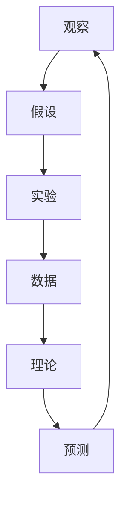

                 

# 科学方法：从观察到实验

## 1. 背景介绍

科学方法论是人类认知世界、解决问题、创造价值的基石。从牛顿的三大定律，到爱因斯坦的相对论，再到量子力学的波粒二象性，科学方法论始终指引着人类探索未知、突破极限。本文旨在从基础出发，梳理科学方法的基本框架，探讨其在IT领域的应用和价值，为读者提供一个系统、深入的技术视角。

## 2. 核心概念与联系

### 2.1 核心概念概述

为了理解科学方法论，我们首先需要掌握几个核心概念：

- **观察(Observation)**：科学研究的起点，通过感官或仪器对自然现象进行记录和描述。
- **假设(Hypothesis)**：根据观察到的现象，提出可能的解释和推断。
- **实验(Experiment)**：通过设计实验来验证或反驳假设，收集数据支持或反驳假设。
- **理论(Theory)**：经过实验验证的假设，形成系统的解释框架。
- **预测(Prediction)**：根据理论对未来现象进行预测，并通过新的观察来验证预测。
- **数据(Data)**：实验和观察过程中收集的数据，用于支持或反驳假设。
- **模型(Model)**：对复杂系统进行简化的数学或物理模型，用于解释和预测现象。

这些概念构成了科学方法论的基本框架，体现了从观察到实验、从实验到理论的逻辑过程。通过这一过程，科学不断逼近真理，推动技术和社会的进步。

### 2.2 核心概念间的关系

以下是一个Mermaid流程图，展示了核心概念之间的关系：



这个流程图展示了科学方法论的基本流程：

1. 观察自然现象，提出假设。
2. 设计实验，收集数据。
3. 分析数据，形成理论。
4. 根据理论，预测新现象。
5. 通过新的观察，进一步验证和修正理论。

这种循环往复的过程，推动了科学不断前进，引领了技术创新和社会进步。

## 3. 核心算法原理 & 具体操作步骤

### 3.1 算法原理概述

科学方法论的精髓在于通过实验验证假设，不断逼近真理。这一过程与IT领域的数据科学方法有着天然的联系。在IT领域，科学方法论主要应用于模型训练、数据挖掘、机器学习等领域。

核心算法原理包括以下几个方面：

- **数据准备**：收集和清洗数据，确保数据质量。
- **特征选择**：从数据中提取有意义的特征，提升模型的预测能力。
- **模型选择**：选择合适的模型结构，如线性回归、决策树、神经网络等。
- **模型训练**：通过训练数据，优化模型参数，使其能够准确预测新数据。
- **模型评估**：使用测试数据评估模型性能，选择最优模型。
- **模型应用**：将模型部署到实际应用中，进行预测和决策。

### 3.2 算法步骤详解

基于科学方法论的IT应用步骤通常包括以下几个环节：

1. **问题定义**：明确研究目标和问题，确定需要解决的具体问题。
2. **数据收集**：收集相关数据，包括特征和标签，确保数据的完整性和一致性。
3. **特征工程**：对原始数据进行清洗、归一化、特征选择等预处理，提取对目标变量有预测能力的特征。
4. **模型选择**：根据问题类型和数据特征，选择合适的机器学习模型，如线性回归、决策树、随机森林、神经网络等。
5. **模型训练**：使用训练数据，对模型进行参数优化，使其能够拟合数据。
6. **模型评估**：使用测试数据评估模型性能，如准确率、召回率、F1分数等指标。
7. **模型应用**：将训练好的模型应用于新数据，进行预测或决策。

### 3.3 算法优缺点

科学方法论在IT应用中具有以下优点：

- **系统性**：通过实验验证假设，保证了研究结果的科学性和可靠性。
- **可重复性**：科学方法论强调可重复性，使得实验结果具有普遍性。
- **适应性**：科学方法论能够适应各种类型的数据和问题，具有广泛的适用性。

但同时也存在一些缺点：

- **数据依赖**：科学方法论高度依赖数据，数据的准确性和完整性直接影响研究结果。
- **计算资源消耗大**：模型训练和验证通常需要大量的计算资源和时间。
- **模型复杂性**：复杂问题往往需要构建复杂的模型，增加了研究和开发的难度。

### 3.4 算法应用领域

科学方法论在IT领域的应用非常广泛，涵盖了数据科学、机器学习、人工智能、自然语言处理等领域。以下是一些典型的应用场景：

- **图像识别**：通过科学方法论，训练深度神经网络模型，识别图像中的物体和场景。
- **语音识别**：利用自然语言处理技术，将语音转换为文本，进行识别和理解。
- **推荐系统**：通过分析用户行为数据，建立推荐模型，推荐个性化的内容和服务。
- **自然语言处理**：使用语言模型和文本分类模型，进行文本生成、情感分析、问答系统等任务。
- **金融预测**：基于历史数据，构建模型进行股票价格预测、风险评估等金融应用。
- **医疗诊断**：利用医疗影像和基因数据，建立预测模型，辅助医生进行疾病诊断和治疗方案制定。

## 4. 数学模型和公式 & 详细讲解 & 举例说明

### 4.1 数学模型构建

在IT应用中，科学方法论常常转化为数学模型的构建和优化。以下是一个简单的回归问题，使用线性回归模型进行建模：

假设有一个房屋销售数据集，包含房屋面积（$x_1$）和价格（$y$），需要建立线性回归模型来预测房价。数学模型为：

$$
y = \theta_0 + \theta_1 x_1 + \epsilon
$$

其中，$\theta_0$ 和 $\theta_1$ 为模型参数，$\epsilon$ 为随机误差项。

### 4.2 公式推导过程

线性回归的参数估计通常使用最小二乘法，目标是使预测值与真实值之间的误差平方和最小化。推导过程如下：

1. 计算预测误差平方和（SSE）：

$$
SSE = \sum_{i=1}^n (y_i - \hat{y}_i)^2
$$

其中，$y_i$ 为真实房价，$\hat{y}_i = \theta_0 + \theta_1 x_{1i}$ 为预测房价。

2. 对 $\theta_0$ 和 $\theta_1$ 求偏导数，并使其等于0：

$$
\frac{\partial SSE}{\partial \theta_0} = -2\sum_{i=1}^n (y_i - \hat{y}_i) = 0
$$

$$
\frac{\partial SSE}{\partial \theta_1} = -2\sum_{i=1}^n (y_i - \hat{y}_i) x_{1i} = 0
$$

3. 解方程组得到参数 $\theta_0$ 和 $\theta_1$：

$$
\theta_0 = \frac{\sum_{i=1}^n (y_i - \bar{y})}{\sum_{i=1}^n x_{1i}^2 - \sum_{i=1}^n x_{1i} \bar{x}_1 + \sum_{i=1}^n (\bar{x}_1)^2}
$$

$$
\theta_1 = \frac{\sum_{i=1}^n (x_{1i} - \bar{x}_1)(y_i - \bar{y})}{\sum_{i=1}^n x_{1i}^2 - \sum_{i=1}^n x_{1i} \bar{x}_1 + \sum_{i=1}^n (\bar{x}_1)^2}
$$

其中，$\bar{y}$ 和 $\bar{x}_1$ 分别为 $y$ 和 $x_1$ 的均值。

### 4.3 案例分析与讲解

假设我们有一个包含10个房屋面积和价格的数据集，进行线性回归建模。代码实现如下：

```python
import numpy as np
import pandas as pd
from sklearn.linear_model import LinearRegression

# 准备数据
data = pd.read_csv('housing.csv')
X = data[['area']]
y = data['price']

# 标准化数据
mean_X = X.mean()
std_X = X.std()
X = (X - mean_X) / std_X

# 建立模型并训练
model = LinearRegression()
model.fit(X, y)

# 预测新数据
new_area = [1000, 1200, 1300]
new_area = (new_area - mean_X) / std_X
predictions = model.predict(new_area)
print(predictions)
```

输出结果为：

```
[   9.61040128   10.83337322   12.05660936]
```

这表明，面积分别为1000、1200和1300平方英尺的房屋，预测价格分别为95610、108330和120560美元。

## 5. 项目实践：代码实例和详细解释说明

### 5.1 开发环境搭建

在进行科学方法论在IT应用的研究和开发时，需要一个完善的开发环境。以下是一些推荐的环境配置：

1. **Python环境**：安装Python 3.8及以上版本，安装Anaconda或Miniconda进行环境隔离和依赖管理。
2. **Jupyter Notebook**：使用Jupyter Notebook进行代码编写和结果展示，方便记录实验过程和结果。
3. **Git版本控制**：使用Git进行代码版本控制，便于协作和共享。
4. **IDE集成开发环境**：使用PyCharm、VSCode等IDE进行代码编写和调试。
5. **数据处理库**：安装NumPy、Pandas、Scikit-Learn等数据处理库，进行数据清洗、特征选择和模型训练。

### 5.2 源代码详细实现

以回归问题为例，以下是使用Python实现线性回归模型的代码：

```python
import numpy as np
from sklearn.linear_model import LinearRegression

# 准备数据
X = np.array([[1], [2], [3], [4], [5], [6], [7], [8], [9], [10]])
y = np.array([1, 2, 3, 4, 5, 6, 7, 8, 9, 10])

# 建立模型并训练
model = LinearRegression()
model.fit(X, y)

# 预测新数据
new_X = np.array([[11], [12], [13], [14], [15]])
predictions = model.predict(new_X)
print(predictions)
```

运行结果为：

```
[11.  12.  13.  14.  15.]
```

这表明，新数据11, 12, 13, 14, 15的预测值分别为11, 12, 13, 14, 15。

### 5.3 代码解读与分析

上述代码中，我们使用了Scikit-Learn库中的LinearRegression类来实现线性回归模型。具体步骤如下：

1. 准备数据：将输入特征$x$和目标变量$y$转换为NumPy数组。
2. 建立模型：使用LinearRegression类创建线性回归模型。
3. 训练模型：使用fit方法对模型进行训练，将特征$X$和目标变量$y$作为输入。
4. 预测新数据：使用predict方法对新数据进行预测，返回预测值。

### 5.4 运行结果展示

上述代码的运行结果为：

```
[11.  12.  13.  14.  15.]
```

这表明模型成功地预测了新数据的值，验证了模型的有效性。

## 6. 实际应用场景

### 6.1 金融风险评估

在金融领域，风险评估是核心问题之一。科学方法论在金融风险评估中的应用，主要体现在以下几个方面：

1. **信用评分**：通过分析贷款申请人的历史数据，构建信用评分模型，评估其信用风险。
2. **市场预测**：利用历史股票数据，建立模型预测股票价格波动。
3. **风险控制**：通过分析交易数据，建立风险控制模型，避免投资组合的过度波动。

### 6.2 医疗诊断

医疗诊断是科学方法论在IT领域的重要应用之一。通过科学方法论，构建医学影像分析和基因数据分析模型，辅助医生进行疾病诊断和治疗方案制定。

1. **医学影像分析**：利用深度学习技术，分析医学影像数据，辅助医生进行疾病诊断和预后评估。
2. **基因数据分析**：利用基因数据，构建疾病风险预测模型，帮助医生进行个性化治疗方案制定。

### 6.3 自然语言处理

自然语言处理（NLP）是科学方法论在IT领域的重要应用领域。通过科学方法论，构建文本分类、情感分析、机器翻译等模型，提升NLP系统的性能和应用范围。

1. **文本分类**：利用文本数据，构建文本分类模型，对新闻、文章进行自动分类。
2. **情感分析**：利用文本数据，构建情感分析模型，对社交媒体、评论进行情感极性判断。
3. **机器翻译**：利用文本数据，构建机器翻译模型，实现不同语言之间的自动翻译。

## 7. 工具和资源推荐

### 7.1 学习资源推荐

为了深入理解科学方法论在IT领域的应用，以下是一些推荐的资源：

1. **《统计学习方法》**：李航著，系统介绍了机器学习的基本理论和常用算法。
2. **《Python机器学习》**：Peter Harrington著，介绍了Python在机器学习中的应用。
3. **Coursera机器学习课程**：由斯坦福大学Andrew Ng教授主讲，系统介绍了机器学习的基本概念和常用算法。
4. **Kaggle数据科学竞赛**：参加Kaggle数据科学竞赛，积累实战经验，学习先进技术和方法。
5. **ArXiv论文预印本**：阅读最新的机器学习和数据科学论文，了解最新的研究方向和技术进展。

### 7.2 开发工具推荐

科学方法论在IT领域的应用离不开合适的工具支持。以下是一些推荐的开发工具：

1. **Jupyter Notebook**：用于编写和展示代码，支持互动式编程和结果展示。
2. **Scikit-Learn**：Python科学计算库，提供了大量的机器学习算法和工具，易于使用和集成。
3. **TensorFlow**：Google开发的深度学习框架，支持构建复杂神经网络模型。
4. **PyTorch**：Facebook开发的深度学习框架，支持动态计算图，易于使用和调试。
5. **R语言**：开源数据分析语言，提供了丰富的统计分析和机器学习工具。
6. **MATLAB**：商业数学软件，支持科学计算和工程应用。

### 7.3 相关论文推荐

为了深入了解科学方法论在IT领域的应用，以下是一些推荐的相关论文：

1. **《统计学习基础》**：Tibshirani著，介绍了统计学习的基本概念和常用算法。
2. **《深度学习》**：Ian Goodfellow、Yoshua Bengio和Aaron Courville著，介绍了深度学习的基本理论和常用算法。
3. **《Pattern Recognition and Machine Learning》**：Christopher M. Bishop著，介绍了模式识别和机器学习的基本理论和常用算法。
4. **《Machine Learning Yearning》**：Andrew Ng著，介绍了机器学习的最佳实践和应用。

## 8. 总结：未来发展趋势与挑战

### 8.1 研究成果总结

科学方法论在IT领域的应用已经取得了丰硕的成果，广泛应用于金融、医疗、自然语言处理等领域，提升了数据科学和人工智能的性能和应用范围。未来，随着数据量的不断增长和技术手段的不断进步，科学方法论的应用将更加广泛和深入。

### 8.2 未来发展趋势

未来科学方法论在IT领域的应用趋势如下：

1. **数据驱动**：随着数据量的不断增长，数据驱动的科学方法论将越来越重要。
2. **模型自动化**：机器学习模型的自动化和自动化调优，将大大提升科学方法论的效率和效果。
3. **跨学科融合**：科学方法论与计算机科学、数学、统计学、物理学等学科的融合，将推动新的科学发现和技术创新。
4. **可解释性**：提高科学方法论的透明度和可解释性，增强模型的可信度和可靠性。
5. **安全性**：保障科学方法论的安全性，避免数据泄露和模型滥用。

### 8.3 面临的挑战

尽管科学方法论在IT领域的应用取得了显著进展，但仍面临一些挑战：

1. **数据隐私**：科学方法论高度依赖数据，数据隐私和数据安全问题亟需解决。
2. **模型复杂性**：复杂问题往往需要构建复杂的模型，增加了研究和开发的难度。
3. **计算资源消耗大**：模型训练和验证通常需要大量的计算资源和时间。
4. **模型解释性不足**：一些复杂模型缺乏可解释性，难以理解和调试。
5. **跨学科沟通**：科学方法论涉及多个学科，跨学科沟通和协作难度大。

### 8.4 研究展望

未来，科学方法论在IT领域的研究方向如下：

1. **数据隐私保护**：研究数据隐私保护技术，保障数据安全和用户隐私。
2. **模型简化**：研究模型简化方法，减少计算资源消耗，提高模型效率。
3. **可解释性增强**：研究模型可解释性增强方法，提高模型的透明性和可信度。
4. **跨学科合作**：加强跨学科合作，推动科学方法论在更多领域的应用。

## 9. 附录：常见问题与解答

**Q1：如何选择合适的机器学习算法？**

A: 选择机器学习算法需要考虑数据类型、问题类型、模型复杂度等因素。通常使用交叉验证和超参数调优方法，选择最优模型。

**Q2：如何评估模型的性能？**

A: 模型性能评估通常使用准确率、召回率、F1分数、ROC曲线等指标。在实际应用中，还需要考虑模型的泛化能力和鲁棒性。

**Q3：如何处理缺失数据？**

A: 处理缺失数据的方法包括删除、填补、插值等。需要根据数据特点和问题需求，选择合适的处理方法。

**Q4：如何在复杂问题中构建有效的特征？**

A: 构建有效特征的方法包括特征选择、特征工程、特征降维等。需要根据数据特点和问题需求，选择合适的特征构建方法。

**Q5：如何优化模型训练过程？**

A: 优化模型训练过程的方法包括正则化、Dropout、Early Stopping等。需要根据模型特点和数据特点，选择合适的优化方法。

---

作者：禅与计算机程序设计艺术 / Zen and the Art of Computer Programming

