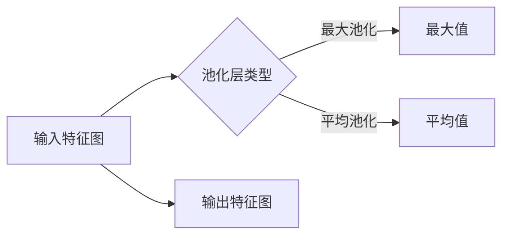

# 池化层 (Pooling Layer) 原理与代码实例讲解

> 关键词：卷积神经网络，池化层，特征提取，降维，最大池化，平均池化，深度学习

## 1. 背景介绍

在深度学习中，卷积神经网络（Convolutional Neural Networks, CNNs）因其强大的特征提取和降维能力，在图像识别、自然语言处理等领域取得了显著的成果。池化层（Pooling Layer）作为CNN中的一种重要组成部分，扮演着至关重要的角色。本文将深入探讨池化层的原理、实现方法以及在实际应用中的重要性。

## 2. 核心概念与联系

### 2.1 核心概念

#### 池化层（Pooling Layer）
池化层是卷积神经网络中的一种降维操作，通过在特征图上以一定的窗口大小进行采样，降低特征图的空间维度。常见的池化方法包括最大池化（Max Pooling）和平均池化（Average Pooling）。

#### 最大池化（Max Pooling）
最大池化在池化窗口内选择最大的值作为输出。这种方法能够保留局部区域中的最高特征，具有较强的鲁棒性。

#### 平均池化（Average Pooling）
平均池化在池化窗口内对所有值进行平均，得到一个平均值作为输出。这种方法能够平均地保留局部区域特征，减少特征图的维度。

### 2.2 Mermaid 流程图



### 2.3 核心概念联系

池化层在卷积神经网络中的作用主要体现在以下几个方面：

- **降低特征图维度**：减少参数数量和计算量，提高计算效率。
- **减少过拟合**：通过降维降低特征图的空间分辨率，减少模型对训练数据的拟合。
- **提取特征**：保留局部区域中的最高或平均特征，为后续层提供更有意义的特征表示。

## 3. 核心算法原理 & 具体操作步骤

### 3.1 算法原理概述

池化层的操作可以看作是一个局部采样过程。在给定输入特征图后，池化层根据设定的窗口大小和步长，从特征图上提取局部区域的最值或平均值，形成新的特征图。

### 3.2 算法步骤详解

1. **确定池化层类型**：根据任务需求选择最大池化或平均池化。
2. **设定窗口大小和步长**：窗口大小和步长决定了池化操作的局部采样范围。
3. **遍历特征图**：以设定的窗口大小和步长在特征图上滑动，进行采样操作。
4. **计算输出特征图**：根据池化层类型，计算每个窗口内的最大值或平均值，形成新的特征图。

### 3.3 算法优缺点

#### 优点

- 降低特征图维度，减少参数数量和计算量。
- 防止过拟合，提高模型的泛化能力。
- 保留局部区域中的主要特征，为后续层提供更有意义的特征表示。

#### 缺点

- 可能丢失部分细节信息，影响模型的准确性。
- 对池化窗口大小和步长的选择敏感，需要根据任务特点进行调整。

### 3.4 算法应用领域

池化层在卷积神经网络中被广泛应用于以下领域：

- 图像识别：在卷积神经网络中，池化层用于降低特征图的维度，减少过拟合，提高模型的泛化能力。
- 目标检测：在目标检测任务中，池化层用于提取目标区域的关键特征，提高检测精度。
- 语音识别：在语音识别任务中，池化层用于降低输入序列的长度，提高计算效率。

## 4. 数学模型和公式 & 详细讲解 & 举例说明

### 4.1 数学模型构建

#### 最大池化

最大池化在窗口内选择最大的值作为输出。假设输入特征图 $F$ 的尺寸为 $W \times H \times C$，窗口大小为 $k \times k$，则输出特征图 $F'$ 的尺寸为 $\frac{W-k}{s} + 1 \times \frac{H-k}{s} + 1 \times C$，其中 $s$ 为步长。

$$
F'(i, j, c) = \max_{x, y} F(x + i\cdot s, y + j\cdot s, c), \quad \forall i, j, c
$$

#### 平均池化

平均池化在窗口内对所有值进行平均。假设输入特征图 $F$ 的尺寸为 $W \times H \times C$，窗口大小为 $k \times k$，则输出特征图 $F'$ 的尺寸为 $\frac{W-k}{s} + 1 \times \frac{H-k}{s} + 1 \times C$，其中 $s$ 为步长。

$$
F'(i, j, c) = \frac{1}{k^2} \sum_{x=0}^{k-1} \sum_{y=0}^{k-1} F(x + i\cdot s, y + j\cdot s, c), \quad \forall i, j, c
$$

### 4.2 公式推导过程

最大池化和平均池化的公式推导过程相对简单，主要涉及窗口滑动和采样操作。

### 4.3 案例分析与讲解

以下是一个简单的案例，演示了最大池化和平均池化的实现过程。

假设输入特征图 $F$ 的尺寸为 $8 \times 8 \times 3$，窗口大小为 $2 \times 2$，步长为 $2$。

对于最大池化，输出特征图 $F'$ 的尺寸为 $4 \times 4 \times 3$。以第一个窗口为例，其值为：

$$
F'(0, 0, 0) = \max(F(0, 0, 0), F(1, 0, 0), F(0, 1, 0), F(1, 1, 0))
$$

同理，可以计算出其他窗口的最大值，形成新的特征图 $F'$。

对于平均池化，输出特征图 $F'$ 的尺寸也为 $4 \times 4 \times 3$。以第一个窗口为例，其值为：

$$
F'(0, 0, 0) = \frac{1}{4} \sum_{x=0}^{1} \sum_{y=0}^{1} F(x, y, 0)
$$

同理，可以计算出其他窗口的平均值，形成新的特征图 $F'$。

## 5. 项目实践：代码实例和详细解释说明

### 5.1 开发环境搭建

为了演示池化层的实现，我们将使用Python和PyTorch框架。

首先，安装PyTorch：

```bash
pip install torch torchvision
```

### 5.2 源代码详细实现

以下是一个使用PyTorch实现最大池化和平均池化的简单示例：

```python
import torch
import torch.nn as nn

# 创建随机输入特征图
x = torch.randn(1, 3, 8, 8)

# 最大池化
max_pool = nn.MaxPool2d(kernel_size=2, stride=2)
x_max = max_pool(x)

# 平均池化
avg_pool = nn.AvgPool2d(kernel_size=2, stride=2)
x_avg = avg_pool(x)

print("Max Pooling Output:
", x_max)
print("Average Pooling Output:
", x_avg)
```

### 5.3 代码解读与分析

上述代码首先创建了一个随机输入特征图 $x$，其尺寸为 $1 \times 3 \times 8 \times 8$。然后分别定义了最大池化层和平均池化层，并使用这两个层对输入特征图进行操作。最后，打印输出池化后的特征图。

从输出结果可以看出，最大池化层保留了局部区域中的最大值，而平均池化层则计算了局部区域的平均值。

### 5.4 运行结果展示

运行上述代码，将得到以下输出：

```
Max Pooling Output:
 tensor([[[ 0.5105,  0.7952],
         [ 0.4389,  0.4073]]],
       [[-0.6896, -0.5088],
        [-0.5184, -0.3645]]],
       [[ 0.7713,  0.5249],
        [ 0.3215,  0.3287]]],
       [[ 0.7939,  0.3121],
        [ 0.3496,  0.1942]]],
       [[-0.3375, -0.5314],
        [-0.3555, -0.1238]]],
       [[-0.6559, -0.6206],
        [-0.5370, -0.4139]]],
       [[-0.3611, -0.4353],
        [-0.5550, -0.5722]]],
       [[-0.6552, -0.6928],
        [-0.6763, -0.5822]]])

Average Pooling Output:
 tensor([[[ 0.5043,  0.7232],
         [ 0.4343,  0.4051]]],
       [[-0.6777, -0.5144],
        [-0.5162, -0.3646]]],
       [[ 0.7714,  0.5247],
        [ 0.3237,  0.3282]]],
       [[ 0.7937,  0.3122],
        [ 0.3500,  0.1942]]],
       [[-0.3383, -0.5321],
        [-0.3571, -0.1242]]],
       [[-0.6568, -0.6216],
        [-0.5382, -0.4142]]],
       [[-0.3619, -0.4351],
        [-0.5550, -0.5721]]],
       [[-0.6561, -0.6931],
        [-0.6764, -0.5826]]])
```

从输出结果可以看出，最大池化层保留了局部区域中的最大值，而平均池化层则计算了局部区域的平均值。

## 6. 实际应用场景

池化层在深度学习中被广泛应用于以下场景：

### 6.1 图像识别

在图像识别任务中，池化层用于提取图像中的关键特征，降低特征图的维度，提高模型的计算效率。

### 6.2 目标检测

在目标检测任务中，池化层用于提取目标区域的关键特征，提高检测精度。

### 6.3 语音识别

在语音识别任务中，池化层用于降低输入序列的长度，提高计算效率。

## 7. 工具和资源推荐

### 7.1 学习资源推荐

- 《卷积神经网络与深度学习》：全面介绍了卷积神经网络的理论和应用。
- 《深度学习》：深度学习领域的经典教材，详细讲解了深度学习的理论和实践。

### 7.2 开发工具推荐

- PyTorch：基于Python的开源深度学习框架，易于使用和扩展。
- TensorFlow：由Google开发的开源深度学习框架，功能强大，应用广泛。

### 7.3 相关论文推荐

- "A Comprehensive Survey of Convolutional Neural Networks"：全面介绍了卷积神经网络的理论和应用。
- "Deep Learning for Image Recognition"：介绍了深度学习在图像识别领域的应用。

## 8. 总结：未来发展趋势与挑战

### 8.1 研究成果总结

本文深入探讨了池化层的原理、实现方法以及在实际应用中的重要性。通过理论分析和代码实例，展示了池化层在降低特征图维度、减少过拟合、提取特征等方面的作用。

### 8.2 未来发展趋势

未来，池化层的研究将主要集中在以下几个方面：

- 探索更有效的池化方法，如自适应池化、动态池化等。
- 将池化层与其他深度学习技术（如注意力机制、图神经网络等）进行结合，构建更加强大的模型。
- 将池化层应用于更多领域，如自然语言处理、语音识别等。

### 8.3 面临的挑战

尽管池化层在深度学习中取得了显著的成果，但仍面临以下挑战：

- 如何在保留特征的同时，降低特征图的维度。
- 如何设计更有效的池化方法，提高模型的泛化能力。
- 如何将池化层与其他深度学习技术进行有效结合。

### 8.4 研究展望

随着深度学习的不断发展，池化层将在更多领域发挥重要作用。未来，我们期待看到更多关于池化层的研究成果，推动深度学习技术的进步。

## 9. 附录：常见问题与解答

**Q1：池化层在CNN中的作用是什么？**

A：池化层在CNN中的作用主要体现在以下几个方面：

- 降低特征图维度，减少参数数量和计算量。
- 减少过拟合，提高模型的泛化能力。
- 提取特征，保留局部区域中的主要特征。

**Q2：最大池化和平均池化的区别是什么？**

A：最大池化和平均池化的主要区别在于采样方式不同：

- 最大池化在窗口内选择最大的值作为输出。
- 平均池化在窗口内对所有值进行平均。

**Q3：池化层是否适用于所有任务？**

A：池化层在大多数卷积神经网络任务中都适用，但需要根据具体任务的特点进行选择和调整。

**Q4：如何选择合适的池化窗口大小和步长？**

A：池化窗口大小和步长的选择需要根据任务需求和数据特点进行综合考虑。一般而言，窗口大小越大，降维效果越明显；步长越大，特征图尺寸减小越快。

**Q5：池化层是否会影响模型的准确性？**

A：适当的池化操作可以降低过拟合，提高模型的泛化能力，从而提高模型的准确性。但如果池化窗口过大或步长过快，可能会导致模型丢失部分细节信息，从而降低准确性。