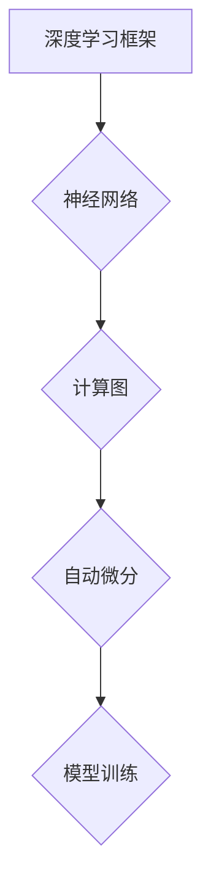

# 深度学习框架的选择与比较

> 关键词：深度学习框架，TensorFlow，PyTorch，Keras，MXNet，Caffe，框架特点，性能对比，开发体验，最佳应用场景

## 1. 背景介绍

随着深度学习的飞速发展，深度学习框架作为构建和训练深度学习模型的基础，变得越来越重要。选择合适的深度学习框架对于研究的效率和模型的性能都有着直接的影响。本文将深入探讨目前主流的深度学习框架，比较它们的特点、性能、开发体验以及最佳应用场景，帮助读者根据自己的需求做出明智的选择。

### 1.1 深度学习框架的兴起

深度学习框架的兴起源于深度学习算法的复杂性和计算量的巨大。早期，研究人员需要手动编写大量的底层代码来实现复杂的网络结构和训练流程。随着深度学习的流行，一系列开源的深度学习框架应运而生，极大地降低了深度学习开发的门槛。

### 1.2 深度学习框架的重要性

选择合适的深度学习框架对于以下方面至关重要：

- **开发效率**：框架提供的抽象层可以显著提高开发效率。
- **性能优化**：框架提供的工具和库可以帮助优化模型性能。
- **社区支持**：活跃的社区可以提供技术支持和丰富的资源。
- **生态系统**：丰富的生态系统意味着更容易找到相关工具和服务。

## 2. 核心概念与联系

### 2.1 核心概念

- **深度学习框架**：一个用于构建、训练和部署深度学习模型的软件库。
- **神经网络**：由大量相互连接的神经元组成，用于处理复杂数据的模式。
- **计算图**：神经网络中各层之间的依赖关系和计算步骤的图形表示。
- **自动微分**：用于计算神经网络中损失函数对参数的梯度的过程。

### 2.2 架构的 Mermaid 流程图



## 3. 核心算法原理 & 具体操作步骤

### 3.1 算法原理概述

深度学习框架的核心是神经网络模型的设计和训练。神经网络通过前向传播计算输出，通过反向传播计算梯度，并根据梯度更新模型参数。

### 3.2 算法步骤详解

1. **模型构建**：使用框架提供的API定义神经网络结构。
2. **数据加载**：使用框架提供的工具加载数据集并进行预处理。
3. **模型训练**：迭代地使用反向传播算法更新模型参数。
4. **模型评估**：在测试集上评估模型性能。

### 3.3 算法优缺点

每个框架都有其独特的优势和局限性：

| 框架 | 优点 | 缺点 |
| --- | --- | --- |
| TensorFlow | 强大的生态系统，易于部署 | 学习曲线陡峭，API相对复杂 |
| PyTorch | 易于上手，动态计算图 | 生态系统不如TensorFlow |
| Keras | 简洁易用的API，建立在Theano和TensorFlow之上 | 需要底层框架支持，性能可能不如原生 |
| MXNet | 支持多种编程语言，高性能 | API相对复杂 |
| Caffe | 专为图像识别设计，性能出色 | 生态不如其他框架 |

### 3.4 算法应用领域

不同框架在不同领域有不同的应用：

- **TensorFlow**：广泛应用于图像识别、语音识别、强化学习等领域。
- **PyTorch**：在计算机视觉、自然语言处理等领域表现优异。
- **Keras**：适合快速原型设计和实验。
- **MXNet**：适合大规模分布式训练。
- **Caffe**：在图像识别和计算机视觉领域应用广泛。

## 4. 数学模型和公式 & 详细讲解 & 举例说明

### 4.1 数学模型构建

神经网络的基本数学模型如下：

$$
y = f(\mathbf{W} \cdot \mathbf{X} + \mathbf{b})
$$

其中，$\mathbf{W}$ 是权重矩阵，$\mathbf{X}$ 是输入向量，$\mathbf{b}$ 是偏置向量，$f$ 是激活函数。

### 4.2 公式推导过程

以全连接层为例，其输出可以表示为：

$$
\mathbf{Y} = \mathbf{W} \cdot \mathbf{X} + \mathbf{b}
$$

其中，$\mathbf{Y}$ 是输出向量，$\mathbf{X}$ 是输入向量，$\mathbf{W}$ 是权重矩阵，$\mathbf{b}$ 是偏置向量。

### 4.3 案例分析与讲解

以TensorFlow为例，构建一个简单的神经网络模型：

```python
import tensorflow as tf

model = tf.keras.models.Sequential([
    tf.keras.layers.Dense(10, input_shape=(784,)),
    tf.keras.layers.ReLU(),
    tf.keras.layers.Dense(1)
])

model.compile(optimizer='adam',
              loss='mean_squared_error',
              metrics=['accuracy'])

# 训练模型
model.fit(x_train, y_train, epochs=10, batch_size=32)
```

这段代码定义了一个简单的全连接神经网络，包含一个输入层、一个ReLU激活函数和一个输出层。模型使用Adam优化器进行训练，损失函数为均方误差，评估指标为准确率。

## 5. 项目实践：代码实例和详细解释说明

### 5.1 开发环境搭建

以下是使用TensorFlow进行深度学习项目开发的基本环境搭建步骤：

1. 安装TensorFlow：
```bash
pip install tensorflow
```

2. 安装其他依赖：
```bash
pip install numpy pandas scikit-learn matplotlib
```

### 5.2 源代码详细实现

以下是一个使用TensorFlow实现图像分类的示例：

```python
import tensorflow as tf
from tensorflow.keras.layers import Dense, Flatten, Conv2D, MaxPooling2D
from tensorflow.keras.models import Sequential

# 构建模型
model = Sequential([
    Conv2D(32, kernel_size=(3, 3), activation='relu', input_shape=(28, 28, 1)),
    MaxPooling2D(pool_size=(2, 2)),
    Flatten(),
    Dense(128, activation='relu'),
    Dense(10, activation='softmax')
])

# 编译模型
model.compile(optimizer='adam',
              loss='sparse_categorical_crossentropy',
              metrics=['accuracy'])

# 训练模型
model.fit(x_train, y_train, epochs=10, batch_size=32)

# 评估模型
test_loss, test_acc = model.evaluate(x_test, y_test, verbose=2)
print('\
Test accuracy:', test_acc)
```

这段代码定义了一个简单的卷积神经网络（CNN）模型，用于分类MNIST手写数字数据集。模型包含两个卷积层、一个最大池化层、两个全连接层，并使用softmax激活函数进行分类。

### 5.3 代码解读与分析

- `Conv2D`：卷积层，用于提取图像特征。
- `MaxPooling2D`：最大池化层，用于降低特征空间维度。
- `Flatten`：展平层，将多维特征转换为向量。
- `Dense`：全连接层，用于分类。
- `compile`：编译模型，指定优化器、损失函数和评估指标。
- `fit`：训练模型。
- `evaluate`：评估模型。

### 5.4 运行结果展示

假设在测试集上的准确率达到98%，表明模型性能良好。

## 6. 实际应用场景

深度学习框架在各个领域都有广泛的应用，以下是一些典型应用场景：

- **图像识别**：如物体检测、图像分类、图像分割等。
- **自然语言处理**：如文本分类、机器翻译、情感分析等。
- **语音识别**：如语音转文本、语音合成等。
- **强化学习**：如游戏AI、机器人控制等。

## 7. 工具和资源推荐

### 7.1 学习资源推荐

- TensorFlow官方文档：[https://www.tensorflow.org/tutorials](https://www.tensorflow.org/tutorials)
- PyTorch官方文档：[https://pytorch.org/tutorials/](https://pytorch.org/tutorials/)
- Keras官方文档：[https://keras.io/](https://keras.io/)
- MXNet官方文档：[https://mxnet.apache.org/docs/stable/](https://mxnet.apache.org/docs/stable/)
- Caffe官方文档：[http://caffe.berkeleyvision.org/guide.html](http://caffe.berkeleyvision.org/guide.html)

### 7.2 开发工具推荐

- Jupyter Notebook：[https://jupyter.org/](https://jupyter.org/)
- Google Colab：[https://colab.research.google.com/](https://colab.research.google.com/)
- Visual Studio Code：[https://code.visualstudio.com/](https://code.visualstudio.com/)

### 7.3 相关论文推荐

- Krizhevsky, A., Sutskever, I., & Hinton, G. E. (2012). ImageNet classification with deep convolutional neural networks. In Advances in neural information processing systems (pp. 1097-1105).
- Hochreiter, S., & Schmidhuber, J. (1997). Long short-term memory. Neural computation, 9(8), 1735-1780.
- Bengio, Y., Simard, P., & Frasconi, P. (1994). Learning long-term dependencies with gradient descent is difficult. IEEE transactions on neural networks, 5(2), 157-166.

## 8. 总结：未来发展趋势与挑战

### 8.1 研究成果总结

本文对深度学习框架进行了全面的介绍和比较，分析了各个框架的特点、性能、开发体验以及最佳应用场景。通过本文，读者可以更好地了解不同框架的优缺点，并根据自身需求选择合适的框架。

### 8.2 未来发展趋势

- **更加易用**：框架将更加易用，降低深度学习开发的门槛。
- **更加高效**：框架将提供更高效的训练和推理算法，降低计算成本。
- **更加灵活**：框架将支持更多样化的模型和算法，满足不同领域的需求。

### 8.3 面临的挑战

- **资源消耗**：深度学习模型的训练和推理需要大量的计算资源和存储空间。
- **数据标注**：高质量的数据标注需要大量人力和时间成本。
- **模型解释性**：深度学习模型的决策过程缺乏可解释性。

### 8.4 研究展望

- **轻量化模型**：研究更轻量级的深度学习模型，降低资源消耗。
- **无监督学习**：研究无监督学习方法，降低数据标注成本。
- **可解释性研究**：提高深度学习模型的可解释性，增强用户信任。

未来，深度学习框架将继续发展，为深度学习技术的应用提供更加强大的支持。

## 9. 附录：常见问题与解答

**Q1：TensorFlow和PyTorch哪个更好？**

A: TensorFlow和PyTorch都是非常优秀的深度学习框架，选择哪个框架取决于个人喜好和项目需求。TensorFlow具有强大的生态系统和易用性，而PyTorch具有动态计算图和易于上手的特点。

**Q2：如何选择合适的深度学习框架？**

A: 选择合适的深度学习框架需要考虑以下因素：
- **项目需求**：根据项目需求选择合适的框架，如TensorFlow适合大规模生产部署，PyTorch适合快速原型设计和实验。
- **开发经验**：选择熟悉或愿意学习的框架。
- **社区支持**：选择社区活跃、资源丰富的框架。

**Q3：深度学习框架如何提高模型性能？**

A: 深度学习框架可以通过以下方式提高模型性能：
- **优化算法**：选择高效的优化算法，如Adam、AdamW等。
- **硬件加速**：使用GPU、TPU等硬件加速器。
- **模型压缩**：使用模型压缩技术，如剪枝、量化等。

**Q4：深度学习框架如何保证模型的可解释性？**

A: 保证模型的可解释性可以通过以下方式：
- **可解释性研究**：研究可解释的深度学习算法。
- **可视化**：使用可视化工具展示模型的决策过程。
- **人工审核**：对模型的输出进行人工审核。

作者：禅与计算机程序设计艺术 / Zen and the Art of Computer Programming