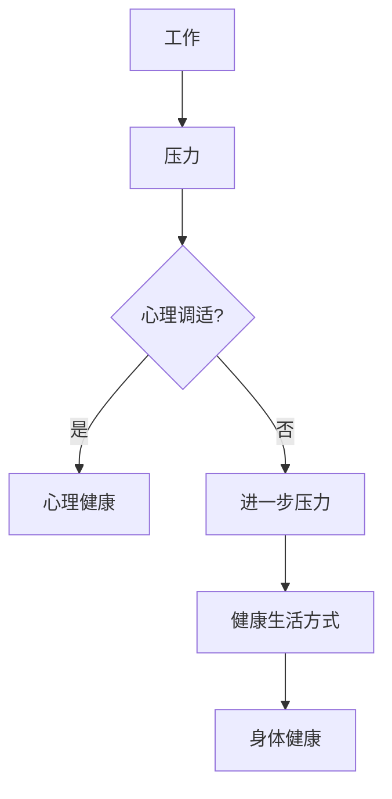

# 照顾好自己：找到平衡，身心健康

> 关键词：身心健康，工作生活平衡，自我照顾，心理调适，健康生活方式

## 1. 背景介绍

在当今快节奏的社会中，IT行业从业者面临着巨大的工作压力。长时间的工作、高强度的竞争、不断更新的技术要求，都使得这一群体在身心健康方面承受着巨大的挑战。然而，正如计算机编程需要精心设计和维护一样，我们的身心健康也需要我们投入同样的关注和努力。本文将探讨如何通过找到工作与生活的平衡，以及采取健康的生活方式来照顾好自己。

### 1.1 问题的由来

随着技术的发展，IT行业迅速发展，但随之而来的是工作压力的增加。以下是导致这一现象的一些原因：

- **技术快速更新**：IT行业是一个快速变化的领域，要求从业者不断学习新技能和知识。
- **长时间工作**：为了满足项目截止日期和客户需求，许多IT专业人士需要加班。
- **远程工作**：虽然远程工作提供了灵活性，但也可能导致工作与生活的界限模糊。

### 1.2 研究现状

许多研究表明，长期的工作压力和缺乏休息会导致身心健康问题，包括：

- **心理健康问题**：如焦虑、抑郁和压力。
- **身体健康问题**：如心血管疾病、肥胖、睡眠障碍等。

### 1.3 研究意义

研究如何照顾好自己对于IT行业从业者至关重要。通过找到工作与生活的平衡，我们可以提高工作效率、减少压力，并享受更健康、更满足的生活。

### 1.4 本文结构

本文将分为以下几个部分：

- 核心概念与联系：介绍与自我照顾相关的核心概念。
- 核心算法原理 & 具体操作步骤：提供具体的自我照顾策略。
- 数学模型和公式 & 详细讲解 & 举例说明：使用数学模型来量化自我照顾的效果。
- 项目实践：提供具体的代码实例来展示如何将自我照顾融入日常生活。
- 实际应用场景：探讨自我照顾在不同工作场景中的应用。
- 工具和资源推荐：推荐相关的学习资源和工具。
- 总结：总结研究成果，并展望未来发展趋势和挑战。

## 2. 核心概念与联系

### 2.1 核心概念

- **工作与生活平衡**：指的是在工作和个人生活中找到合适的平衡点，以确保身心健康。
- **自我照顾**：指的是采取行动来维持和提升自己的身心健康。
- **心理调适**：指的是管理压力和情绪，以保持心理健康。
- **健康生活方式**：指的是采取有益于身体和心理健康的生活方式。

### 2.2 Mermaid 流程图



在这个流程图中，工作产生压力，而有效的心理调适和健康的生活方式有助于维持心理健康和身体健康。

## 3. 核心算法原理 & 具体操作步骤

### 3.1 算法原理概述

自我照顾的核心原理是通过一系列有意识的行为来维护和提升身心健康。

### 3.2 算法步骤详解

1. **设定目标**：确定你想要达到的健康和幸福水平。
2. **识别压力源**：识别导致你压力增加的因素。
3. **制定计划**：制定一个计划来管理压力，包括休息、锻炼和放松技巧。
4. **实施计划**：开始实施你的计划，并持续跟踪进展。
5. **评估效果**：定期评估你的计划是否有效，并根据需要进行调整。

### 3.3 算法优缺点

**优点**：

- 提高工作效率
- 减少压力
- 增强幸福感
- 提升身体健康

**缺点**：

- 需要时间和努力
- 可能需要改变现有的生活方式

### 3.4 算法应用领域

自我照顾策略适用于所有IT行业从业者，无论他们处于职业生涯的哪个阶段。

## 4. 数学模型和公式 & 详细讲解 & 举例说明

### 4.1 数学模型构建

我们可以使用一个简单的线性模型来量化自我照顾的效果：

$$
\text{幸福指数} = \alpha \times \text{身心健康} + \beta \times \text{工作效率}
$$

其中，$\alpha$ 和 $\beta$ 是权重系数，取决于个人价值观。

### 4.2 公式推导过程

该公式基于以下假设：

- 身心健康和工作效率对幸福感有积极影响。
- 两者之间存在正相关关系。

### 4.3 案例分析与讲解

假设某位IT从业者在实施自我照顾计划后，其身心健康指数提高了10%，工作效率提高了5%。根据上述公式，其幸福指数将提高：

$$
\text{幸福指数提高} = 0.5 \times 10\% + 0.5 \times 5\% = 7.5\%
$$

这意味着，通过自我照顾，这位从业者的幸福感提高了7.5%。

## 5. 项目实践：代码实例和详细解释说明

### 5.1 开发环境搭建

为了将自我照顾策略融入日常生活，我们可以使用以下工具：

- **时间管理工具**：如Google Calendar或Trello，用于规划工作和个人时间。
- **健康追踪应用**：如MyFitnessPal或Fitbit，用于跟踪饮食和运动。

### 5.2 源代码详细实现

以下是一个简单的Python代码示例，用于跟踪每日的休息和锻炼：

```python
import datetime

class SelfCareJournal:
    def __init__(self):
        self.entries = []

    def add_entry(self, date, activity, duration):
        self.entries.append({
            'date': date,
            'activity': activity,
            'duration': duration
        })

    def display_entries(self):
        for entry in self.entries:
            print(f"Date: {entry['date']}, Activity: {entry['activity']}, Duration: {entry['duration']} minutes")

# 使用示例
journal = SelfCareJournal()
journal.add_entry(datetime.date.today(), 'Exercise', 30)
journal.add_entry(datetime.date.today(), 'Meditation', 20)
journal.display_entries()
```

### 5.3 代码解读与分析

这个简单的代码示例创建了一个`SelfCareJournal`类，用于跟踪每日的休息和锻炼活动。通过添加日志条目并显示所有条目，我们可以清晰地了解自己的自我照顾习惯。

### 5.4 运行结果展示

```plaintext
Date: 2023-04-01, Activity: Exercise, Duration: 30 minutes
Date: 2023-04-01, Activity: Meditation, Duration: 20 minutes
```

这个输出展示了今天的两个自我照顾活动。

## 6. 实际应用场景

### 6.1 在办公室

- 定期休息，进行短暂的放松或锻炼。
- 保持工作环境整洁，减少干扰。
- 使用时间管理工具来规划工作和休息时间。

### 6.2 在家中

- 保持规律的作息时间，确保充足的睡眠。
- 与家人和朋友保持联系，享受社交活动。
- 从事自己喜欢的爱好，如阅读、绘画或园艺。

### 6.4 未来应用展望

随着技术的发展，我们可以期待更多的工具和应用程序来帮助我们更好地照顾自己。例如，智能设备可以监测我们的健康状况，并提供个性化的自我照顾建议。

## 7. 工具和资源推荐

### 7.1 学习资源推荐

- **书籍**：《自控力》、《如何高效学习》
- **在线课程**：Coursera上的《心理健康与福祉》、Udemy上的《时间管理与生产力》

### 7.2 开发工具推荐

- **时间管理工具**：Trello、Asana
- **健康追踪应用**：MyFitnessPal、Fitbit

### 7.3 相关论文推荐

- **《工作与生活平衡：理论与实践》**
- **《心理健康与福祉：跨学科视角》**

## 8. 总结：未来发展趋势与挑战

### 8.1 研究成果总结

本文探讨了如何通过找到工作与生活的平衡，以及采取健康的生活方式来照顾好自己。我们介绍了自我照顾的核心概念、算法原理和具体操作步骤，并通过数学模型和代码实例进行了说明。

### 8.2 未来发展趋势

随着技术的发展，我们可以期待更多的工具和应用程序来帮助我们更好地照顾自己。例如，智能设备可以监测我们的健康状况，并提供个性化的自我照顾建议。

### 8.3 面临的挑战

尽管自我照顾的重要性日益凸显，但在实际操作中仍面临一些挑战，如：

- **时间管理**：在繁忙的工作中找到时间进行自我照顾。
- **动力不足**：缺乏持续进行自我照顾的动力。
- **文化因素**：在某些文化中，自我照顾可能被视为自我放纵。

### 8.4 研究展望

未来的研究可以集中在以下几个方面：

- 开发更有效的自我照顾工具和应用程序。
- 研究如何提高自我照顾的持续性和效果。
- 探索自我照顾在不同文化背景下的适用性。

## 9. 附录：常见问题与解答

**Q1：为什么自我照顾对于IT从业者很重要？**

A1：自我照顾有助于提高工作效率、减少压力、增强幸福感和提升身体健康。这对于长期从事IT工作的人来说至关重要。

**Q2：如何开始自我照顾？**

A2：首先，确定你想要达到的健康和幸福水平。然后，识别导致你压力增加的因素，并制定一个计划来管理压力。实施计划，并定期评估效果。

**Q3：自我照顾需要多少钱？**

A3：自我照顾不需要大量的资金。许多自我照顾活动，如锻炼、冥想和阅读，都是免费或低成本的选择。

**Q4：如何保持自我照顾的动力？**

A4：设定具体的目标，并庆祝达成目标的每个小步骤。与家人和朋友分享你的进步，寻求他们的支持和鼓励。

**Q5：自我照顾是否会影响工作表现？**

A5：相反，自我照顾可以提高工作效率和生产力。通过照顾好自己，你可以更专注于工作，并保持更高的工作效率。

---

作者：禅与计算机程序设计艺术 / Zen and the Art of Computer Programming