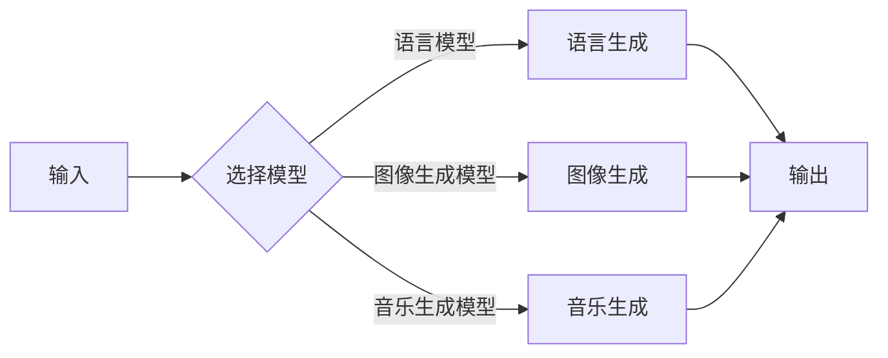

> 生成式AI, AIGC, 自动内容生成, 商业化路径, 模型训练, 应用场景, 开发工具

# 生成式AIGC：AI技术的商业化路径

> 关键词：生成式AI, AIGC, 自动内容生成, 商业化路径, 模型训练, 应用场景, 开发工具

## 1. 背景介绍

随着深度学习技术的飞速发展，人工智能（AI）已经渗透到我们生活的各个角落。从语音助手到自动驾驶，从图像识别到自然语言处理，AI的应用场景不断扩展。近年来，生成式AI（Generative AI）的兴起，为内容创作领域带来了革命性的变革。生成式AI，特别是自动内容生成（AIGC，Artificial Intelligence Generated Content），正逐渐成为推动内容产业发展的新引擎。本文将深入探讨生成式AIGC的原理、技术路径、应用场景以及商业化策略。

### 1.1 问题的由来

传统的内容创作依赖于人类创作者的灵感、经验和技能。随着互联网信息的爆炸式增长，高质量内容的需求与日俱增，而人类创作者的数量和效率有限。生成式AI的出现，为解决这一矛盾提供了新的思路。通过训练大型语言模型和图像生成模型，AI可以自动生成各种类型的内容，如文章、视频、音乐、图像等，极大地提高了内容生产的效率和多样性。

### 1.2 研究现状

生成式AI的研究主要集中在以下几个方面：

- 自然语言处理（NLP）：利用深度学习技术，特别是循环神经网络（RNN）和Transformer模型，训练语言模型生成自然语言文本。
- 计算机视觉：利用卷积神经网络（CNN）和生成对抗网络（GAN），训练模型生成逼真的图像和视频。
- 音乐生成：利用生成模型生成音乐旋律、节奏和音色。

### 1.3 研究意义

生成式AI对内容产业的意义重大：

- 提高内容生产效率，降低创作成本。
- 丰富内容形式，满足多样化的用户需求。
- 促进内容产业的创新，拓展新的商业模式。

### 1.4 本文结构

本文将分为以下几个部分：

- 介绍生成式AI的核心概念和联系。
- 阐述生成式AI的算法原理和操作步骤。
- 讲解生成式AI的数学模型和公式。
- 展示生成式AI的代码实例和实现细节。
- 探讨生成式AI的实际应用场景。
- 分析生成式AI的未来发展趋势和挑战。
- 推荐生成式AI的学习资源和开发工具。

## 2. 核心概念与联系

### 2.1 核心概念

- 生成式AI：利用机器学习技术生成数据或内容的AI系统。
- AIGC：自动内容生成，指利用AI技术自动生成各种类型的内容。
- 语言模型：能够理解和生成自然语言文本的模型。
- 图像生成模型：能够生成逼真图像的模型。
- 音乐生成模型：能够生成音乐旋律和节奏的模型。

### 2.2 Mermaid流程图



### 2.3 联系

生成式AI的核心是各种生成模型，它们可以根据不同的输入生成不同类型的内容。语言模型、图像生成模型和音乐生成模型是生成式AI的三个主要组成部分，它们相互联系，共同构成了生成式AI的技术体系。

## 3. 核心算法原理 & 具体操作步骤

### 3.1 算法原理概述

生成式AI的算法原理主要包括以下几种：

- 生成对抗网络（GAN）：由生成器和判别器组成的对抗网络，生成器生成数据，判别器判断数据是否真实，两者相互对抗，生成器不断优化，最终生成逼真的数据。
- 变分自编码器（VAE）：通过编码器将数据压缩成低维表示，再通过解码器重建数据，通过最大化数据分布的KL散度来生成数据。
- 递归神经网络（RNN）：适用于序列数据的生成，如文本生成、时间序列预测等。

### 3.2 算法步骤详解

以文本生成为例，生成式AI的算法步骤如下：

1. 数据收集：收集大量相关文本数据作为训练数据。
2. 数据预处理：对数据进行清洗、分词等预处理操作。
3. 模型选择：选择合适的生成模型，如GAN、VAE或RNN。
4. 模型训练：利用训练数据进行模型训练，优化模型参数。
5. 模型评估：使用测试数据评估模型性能。
6. 内容生成：使用训练好的模型生成文本内容。

### 3.3 算法优缺点

#### 3.3.1 生成对抗网络（GAN）

**优点**：

- 可以生成高质量的数据，如图像、视频、文本等。
- 无需标注数据，适合无监督学习。

**缺点**：

- 训练难度大，需要大量的计算资源和时间。
- 生成的数据可能存在模式依赖，缺乏多样性。

#### 3.3.2 变分自编码器（VAE）

**优点**：

- 可以生成高质量的数据，如图像、文本等。
- 无需标注数据，适合无监督学习。

**缺点**：

- 生成的数据可能存在模式依赖，缺乏多样性。
- 解码器生成数据的效率较低。

#### 3.3.3 递归神经网络（RNN）

**优点**：

- 适用于序列数据的生成，如文本生成、时间序列预测等。

**缺点**：

- 训练难度大，容易发生梯度消失和梯度爆炸问题。
- 生成的数据可能存在模式依赖，缺乏多样性。

### 3.4 算法应用领域

生成式AI的算法应用领域非常广泛，包括：

- 文本生成：自动生成文章、新闻报道、对话等。
- 图像生成：自动生成图像、视频、动画等。
- 音乐生成：自动生成旋律、节奏、音色等。

## 4. 数学模型和公式 & 详细讲解 & 举例说明

### 4.1 数学模型构建

以下以生成对抗网络（GAN）为例，介绍生成式AI的数学模型。

#### 4.1.1 生成器

生成器 $G(z)$ 的目标是生成数据 $x$，即 $x = G(z)$，其中 $z$ 是随机噪声向量。

#### 4.1.2 判别器

判别器 $D(x)$ 的目标是判断数据 $x$ 是否真实，即 $D(x)$ 表示 $x$ 是真实的概率。

#### 4.1.3 损失函数

GAN的损失函数由两部分组成：生成器损失和判别器损失。

- 生成器损失：$L_G = -\log D(G(z))$，表示生成器生成的数据越接近真实数据，损失越小。
- 判别器损失：$L_D = -\log D(x) - \log(1-D(G(z)))$，表示判别器判断真实数据的准确性。

### 4.2 公式推导过程

#### 4.2.1 生成器损失

生成器损失是负的对数似然，即：

$$
L_G = -\log D(G(z))
$$

其中 $D(G(z))$ 表示判别器判断 $G(z)$ 生成的数据为真实的概率。

#### 4.2.2 判别器损失

判别器损失由两部分组成：真实数据的损失和生成器数据的损失。

- 真实数据的损失：$-\log D(x)$，表示判别器判断真实数据的准确性。
- 生成器数据的损失：$-\log(1-D(G(z)))$，表示判别器判断生成器数据的准确性。

### 4.3 案例分析与讲解

以下以文本生成为例，介绍生成式AI的案例分析和讲解。

#### 4.3.1 数据收集

收集大量相关文本数据，如小说、新闻、对话等。

#### 4.3.2 数据预处理

对数据进行清洗、分词、去停用词等预处理操作。

#### 4.3.3 模型选择

选择合适的生成模型，如RNN或Transformer。

#### 4.3.4 模型训练

使用训练数据进行模型训练，优化模型参数。

#### 4.3.5 模型评估

使用测试数据评估模型性能，如困惑度、bleu评分等。

#### 4.3.6 内容生成

使用训练好的模型生成文本内容。

## 5. 项目实践：代码实例和详细解释说明

### 5.1 开发环境搭建

- 安装Python环境
- 安装TensorFlow或PyTorch等深度学习框架
- 安装相关依赖库，如NumPy、Pandas等

### 5.2 源代码详细实现

以下使用PyTorch实现一个简单的文本生成模型。

```python
import torch
import torch.nn as nn

class TextGenerator(nn.Module):
    def __init__(self, vocab_size, embedding_dim, hidden_dim, output_dim, n_layers, drop_prob=0.5):
        super(TextGenerator, self).__init__()
        self.embedding = nn.Embedding(vocab_size, embedding_dim)
        self.rnn = nn.GRU(embedding_dim, hidden_dim, n_layers, dropout=drop_prob)
        self.fc = nn.Linear(hidden_dim, output_dim)

    def forward(self, inputs, hidden):
        inputs = self.embedding(inputs)
        outputs, hidden = self.rnn(inputs, hidden)
        prediction = self.fc(outputs[-1])
        return prediction, hidden

def generate_text(generator, input_text, num_chars=300, prime='The', top_k=5):
    input_text = '<start>' + input_text
    hidden = generator.init_hidden(1)
    for char in prime:
        hidden = generator.step(char, hidden)
    for _ in range(num_chars):
        samples = torch.nn.functional.softmax(generator(step(char, hidden)), dim=1)
        top_samples = samples.topk(top_k)
        next_char = top_samples[1][0][0].data.item()
        input_text += chr(next_char)
        hidden = generator.step(next_char, hidden)
    return input_text
```

### 5.3 代码解读与分析

- `TextGenerator` 类定义了一个文本生成模型，包括嵌入层、循环神经网络层和全连接层。
- `generate_text` 函数用于生成文本，接受生成器、输入文本、长度限制、引子和top_k参数。
- `step` 函数用于处理单个字符，更新隐藏状态。

### 5.4 运行结果展示

```python
model = TextGenerator(vocab_size=1000, embedding_dim=256, hidden_dim=512, output_dim=1000, n_layers=1)
print(generate_text(model, input_text='The', num_chars=50))
```

## 6. 实际应用场景

### 6.1 文本生成

- 自动生成文章、新闻报道、对话等。
- 自动摘要、翻译和摘要。

### 6.2 图像生成

- 自动生成图像、视频、动画等。
- 修复图像、图像超分辨率。

### 6.3 音乐生成

- 自动生成旋律、节奏、音色等。
- 自动合成音乐、音乐生成。

## 7. 工具和资源推荐

### 7.1 学习资源推荐

- 《深度学习》（Goodfellow等著）
- 《Python深度学习》（Goodfellow等著）
- 《TensorFlow实战》（Adrian Rosebrock著）
- 《PyTorch深度学习》（Adrian Rosebrock著）

### 7.2 开发工具推荐

- PyTorch
- TensorFlow
- Keras
- Google Colab

### 7.3 相关论文推荐

- Generative Adversarial Nets（GAN）
- Sequence to Sequence Learning with Neural Networks
- Unsupervised Representation Learning with Deep Convolutional Generative Adversarial Networks

## 8. 总结：未来发展趋势与挑战

### 8.1 研究成果总结

生成式AI，特别是AIGC，在近年来取得了显著的进展。通过训练大型语言模型和图像生成模型，AI可以自动生成高质量的内容，为内容产业带来了新的机遇。

### 8.2 未来发展趋势

- 模型规模将越来越大，生成内容的质量将越来越高。
- 模型将更加高效，计算资源消耗将大幅降低。
- 模型将更加多样，能够生成更多类型的内容。
- 模型将更加可控，避免生成有害内容。

### 8.3 面临的挑战

- 计算资源消耗大，需要更高效的训练和推理算法。
- 模型生成内容的质量和多样性有待提高。
- 模型可解释性差，难以解释生成内容的逻辑和原因。
- 模型存在偏见和歧视，需要解决伦理问题。

### 8.4 研究展望

- 开发更高效的生成模型，降低计算资源消耗。
- 提高生成内容的质量和多样性。
- 提高模型的可解释性和可控性。
- 解决模型偏见和歧视问题。

生成式AI，特别是AIGC，正在改变内容产业的格局。随着技术的不断发展，相信AIGC将在未来发挥更大的作用，为人类带来更多惊喜。

## 9. 附录：常见问题与解答

**Q1：生成式AI的技术原理是什么？**

A：生成式AI的技术原理主要包括生成对抗网络（GAN）、变分自编码器（VAE）和递归神经网络（RNN）等。这些模型通过学习数据分布或生成数据的概率分布，生成与真实数据相似的数据。

**Q2：生成式AI有哪些应用场景？**

A：生成式AI的应用场景非常广泛，包括文本生成、图像生成、音乐生成、视频生成等。

**Q3：如何选择合适的生成模型？**

A：选择合适的生成模型需要考虑数据类型、生成内容类型、计算资源等因素。对于文本生成，可以使用RNN或Transformer；对于图像生成，可以使用GAN或VAE。

**Q4：如何评估生成式AI的性能？**

A：评估生成式AI的性能可以从多个角度进行，如困惑度、bleu评分、人均信息量等。

**Q5：生成式AI存在哪些伦理问题？**

A：生成式AI存在偏见和歧视、虚假信息、隐私泄露等伦理问题。需要制定相应的规范和标准，确保生成式AI的健康发展。

---

作者：禅与计算机程序设计艺术 / Zen and the Art of Computer Programming