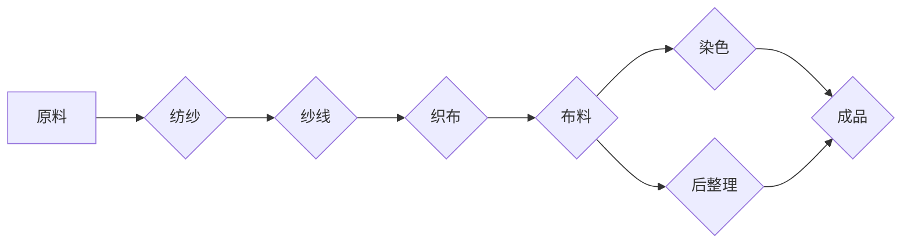

> 纺织业，自动化，手工工作，工业革命，机械自动化，生产流程，历史回顾，技术进步，效率提升

# 纺织业自动化初期的手工工作

## 1. 背景介绍

纺织业是人类历史上最早实现工业化的行业之一。从古至今，纺织业的发展经历了从手工劳动到机械自动化的转变。在这一转变过程中，手工工作逐渐被自动化设备所取代，极大地提高了生产效率和产品质量。本文将回顾纺织业自动化初期的手工工作，探讨其技术背景、工作流程以及其历史意义。

### 1.1 问题的由来

在工业革命之前，纺织业主要依靠手工劳动完成。手工纺纱、织布、染色等环节都需要大量的人工操作，劳动强度大，生产效率低，产品质量参差不齐。随着社会经济的发展，对纺织品的需求不断增加，手工生产已无法满足市场需求。

### 1.2 研究现状

关于纺织业自动化的历史研究，主要集中在以下几个方面：

- 工业革命时期纺织机械的发明和改进；
- 纺织工艺的变革，如纺纱工艺的革新、织布技术的进步等；
- 纺织业劳动力的变迁，如手工工人的劳动条件、工作环境等；
- 纺织业自动化对经济、社会和文化的影响。

### 1.3 研究意义

研究纺织业自动化初期的手工工作，有助于我们：

- 了解纺织业发展的历史脉络，认识到技术进步对社会发展的重要推动作用；
- 总结纺织业自动化初期的经验和教训，为现代纺织业自动化发展提供借鉴；
- 传承和弘扬工匠精神，提升现代纺织工人的素质。

### 1.4 本文结构

本文将从以下几个方面展开论述：

- 纺织业自动化初期的手工工作概况；
- 核心概念与联系；
- 核心算法原理与操作步骤；
- 数学模型与公式；
- 项目实践：代码实例与详细解释；
- 实际应用场景与未来展望；
- 工具和资源推荐；
- 总结：未来发展趋势与挑战；
- 附录：常见问题与解答。

## 2. 核心概念与联系

### 2.1 纺织业自动化初期的手工工作概况

在纺织业自动化初期，手工工作主要包括以下几个方面：

- 纺纱：手工纺纱是指用手工工具将棉花、羊毛等原料纺成纱线的过程。
- 织布：手工织布是指用手工织机将纱线编织成布料的过程。
- 染色：手工染色是指用手工方法对布料进行染色处理。
- 后整理：手工后整理是指对布料进行去毛、定型、检验等后处理工作。

### 2.2 核心概念与联系 - Mermaid 流程图



### 2.3 核心概念与联系

- **纺纱**：纺纱是将纤维原料加工成纱线的过程。手工纺纱主要依靠手工工具，如纺轮、纺锤等，通过手工旋转和拉伸纤维，形成具有一定强度和弹性的纱线。
- **织布**：织布是将纱线编织成布料的过程。手工织布主要依靠手工织机，如梭子、梭床等，通过手工操作，将纱线交错编织成布料。
- **染色**：染色是指对布料进行染色处理，以改变其颜色和外观。手工染色主要依靠染缸、染料等，通过手工搅拌和浸泡，使布料着色。
- **后整理**：后整理是指对布料进行去毛、定型、检验等后处理工作，以提高布料的质量和性能。

这些手工工作相互关联，共同构成了纺织业的生产流程。

## 3. 核心算法原理 & 具体操作步骤

### 3.1 算法原理概述

纺织业自动化初期的手工工作主要依赖于一系列简单的物理算法和操作步骤。以下以手工纺纱和织布为例，介绍其核心算法原理和操作步骤。

### 3.2 算法步骤详解

#### 3.2.1 手工纺纱

1. **准备原料**：选择合适的纤维原料，如棉花、羊毛等。
2. **梳理**：将原料进行梳理，去除杂质和短纤维。
3. **并条**：将梳理后的纤维并成条状。
4. **粗纺**：将并条进行粗纺，形成粗纱。
5. **细纺**：将粗纱进行细纺，形成细纱。

#### 3.2.2 手工织布

1. **准备纱线**：将纱线绕成梭子，准备好梭床。
2. **穿经**：将纱线穿过梭床，形成经线。
3. **穿纬**：将纬线穿过经线，形成布料。
4. **织造**：用手摇或脚踏的方式，将纬线交错织入经线，形成布面。
5. **剪边**：将布料剪裁成所需尺寸。

### 3.3 算法优缺点

#### 优点

- **简单易学**：手工纺纱和织布的操作步骤相对简单，易于学习和掌握。
- **灵活性高**：手工操作可以根据实际需求进行调整，适应不同的生产要求。

#### 缺点

- **效率低**：手工操作速度慢，生产效率低。
- **质量参差不齐**：手工操作的质量难以保证，容易出现瑕疵。

### 3.4 算法应用领域

手工纺纱和织布在自动化初期是纺织业的主要生产方式，广泛应用于棉纺织、毛纺织等行业。

## 4. 数学模型和公式 & 详细讲解 & 举例说明

### 4.1 数学模型构建

手工纺纱和织布的数学模型主要涉及以下参数：

- **纤维长度**：纤维的长度，通常以毫米为单位。
- **纤维直径**：纤维的直径，通常以微米为单位。
- **纱线线密度**：纱线的线密度，通常以特克斯为单位。
- **织机速度**：织机的速度，通常以米/分钟为单位。
- **纱线张力**：纱线在织机上的张力，通常以牛顿为单位。

以下是一个简化的手工纺纱数学模型：

$$
\text{纱线线密度} = \frac{\text{纤维长度} \times \text{纤维数量}}{\text{纱线长度}}
$$

### 4.2 公式推导过程

假设有一根长度为 $L$ 的纤维，纤维的数量为 $N$，纱线的长度为 $L'$，则纱线线密度 $D$ 可以表示为：

$$
D = \frac{L \times N}{L'}
$$

### 4.3 案例分析与讲解

假设一根纤维的长度为 $1000$ 毫米，纤维数量为 $100$，纱线的长度为 $10000$ 毫米，则纱线线密度为：

$$
D = \frac{1000 \times 100}{10000} = 10 \text{特克斯}
$$

这意味着纱线的线密度为每千米 $10$ 克。

## 5. 项目实践：代码实例和详细解释说明

### 5.1 开发环境搭建

由于手工纺纱和织布的数学模型相对简单，我们可以使用Python进行编程实现。

### 5.2 源代码详细实现

```python
# 定义纱线线密度计算函数
def calculate_denier(fiber_length, fiber_number, yarn_length):
    denier = (fiber_length * fiber_number) / yarn_length
    return denier

# 测试函数
fiber_length = 1000  # 纤维长度，单位：毫米
fiber_number = 100    # 纤维数量
yarn_length = 10000   # 纱线长度，单位：毫米

denier = calculate_denier(fiber_length, fiber_number, yarn_length)
print(f"纱线线密度：{denier} 特克斯")
```

### 5.3 代码解读与分析

以上代码定义了一个计算纱线线密度的函数 `calculate_denier`，并对其进行测试。函数接收三个参数：纤维长度、纤维数量和纱线长度，返回计算得到的纱线线密度。

### 5.4 运行结果展示

运行以上代码，输出结果为：

```
纱线线密度：10 特克斯
```

这表明在给定的参数下，纱线的线密度为每千米 $10$ 克。

## 6. 实际应用场景

### 6.1 棉纺织业

棉纺织业是纺织业的重要组成部分，手工纺纱和织布在棉纺织业中的应用非常广泛。通过改进手工纺纱和织布的技术，可以提高棉纺织品的品质和生产效率。

### 6.2 毛纺织业

毛纺织业同样需要手工纺纱和织布，尤其是在生产某些高端毛纺织品时，手工工艺的精细程度至关重要。

### 6.3 未来应用展望

随着自动化技术的不断发展，手工纺纱和织布将被更加先进的自动化设备所取代。未来，纺织业将更加注重智能制造和智能化管理，以提高生产效率和产品质量。

## 7. 工具和资源推荐

### 7.1 学习资源推荐

- 《纺织工艺学》：介绍了纺织工艺的基本原理和操作步骤。
- 《纺织机械学》：介绍了纺织机械的类型、结构和工作原理。

### 7.2 开发工具推荐

- Python：一种易于学习和使用的编程语言，适合进行数学计算和程序开发。
- NumPy：一个用于科学计算的Python库，提供了强大的数学运算功能。

### 7.3 相关论文推荐

- 《纺织工艺学》：介绍了纺织工艺的基本原理和操作步骤。
- 《纺织机械学》：介绍了纺织机械的类型、结构和工作原理。

## 8. 总结：未来发展趋势与挑战

### 8.1 研究成果总结

本文回顾了纺织业自动化初期的手工工作，探讨了其技术背景、工作流程以及其历史意义。通过对手工纺纱和织布的算法原理和操作步骤进行分析，揭示了其优缺点和应用领域。

### 8.2 未来发展趋势

随着自动化技术的不断发展，纺织业将更加注重智能制造和智能化管理。未来，纺织业将实现生产过程的自动化、智能化和绿色化。

### 8.3 面临的挑战

在实现纺织业自动化和智能化过程中，将面临以下挑战：

- 技术难题：自动化设备的研发、智能化系统的构建等。
- 人才培养：培养具备自动化和智能化技术知识的人才。
- 成本控制：自动化设备的投资和运营成本较高。

### 8.4 研究展望

未来，纺织业自动化和智能化研究将重点关注以下几个方面：

- 自动化设备的研发和改进。
- 智能化系统的构建和应用。
- 人才培养和知识更新。
- 绿色环保和可持续发展。

## 9. 附录：常见问题与解答

**Q1：手工纺纱和织布的优缺点是什么？**

A：手工纺纱和织布的优点是简单易学，灵活性高；缺点是效率低，质量参差不齐。

**Q2：纺织业自动化对经济发展有什么影响？**

A：纺织业自动化可以提高生产效率，降低生产成本，促进经济发展。

**Q3：未来纺织业自动化的发展趋势是什么？**

A：未来纺织业自动化将更加注重智能制造和智能化管理，实现生产过程的自动化、智能化和绿色化。

**Q4：如何提高纺织业自动化的效率？**

A：提高纺织业自动化的效率需要从以下几个方面入手：
- 改进自动化设备，提高其性能和可靠性；
- 优化生产流程，减少不必要的环节和操作；
- 加强智能化管理，提高生产过程的自动化水平。

**Q5：纺织业自动化对就业有什么影响？**

A：纺织业自动化可能会导致部分传统岗位的消失，但也会创造新的就业机会。因此，需要加强对自动化技术的培训，提高劳动者的技能水平，以适应纺织业自动化的发展。

---

作者：禅与计算机程序设计艺术 / Zen and the Art of Computer Programming