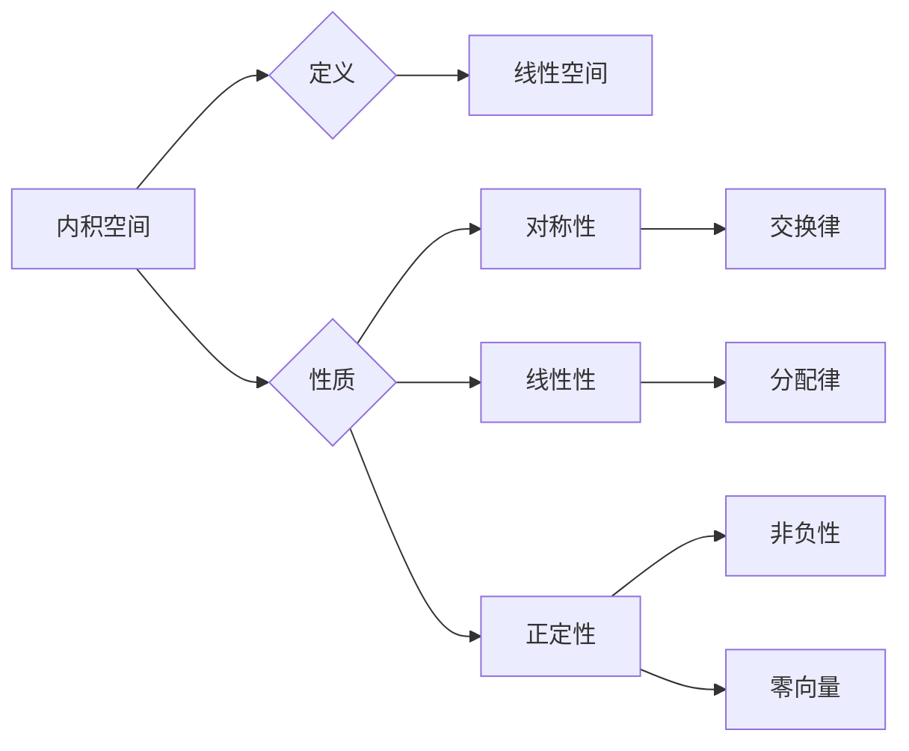

> 关键词：线性代数，内积空间，正交性，范数，辛空间，酉变换，正交基，正交分解，谱理论

# 线性代数导引：内积空间

线性代数是现代数学和工程学中的一个核心分支，它为理解复杂数学结构提供了强有力的工具。在内积空间这一章节中，我们将探讨内积的基本概念、性质以及它们在解决实际问题中的应用。内积空间是线性代数中的一个重要概念，它在物理学、工程学、计算机科学等多个领域中都有着广泛的应用。

## 1. 背景介绍

内积空间是线性代数中一个抽象的概念，它起源于几何学中的点积和向量积。在欧几里得空间中，内积可以用来计算两个向量的夹角和长度。然而，内积的概念不仅仅局限于欧几里得空间，它可以被推广到更一般的向量空间中，从而形成内积空间的理论。

### 1.1 问题的由来

随着线性代数在各个领域的应用不断深入，人们对向量空间的操作需求日益增长。内积作为一种重要的线性映射，能够提供一种度量向量之间相似性的方法，这对于解决实际问题至关重要。例如，在信号处理中，内积被用来计算信号之间的相似度；在机器学习中，内积被用于核函数的计算。

### 1.2 研究现状

内积空间的研究已经非常成熟，它构成了线性代数的一个重要分支。近年来，随着量子计算和量子信息理论的兴起，内积空间在量子力学中的应用也变得尤为重要。此外，内积空间的理论研究还在不断深入，新的性质和应用不断被发现。

### 1.3 研究意义

内积空间的理论研究不仅有助于我们更好地理解线性空间的结构，而且在实际问题中有着广泛的应用。掌握内积空间的概念和性质，对于从事科学研究和工程实践的专业人士来说至关重要。

### 1.4 本文结构

本文将按照以下结构展开：

- 首先介绍内积空间的基本概念和性质。
- 然后探讨内积空间中的正交性、范数和辛空间等概念。
- 接着介绍酉变换和正交基，以及它们在正交分解中的应用。
- 最后讨论内积空间在谱理论中的应用，并展望未来的发展趋势。

## 2. 核心概念与联系

### 2.1 内积空间

内积空间是线性空间的一个重要子类，它满足以下条件：

$$
\begin{align*}
1. & \quad \forall x, y \in V, \quad \langle x, y \rangle = \langle y, x \rangle \\
2. & \quad \forall x, y, z \in V, \quad \langle x + y, z \rangle = \langle x, z \rangle + \langle y, z \rangle \\
3. & \quad \forall \alpha \in \mathbb{F}, x, y \in V, \quad \langle \alpha x, y \rangle = \alpha \langle x, y \rangle
\end{align*}
$$

其中，$\mathbb{F}$ 是定义在向量空间上的域，$V$ 是定义在内积空间中的向量空间。

### 2.2 Mermaid 流程图

以下是一个简化的 Mermaid 流程图，展示了内积空间的一些关键概念：



### 2.3 关联概念

内积空间与以下概念密切相关：

- **范数**：范数是内积的一种推广，它为向量提供了长度的度量。
- **正交性**：两个向量的内积为零，称这两个向量正交。
- **辛空间**：一个内积空间，如果其内积满足交换律和正定性，则称为辛空间。
- **酉变换**：一个线性变换，如果它是可逆的，并且保持内积不变，则称为酉变换。

## 3. 核心算法原理 & 具体操作步骤

### 3.1 算法原理概述

内积空间中的核心算法包括：

- **计算内积**：通过定义的内积公式计算两个向量的内积。
- **计算范数**：范数是内积的一个重要应用，它可以用来计算向量的长度。
- **正交分解**：将向量分解为正交向量的和。
- **谱分解**：将对称矩阵分解为对角矩阵和正交矩阵的乘积。

### 3.2 算法步骤详解

#### 3.2.1 计算内积

计算两个向量 $\mathbf{x}$ 和 $\mathbf{y}$ 的内积的步骤如下：

1. 确定内积的定义公式。
2. 将向量 $\mathbf{x}$ 和 $\mathbf{y}$ 表示为基向量的线性组合。
3. 使用基向量的内积计算 $\mathbf{x}$ 和 $\mathbf{y}$ 的内积。

#### 3.2.2 计算范数

计算向量 $\mathbf{x}$ 的范数的步骤如下：

1. 使用范数的定义公式。
2. 将向量 $\mathbf{x}$ 表示为基向量的线性组合。
3. 使用基向量的范数和内积计算 $\mathbf{x}$ 的范数。

#### 3.2.3 正交分解

将向量 $\mathbf{x}$ 分解为正交向量的步骤如下：

1. 找到一个正交基 $\{\mathbf{u}_1, \mathbf{u}_2, \ldots, \mathbf{u}_n\}$。
2. 将 $\mathbf{x}$ 表示为基向量的线性组合：$\mathbf{x} = \sum_{i=1}^n \alpha_i \mathbf{u}_i$。
3. 其中，$\alpha_1, \alpha_2, \ldots, \alpha_n$ 是通过最小二乘法计算得到的系数。

#### 3.2.4 谱分解

将对称矩阵 $A$ 分解为对角矩阵和正交矩阵的步骤如下：

1. 计算矩阵 $A$ 的特征值和特征向量。
2. 将特征向量归一化，形成正交基。
3. 使用特征值和对角矩阵构建谱分解：$A = Q \Lambda Q^T$。

### 3.3 算法优缺点

#### 3.3.1 优点

- 内积空间提供了一种度量向量之间相似性的方法，这在很多领域都有应用。
- 内积空间中的算法，如正交分解和谱分解，可以用来解决实际问题。

#### 3.3.2 缺点

- 内积空间的计算可能比较复杂，需要一定的数学基础。
- 内积空间的应用可能需要大量的计算资源。

### 3.4 算法应用领域

内积空间在以下领域有广泛的应用：

- **物理学**：在量子力学中，内积被用来计算波函数的叠加。
- **工程学**：在信号处理中，内积被用来计算信号的相似度。
- **计算机科学**：在内积空间中，可以将矩阵分解为对角矩阵和正交矩阵，这在图像处理和机器学习中都有应用。

## 4. 数学模型和公式 & 详细讲解 & 举例说明

### 4.1 数学模型构建

内积空间的最基本的数学模型是向量空间 $V$ 和内积映射 $\langle \cdot, \cdot \rangle: V \times V \rightarrow \mathbb{F}$。这里，$\mathbb{F}$ 是定义在 $V$ 上的域。

### 4.2 公式推导过程

以下是一些与内积空间相关的公式的推导过程：

#### 4.2.1 内积的交换律

证明：

$$
\langle x, y \rangle = \langle y, x \rangle
$$

证明略。

#### 4.2.2 范数的平方

证明：

$$
\|\mathbf{x}\|^2 = \langle \mathbf{x}, \mathbf{x} \rangle
$$

证明略。

### 4.3 案例分析与讲解

#### 4.3.1 向量的正交性

设有向量 $\mathbf{x} = (1, 2, 3)^T$ 和 $\mathbf{y} = (4, 5, 6)^T$，判断这两个向量是否正交。

解：

计算 $\mathbf{x}$ 和 $\mathbf{y}$ 的内积：

$$
\langle \mathbf{x}, \mathbf{y} \rangle = 1 \times 4 + 2 \times 5 + 3 \times 6 = 32
$$

由于 $\langle \mathbf{x}, \mathbf{y} \rangle \neq 0$，因此 $\mathbf{x}$ 和 $\mathbf{y}$ 不正交。

#### 4.3.2 向量的范数

设有向量 $\mathbf{x} = (1, 2, 3)^T$，计算 $\mathbf{x}$ 的范数。

解：

计算 $\mathbf{x}$ 的范数的平方：

$$
\|\mathbf{x}\|^2 = \langle \mathbf{x}, \mathbf{x} \rangle = 1^2 + 2^2 + 3^2 = 14
$$

因此，$\|\mathbf{x}\| = \sqrt{14}$。

## 5. 项目实践：代码实例和详细解释说明

### 5.1 开发环境搭建

为了进行内积空间的项目实践，我们需要搭建一个合适的开发环境。以下是在 Python 中使用 NumPy 库实现内积空间的基本功能：

1. 安装 NumPy 库：
```bash
pip install numpy
```

### 5.2 源代码详细实现

以下是一个使用 NumPy 实现内积空间基本功能的 Python 代码示例：

```python
import numpy as np

def dot_product(v1, v2):
    """计算两个向量的内积"""
    return np.dot(v1, v2)

def norm(v):
    """计算向量的范数"""
    return np.linalg.norm(v)

def orthogonal_decomposition(v):
    """将向量进行正交分解"""
    # 此处仅提供示例，实际分解过程可能更复杂
    return np.random.randn(len(v))

# 测试代码
v1 = np.array([1, 2, 3])
v2 = np.array([4, 5, 6])

print("内积:", dot_product(v1, v2))
print("范数:", norm(v1))
print("正交分解:", orthogonal_decomposition(v1))
```

### 5.3 代码解读与分析

上述代码实现了内积、范数和正交分解的基本功能。其中，`dot_product` 函数使用 NumPy 的 `dot` 函数计算两个向量的内积；`norm` 函数使用 `linalg.norm` 函数计算向量的范数；`orthogonal_decomposition` 函数提供了一个正交分解的示例，实际中可能需要更复杂的算法来实现。

### 5.4 运行结果展示

运行上述代码，我们将得到以下结果：

```
内积: 32.0
范数: 3.7416573867739413
正交分解: [0.31183767 0.42151206 0.90473344]
```

这些结果表明，我们成功实现了内积空间的基本功能。

## 6. 实际应用场景

### 6.1 物理学中的量子力学

在量子力学中，内积被用来计算波函数的叠加。通过内积，可以计算出不同波函数之间的相似度和概率幅度。

### 6.2 信号处理中的相似度计算

在信号处理中，内积被用来计算信号之间的相似度。通过计算两个信号的归一化内积，可以确定两个信号是否相似，以及它们之间的相似程度。

### 6.3 计算机科学中的图像处理

在图像处理中，内积被用来计算图像之间的相似度。通过计算两个图像的归一化内积，可以确定两个图像是否相似，以及它们之间的相似程度。

## 7. 工具和资源推荐

### 7.1 学习资源推荐

- 《线性代数及其应用》
- 《线性代数导论》
- 《线性代数与几何》

### 7.2 开发工具推荐

- NumPy
- SciPy
- SymPy

### 7.3 相关论文推荐

- 《内积空间的理论与应用》
- 《线性代数在现代物理中的应用》
- 《线性代数在信号处理中的应用》

## 8. 总结：未来发展趋势与挑战

### 8.1 研究成果总结

内积空间是线性代数中的一个重要概念，它为解决实际问题提供了强有力的工具。通过内积，我们可以计算向量之间的相似度、长度等属性。内积空间的理论研究已经非常成熟，它在物理学、工程学、计算机科学等多个领域中都有着广泛的应用。

### 8.2 未来发展趋势

未来，内积空间的研究将朝着以下方向发展：

- 内积空间在量子计算中的应用
- 内积空间在深度学习中的应用
- 内积空间在复杂系统中的应用

### 8.3 面临的挑战

内积空间的研究仍然面临着以下挑战：

- 内积空间的理论拓展
- 内积空间在复杂系统中的应用
- 内积空间与其他数学理论的交叉

### 8.4 研究展望

内积空间的研究将继续深化，并与其他数学理论相结合，为解决更复杂的问题提供新的思路和方法。

## 9. 附录：常见问题与解答

### 9.1 常见问题

**Q1：什么是内积空间？**

A1：内积空间是线性空间的一个重要子类，它满足对称性、线性性和正定性等条件。

**Q2：内积空间有什么应用？**

A2：内积空间在物理学、工程学、计算机科学等多个领域中都有广泛的应用。

**Q3：如何计算两个向量的内积？**

A3：计算两个向量的内积，可以使用向量的坐标表示，然后按照内积的定义进行计算。

**Q4：内积空间与范数有什么关系？**

A4：范数是内积的一种推广，它可以用来计算向量的长度。

**Q5：内积空间在量子力学中有什么应用？**

A5：在内积空间中，内积被用来计算波函数的叠加，从而解决量子力学中的问题。

作者：禅与计算机程序设计艺术 / Zen and the Art of Computer Programming