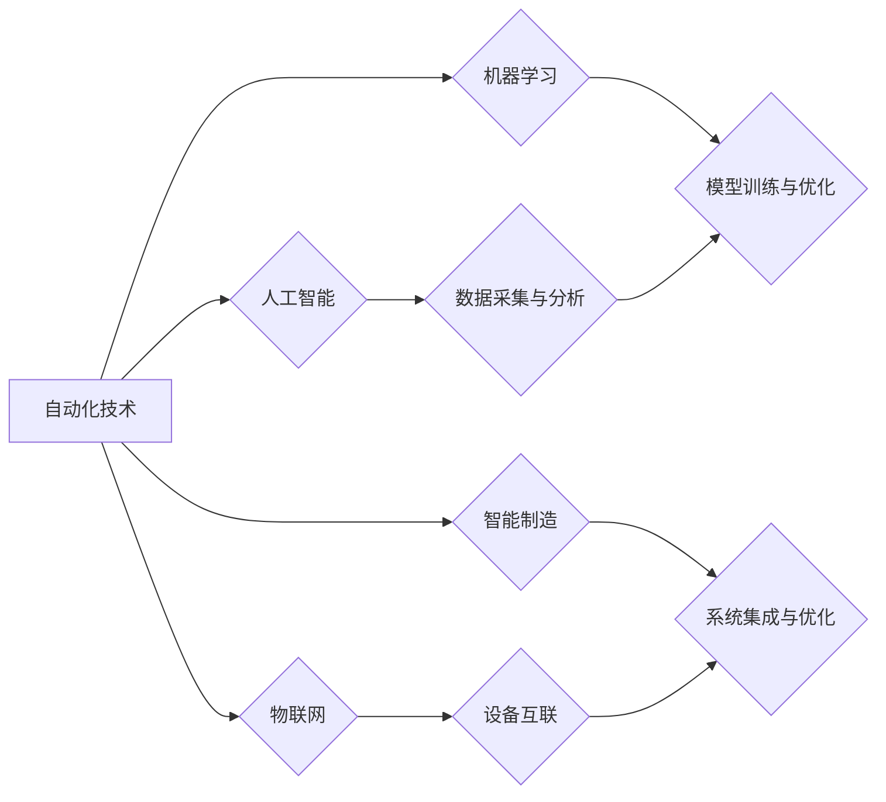

# 自动化技术的未来发展方向

> 关键词：自动化，人工智能，机器学习，智能制造，工业4.0，物联网，机器人，智能控制

## 1. 背景介绍

自动化技术是现代工业和制造业发展的基石，它通过使用机器和设备替代人工完成生产任务，提高了生产效率、降低了成本、保障了产品质量，并极大提升了人类生活的便利性。随着信息技术的飞速发展，特别是人工智能（AI）、机器学习（ML）等技术的突破，自动化技术正经历着前所未有的变革，朝着更加智能化、高效化、柔性化的方向发展。

### 1.1 自动化的起源与发展

自动化技术的起源可以追溯到20世纪初，随着电力、电子和计算机技术的发展，自动化设备逐渐从简单的机械装置演变成复杂的控制系统能够执行复杂的生产流程。从早期的生产线自动化，到后来的计算机辅助设计（CAD）和计算机辅助制造（CAM），自动化技术不断进步，逐渐渗透到工业生产的各个领域。

### 1.2 自动化技术的现状

当前，自动化技术已经广泛应用于汽车、电子、钢铁、化工、食品等行业。自动化系统不仅能够执行重复性高的生产任务，还能够进行过程监控、质量检测、故障诊断等复杂任务。

### 1.3 自动化技术的挑战

尽管自动化技术取得了巨大的成功，但仍然面临着以下挑战：

- **技术复杂性**：自动化系统越来越复杂，需要更加智能的算法和更加灵活的控制策略。
- **系统集成**：自动化系统需要与信息系统、物联网（IoT）等集成，以实现数据共享和协同工作。
- **安全性**：自动化系统需要保证生产过程的安全性，防止人为错误和设备故障带来的风险。
- **成本**：自动化系统的开发、部署和维护成本较高，需要寻找更加经济高效的解决方案。

## 2. 核心概念与联系

### 2.1 核心概念原理和架构的 Mermaid 流程图



### 2.2 核心概念解释

- **人工智能**：通过模拟人类智能行为，使机器能够执行复杂的决策和推理任务。
- **机器学习**：一种使计算机系统能够从数据中学习并做出决策或预测的技术。
- **物联网**：通过互联网将各种设备连接起来，实现设备间的数据交换和通信。
- **智能制造**：将自动化、信息化和智能化技术融合，实现生产过程的智能化管理。

## 3. 核心算法原理 & 具体操作步骤

### 3.1 算法原理概述

自动化技术的核心算法包括：

- **控制算法**：用于控制机器执行特定任务，如PID控制、模糊控制、神经网络控制等。
- **优化算法**：用于优化生产过程，如线性规划、遗传算法、模拟退火等。
- **机器学习算法**：用于从数据中学习并预测结果，如决策树、支持向量机、神经网络等。

### 3.2 算法步骤详解

1. **数据采集**：使用传感器、摄像头等设备采集生产过程中的各种数据。
2. **数据预处理**：对采集到的数据进行清洗、转换和规范化，以供后续分析。
3. **算法应用**：选择合适的算法对数据进行处理，如控制算法进行过程控制，机器学习算法进行预测。
4. **结果反馈**：将算法处理的结果反馈到生产过程中，以实现自动化控制。

### 3.3 算法优缺点

- **控制算法**：优点是稳定可靠，缺点是难以适应复杂多变的生产环境。
- **优化算法**：优点是能够优化生产过程，缺点是计算量大，难以处理大规模问题。
- **机器学习算法**：优点是能够适应复杂多变的生产环境，缺点是需要大量标注数据，且模型的可解释性较差。

### 3.4 算法应用领域

- **工业自动化**：如机器人、数控机床、自动化生产线等。
- **智能制造**：如工业互联网、智能工厂、智能物流等。
- **智能家居**：如智能家电、智能家居系统等。

## 4. 数学模型和公式 & 详细讲解 & 举例说明

### 4.1 数学模型构建

自动化技术的数学模型通常包括以下部分：

- **状态变量**：描述系统当前状态的变量，如温度、压力、速度等。
- **控制变量**：描述系统输出变量的变量，如加热功率、电机转速等。
- **控制策略**：根据状态变量和控制变量设计控制策略，如PID控制、模糊控制等。

### 4.2 公式推导过程

以PID控制为例，其控制策略可以用以下公式表示：

$$
u(t) = K_p \cdot e(t) + K_i \cdot \int e(t) \, dt + K_d \cdot \frac{de(t)}{dt}
$$

其中，$u(t)$ 为控制输出，$e(t)$ 为误差，$K_p$、$K_i$、$K_d$ 分别为比例、积分、微分系数。

### 4.3 案例分析与讲解

以下是一个简单的PID控制案例：

假设一个加热系统，其温度与加热功率成正比，温度目标值为$T_s$，当前温度为$T$，加热功率为$u$。我们希望使用PID控制策略使温度稳定在目标值。

首先，定义误差 $e = T_s - T$。然后，根据PID控制策略计算加热功率：

$$
u = K_p \cdot e + K_i \cdot \int e \, dt + K_d \cdot \frac{de}{dt}
$$

通过调整比例系数$K_p$、积分系数$K_i$和微分系数$K_d$，可以实现对温度的精确控制。

## 5. 项目实践：代码实例和详细解释说明

### 5.1 开发环境搭建

为了实现自动化控制，我们需要搭建以下开发环境：

- 操作系统：Windows、Linux或macOS
- 编程语言：Python、C++等
- 控制库：如PyQt、OpenCV等
- 传感器库：如Arduino、Raspberry Pi等

### 5.2 源代码详细实现

以下是一个使用Python和PyQt实现简单的PID控制器的示例代码：

```python
import sys
from PyQt5.QtWidgets import QApplication, QMainWindow, QVBoxLayout, QLabel, QPushButton, QSlider

class PIDController(QMainWindow):
    def __init__(self):
        super().__init__()
        self.initUI()

    def initUI(self):
        self.setWindowTitle('PID Controller')
        self.setGeometry(100, 100, 300, 200)

        layout = QVBoxLayout()
        self.label_setpoint = QLabel('Setpoint:', self)
        self.slider_setpoint = QSlider(self)
        self.slider_setpoint.setOrientation(Qt.Horizontal)
        self.slider_setpoint.setMinimum(0)
        self.slider_setpoint.setMaximum(100)
        self.slider_setpoint.setValue(50)

        self.label_process_value = QLabel('Process Value:', self)
        self.slider_process_value = QSlider(self)
        self.slider_process_value.setOrientation(Qt.Horizontal)
        self.slider_process_value.setMinimum(0)
        self.slider_process_value.setMaximum(100)
        self.slider_process_value.setValue(50)

        self.btn_calculate = QPushButton('Calculate', self)
        self.btn_calculate.clicked.connect(self.calculate)

        layout.addWidget(self.label_setpoint)
        layout.addWidget(self.slider_setpoint)
        layout.addWidget(self.label_process_value)
        layout.addWidget(self.slider_process_value)
        layout.addWidget(self.btn_calculate)

        self.setCentralWidget(QVBoxLayout())

    def calculate(self):
        setpoint = self.slider_setpoint.value()
        process_value = self.slider_process_value.value()
        Kp = 1.0
        Ki = 0.1
        Kd = 0.05

        error = setpoint - process_value
        derivative = error - self.last_error
        integral = self.integral + error

        output = Kp * error + Ki * integral + Kd * derivative
        self.last_error = error

        self.label_process_value.setText(f'Process Value: {process_value:.2f}')
        self.label_setpoint.setText(f'Setpoint: {setpoint:.2f}')

if __name__ == '__main__':
    app = QApplication(sys.argv)
    ex = PIDController()
    ex.show()
    sys.exit(app.exec_())
```

### 5.3 代码解读与分析

上述代码实现了一个简单的PID控制器，通过调整滑动条设置目标值和过程值，可以观察PID控制器的输出结果。

- `PIDController` 类继承自 `QMainWindow` 类，用于创建主窗口。
- `initUI` 方法用于初始化用户界面，包括标签、滑动条和按钮。
- `calculate` 方法根据PID控制策略计算输出值，并更新标签显示结果。

### 5.4 运行结果展示

运行上述代码后，将显示一个窗口，其中包含设置点和过程值滑动条以及计算按钮。通过调整滑动条设置目标值和过程值，可以观察到PID控制器输出值的变化。

## 6. 实际应用场景

### 6.1 工业自动化

自动化技术在工业自动化中的应用非常广泛，以下是一些常见的应用场景：

- **生产线自动化**：通过机器人、自动化设备等实现生产线的自动化生产。
- **质量控制**：使用机器视觉技术对产品进行质量检测，确保产品质量。
- **过程控制**：使用PID控制等算法对生产过程中的温度、压力、流量等参数进行控制。

### 6.2 智能制造

智能制造是自动化技术发展的重要方向，以下是一些智能制造的应用场景：

- **工业互联网**：通过物联网技术实现设备互联和数据共享。
- **智能工厂**：构建高度自动化的智能工厂，实现生产过程的智能化管理。
- **智能物流**：使用自动化设备和人工智能技术实现物流的自动化和智能化。

### 6.3 智能家居

智能家居是自动化技术在生活中的应用，以下是一些智能家居的应用场景：

- **智能家电**：通过智能设备实现家庭生活的自动化，如智能电视、智能冰箱等。
- **智能照明**：根据环境光线自动调节灯光亮度。
- **智能安防**：使用摄像头、传感器等技术实现家庭安全的自动化监控。

## 7. 工具和资源推荐

### 7.1 学习资源推荐

- 《自动化系统设计》
- 《控制理论》
- 《机器学习》
- 《物联网》
- 《智能制造》

### 7.2 开发工具推荐

- Python编程语言
- PyQt图形界面库
- OpenCV计算机视觉库
- Arduino物联网平台
- Raspberry Pi物联网平台

### 7.3 相关论文推荐

- 《人工智能：一种现代的方法》
- 《物联网：理论与实践》
- 《智能制造：技术与发展》
- 《工业自动化控制技术》
- 《机器学习：概率视角》

## 8. 总结：未来发展趋势与挑战

### 8.1 研究成果总结

自动化技术经过多年的发展，已经取得了显著的成果。人工智能、机器学习、物联网等技术的融合，使得自动化技术更加智能化、高效化、柔性化。未来，自动化技术将朝着更加智能、高效、安全的方向发展。

### 8.2 未来发展趋势

- **智能化**：通过人工智能、机器学习等技术，使自动化系统具备更强的智能决策和自主学习能力。
- **高效化**：通过优化算法和控制策略，提高自动化系统的生产效率和资源利用率。
- **柔性化**：通过模块化和标准化设计，使自动化系统更加灵活，能够适应不同的生产环境和需求。
- **网络化**：通过物联网技术，实现自动化系统与信息系统的集成，实现数据共享和协同工作。

### 8.3 面临的挑战

- **技术挑战**：自动化技术需要不断突破新的技术难题，如智能控制、机器学习算法、机器人技术等。
- **成本挑战**：自动化系统的开发、部署和维护成本较高，需要寻找更加经济高效的解决方案。
- **人才挑战**：自动化技术发展需要大量专业人才，需要加强人才培养和引进。

### 8.4 研究展望

未来，自动化技术将与其他新兴技术深度融合，推动制造业和各行各业的发展。以下是一些研究方向：

- **自适应控制**：根据环境变化和系统状态，自动调整控制策略。
- **强化学习**：使自动化系统能够通过试错学习，优化决策过程。
- **人机协同**：实现人与机器的协同工作，提高生产效率和安全性。

## 9. 附录：常见问题与解答

**Q1：自动化技术有哪些应用领域？**

A：自动化技术广泛应用于工业、农业、医疗、教育、家居等领域。

**Q2：什么是智能制造？**

A：智能制造是指将自动化、信息化和智能化技术融合，实现生产过程的智能化管理。

**Q3：什么是工业互联网？**

A：工业互联网是指通过物联网技术将工业设备连接起来，实现数据共享和协同工作。

**Q4：如何实现自动化控制？**

A：自动化控制通常使用PID控制、模糊控制、神经网络控制等方法实现。

**Q5：什么是机器人？**

A：机器人是一种能够模拟人类行为，执行特定任务的自动化设备。

作者：禅与计算机程序设计艺术 / Zen and the Art of Computer Programming