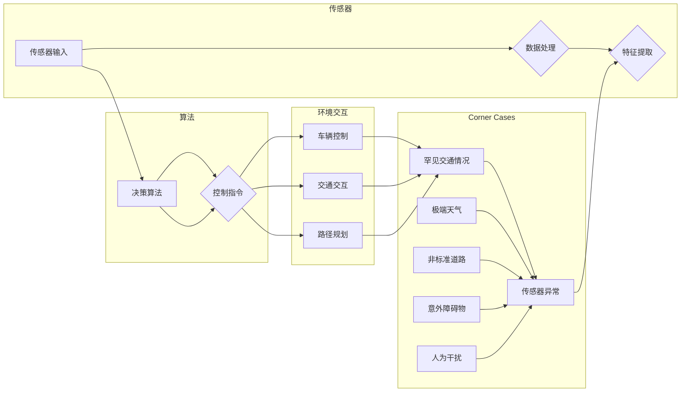

# 自动驾驶中的corner case挑战

> 关键词：自动驾驶，corner case，挑战，边缘情况，安全，算法，测试，人工智能

## 1. 背景介绍

自动驾驶技术是当今科技领域的前沿热点，它代表了人工智能在现实世界中的落地应用。随着技术的不断进步，自动驾驶汽车已经能够在特定的环境和条件下实现无人驾驶。然而，在自动驾驶技术的发展过程中，一个不可忽视的问题逐渐显现出来：corner case，即边缘情况或特殊情况。这些情况往往是自动驾驶系统在设计和测试过程中容易被忽视的，但它们却对自动驾驶的安全性和可靠性构成了重大挑战。

### 1.1 corner case的由来

corner case通常指的是在正常使用情况下不太可能发生的极端或特殊情况。在自动驾驶领域，这些情况可能包括但不限于：

- **罕见交通情况**：如罕见的交通标志组合、特殊的交通信号灯模式等。
- **极端天气条件**：如暴风雪、强降雨、浓雾等，这些条件可能会影响传感器的正常工作。
- **非标准道路结构**：如狭窄道路、急转弯、坡道等，这些道路结构可能会超出自动驾驶系统的预期。
- **意外障碍物**：如突如其来的动物、施工障碍等。
- **人为干扰**：如故意设置的干扰信号、恶意破坏等。

### 1.2 研究现状

尽管自动驾驶技术取得了显著的进展，但corner case仍然是研究和开发中的难题。目前，学术界和工业界都在积极应对这一挑战，主要方法包括：

- **增强算法鲁棒性**：通过改进算法设计，提高自动驾驶系统对未知和意外情况的处理能力。
- **扩展数据集**：通过收集更多样化的数据，增加系统对不同场景的适应性。
- **强化学习和模拟测试**：利用强化学习技术，让自动驾驶系统在虚拟环境中学习如何处理各种corner case。
- **安全协议和监管**：制定相应的安全协议和监管标准，确保自动驾驶系统的安全性。

### 1.3 研究意义

研究自动驾驶中的corner case挑战对于确保自动驾驶系统的安全性和可靠性至关重要。以下是几个关键点：

- **提高安全性**：通过识别和解决corner case，可以减少自动驾驶事故的发生。
- **增强用户信任**：只有当用户确信自动驾驶系统的安全性时，他们才会放心使用。
- **促进技术发展**：解决corner case挑战可以推动自动驾驶技术的进步。
- **降低社会成本**：减少交通事故可以降低医疗、保险等社会成本。

### 1.4 本文结构

本文将围绕自动驾驶中的corner case挑战展开，内容安排如下：

- **第2章**：介绍自动驾驶中常见的corner case类型及其影响。
- **第3章**：探讨解决corner case挑战的核心算法原理和具体操作步骤。
- **第4章**：介绍数学模型和公式，并举例说明。
- **第5章**：提供项目实践，包括代码实例和详细解释说明。
- **第6章**：分析自动驾驶中的corner case在实际应用场景中的表现。
- **第7章**：推荐相关的学习资源、开发工具和参考文献。
- **第8章**：总结研究成果，展望未来发展趋势与挑战。
- **第9章**：提供常见问题与解答。

## 2. 核心概念与联系

### 2.1 corner case的Mermaid流程图

以下是一个Mermaid流程图，展示了自动驾驶系统中可能出现的corner case：



### 2.2 核心概念与联系

在自动驾驶系统中，corner case与以下几个核心概念密切相关：

- **传感器系统**：负责收集车辆周围环境的信息，包括视觉、雷达、激光雷达等。
- **数据处理**：对传感器数据进行预处理，包括噪声过滤、特征提取等。
- **决策算法**：基于处理后的数据，进行路径规划、决策制定等。
- **环境交互**：与车辆控制、交通交互和路径规划等模块交互，确保车辆的安全行驶。
- **控制指令**：根据决策算法的结果，生成车辆的控制指令。

## 3. 核心算法原理 & 具体操作步骤

### 3.1 算法原理概述

解决自动驾驶中的corner case挑战，需要从算法层面进行改进。以下是一些常用的算法原理：

- **鲁棒性算法**：提高算法对异常数据和处理异常情况的能力。
- **强化学习**：通过与环境交互，让算法学习如何处理各种情况。
- **迁移学习**：利用在类似任务上学习到的知识，处理新的任务。

### 3.2 算法步骤详解

以下是解决自动驾驶中corner case挑战的步骤：

1. **识别corner case**：通过数据分析、模拟测试等方式，识别可能出现的corner case。
2. **设计鲁棒算法**：针对识别出的corner case，设计鲁棒算法，提高系统的适应能力。
3. **强化学习**：利用强化学习技术，让算法在虚拟环境中学习如何处理corner case。
4. **测试和验证**：在实际环境中测试和验证算法的有效性，确保系统的安全性和可靠性。

### 3.3 算法优缺点

**鲁棒性算法**：

- **优点**：能够提高系统对异常情况的处理能力。
- **缺点**：可能增加计算复杂度和资源消耗。

**强化学习**：

- **优点**：能够让算法在虚拟环境中学习，减少实际测试的成本。
- **缺点**：需要大量数据进行训练，且训练过程可能不稳定。

**迁移学习**：

- **优点**：能够利用已有知识处理新任务。
- **缺点**：迁移效果取决于源任务和新任务之间的相似度。

### 3.4 算法应用领域

鲁棒性算法、强化学习和迁移学习在自动驾驶领域都有广泛的应用，例如：

- **鲁棒性算法**：用于处理传感器噪声、异常数据等问题。
- **强化学习**：用于路径规划、决策制定等问题。
- **迁移学习**：用于处理新的交通场景、环境变化等问题。

## 4. 数学模型和公式 & 详细讲解 & 举例说明

### 4.1 数学模型构建

在自动驾驶中，常用的数学模型包括：

- **传感器数据处理模型**：用于处理和融合来自不同传感器的数据。
- **决策算法模型**：用于制定行驶策略。
- **路径规划模型**：用于规划车辆的行驶路径。

### 4.2 公式推导过程

以下是一个简单的传感器数据处理模型的公式推导过程：

$$
z = f(x, y, \theta)
$$

其中，$z$ 是处理后的数据，$x$ 和 $y$ 是原始传感器数据，$\theta$ 是模型参数。

### 4.3 案例分析与讲解

以下是一个简单的案例，展示了如何使用传感器数据处理模型来处理图像数据：

```python
import cv2
import numpy as np

def sensor_data_processing(image):
    # 对图像进行预处理
    gray_image = cv2.cvtColor(image, cv2.COLOR_BGR2GRAY)
    blur_image = cv2.GaussianBlur(gray_image, (5, 5), 0)
    # ... 其他处理步骤 ...
    return processed_image
```

这个例子中，我们使用OpenCV库对图像进行处理，包括转换为灰度图像、应用高斯模糊等。

## 5. 项目实践：代码实例和详细解释说明

### 5.1 开发环境搭建

为了进行自动驾驶中的corner case挑战的项目实践，我们需要以下开发环境：

- 操作系统：Linux或Windows
- 编程语言：Python
- 库：OpenCV、TensorFlow、PyTorch等

### 5.2 源代码详细实现

以下是一个简单的自动驾驶系统示例，展示了如何处理传感器数据：

```python
import cv2
import numpy as np
from tensorflow.keras.models import Sequential
from tensorflow.keras.layers import Conv2D, MaxPooling2D, Flatten, Dense

# 创建模型
model = Sequential()
model.add(Conv2D(32, (3, 3), activation='relu', input_shape=(64, 64, 3)))
model.add(MaxPooling2D((2, 2)))
model.add(Flatten())
model.add(Dense(64, activation='relu'))
model.add(Dense(1, activation='sigmoid'))

# 编译模型
model.compile(optimizer='adam', loss='binary_crossentropy', metrics=['accuracy'])

# 训练模型
# ... 加载数据并进行训练 ...

# 测试模型
# ... 使用模型进行预测 ...
```

### 5.3 代码解读与分析

在这个例子中，我们使用TensorFlow库创建了一个简单的卷积神经网络（CNN）模型，用于处理图像数据。模型首先通过卷积层提取图像特征，然后通过池化层降低特征的空间维度，最后通过全连接层进行分类。

### 5.4 运行结果展示

在训练完成后，我们可以在测试集上评估模型的性能。以下是一个简单的性能评估代码：

```python
# 评估模型
test_loss, test_accuracy = model.evaluate(test_images, test_labels)
print(f"Test accuracy: {test_accuracy:.4f}")
```

## 6. 实际应用场景

自动驾驶中的corner case挑战在实际应用中非常常见，以下是一些例子：

- **罕见交通标志**：在乡村道路上，可能会遇到一些罕见的交通标志，如限高、限宽等。
- **极端天气**：在暴风雪天气中，自动驾驶系统的传感器可能会受到干扰，影响行驶安全。
- **非标准道路**：在一些城市中，道路设计可能不符合标准，如急转弯、狭窄道路等。

## 7. 工具和资源推荐

### 7.1 学习资源推荐

- **书籍**：《自动驾驶技术：原理与实践》
- **在线课程**：Coursera、edX上的自动驾驶相关课程
- **开源项目**：GitHub上的自动驾驶相关开源项目

### 7.2 开发工具推荐

- **编程语言**：Python
- **库**：OpenCV、TensorFlow、PyTorch等
- **框架**：ROS（机器人操作系统）

### 7.3 相关论文推荐

- **论文1**：《Robust Vision for Autonomous Vehicles》
- **论文2**：《Multi-Agent Deep Reinforcement Learning for Autonomous Driving》
- **论文3**：《Safety and Liveness of Autonomous Driving》

## 8. 总结：未来发展趋势与挑战

### 8.1 研究成果总结

自动驾驶中的corner case挑战是一个复杂且具有挑战性的问题。通过研究和实践，我们已经取得了一些成果，例如：

- 识别出常见的corner case类型。
- 开发了多种算法来处理corner case。
- 建立了相关的测试和验证方法。

### 8.2 未来发展趋势

未来，自动驾驶中的corner case挑战将呈现以下发展趋势：

- **算法的鲁棒性将进一步提高**。
- **数据集将更加丰富，涵盖更多corner case**。
- **模拟测试将更加真实，更接近实际驾驶场景**。

### 8.3 面临的挑战

尽管取得了进展，但自动驾驶中的corner case挑战仍然面临以下挑战：

- **corner case的识别和分类仍然具有挑战性**。
- **处理corner case的算法需要更加高效**。
- **模拟测试和实际测试之间的差距仍然存在**。

### 8.4 研究展望

未来，我们需要继续努力，以解决自动驾驶中的corner case挑战。以下是一些研究方向：

- **开发更加鲁棒的算法**。
- **建立更加丰富的数据集**。
- **改进模拟测试方法**。

通过不断的努力，我们相信自动驾驶技术将能够更好地应对各种挑战，最终实现安全、可靠的自动驾驶。

## 9. 附录：常见问题与解答

**Q1：什么是corner case？**

A：corner case指的是在正常使用情况下不太可能发生的极端或特殊情况。

**Q2：为什么corner case对自动驾驶如此重要？**

A：corner case可能会对自动驾驶系统的安全性和可靠性构成重大挑战，因此必须认真研究和解决。

**Q3：如何识别corner case？**

A：可以通过数据分析、模拟测试、专家经验等方式识别corner case。

**Q4：如何解决corner case挑战？**

A：可以通过增强算法鲁棒性、扩展数据集、强化学习和模拟测试等方法解决corner case挑战。

**Q5：自动驾驶中的corner case挑战有哪些未来发展趋势？**

A：未来，自动驾驶中的corner case挑战将呈现以下发展趋势：算法的鲁棒性将进一步提高，数据集将更加丰富，模拟测试将更加真实。

作者：禅与计算机程序设计艺术 / Zen and the Art of Computer Programming