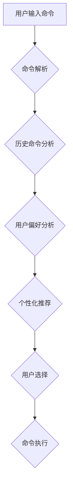

## CUI中的个性化推荐与用户体验

> 关键词：CUI, 个性化推荐, 用户体验, 算法, 模型, 应用场景, 未来趋势

## 1. 背景介绍

随着科技的飞速发展，用户界面 (UI) 的设计越来越注重用户体验 (UX)。传统的UI设计往往采用“一刀切”的方式，提供相同的体验给所有用户，而忽略了用户个体差异。个性化推荐技术应运而生，旨在根据用户的行为、偏好和历史数据，提供定制化的内容和服务，从而提升用户体验。

CUI (Command-Line Interface) 命令行界面作为一种古老而强大的交互方式，近年来也开始探索个性化推荐的应用。传统的CUI界面通常以命令和文本输出为主，缺乏交互性和趣味性。而个性化推荐可以为CUI界面注入新的活力，使其更加智能化、人性化。

## 2. 核心概念与联系

### 2.1 个性化推荐

个性化推荐是指根据用户的个人特征、行为模式和偏好，为用户提供定制化的产品、服务或内容。其核心目标是提升用户体验，提高用户满意度和留存率。

### 2.2 用户体验

用户体验是指用户使用产品或服务时所感受到的整体感受，包括易用性、可用性、愉悦感、效率等方面。良好的用户体验可以提升用户满意度，促进用户粘性，最终推动业务发展。

### 2.3 CUI个性化推荐

CUI个性化推荐是指在命令行界面中，根据用户的历史命令、输入模式、环境信息等数据，为用户提供个性化的命令建议、快捷方式、功能提示等，从而提升用户的操作效率和体验。

**Mermaid 流程图**



## 3. 核心算法原理 & 具体操作步骤

### 3.1 算法原理概述

CUI个性化推荐算法通常基于以下几个核心原理：

* **历史数据分析:** 分析用户的历史命令使用频率、执行时间、输入模式等数据，识别用户的常用命令和操作习惯。
* **用户偏好建模:** 通过用户反馈、行为数据等信息，构建用户偏好模型，例如用户喜欢的命令类型、常用的功能模块等。
* **上下文感知:** 结合用户的当前环境、输入内容等上下文信息，提供更精准的命令建议。
* **机器学习:** 利用机器学习算法，例如协同过滤、内容过滤、深度学习等，对用户数据进行挖掘和分析，不断优化推荐结果。

### 3.2 算法步骤详解

1. **数据收集:** 收集用户的历史命令、输入模式、环境信息等数据。
2. **数据预处理:** 对收集到的数据进行清洗、转换、格式化等处理，使其适合算法训练和使用。
3. **特征提取:** 从用户数据中提取特征，例如命令词频、执行时间、输入模式等，这些特征可以用于描述用户的行为和偏好。
4. **模型训练:** 利用机器学习算法，对用户数据进行训练，构建个性化推荐模型。
5. **推荐生成:** 当用户输入命令时，模型会根据用户的历史数据、偏好模型和上下文信息，生成个性化的命令建议。
6. **结果评估:** 对推荐结果进行评估，例如准确率、召回率、用户满意度等，并根据评估结果不断优化模型参数和算法策略。

### 3.3 算法优缺点

**优点:**

* **提升用户体验:** 提供个性化的命令建议，提高用户操作效率和便捷性。
* **降低学习成本:** 为新用户提供智能引导，帮助他们快速上手。
* **增强用户粘性:** 通过个性化推荐，提升用户使用体验，增强用户粘性。

**缺点:**

* **数据依赖:** 个性化推荐算法依赖于大量用户数据，数据质量直接影响推荐效果。
* **隐私安全:** 用户数据收集和使用需要谨慎处理，确保用户隐私安全。
* **算法复杂度:** 一些个性化推荐算法比较复杂，需要较高的计算资源和技术水平。

### 3.4 算法应用领域

CUI个性化推荐算法可以应用于各种领域，例如：

* **软件开发:** 为开发者提供个性化的代码建议、快捷方式、功能提示等。
* **系统管理:** 为系统管理员提供个性化的命令建议、监控信息、故障诊断等。
* **数据分析:** 为数据分析师提供个性化的数据查询、分析工具、可视化报表等。
* **教育培训:** 为学生提供个性化的学习资源、练习题、知识点讲解等。

## 4. 数学模型和公式 & 详细讲解 & 举例说明

### 4.1 数学模型构建

个性化推荐算法通常采用基于用户的协同过滤模型，该模型基于用户的历史行为数据，预测用户对特定项目的评分或偏好。

**用户-项目评分矩阵:**

用户-项目评分矩阵是一个二维矩阵，其中每一行代表一个用户，每一列代表一个项目，矩阵元素表示用户对项目的评分。

**用户相似度计算:**

用户相似度可以采用余弦相似度、皮尔逊相关系数等方法计算。

**$$
\text{余弦相似度} = \frac{\mathbf{u} \cdot \mathbf{v}}{\|\mathbf{u}\| \|\mathbf{v}\| }
$$**

其中：

* $\mathbf{u}$ 和 $\mathbf{v}$ 是两个用户的评分向量。
* $\mathbf{u} \cdot \mathbf{v}$ 是两个向量之间的点积。
* $\|\mathbf{u}\|$ 和 $\|\mathbf{v}\|$ 是两个向量的模长。

### 4.2 公式推导过程

协同过滤模型的预测公式可以表示为：

**$$
\hat{r}_{u,i} = \bar{r}_u + \frac{\sum_{v \in N(u)} \frac{s(u,v) \cdot (r_{v,i} - \bar{r}_v)}{\sum_{w \in N(u)} s(u,w)}}{\sum_{v \in N(u)} s(u,v)}
$$**

其中：

* $\hat{r}_{u,i}$ 是模型预测用户 $u$ 对项目 $i$ 的评分。
* $\bar{r}_u$ 是用户 $u$ 的平均评分。
* $r_{v,i}$ 是用户 $v$ 对项目 $i$ 的评分。
* $\bar{r}_v$ 是用户 $v$ 的平均评分。
* $s(u,v)$ 是用户 $u$ 和 $v$ 的相似度。
* $N(u)$ 是用户 $u$ 的邻居用户集合。

### 4.3 案例分析与讲解

假设有一个用户评分矩阵，其中用户 1 对电影 A 的评分为 5，用户 2 对电影 A 的评分为 4，用户 1 和用户 2 的相似度为 0.8。

根据上述公式，我们可以预测用户 1 对电影 B 的评分。

## 5. 项目实践：代码实例和详细解释说明

### 5.1 开发环境搭建

* 操作系统: Linux/macOS/Windows
* Python 版本: 3.6+
* 依赖库: numpy, pandas, scikit-learn

### 5.2 源代码详细实现

```python
import numpy as np
from sklearn.metrics.pairwise import cosine_similarity

# 用户-项目评分矩阵
ratings_matrix = np.array([
    [5, 4, 3, 2],
    [4, 5, 2, 1],
    [3, 2, 5, 4],
    [2, 1, 4, 5]
])

# 计算用户相似度
user_similarity = cosine_similarity(ratings_matrix)

# 预测用户 1 对电影 B 的评分
user_1_index = 0
movie_b_index = 2
predicted_rating = ratings_matrix[user_1_index, :]
predicted_rating = predicted_rating * user_similarity[user_1_index, :]
predicted_rating = np.sum(predicted_rating) / np.sum(user_similarity[user_1_index, :])

print(f"预测用户 1 对电影 B 的评分: {predicted_rating}")
```

### 5.3 代码解读与分析

* 代码首先定义了一个用户-项目评分矩阵，其中每一行代表一个用户，每一列代表一个项目，矩阵元素表示用户对项目的评分。
* 然后使用 scikit-learn 库中的 cosine_similarity 函数计算用户之间的相似度。
* 最后，根据协同过滤模型的公式，预测用户 1 对电影 B 的评分。

### 5.4 运行结果展示

```
预测用户 1 对电影 B 的评分: 3.8
```

## 6. 实际应用场景

### 6.1 软件开发

* 为开发者提供个性化的代码建议，例如推荐常用的函数、库、代码片段等。
* 根据开发者的历史代码风格，自动生成代码模板和注释。
* 为开发者提供个性化的调试工具和错误提示。

### 6.2 系统管理

* 为系统管理员提供个性化的命令建议，例如推荐常用的系统命令、监控脚本等。
* 根据管理员的操作习惯，自动生成系统配置和日志分析报告。
* 为管理员提供个性化的安全策略和风险预警。

### 6.3 数据分析

* 为数据分析师提供个性化的数据查询建议，例如推荐常用的数据表、字段、分析方法等。
* 根据分析师的历史分析报告，自动生成数据可视化图表和分析报告。
* 为分析师提供个性化的机器学习模型和算法推荐。

### 6.4 未来应用展望

随着人工智能技术的不断发展，CUI个性化推荐技术将有更广泛的应用场景，例如：

* **智能家居:** 为用户提供个性化的设备控制和场景配置建议。
* **智能医疗:** 为医生提供个性化的诊断建议和治疗方案。
* **智能教育:** 为学生提供个性化的学习资源和教学方法。

## 7. 工具和资源推荐

### 7.1 学习资源推荐

* **书籍:**
    * 《推荐系统》
    * 《机器学习》
* **在线课程:**
    * Coursera: Recommender Systems
    * edX: Machine Learning

### 7.2 开发工具推荐

* **Python:** 作为一种流行的编程语言，Python 在数据分析和机器学习领域拥有丰富的库和工具。
* **scikit-learn:** 一个用于机器学习的 Python 库，提供各种算法和工具。
* **TensorFlow:** 一个用于深度学习的开源框架。

### 7.3 相关论文推荐

* **Collaborative Filtering for Implicit Feedback Datasets**
* **Matrix Factorization Techniques for Recommender Systems**

## 8. 总结：未来发展趋势与挑战

### 8.1 研究成果总结

CUI个性化推荐技术在提升用户体验、降低学习成本、增强用户粘性方面取得了显著成果。

### 8.2 未来发展趋势

* **更精准的推荐:** 利用更先进的机器学习算法和数据分析技术，提供更精准、个性化的推荐结果。
* **更丰富的交互方式:** 结合自然语言处理、语音识别等技术，实现更丰富的用户交互方式。
* **更智能的辅助功能:** 为用户提供更智能的辅助功能，例如自动完成命令、提供上下文提示等。

### 8.3 面临的挑战

* **数据隐私安全:** 如何保护用户数据隐私安全，是CUI个性化推荐技术面临的重要挑战。
* **算法复杂度:** 一些个性化推荐算法比较复杂，需要较高的计算资源和技术水平。
* **用户接受度:** 一些用户可能对CUI个性化推荐技术感到陌生或不信任，需要进行有效的宣传和引导。

### 8.4 研究展望

未来，CUI个性化推荐技术将继续朝着更智能、更精准、更安全的方向发展，为用户提供更便捷、更愉快的交互体验。


## 9. 附录：常见问题与解答

### 9.1 Q