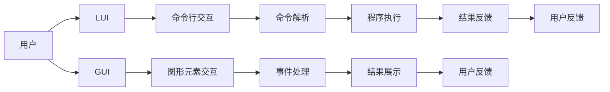

# GUI与LUI在内容匹配与引导中的比较

> 关键词：图形用户界面（GUI），线性用户界面（LUI），内容匹配，用户引导，交互设计，用户体验

## 1. 背景介绍

随着计算机技术的飞速发展，用户界面设计成为软件和应用程序不可或缺的一部分。用户界面（User Interface，简称UI）的质量直接影响到用户的体验和满意度。在现代软件设计中，图形用户界面（Graphical User Interface，简称GUI）和线性用户界面（Linear User Interface，简称LUI）是最常见的两种界面形式。本文将深入探讨GUI与LUI在内容匹配与引导方面的差异，以及它们各自的优势和挑战。

### 1.1 GUI的兴起

GUI的出现标志着计算机用户界面的革命。它通过图形元素（如按钮、窗口、图标等）提供直观的用户交互方式，极大地提高了用户操作的便捷性和效率。GUI的兴起得益于以下因素：

- 图形显示技术的进步，使得屏幕上的图形元素更加丰富和生动。
- 鼠标和触摸技术的普及，提供了比键盘更自然的交互方式。
- 交互设计的不断发展，使得GUI界面更加符合用户的操作习惯。

### 1.2 LUI的演变

LUI，也称为命令行界面（Command Line Interface，简称CLI），是一种基于文本的交互方式。虽然相比GUI来说，LUI在直观性和易用性方面有所不足，但在某些场景下，如服务器管理、编程开发等，它仍然具有不可替代的优势。随着技术的进步，LUI也在不断演变，例如通过图形化界面元素和命令提示符的改进，提高了用户体验。

### 1.3 本文结构

本文将按照以下结构展开：

- 第二部分将介绍GUI和LUI的核心概念与联系。
- 第三部分将分析GUI和LUI在内容匹配与引导中的原理和操作步骤。
- 第四部分将讨论GUI和LUI的数学模型和公式。
- 第五部分将提供一个项目实践案例，并详细解释代码实现。
- 第六部分将探讨GUI和LUI在实际应用场景中的使用。
- 第七部分将展望GUI和LUI的未来发展趋势和挑战。
- 第八部分将总结全文，并提出研究展望。
- 第九部分将提供常见问题与解答。

## 2. 核心概念与联系

### 2.1 GUI的核心概念

GUI的核心概念包括：

- 图形元素：如按钮、窗口、图标、菜单等。
- 交互方式：如鼠标点击、拖拽、键盘输入等。
- 事件驱动：用户操作触发的事件被界面捕获并处理。

### 2.2 LUI的核心概念

LUI的核心概念包括：

- 命令行：用户通过输入特定的命令与程序交互。
- 文本输入：用户通过键盘输入文本信息。
- 回显：程序对用户输入的响应，通常以文本形式展示。

### 2.3 Mermaid流程图

以下是GUI和LUI的基本流程图：



## 3. 核心算法原理 & 具体操作步骤

### 3.1 算法原理概述

GUI和LUI的核心算法原理在于如何处理用户的输入，并给出相应的响应。GUI通过图形元素和事件驱动来处理用户的交互，而LUI则通过命令行和文本输入来处理用户的命令。

### 3.2 算法步骤详解

#### 3.2.1 GUI操作步骤

1. 用户通过鼠标或键盘操作图形元素。
2. 界面捕获用户操作，触发相应的事件。
3. 事件处理程序执行相应的操作，如打开窗口、显示信息等。
4. 界面展示操作结果，等待用户下一次操作。

#### 3.2.2 LUI操作步骤

1. 用户通过命令行输入命令。
2. 命令解析程序解析命令，确定操作意图。
3. 程序执行相应的操作，如文件操作、系统管理等。
4. 程序向用户反馈操作结果。

### 3.3 算法优缺点

#### 3.3.1 GUI的优点

- 直观易用：图形元素和交互方式使得用户更容易上手。
- 丰富的功能：可以通过多种图形元素和交互方式实现复杂功能。

#### 3.3.2 GUI的缺点

- 复杂性：GUI设计和管理较为复杂，需要考虑更多的交互细节。
- 资源消耗：GUI通常需要更多的系统资源。

#### 3.3.3 LUI的优点

- 简洁高效：命令行操作简洁，执行速度快。
- 灵活性：可以通过命令组合实现复杂操作。

#### 3.3.4 LUI的缺点

- 学习曲线：需要用户学习和记忆大量命令。
- 用户体验：相比GUI，用户体验可能较差。

### 3.4 算法应用领域

GUI和LUI在不同的应用领域中有着不同的应用场景：

- GUI：广泛应用于桌面应用程序、移动应用程序、网页应用程序等。
- LUI：广泛应用于服务器管理、编程开发、脚本编写等。

## 4. 数学模型和公式

GUI和LUI的数学模型主要涉及用户行为和界面交互的统计规律。以下是一些常见的数学模型和公式：

- $$
  P(U|I) = \frac{P(I|U)P(U)}{P(I)}
$$

这是贝叶斯公式，用于计算给定用户行为 $U$ 下界面交互 $I$ 发生的概率。

- $$
  NLL = -\sum_{i=1}^n \log P(y_i|x_i)
$$

这是负对数似然损失函数，用于评估模型的预测效果。

## 5. 项目实践：代码实例和详细解释说明

### 5.1 开发环境搭建

为了演示GUI和LUI在内容匹配与引导中的应用，我们将使用Python语言，分别使用PyQt5库实现GUI应用程序，使用Python标准库实现LUI应用程序。

### 5.2 源代码详细实现

#### 5.2.1 GUI应用程序

```python
import sys
from PyQt5.QtWidgets import QApplication, QWidget, QPushButton, QVBoxLayout

class GUIApp(QWidget):
    def __init__(self):
        super().__init__()
        self.initUI()

    def initUI(self):
        self.setWindowTitle('GUI Example')
        layout = QVBoxLayout()

        button = QPushButton('Click Me', self)
        button.clicked.connect(self.on_button_clicked)
        layout.addWidget(button)

        self.setLayout(layout)

    def on_button_clicked(self):
        print('Button clicked!')

if __name__ == '__main__':
    app = QApplication(sys.argv)
    ex = GUIApp()
    ex.show()
    sys.exit(app.exec_())
```

#### 5.2.2 LUI应用程序

```python
import sys

def main():
    while True:
        command = input('Enter command: ')
        if command == 'exit':
            break
        elif command == 'hello':
            print('Hello, world!')
        else:
            print('Unknown command.')

if __name__ == '__main__':
    main()
```

### 5.3 代码解读与分析

以上代码分别实现了GUI和LUI应用程序。GUI应用程序使用PyQt5库创建了一个带有按钮的窗口，用户点击按钮会触发一个事件，打印出“Button clicked!”。LUI应用程序则通过命令行接收用户的输入，并根据输入执行相应的操作。

### 5.4 运行结果展示

#### 5.4.1 GUI应用程序

启动GUI应用程序后，会看到一个窗口，其中包含一个按钮。点击按钮后，会在控制台中打印出“Button clicked!”。

#### 5.4.2 LUI应用程序

启动LUI应用程序后，用户可以在命令行中输入命令。输入“hello”后，程序会打印出“Hello, world!”。输入“exit”后，程序会退出。

## 6. 实际应用场景

### 6.1 GUI应用场景

GUI在以下场景中表现出色：

- 需要提供直观的用户体验的应用程序。
- 需要复杂交互的应用程序。
- 需要多媒体内容的展示。

### 6.2 LUI应用场景

LUI在以下场景中表现出色：

- 需要进行服务器管理的应用程序。
- 需要进行编程开发的应用程序。
- 需要进行脚本编写的应用程序。

## 7. 工具和资源推荐

### 7.1 学习资源推荐

- 《用户体验设计：原则与实务》
- 《交互设计精髓：设计优秀的用户界面》
- 《设计模式：可复用面向对象软件的基础》

### 7.2 开发工具推荐

- PyQt5：Python的GUI开发库。
- Tkinter：Python的标准GUI库。
- PuTTY：SSH客户端，适用于LUI应用程序。

### 7.3 相关论文推荐

- 《The Design of the X Window System》
- 《The Design of the UNIX Operating System》
- 《The Art of Human-Computer Interaction》

## 8. 总结：未来发展趋势与挑战

### 8.1 研究成果总结

本文通过比较GUI和LUI在内容匹配与引导中的差异，分析了它们各自的优势和挑战。GUI提供直观易用的用户体验，但设计和管理较为复杂；LUI简洁高效，但学习曲线较陡峭。

### 8.2 未来发展趋势

- GUI和LUI将更加融合，例如通过图形化界面元素和命令提示符的改进。
- 人工智能技术将应用于GUI和LUI设计，例如通过机器学习预测用户行为。
- 用户体验将更加个性化和智能化。

### 8.3 面临的挑战

- 如何平衡GUI和LUI的设计，以满足不同用户的需求。
- 如何利用人工智能技术提升GUI和LUI的体验。
- 如何确保GUI和LUI的安全性和可靠性。

### 8.4 研究展望

未来，GUI和LUI将不断发展，以更好地满足用户的交互需求。研究者需要关注以下方面：

- 用户行为研究：深入了解用户的使用习惯和偏好。
- 交互设计研究：探索新的交互方式和设计理念。
- 人工智能与UI的融合：利用人工智能技术提升UI的智能性和个性化。

## 9. 附录：常见问题与解答

### 9.1 常见问题

**Q1：GUI和LUI哪个更好？**

A1：GUI和LUI各有优缺点，适用于不同的应用场景。选择哪种界面形式取决于具体的需求和目标用户。

**Q2：如何设计良好的GUI和LUI？**

A2：设计良好的GUI和LUI需要考虑以下因素：

- 用户需求：了解用户的需求和目标。
- 用户体验：关注用户体验，确保界面易用、直观。
- 设计原则：遵循设计原则，如一致性、可访问性等。
- 技术实现：选择合适的技术和工具实现界面。

### 9.2 解答

**解答1：GUI和LUI哪个更好？**

A1：没有绝对的“更好”，两者各有千秋。GUI适用于需要直观交互的应用程序，而LUI适用于需要高效交互的应用程序。

**解答2：如何设计良好的GUI和LUI？**

A2：设计良好的GUI和LUI需要综合考虑用户需求、用户体验、设计原则和技术实现等因素。建议参考相关设计理论和实践指南，并不断进行测试和迭代。

作者：禅与计算机程序设计艺术 / Zen and the Art of Computer Programming