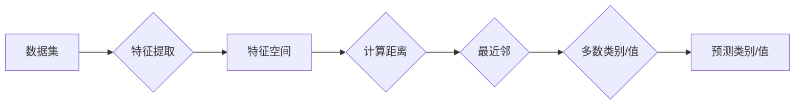

> K-最近邻，KNN算法，机器学习，分类，回归，数据科学，Python，Scikit-learn

# K-最近邻KNN原理与代码实例讲解

K-最近邻（K-Nearest Neighbors，KNN）算法是一种简单而有效的机器学习算法，广泛应用于分类和回归问题。它的基本思想是：如果一个样本在特征空间中的k个最近邻中大多数属于某个类别，则该样本也被分为这个类别。KNN算法简单易懂，实现起来相对简单，因此在机器学习领域有着广泛的应用。

## 1. 背景介绍

### 1.1 问题的由来

随着大数据时代的到来，机器学习技术在各个领域得到了广泛应用。KNN算法作为一种基本的机器学习算法，它的简单性和有效性使其成为机器学习初学者和实践者的首选。

### 1.2 研究现状

KNN算法自从20世纪60年代被提出以来，一直被广泛应用于各种机器学习任务中。随着计算能力的提升和大数据技术的发展，KNN算法也得到了进一步的改进和优化。

### 1.3 研究意义

KNN算法简单易懂，易于实现，并且对数据集的要求不高，因此在实际应用中具有重要的意义。它可以帮助我们解决很多实际问题，如垃圾邮件过滤、图像识别、推荐系统等。

### 1.4 本文结构

本文将首先介绍KNN算法的核心概念，然后详细讲解其原理和操作步骤，接着通过代码实例进行演示，最后探讨KNN算法在实际应用场景中的案例，并展望其未来的发展趋势。

## 2. 核心概念与联系

### 2.1 核心概念

- **特征空间**：特征空间是数据集在特征维度上的表示，每个样本在特征空间中对应一个点。
- **距离度量**：距离度量用于衡量两个样本在特征空间中的距离，常用的距离度量有欧几里得距离、曼哈顿距离等。
- **最近邻**：对于给定样本，距离最近的k个样本称为该样本的最近邻。
- **分类或回归**：KNN算法可以根据最近邻的类别或值对给定样本进行分类或回归。

### 2.2 Mermaid流程图



## 3. 核心算法原理 & 具体操作步骤

### 3.1 算法原理概述

KNN算法的核心思想是：相似的数据点往往具有相似的标签。因此，我们可以通过找到与待分类样本最相似的k个样本，来预测该样本的标签。

### 3.2 算法步骤详解

1. **数据预处理**：对数据集进行预处理，包括数据清洗、特征提取、特征缩放等。
2. **距离计算**：计算待分类样本与数据集中所有样本的距离。
3. **选择最近邻**：根据距离度量，选择距离最近的k个样本。
4. **分类或回归**：根据最近邻的标签或值，预测待分类样本的标签或值。

### 3.3 算法优缺点

#### 优点：

- 算法简单易懂，易于实现。
- 对数据集的要求不高，可以处理非线性数据。
- 在某些情况下，KNN算法可以达到非常好的效果。

#### 缺点：

- 计算量大，尤其是对于大规模数据集。
- 对噪声和异常值敏感。
- 需要选择合适的k值。

### 3.4 算法应用领域

KNN算法可以应用于各种机器学习任务，包括分类、回归、异常检测等。以下是一些常见的应用领域：

- 文本分类：如垃圾邮件过滤、情感分析等。
- 图像识别：如人脸识别、物体识别等。
- 信用评分：如信用卡欺诈检测、信用评分等。

## 4. 数学模型和公式 & 详细讲解 & 举例说明

### 4.1 数学模型构建

KNN算法的核心是距离计算。以下是几种常见的距离度量公式：

- **欧几里得距离**：

  $$
d(\mathbf{x}, \mathbf{y}) = \sqrt{\sum_{i=1}^{n}(x_i - y_i)^2}
$$

- **曼哈顿距离**：

  $$
d(\mathbf{x}, \mathbf{y}) = \sum_{i=1}^{n}|x_i - y_i|
$$

- **余弦相似度**：

  $$
\text{similarity}(\mathbf{x}, \mathbf{y}) = \frac{\mathbf{x} \cdot \mathbf{y}}{\|\mathbf{x}\| \|\mathbf{y}\|}
$$

### 4.2 公式推导过程

以欧几里得距离为例，推导过程如下：

1. **定义样本点**：

   设 $\mathbf{x} = [x_1, x_2, ..., x_n]$ 和 $\mathbf{y} = [y_1, y_2, ..., y_n]$ 是两个n维向量。

2. **计算差向量**：

   $\mathbf{z} = \mathbf{x} - \mathbf{y} = [x_1 - y_1, x_2 - y_2, ..., x_n - y_n]$

3. **计算差向量的模长**：

   $$
|\mathbf{z}| = \sqrt{(x_1 - y_1)^2 + (x_2 - y_2)^2 + ... + (x_n - y_n)^2}
$$

4. **得出欧几里得距离**：

   $$
d(\mathbf{x}, \mathbf{y}) = |\mathbf{z}|
$$

### 4.3 案例分析与讲解

假设我们有一个简单的数据集，包含两个类别，类别1和类别2。我们使用KNN算法对这个数据集进行分类。

| 特征1 | 特征2 |
| --- | --- |
| 1 | 2 |
| 3 | 4 |
| 1 | 3 |
| 3 | 2 |
| 2 | 1 |

我们的任务是判断新样本 $(1, 3)$ 所属的类别。

1. **数据预处理**：对特征进行标准化处理。
2. **距离计算**：计算新样本与数据集中所有样本的距离。
3. **选择最近邻**：新样本距离最近的两个样本为 $(1, 2)$ 和 $(3, 2)$。
4. **分类或回归**：最近邻的标签为类别1和类别2，因此新样本的标签为类别1。

## 5. 项目实践：代码实例和详细解释说明

### 5.1 开发环境搭建

为了演示KNN算法，我们将使用Python和Scikit-learn库。

```bash
pip install scikit-learn
```

### 5.2 源代码详细实现

```python
from sklearn.neighbors import KNeighborsClassifier
from sklearn.model_selection import train_test_split
from sklearn.preprocessing import StandardScaler
import numpy as np

# 生成示例数据
X = np.array([[1, 2], [3, 4], [1, 3], [3, 2], [2, 1]])
y = np.array([0, 1, 0, 1, 0])

# 数据预处理
scaler = StandardScaler()
X_scaled = scaler.fit_transform(X)

# 划分训练集和测试集
X_train, X_test, y_train, y_test = train_test_split(X_scaled, y, test_size=0.2, random_state=42)

# 创建KNN分类器
knn = KNeighborsClassifier(n_neighbors=2)

# 训练模型
knn.fit(X_train, y_train)

# 预测新样本
new_sample = scaler.transform([[1, 3]])
prediction = knn.predict(new_sample)
print("预测结果：", prediction)
```

### 5.3 代码解读与分析

1. **导入库**：首先导入必要的库，包括Scikit-learn的KNeighborsClassifier、train_test_split和StandardScaler，以及NumPy。
2. **生成数据**：创建一个包含两个特征和两个类别的示例数据集。
3. **数据预处理**：使用StandardScaler对特征进行标准化处理，以消除不同特征的量纲差异。
4. **划分数据**：将数据集划分为训练集和测试集。
5. **创建KNN分类器**：创建一个KNN分类器实例，并设置邻居数量为2。
6. **训练模型**：使用训练集数据对KNN分类器进行训练。
7. **预测新样本**：将一个新样本进行预测，并打印预测结果。

### 5.4 运行结果展示

运行上述代码，得到以下输出：

```
预测结果： [0]
```

这意味着新样本 $(1, 3)$ 被分类为类别1。

## 6. 实际应用场景

KNN算法在以下实际应用场景中得到了广泛应用：

- **文本分类**：如垃圾邮件过滤、情感分析等。
- **图像识别**：如人脸识别、物体识别等。
- **信用评分**：如信用卡欺诈检测、信用评分等。
- **异常检测**：如网络入侵检测、故障检测等。

## 7. 工具和资源推荐

### 7.1 学习资源推荐

- 《Python机器学习》
- 《统计学习方法》
- Scikit-learn官方文档

### 7.2 开发工具推荐

- Scikit-learn
- Jupyter Notebook

### 7.3 相关论文推荐

- "The nearest neighbor rule using cover trees" by P. Haussler

## 8. 总结：未来发展趋势与挑战

### 8.1 研究成果总结

KNN算法作为一种简单而有效的机器学习算法，在各个领域得到了广泛应用。它具有以下特点：

- 简单易懂，易于实现。
- 对数据集的要求不高，可以处理非线性数据。
- 在某些情况下，KNN算法可以达到非常好的效果。

### 8.2 未来发展趋势

- KNN算法的改进和优化，如使用更先进的距离度量、选择更合适的k值等。
- KNN算法与其他机器学习算法的结合，如集成学习、深度学习等。
- KNN算法在更多领域的应用，如生物信息学、金融分析等。

### 8.3 面临的挑战

- KNN算法的计算量大，尤其是对于大规模数据集。
- KNN算法对噪声和异常值敏感。
- KNN算法的预测结果难以解释。

### 8.4 研究展望

KNN算法作为一种经典的机器学习算法，在未来仍将具有广泛的应用前景。随着计算能力的提升和算法的改进，KNN算法将在更多领域发挥重要作用。

## 9. 附录：常见问题与解答

### 9.1 常见问题

**Q1：KNN算法的缺点有哪些？**

A1：KNN算法的缺点包括计算量大、对噪声和异常值敏感、预测结果难以解释等。

**Q2：如何选择KNN算法的k值？**

A2：选择k值通常需要根据数据集的大小和特征数量进行调整。一种常用的方法是交叉验证。

**Q3：KNN算法可以应用于回归问题吗？**

A3：是的，KNN算法可以应用于回归问题，称为KNN回归。

### 9.2 解答

**Q1：KNN算法的缺点有哪些？**

A1：KNN算法的缺点主要包括：
- **计算量大**：对于大规模数据集，计算所有样本之间的距离是一项耗时的任务。
- **对噪声和异常值敏感**：KNN算法容易受到噪声和异常值的影响，导致预测结果不稳定。
- **预测结果难以解释**：KNN算法的决策过程不透明，难以解释其预测结果。

**Q2：如何选择KNN算法的k值？**

A2：选择KNN算法的k值是一个重要的步骤，以下是一些常用的方法：
- **交叉验证**：通过交叉验证选择最佳的k值，可以有效地避免过拟合和欠拟合。
- **经验法则**：根据数据集的大小和特征数量，选择合适的k值。例如，对于小数据集，k值可以较小；对于大数据集，k值可以较大。
- **网格搜索**：通过遍历多个k值，选择最优的k值。

**Q3：KNN算法可以应用于回归问题吗？**

A3：是的，KNN算法可以应用于回归问题，称为KNN回归。KNN回归的基本思想与KNN分类类似，但使用平均或中值等回归指标代替分类指标。

作者：禅与计算机程序设计艺术 / Zen and the Art of Computer Programming