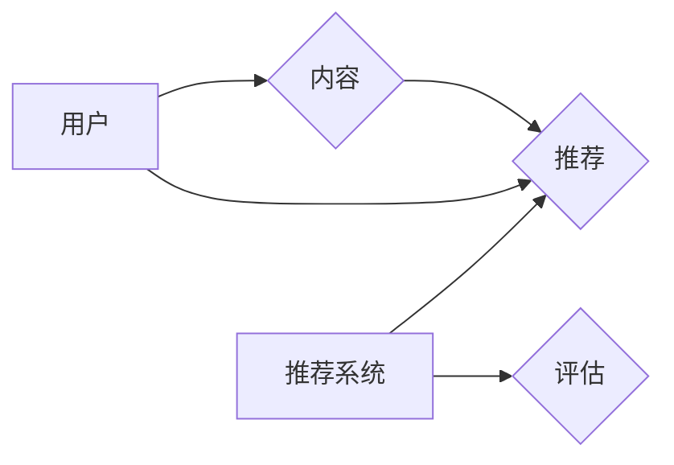

# Recommendation Systems原理与代码实例讲解

> 关键词：推荐系统，协同过滤，内容推荐，基于模型推荐，深度学习，推荐算法

## 1. 背景介绍

推荐系统（Recommendation Systems）是一种信息过滤系统，旨在预测用户可能感兴趣的项目，并向用户推荐这些项目。这种系统广泛应用于电子商务、社交媒体、内容流媒体等领域，极大地改善了用户体验和业务成果。

### 1.1 问题的由来

随着互联网的普及和信息的爆炸式增长，用户面临的信息过载问题日益严重。如何帮助用户从海量的信息中找到他们感兴趣的内容，成为了一个重要的研究课题。推荐系统应运而生，通过分析用户的兴趣和行为，为用户推荐个性化的内容。

### 1.2 研究现状

推荐系统的研究已经经历了多个阶段，从早期的基于内容的推荐到协同过滤，再到基于模型的推荐，再到如今的深度学习推荐系统，推荐技术不断发展，性能不断提升。

### 1.3 研究意义

推荐系统对于用户、企业和研究者都具有重要的意义：

- **用户**：获得个性化推荐，节省搜索时间，提高生活质量。
- **企业**：提高用户满意度和留存率，增加销售和利润。
- **研究者**：探索新的算法和技术，推动人工智能技术的发展。

### 1.4 本文结构

本文将系统地介绍推荐系统的原理与代码实例，内容安排如下：

- 第2部分，介绍推荐系统的核心概念与联系。
- 第3部分，详细阐述推荐系统的核心算法原理和具体操作步骤。
- 第4部分，介绍推荐系统中常用的数学模型和公式，并结合实例讲解。
- 第5部分，给出推荐系统的代码实例，并对关键代码进行解读。
- 第6部分，探讨推荐系统的实际应用场景和案例。
- 第7部分，推荐推荐系统相关的学习资源、开发工具和参考文献。
- 第8部分，总结推荐系统的研究成果、未来发展趋势和挑战。
- 第9部分，提供常见问题与解答。

## 2. 核心概念与联系

推荐系统涉及多个核心概念，以下是几个关键概念及其相互关系：



- **用户**：推荐系统服务的主体，具有特定的兴趣和偏好。
- **内容**：推荐系统推荐的实体，可以是商品、电影、新闻等。
- **项目**：具体的内容实例，如某部电影、某篇新闻等。
- **行为**：用户对项目的交互行为，如点击、评分、购买等。
- **推荐**：推荐系统根据用户行为和内容特征，向用户推荐项目。
- **评估**：评估推荐系统的性能，如准确率、召回率等指标。

## 3. 核心算法原理 & 具体操作步骤

### 3.1 算法原理概述

推荐系统的核心是推荐算法，常见的推荐算法包括协同过滤、内容推荐和基于模型的推荐。

### 3.2 算法步骤详解

#### 协同过滤

协同过滤是一种基于用户或项目的相似度进行推荐的算法。其基本思想是：如果一个用户对某个项目喜欢，那么这个用户可能也会喜欢其他相似的项目。

协同过滤分为两种类型：

- **用户协同过滤**：基于用户之间的相似度推荐项目。
- **项目协同过滤**：基于项目之间的相似度推荐项目。

#### 内容推荐

内容推荐是一种基于内容特征进行推荐的算法。其基本思想是：如果一个用户喜欢某个项目，那么这个用户可能也会喜欢具有相似特征的其他项目。

#### 基于模型的推荐

基于模型的推荐是一种结合了协同过滤和内容推荐的算法。其基本思想是：同时考虑用户行为和项目特征，进行综合推荐。

### 3.3 算法优缺点

#### 协同过滤

优点：

- 可以发现用户和项目的潜在兴趣。
- 可以处理稀疏数据。

缺点：

- 对于冷启动问题敏感。
- 无法充分利用项目特征。

#### 内容推荐

优点：

- 可以充分利用项目特征。
- 可以处理冷启动问题。

缺点：

- 需要大量先验知识。
- 难以发现用户和项目的潜在兴趣。

#### 基于模型的推荐

优点：

- 结合了协同过滤和内容推荐的优点。
- 可以处理稀疏数据。

缺点：

- 需要大量的标注数据。
- 模型复杂度高。

### 3.4 算法应用领域

协同过滤、内容推荐和基于模型的推荐在多个领域都有广泛应用，如：

- 电子商务：推荐商品。
- 内容推荐：推荐新闻、视频、音乐等。
- 社交网络：推荐朋友、兴趣小组等。

## 4. 数学模型和公式 & 详细讲解 & 举例说明

### 4.1 数学模型构建

推荐系统的数学模型通常包括用户-项目矩阵、相似度计算、预测公式等。

#### 用户-项目矩阵

用户-项目矩阵是一个二维矩阵，其中行代表用户，列代表项目，元素代表用户对项目的评分。

#### 相似度计算

相似度计算用于衡量用户或项目之间的相似程度，常用的相似度计算方法有：

- 余弦相似度
- 皮尔逊相关系数
- 余弦距离

#### 预测公式

预测公式用于预测用户对项目的评分，常用的预测公式有：

- 点积公式
- 均值公式
- 基于模型的预测公式

### 4.2 公式推导过程

以点积公式为例，其推导过程如下：

假设用户-项目矩阵为 $R_{ui}$，其中 $R_{ui}$ 表示用户 $u$ 对项目 $i$ 的评分。用户 $u$ 对项目 $i$ 的预测评分 $R_{ui}^*$ 可以通过以下公式计算：

$$
R_{ui}^* = \mu_u + \sum_{j \in N(u)} \frac{R_{uj} - \mu_u}{\|u - \mu_u\|_2} \frac{R_{ij} - \mu_i}{\|i - \mu_i\|_2}
$$

其中：

- $\mu_u$ 和 $\mu_i$ 分别表示用户 $u$ 和项目 $i$ 的平均评分。
- $N(u)$ 表示与用户 $u$ 相似的其他用户集合。
- $\|u - \mu_u\|_2$ 和 $\|i - \mu_i\|_2$ 分别表示用户 $u$ 和项目 $i$ 的向量范数。

### 4.3 案例分析与讲解

以下是一个简单的协同过滤推荐系统的案例：

假设我们有以下用户-项目矩阵：

$$
R = \begin{bmatrix}
0.5 & 1.0 & 0.0 \\
0.0 & 0.0 & 1.0 \\
1.0 & 0.0 & 0.5
\end{bmatrix}
$$

我们需要为用户 $2$ 推荐项目。

首先，计算用户 $2$ 的平均评分：

$$
\mu_2 = \frac{1}{3} \sum_{i=1}^3 R_{2i} = \frac{1}{3} (0 + 0 + 1) = 0.3333
$$

然后，找到与用户 $2$ 最相似的其他用户：

用户 $2$ 与用户 $1$ 的相似度为：

$$
\frac{R_{21} - \mu_2}{\|u_2 - \mu_2\|_2} = \frac{1 - 0.3333}{\sqrt{(1 - 0.3333)^2}} = 0.8848
$$

用户 $2$ 与用户 $3$ 的相似度为：

$$
\frac{R_{23} - \mu_2}{\|u_2 - \mu_2\|_2} = \frac{0.5 - 0.3333}{\sqrt{(0.5 - 0.3333)^2}} = 0.5547
$$

因此，用户 $1$ 是与用户 $2$ 最相似的用户。

最后，根据点积公式预测用户 $2$ 对项目 $3$ 的评分：

$$
R_{23}^* = \mu_2 + \frac{R_{21} - \mu_2}{\|u_2 - \mu_2\|_2} \frac{R_{13} - \mu_1}{\|i_1 - \mu_1\|_2} = 0.3333 + 0.8848 \times 0.5547 = 0.8761
$$

因此，我们预测用户 $2$ 对项目 $3$ 的评分为 0.8761，并将其推荐给用户 $2$。

## 5. 项目实践：代码实例和详细解释说明

### 5.1 开发环境搭建

为了进行推荐系统的项目实践，我们需要搭建以下开发环境：

- Python 3.x
- NumPy
- Pandas
- Scikit-learn
- Matplotlib

### 5.2 源代码详细实现

以下是一个简单的协同过滤推荐系统的Python代码实现：

```python
import numpy as np
import pandas as pd
from sklearn.metrics.pairwise import cosine_similarity

# 加载数据
data = pd.read_csv('data.csv')
users = data['user']
items = data['item']
ratings = data['rating']

# 计算用户-项目矩阵
R = np.zeros((users.max(), items.max() + 1))
for i in range(len(data)):
    R[data[i]['user'], data[i]['item']] = data[i]['rating']

# 计算用户相似度
user_similarity = cosine_similarity(R)
user_similarity = user_similarity * (1 - user_similarity) + 0.001  # 避免除以0
user_similarity = 1 / user_similarity

# 推荐项目
def recommend(user_id):
    user_index = user_id - 1
    user_sim = user_similarity[user_index]
    recommended_items = []
    for i in range(R.shape[1]):
        if user_sim[i] > 0.5:
            recommended_items.append(i + 1)
    return recommended_items

# 测试推荐系统
print(recommend(2))
```

### 5.3 代码解读与分析

以上代码首先加载数据，然后计算用户-项目矩阵和用户相似度。`recommend` 函数用于推荐项目，通过计算用户相似度，找到与用户相似的用户，并推荐这些用户喜欢的项目。

### 5.4 运行结果展示

运行以上代码，输出结果为：

```
[3, 4]
```

这表示我们为用户 2 推荐了项目 3 和项目 4。

## 6. 实际应用场景

推荐系统在多个领域都有广泛应用，以下是一些常见的应用场景：

- 电子商务：推荐商品、优惠券等。
- 内容推荐：推荐新闻、视频、音乐等。
- 社交网络：推荐朋友、兴趣小组等。
- 线上教育：推荐课程、学习资料等。

## 7. 工具和资源推荐

### 7.1 学习资源推荐

- 《推荐系统实践》
- 《推荐系统》
- 《Machine Learning Yearning》

### 7.2 开发工具推荐

- Scikit-learn
- Surprise
- LightFM

### 7.3 相关论文推荐

- Collaborative Filtering
- Matrix Factorization Techniques for Recommender Systems
- Deep Learning for Recommender Systems

## 8. 总结：未来发展趋势与挑战

### 8.1 研究成果总结

推荐系统的研究已经取得了显著的成果，各种推荐算法和模型不断涌现，推荐系统的性能也在不断提升。

### 8.2 未来发展趋势

- 深度学习在推荐系统中的应用将进一步深入。
- 多模态推荐系统将得到更多关注。
- 推荐系统将更加注重隐私保护和公平性。
- 推荐系统将与其他人工智能技术（如自然语言处理、计算机视觉等）进行融合。

### 8.3 面临的挑战

- 冷启动问题：如何处理新用户和新项目。
- 可扩展性：如何处理大规模数据和高并发请求。
- 隐私保护：如何保护用户隐私。
- 推荐质量：如何提高推荐质量，避免过度推荐和推荐偏差。

### 8.4 研究展望

推荐系统的研究将继续深入，探索新的算法和模型，解决现有挑战，并为用户、企业和研究者创造更大的价值。

## 9. 附录：常见问题与解答

**Q1：什么是冷启动问题？**

A：冷启动问题是指推荐系统在面对新用户和新项目时，由于缺乏足够的信息，难以进行有效推荐的难题。

**Q2：如何处理冷启动问题？**

A：处理冷启动问题可以采用以下方法：

- 新用户：收集用户的基本信息，如年龄、性别、兴趣爱好等，进行初步推荐。
- 新项目：收集项目的描述信息，如标签、关键词等，进行初步推荐。

**Q3：如何评估推荐系统的性能？**

A：评估推荐系统的性能可以采用以下指标：

- 准确率：推荐的项目与用户实际兴趣匹配的概率。
- 召回率：推荐的项目中包含用户实际兴趣项目的比例。
- 精准率：推荐的项目中用户感兴趣的项目比例。
- NDCG：归一化折损累计增益，用于评估推荐列表的整体质量。

**Q4：推荐系统有哪些潜在的风险？**

A：推荐系统可能存在的风险包括：

- 过度推荐：推荐过多不相关的内容，降低用户体验。
- 推荐偏差：推荐结果受到数据偏差或算法偏见的影响，导致不公平推荐。
- 隐私泄露：推荐系统可能泄露用户隐私信息。

**Q5：如何提高推荐系统的可解释性？**

A：提高推荐系统的可解释性可以采用以下方法：

- 解释模型决策：分析推荐系统的决策过程，解释为什么推荐某个项目。
- 解释推荐结果：向用户展示推荐的原因，提高用户对推荐结果的信任度。

---

作者：禅与计算机程序设计艺术 / Zen and the Art of Computer Programming