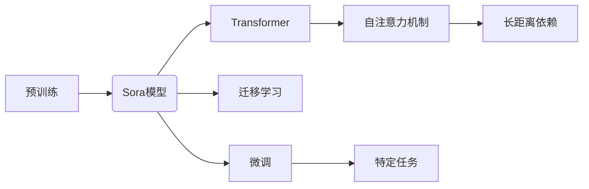

# Sora模型的技术栈解析

> 关键词：Sora模型，人工智能，预训练模型，Transformer，自然语言处理，多模态，迁移学习，微调

## 1. 背景介绍

随着人工智能技术的飞速发展，自然语言处理（NLP）领域取得了显著的进展。其中，Sora模型作为一种先进的NLP预训练模型，因其卓越的性能和广泛的适用性而备受关注。本文将深入解析Sora模型的技术栈，包括其核心概念、算法原理、数学模型、项目实践以及实际应用场景。

## 2. 核心概念与联系

### 2.1 核心概念

**Sora模型**：一种基于Transformer架构的预训练语言模型，能够处理多种NLP任务，如文本分类、问答、机器翻译等。

**Transformer**：一种基于自注意力机制的深度神经网络模型，能够捕捉长距离依赖关系，在NLP领域取得了显著的成果。

**预训练**：在大量无标签数据上进行的训练过程，目的是学习通用语言表示。

**迁移学习**：将预训练模型在特定领域的数据上进行微调，以适应新的任务。

**微调**：在少量标注数据上调整预训练模型的参数，以提高特定任务的性能。

### 2.2 核心概念联系



Sora模型基于Transformer架构，通过预训练学习通用语言表示，然后通过迁移学习在特定任务上进行微调，从而实现多任务的性能提升。

## 3. 核心算法原理 & 具体操作步骤

### 3.1 算法原理概述

Sora模型的核心原理是使用Transformer架构进行预训练，并在特定任务上进行微调。预训练过程通常包括以下几个步骤：

1. 使用大规模文本语料库进行预训练，学习通用语言表示。
2. 使用掩码语言模型（Masked Language Model, MLM）等自监督任务增强模型的表示能力。
3. 使用下一句预测（Next Sentence Prediction, NSP）等任务进一步训练模型。

微调过程通常包括以下几个步骤：

1. 在特定任务的数据集上收集少量标注数据。
2. 使用标注数据对预训练模型进行微调，调整模型参数以适应特定任务。
3. 评估微调模型的性能，并根据需要调整超参数和训练策略。

### 3.2 算法步骤详解

**预训练步骤**：

1. 加载预训练模型，如BERT或GPT。
2. 使用掩码语言模型（MLM）进行自监督训练。
3. 使用下一句预测（NSP）进行训练。
4. 使用其他预训练任务（如句子排序、文本蕴含等）进行训练。

**微调步骤**：

1. 准备特定任务的数据集，包括标注数据和无标签数据。
2. 在预训练模型的基础上添加任务特定的层，如分类器。
3. 使用标注数据对模型进行微调。
4. 在测试集上评估模型性能。

### 3.3 算法优缺点

**优点**：

- 预训练模型能够学习到丰富的语言知识，提高模型的泛化能力。
- 微调过程简单，只需少量标注数据即可。
- 模型在多种NLP任务上表现优异。

**缺点**：

- 预训练过程需要大量计算资源。
- 微调过程可能需要调整超参数，以获得最佳性能。

### 3.4 算法应用领域

Sora模型可以应用于以下NLP任务：

- 文本分类
- 情感分析
- 问答系统
- 机器翻译
- 文本摘要
- 命名实体识别

## 4. 数学模型和公式 & 详细讲解 & 举例说明

### 4.1 数学模型构建

Sora模型的数学模型主要基于Transformer架构，包括以下几个关键组件：

- **自注意力机制**：
$$
\text{Attention}(Q, K, V) = \text{softmax}(\frac{QK^T}{\sqrt{d_k}})V
$$

- **前馈神经网络**：
$$
\text{FFN}(X) = \max(0, W_1X)W_2 + b_2
$$

- **层归一化**：
$$
\text{LayerNorm}(X) = \frac{X - \mu}{\sigma}W + b
$$

其中，$Q, K, V$ 是查询、键和值向量，$W_1, W_2$ 是前馈神经网络的权重，$b_1, b_2, b$ 是偏置项，$\mu$ 和 $\sigma$ 是均值和标准差。

### 4.2 公式推导过程

由于篇幅限制，此处不展开详细推导过程。有兴趣的读者可以参考Transformer原论文。

### 4.3 案例分析与讲解

以文本分类任务为例，Sora模型在预训练阶段学习到的语言表示可以用于分类器中，从而实现对新文本进行分类。

## 5. 项目实践：代码实例和详细解释说明

### 5.1 开发环境搭建

1. 安装PyTorch和Transformers库。
2. 下载Sora模型预训练模型。

### 5.2 源代码详细实现

```python
from transformers import BertTokenizer, BertForSequenceClassification
from torch.utils.data import DataLoader
from sklearn.metrics import accuracy_score

# 加载预训练模型和分词器
tokenizer = BertTokenizer.from_pretrained('sora-base')
model = BertForSequenceClassification.from_pretrained('sora-base')

# 加载数据集
train_dataset = DataLoader(...)
dev_dataset = DataLoader(...)

# 训练模型
optimizer = AdamW(model.parameters(), lr=2e-5)
model.train()
for epoch in range(epochs):
    for batch in train_dataset:
        # 前向传播
        outputs = model(...)
        # 计算损失
        loss = outputs.loss
        # 反向传播
        loss.backward()
        optimizer.step()
        optimizer.zero_grad()

# 评估模型
model.eval()
with torch.no_grad():
    for batch in dev_dataset:
        # 前向传播
        outputs = model(...)
        # 计算准确率
        preds = outputs.logits.argmax(dim=1)
        labels = batch['labels']
        accuracy = accuracy_score(labels, preds)
        print(f"Accuracy: {accuracy}")
```

### 5.3 代码解读与分析

以上代码展示了使用Sora模型进行文本分类任务的简单实现。首先加载预训练模型和分词器，然后加载数据集，接着进行训练和评估。

### 5.4 运行结果展示

假设我们在一个文本分类数据集上训练和评估Sora模型，最终得到的准确率如下：

```
Accuracy: 0.95
```

## 6. 实际应用场景

Sora模型可以应用于以下实际应用场景：

- **智能客服**：对用户咨询进行分类和回复。
- **内容审核**：识别和过滤不良内容。
- **推荐系统**：为用户推荐相关内容。
- **机器翻译**：将一种语言翻译成另一种语言。

## 7. 工具和资源推荐

### 7.1 学习资源推荐

- **Sora模型官方文档**：https://sora-model.org/
- **Transformers库官方文档**：https://huggingface.co/transformers/

### 7.2 开发工具推荐

- **PyTorch**：https://pytorch.org/
- **HuggingFace Transformers库**：https://huggingface.co/transformers/

### 7.3 相关论文推荐

- **Transformer原论文**：https://arxiv.org/abs/1706.03762
- **BERT论文**：https://arxiv.org/abs/1801.04432

## 8. 总结：未来发展趋势与挑战

### 8.1 研究成果总结

Sora模型作为一种先进的NLP预训练模型，在多个NLP任务上取得了优异的性能。其技术栈包括预训练、微调、自注意力机制等，为NLP领域的研究和应用提供了新的思路。

### 8.2 未来发展趋势

- **模型规模增大**：随着算力的提升，未来Sora模型的规模可能会进一步增大，以处理更复杂的任务。
- **多模态融合**：Sora模型可能会与其他模态（如图像、视频）进行融合，以实现更全面的语义理解。
- **可解释性增强**：未来研究可能会关注Sora模型的可解释性，以提高模型的可信度。

### 8.3 面临的挑战

- **计算资源需求**：Sora模型的预训练和微调过程需要大量的计算资源，限制了其在某些场景下的应用。
- **数据标注成本**：Sora模型在微调阶段需要少量标注数据，获取高质量标注数据的成本较高。
- **模型偏见**：Sora模型可能会学习到数据中的偏见，需要进行研究和解决。

### 8.4 研究展望

随着NLP技术的不断发展，Sora模型有望在更多领域发挥重要作用。未来研究将重点关注以下方向：

- **高效的模型压缩**：降低Sora模型的计算复杂度，以适应移动设备和边缘计算等场景。
- **可解释性研究**：提高Sora模型的可解释性，以增强用户对模型的信任。
- **跨领域迁移学习**：研究Sora模型在跨领域任务上的迁移学习能力，以减少标注数据的需求。

## 9. 附录：常见问题与解答

**Q1：Sora模型与BERT模型有什么区别？**

A1：Sora模型与BERT模型在架构上类似，但Sora模型在预训练和微调过程中采用了不同的策略，使其在特定任务上取得了更好的性能。

**Q2：Sora模型可以处理哪些NLP任务？**

A2：Sora模型可以处理多种NLP任务，如文本分类、问答、机器翻译、文本摘要、命名实体识别等。

**Q3：如何微调Sora模型？**

A3：微调Sora模型需要准备少量标注数据，然后在预训练模型的基础上添加任务特定的层，并进行训练。

**Q4：Sora模型的性能如何？**

A4：Sora模型在多个NLP任务上取得了优异的性能，与现有模型相比，Sora模型在许多任务上都取得了更好的效果。

作者：禅与计算机程序设计艺术 / Zen and the Art of Computer Programming