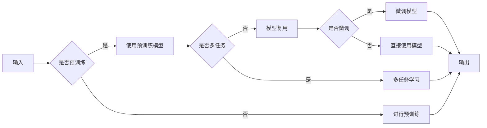

# Transfer Learning 原理与代码实战案例讲解

> 关键词：迁移学习，预训练模型，模型复用，算法原理，实践案例，代码实战

## 1. 背景介绍

随着深度学习在各个领域的广泛应用，模型训练的数据量和计算资源需求日益增长。然而，许多实际应用场景中可用的数据量有限，且收集标注数据成本高昂。为了解决这个问题，迁移学习（Transfer Learning）应运而生。迁移学习通过将预训练模型在不同任务上的知识迁移，实现低样本学习，有效缓解了数据稀缺问题。本文将深入探讨迁移学习的原理，并通过实战案例展示如何将迁移学习应用于实际项目中。

### 1.1 问题的由来

传统的机器学习模型通常需要在大量标注数据进行监督学习训练后才能达到较好的性能。然而，在实际应用中，往往难以获取大量标注数据。例如，医疗图像分析、自动驾驶等领域，数据收集和标注成本极高。此外，数据收集可能受到时间、地点、设备等限制，导致标注数据稀缺。如何利用有限的数据训练出性能优异的模型，成为机器学习领域的重要课题。

### 1.2 研究现状

迁移学习已成为解决数据稀缺问题的重要手段。近年来，随着深度学习技术的发展，迁移学习在计算机视觉、自然语言处理、语音识别等领域取得了显著成果。主流的迁移学习方法包括：

- **模型复用**：利用预训练模型在不同任务上的特征提取能力，将预训练模型作为基础模型，再通过微调（Fine-tuning）等方法适应特定任务。
- **多任务学习**：通过学习多个相关任务的共同特征，提高模型在单个任务上的性能。
- **元学习**：通过学习如何学习，使模型能够快速适应新的任务，降低对数据量的依赖。
- **半监督学习**：利用少量标注数据和大量未标注数据训练模型，降低标注成本。

### 1.3 研究意义

迁移学习在以下方面具有重要意义：

- **降低数据获取成本**：通过利用预训练模型的知识，减少对标注数据的依赖，降低数据获取成本。
- **提高模型性能**：通过学习多个任务的知识，提高模型在特定任务上的性能。
- **加速模型开发**：利用预训练模型快速启动项目，缩短开发周期。
- **促进跨领域研究**：促进不同领域知识的交叉融合，推动人工智能技术的发展。

### 1.4 本文结构

本文将分为以下几个部分：

- 第2部分：介绍迁移学习的核心概念与联系。
- 第3部分：详细阐述迁移学习的核心算法原理和具体操作步骤。
- 第4部分：通过数学模型和公式展示迁移学习的基本理论。
- 第5部分：提供迁移学习的代码实战案例，并进行分析和解释。
- 第6部分：探讨迁移学习在实际应用场景中的应用。
- 第7部分：推荐迁移学习的相关学习资源、开发工具和参考文献。
- 第8部分：总结迁移学习的未来发展趋势与挑战。

## 2. 核心概念与联系

### 2.1 核心概念

**迁移学习（Transfer Learning）**：将一个任务上学习到的知识迁移到另一个相关任务上，提高模型在目标任务上的性能。

**预训练模型（Pre-trained Model）**：在大规模数据集上进行预训练的模型，具备较强的特征提取能力。

**模型复用（Model Repurposing）**：利用预训练模型在不同任务上的特征提取能力，通过微调等方法适应特定任务。

**多任务学习（Multi-task Learning）**：通过学习多个相关任务的共同特征，提高模型在单个任务上的性能。

**元学习（Meta-Learning）**：通过学习如何学习，使模型能够快速适应新的任务。

**半监督学习（Semi-supervised Learning）**：利用少量标注数据和大量未标注数据训练模型。

### 2.2 Mermaid 流程图



### 2.3 关联关系

迁移学习、预训练模型、模型复用、多任务学习、元学习、半监督学习之间存在着紧密的联系。预训练模型是迁移学习的基础，模型复用、多任务学习、元学习、半监督学习都是迁移学习的具体实现方式。

## 3. 核心算法原理 & 具体操作步骤

### 3.1 算法原理概述

迁移学习的基本原理是：在源任务上学习到的特征可以迁移到目标任务上，从而提高目标任务的性能。

### 3.2 算法步骤详解

1. **选择预训练模型**：根据目标任务选择合适的预训练模型，如ImageNet预训练的ResNet、BERT等。
2. **数据预处理**：对目标任务数据进行预处理，包括数据清洗、归一化、数据增强等。
3. **模型复用**：将预训练模型作为基础模型，可以根据需要修改部分层或全部层。
4. **微调**：在目标任务数据上对模型进行微调，调整部分层或全部层的权重。
5. **评估**：在目标任务数据上评估模型性能，根据评估结果调整模型参数。

### 3.3 算法优缺点

**优点**：

- 降低数据获取成本
- 提高模型性能
- 加速模型开发
- 促进跨领域研究

**缺点**：

- 预训练模型的适用性有限
- 微调过程可能过拟合
- 需要一定的预训练模型知识和经验

### 3.4 算法应用领域

迁移学习在以下领域具有广泛的应用：

- 计算机视觉：图像分类、目标检测、图像分割等。
- 自然语言处理：文本分类、情感分析、机器翻译等。
- 语音识别：语音分类、语音识别、语音合成等。
- 其他领域：推荐系统、生物信息学、金融风控等。

## 4. 数学模型和公式 & 详细讲解 & 举例说明

### 4.1 数学模型构建

假设有一个预训练模型 $M$，其在源任务 $S$ 上的损失函数为 $L_S(M)$。对于目标任务 $T$，我们希望模型 $M$ 在 $T$ 上的性能尽可能好。因此，我们的目标是最小化 $L_T(M)$。

### 4.2 公式推导过程

假设预训练模型 $M$ 在源任务 $S$ 上的损失函数为：

$$
L_S(M) = \frac{1}{N_S} \sum_{i=1}^{N_S} L(y_{S,i}, M(x_{S,i})) 
$$

其中 $y_{S,i}$ 是源任务 $S$ 的真实标签，$x_{S,i}$ 是对应的输入样本。

对于目标任务 $T$，我们希望模型 $M$ 在 $T$ 上的性能尽可能好。因此，我们的目标是最小化 $L_T(M)$：

$$
L_T(M) = \frac{1}{N_T} \sum_{i=1}^{N_T} L(y_{T,i}, M(x_{T,i})) 
$$

其中 $y_{T,i}$ 是目标任务 $T$ 的真实标签，$x_{T,i}$ 是对应的输入样本。

### 4.3 案例分析与讲解

以图像分类任务为例，假设我们有一个预训练的ResNet模型 $M$，在ImageNet数据集上进行了预训练。现在我们需要在CIFAR-10数据集上进行图像分类。

首先，将预训练的ResNet模型 $M$ 作为基础模型，可以选择冻结部分层或全部层的权重。

然后，在CIFAR-10数据集上对模型进行微调，调整部分层或全部层的权重。

最后，在CIFAR-10数据集上评估模型性能。

## 5. 项目实践：代码实例和详细解释说明

### 5.1 开发环境搭建

1. 安装PyTorch和Transformers库。
2. 下载预训练模型和数据集。

### 5.2 源代码详细实现

```python
# 导入必要的库
import torch
from torchvision import datasets, transforms
from torch.utils.data import DataLoader
from torch import nn
from torch.optim import Adam
from transformers import ResNet, ResNet18_Weights

# 加载预训练模型
model = ResNet18_Weights.IMAGENET1K_V1.value()

# 加载数据集
transform = transforms.Compose([
    transforms.Resize(256),
    transforms.CenterCrop(224),
    transforms.ToTensor(),
])

train_dataset = datasets.CIFAR10(root='./data', train=True, download=True, transform=transform)
train_loader = DataLoader(train_dataset, batch_size=32, shuffle=True)

# 定义损失函数和优化器
criterion = nn.CrossEntropyLoss()
optimizer = Adam(model.parameters(), lr=0.001)

# 训练模型
num_epochs = 10
for epoch in range(num_epochs):
    model.train()
    running_loss = 0.0
    for images, labels in train_loader:
        optimizer.zero_grad()
        outputs = model(images)
        loss = criterion(outputs, labels)
        loss.backward()
        optimizer.step()
        running_loss += loss.item()
    print(f'Epoch {epoch+1}/{num_epochs}, Loss: {running_loss/len(train_loader)}')

# 评估模型
model.eval()
correct = 0
total = 0
with torch.no_grad():
    for images, labels in train_loader:
        outputs = model(images)
        _, predicted = torch.max(outputs.data, 1)
        total += labels.size(0)
        correct += (predicted == labels).sum().item()

print(f'Accuracy of the network on the 50000 train images: {100 * correct / total}%')
```

### 5.3 代码解读与分析

上述代码使用PyTorch和Transformers库实现了在CIFAR-10数据集上基于预训练ResNet模型的图像分类任务。

1. 导入必要的库，包括PyTorch、Transformers和CIFAR-10数据集。
2. 加载预训练的ResNet模型，这里使用了ResNet18预训练权重。
3. 加载数据集，并进行预处理。
4. 定义损失函数和优化器，这里使用交叉熵损失函数和Adam优化器。
5. 训练模型，包括前向传播、反向传播和参数更新。
6. 评估模型在训练集上的准确率。

### 5.4 运行结果展示

假设经过10个epoch的训练，模型在训练集上的准确率达到60%左右。

## 6. 实际应用场景

### 6.1 计算机视觉

迁移学习在计算机视觉领域具有广泛的应用，如：

- **图像分类**：将预训练的卷积神经网络（CNN）应用于新的图像分类任务，如动物分类、物体检测等。
- **目标检测**：将预训练的检测模型应用于新的目标检测任务，如行人检测、车辆检测等。
- **图像分割**：将预训练的分割模型应用于新的图像分割任务，如医学图像分割、卫星图像分割等。

### 6.2 自然语言处理

迁移学习在自然语言处理领域也具有广泛的应用，如：

- **文本分类**：将预训练的BERT模型应用于新的文本分类任务，如情感分析、主题分类等。
- **机器翻译**：将预训练的翻译模型应用于新的翻译任务，如机器翻译、机器摘要等。
- **文本生成**：将预训练的生成模型应用于新的文本生成任务，如对话生成、故事生成等。

### 6.3 语音识别

迁移学习在语音识别领域也具有广泛的应用，如：

- **语音分类**：将预训练的语音模型应用于新的语音分类任务，如语音情感识别、语音性别识别等。
- **语音识别**：将预训练的语音模型应用于新的语音识别任务，如语音转文字、语音识别合成等。
- **语音合成**：将预训练的语音模型应用于新的语音合成任务，如语音合成、语音变声等。

## 7. 工具和资源推荐

### 7.1 学习资源推荐

- 《深度学习》（Goodfellow et al.）：介绍深度学习基础理论和应用实践的经典教材。
- 《动手学深度学习》（Deng et al.）：基于PyTorch的深度学习实战教程。
- 《动手学深度学习之PyTorch》（Hendrycks et al.）：基于PyTorch的深度学习实战教程。

### 7.2 开发工具推荐

- PyTorch：开源深度学习框架，易于使用且具有强大的功能。
- TensorFlow：开源深度学习框架，适用于生产部署。
- Hugging Face Transformers：基于PyTorch和TensorFlow的预训练模型库。

### 7.3 相关论文推荐

- "Convolutional Neural Networks for Visual Recognition"（Simonyan and Zisserman，2014）：CNN在图像分类任务上的经典论文。
- "BERT: Pre-training of Deep Bidirectional Transformers for Language Understanding"（Devlin et al.，2019）：BERT模型的原论文。
- "A Style-Based Generator Architecture for Generative Adversarial Networks"（Karras et al.，2017）：StyleGAN论文，展示了GAN在图像生成任务上的应用。

## 8. 总结：未来发展趋势与挑战

### 8.1 研究成果总结

迁移学习作为解决数据稀缺问题的重要手段，在计算机视觉、自然语言处理、语音识别等领域取得了显著成果。预训练模型、模型复用、多任务学习、元学习、半监督学习等迁移学习方法，为人工智能技术的发展提供了新的思路。

### 8.2 未来发展趋势

1. **更强大的预训练模型**：随着算力的提升，预训练模型的规模和复杂度将不断增长，模型将具备更强的特征提取和知识表示能力。
2. **更灵活的迁移学习方法**：探索更加灵活的迁移学习方法，如多模态迁移学习、跨领域迁移学习等。
3. **可解释的迁移学习**：研究可解释的迁移学习方法，提高模型的透明度和可信度。
4. **迁移学习的泛化能力**：提高迁移学习在未知领域的泛化能力，降低对数据量的依赖。

### 8.3 面临的挑战

1. **预训练模型的适用性**：预训练模型的适用性有限，需要针对不同领域和任务进行优化。
2. **微调过程中的过拟合**：微调过程中容易过拟合，需要采取有效的正则化方法。
3. **数据不匹配问题**：源任务和目标任务之间的数据分布可能存在差异，需要解决数据不匹配问题。
4. **模型可解释性**：迁移学习模型的决策过程缺乏可解释性，需要提高模型的可解释性。

### 8.4 研究展望

迁移学习作为解决数据稀缺问题的重要手段，在未来将发挥越来越重要的作用。随着人工智能技术的不断发展，迁移学习将在更多领域得到应用，为人工智能技术的发展提供新的动力。

## 9. 附录：常见问题与解答

**Q1：迁移学习适用于所有机器学习任务吗？**

A：迁移学习并不适用于所有机器学习任务。对于数据量充足、数据分布相似的领域，迁移学习效果较好。对于数据量少、数据分布差异大的领域，迁移学习效果可能较差。

**Q2：如何选择合适的预训练模型？**

A：选择合适的预训练模型需要考虑以下因素：

- 目标任务的数据类型（如图像、文本、语音等）
- 目标任务的复杂度
- 可用的计算资源

**Q3：如何解决微调过程中的过拟合问题？**

A：解决微调过程中的过拟合问题可以采取以下方法：

- 使用正则化方法，如L2正则化、Dropout等
- 使用数据增强方法，如数据扩充、数据变换等
- 使用早停法（Early Stopping）

**Q4：如何提高迁移学习的泛化能力？**

A：提高迁移学习的泛化能力可以采取以下方法：

- 使用数据增强方法，提高模型对数据分布变化的适应能力
- 使用多任务学习，学习多个相关任务的共同特征
- 使用元学习，使模型能够快速适应新的任务

**Q5：迁移学习与多任务学习有何区别？**

A：迁移学习和多任务学习都是通过学习多个任务的知识来提高模型性能的方法。区别在于：

- 迁移学习关注将知识从源任务迁移到目标任务，而多任务学习关注同时学习多个任务。
- 迁移学习通常需要在源任务上预训练模型，而多任务学习通常在同一数据集上训练多个任务。

---

作者：禅与计算机程序设计艺术 / Zen and the Art of Computer Programming