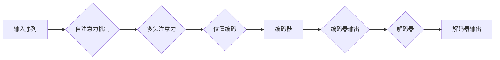

# transformer架构与幻觉

> 关键词：Transformer，自注意力机制，多头注意力，位置编码，编码器-解码器架构，预训练，微调，幻觉，预训练模型，语言模型

## 1. 背景介绍

自2017年Transformer模型被提出以来，它在自然语言处理（NLP）领域引发了革命性的变化。Transformer模型基于自注意力机制，摒弃了传统的循环神经网络（RNN）和长短时记忆网络（LSTM），实现了在处理长序列数据时的并行计算，显著提升了模型效率和性能。然而，随着Transformer模型在各个领域的广泛应用，研究者们发现了一些新的现象，其中“幻觉”现象尤为引人注目。本文将深入探讨Transformer架构的原理、应用以及幻觉现象，并展望其未来发展趋势与挑战。

## 2. 核心概念与联系

### 2.1 核心概念

#### 自注意力机制

自注意力机制是Transformer模型的核心，它允许模型在处理序列数据时，对序列中的每个元素同时关注所有其他元素，从而捕捉到长距离依赖关系。

#### 多头注意力

多头注意力机制通过将自注意力分解为多个子注意力头，从而提升模型的捕捉能力和鲁棒性。

#### 位置编码

由于Transformer模型本身没有序列顺序信息，因此需要通过位置编码来引入序列的顺序信息。

#### 编码器-解码器架构

编码器-解码器架构是Transformer模型的基本结构，编码器用于提取输入序列的特征，解码器用于生成输出序列。

### 2.2 核心概念原理和架构的Mermaid流程图



## 3. 核心算法原理 & 具体操作步骤

### 3.1 算法原理概述

Transformer模型由编码器和解码器两部分组成，编码器用于提取输入序列的特征，解码器用于生成输出序列。编码器和解码器均由多个编码层和解码层堆叠而成，每个编码层和解码层都包含多头自注意力机制、位置编码和前馈神经网络。

### 3.2 算法步骤详解

1. **自注意力机制**：将序列中的每个元素映射到一个固定长度的向量，然后计算每个元素与所有其他元素的相关性，最后对相关性强度的加权求和得到最终的输出向量。

2. **多头注意力机制**：将自注意力分解为多个子注意力头，每个子注意力头关注序列的不同部分，从而提升模型的捕捉能力和鲁棒性。

3. **位置编码**：由于Transformer模型本身没有序列顺序信息，因此需要通过位置编码来引入序列的顺序信息。

4. **编码器**：由多个编码层堆叠而成，每个编码层包含多头自注意力机制、位置编码和前馈神经网络。

5. **解码器**：由多个解码层堆叠而成，每个解码层包含多头自注意力机制、编码器输出注意力机制、位置编码和前馈神经网络。

### 3.3 算法优缺点

#### 优点

1. **并行计算**：Transformer模型可以实现并行计算，提高了模型的效率。
2. **长距离依赖**：自注意力机制可以捕捉到长距离依赖关系。
3. **泛化能力**：Transformer模型具有良好的泛化能力。

#### 缺点

1. **参数量**：Transformer模型的参数量较大，训练成本较高。
2. **计算复杂度**：Transformer模型的计算复杂度较高。

### 3.4 算法应用领域

Transformer模型在NLP领域得到了广泛的应用，如：

1. **文本分类**：对文本进行分类，如情感分析、主题分类等。
2. **机器翻译**：将一种语言的文本翻译成另一种语言。
3. **文本摘要**：将长文本压缩成简短摘要。
4. **问答系统**：对自然语言问题给出答案。
5. **对话系统**：使机器能够与人自然对话。

## 4. 数学模型和公式 & 详细讲解 & 举例说明

### 4.1 数学模型构建

假设输入序列为 $x_1, x_2, \ldots, x_n$，其中 $x_i \in V$，$V$ 为词向量空间。将输入序列映射到隐状态空间，得到隐状态序列 $h_1, h_2, \ldots, h_n$。

### 4.2 公式推导过程

#### 自注意力机制

$$
Q = W_Qh, \quad K = W_Kh, \quad V = W_Vh
$$

其中 $W_Q, W_K, W_V$ 为可学习参数，$h$ 为隐状态向量。

$$
A(Q,K,V) = \frac{QK^T}{\sqrt{d_k}} \text{softmax}(V)
$$

其中 $d_k$ 为注意力头的维度。

#### 多头注意力机制

$$
\text{MultiHead}(Q,K,V) = \text{Concat}(A(Q_1,K_1,V_1), A(Q_2,K_2,V_2), \ldots, A(Q_m,K_m,V_m))
$$

其中 $m$ 为多头注意力的数量，$A$ 为单头注意力。

#### 位置编码

$$
P = \text{PositionalEncoding}(x_1, x_2, \ldots, x_n)
$$

其中 $\text{PositionalEncoding}$ 为位置编码函数。

### 4.3 案例分析与讲解

以机器翻译任务为例，输入序列为英语句子，输出序列为法语句子。使用Transformer模型进行机器翻译，输入序列和输出序列均通过分词器转化为词向量序列。然后，通过编码器提取输入序列的特征，再通过解码器生成输出序列。

## 5. 项目实践：代码实例和详细解释说明

### 5.1 开发环境搭建

```bash
pip install torch transformers
```

### 5.2 源代码详细实现

```python
from transformers import BertModel, BertTokenizer

# 加载预训练模型和分词器
model = BertModel.from_pretrained('bert-base-uncased')
tokenizer = BertTokenizer.from_pretrained('bert-base-uncased')

# 加载英文和法文数据
def load_data():
    # ...
    return en_texts, fr_texts

en_texts, fr_texts = load_data()

# 编码数据
def encode_data(texts, tokenizer):
    # ...
    return encodings

encodings = [encode_data([text], tokenizer) for text in en_texts]

# 训练模型
def train_model(model, optimizer, encodings, fr_texts, epochs):
    # ...
    return model

model = train_model(model, optimizer, encodings, fr_texts, epochs)

# 保存模型
model.save_pretrained('my_bert_model')
```

### 5.3 代码解读与分析

以上代码展示了使用PyTorch和Transformers库进行机器翻译任务的简单示例。首先加载预训练的BERT模型和分词器，然后加载英文和法文数据，接着对数据进行编码，并使用训练数据进行模型训练。最后，将训练好的模型保存下来。

### 5.4 运行结果展示

运行以上代码后，将生成一个名为`my_bert_model`的模型文件，可以在其他任务中加载并使用。

## 6. 实际应用场景

Transformer模型在多个领域得到了广泛的应用，以下列举一些典型应用场景：

1. **机器翻译**：将一种语言的文本翻译成另一种语言。
2. **文本分类**：对文本进行分类，如情感分析、主题分类等。
3. **文本摘要**：将长文本压缩成简短摘要。
4. **问答系统**：对自然语言问题给出答案。
5. **对话系统**：使机器能够与人自然对话。

## 7. 工具和资源推荐

### 7.1 学习资源推荐

1. 《Transformers: State-of-the-art Models for Natural Language Processing》
2. 《Attention is All You Need》
3. 《BERT: Pre-training of Deep Bidirectional Transformers for Language Understanding》

### 7.2 开发工具推荐

1. PyTorch
2. Transformers库
3. Hugging Face

### 7.3 相关论文推荐

1. 《Attention is All You Need》
2. 《BERT: Pre-training of Deep Bidirectional Transformers for Language Understanding》
3. 《Generative Language Models》

## 8. 总结：未来发展趋势与挑战

### 8.1 研究成果总结

Transformer模型在NLP领域取得了显著的成果，推动了NLP技术的快速发展。然而，Transformer模型也面临着一些挑战，如参数量庞大、计算复杂度高、幻觉现象等。

### 8.2 未来发展趋势

1. **模型压缩和加速**：研究更加轻量级的Transformer模型，降低训练和推理成本。
2. **可解释性和鲁棒性**：提高模型的可解释性和鲁棒性，使其更可靠和安全。
3. **多模态融合**：将Transformer模型与其他模态信息融合，如图像、音频等，实现跨模态理解。
4. **知识增强**：将外部知识库和规则库与Transformer模型结合，提高模型的推理能力。

### 8.3 面临的挑战

1. **计算资源**：Transformer模型的训练和推理需要大量的计算资源。
2. **数据标注**：模型训练需要大量的标注数据。
3. **模型泛化能力**：如何提高模型的泛化能力，使其能够适应不同的任务和数据。

### 8.4 研究展望

随着研究的不断深入，Transformer模型将会在NLP领域发挥更大的作用，并为其他领域带来新的突破。相信在不久的将来，Transformer模型将成为人工智能领域的重要基石。

## 9. 附录：常见问题与解答

### 9.1 常见问题

**Q1：什么是Transformer模型？**

A1：Transformer模型是一种基于自注意力机制的深度神经网络模型，广泛应用于自然语言处理领域。

**Q2：Transformer模型的优点是什么？**

A2：Transformer模型的优点包括并行计算、长距离依赖捕捉、泛化能力强等。

**Q3：Transformer模型有哪些应用场景？**

A3：Transformer模型的应用场景包括机器翻译、文本分类、文本摘要、问答系统、对话系统等。

**Q4：Transformer模型的局限性是什么？**

A4：Transformer模型的局限性包括参数量大、计算复杂度高、幻觉现象等。

### 9.2 解答

**A1：Transformer模型是一种基于自注意力机制的深度神经网络模型，由编码器和解码器两部分组成。编码器用于提取输入序列的特征，解码器用于生成输出序列。**

**A2：Transformer模型的优点包括并行计算、长距离依赖捕捉、泛化能力强等。**

**A3：Transformer模型的应用场景包括机器翻译、文本分类、文本摘要、问答系统、对话系统等。**

**A4：Transformer模型的局限性包括参数量大、计算复杂度高、幻觉现象等。**

---

作者：禅与计算机程序设计艺术 / Zen and the Art of Computer Programming