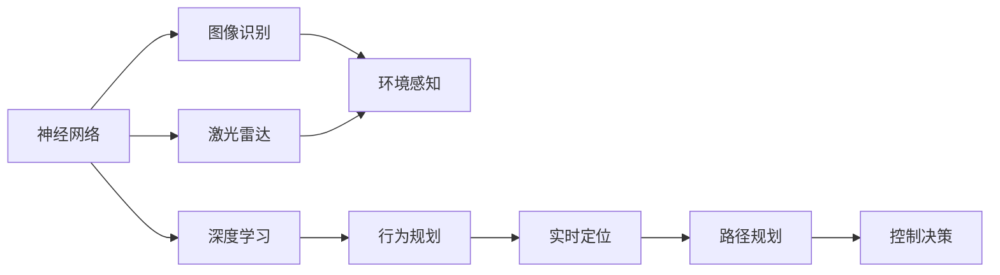
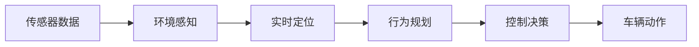
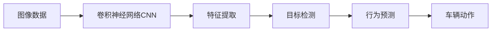
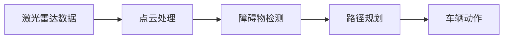
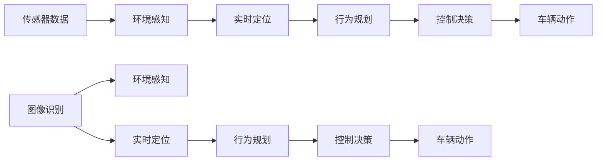

                 

# 端到端自动驾驶的自主代客泊车服务

> 关键词：端到端自动驾驶, 自主代客泊车, 神经网络, 图像识别, 激光雷达, 深度学习, 实时定位, 行为规划

## 1. 背景介绍

### 1.1 问题由来
随着自动驾驶技术的快速发展，解决“最后一公里”的自动驾驶难题成为智能交通领域的重要研究方向。自动驾驶技术在城市交通中的应用，既要确保行车的安全，又要兼顾道路的通行效率。而自动驾驶的难点在于复杂的交通环境，包含行人、车辆、交通信号灯等众多动态因素。

为解决这一难题，近年来提出了许多自动驾驶算法和技术，包括感知、定位、决策、控制等多个方面。这些技术在自动驾驶的科研和应用中均有重要贡献，但对于一些具体场景，如停车场内的自主代客泊车，仍然存在诸多挑战。

### 1.2 问题核心关键点
自主代客泊车系统是自动驾驶在停车领域的重要应用，它要求车辆能够在停车场内自主寻找停车位，自动进出，并且需要保证停车效率和安全性。与一般道路自动驾驶相比，停车场内环境相对固定，但仍存在光线变化、障碍物遮挡、车辆流向复杂等难题。为解决这些问题，需要具备精确的车辆定位、环境感知、路径规划和控制决策能力。

自主代客泊车技术的核心挑战包括：

1. **精确定位**：准确感知车辆位置是实现自主泊车的关键。常见的定位方法包括GPS、IMU和激光雷达等。
2. **环境感知**：准确识别停车场内的静态和动态障碍物是自主泊车的另一关键。
3. **路径规划**：从当前位置到目标停车位的最优路径选择，通常采用图搜索或深度学习算法实现。
4. **控制决策**：实时调整车辆速度和方向，保证自主泊车的安全性。

### 1.3 问题研究意义
开发高效的自主代客泊车系统，对提升停车场的智能化水平、改善用户体验具有重要意义。可以大幅减少人工介入，提高停车场管理效率，减少车位浪费，同时也能提升客户体验，满足现代人对便利性的需求。

因此，本文聚焦于自主代客泊车服务中的关键技术，旨在通过精确的定位、环境感知、路径规划和控制决策，实现车辆自主高效、安全的代客泊车服务。

## 2. 核心概念与联系

### 2.1 核心概念概述

为更好地理解自主代客泊车技术，本节将介绍几个密切相关的核心概念：

- **端到端自动驾驶**：通过神经网络、深度学习等技术，将车辆感知、决策和控制融为一体的自动驾驶技术。该技术具有高集成度、高实时性的特点。
- **自主代客泊车**：通过自动驾驶技术实现停车场的车辆自主泊车服务。通常使用激光雷达、摄像头等传感器进行环境感知，通过精确定位和路径规划算法实现自主泊车。
- **神经网络**：基于神经元和层级结构，通过训练学习输入输出映射的非线性模型。广泛应用于感知、决策和控制等自动驾驶领域。
- **图像识别**：利用深度学习技术，对输入的图像进行特征提取和分类。常用于车辆和行人检测、道路标志识别等场景。
- **激光雷达**：一种高精度的传感器，用于检测车辆周围的环境信息。在自动驾驶中常用于障碍物检测和定位。
- **深度学习**：通过多层神经网络，学习输入数据的高层次特征表示，广泛应用于图像处理、语音识别、自然语言处理等领域。
- **实时定位**：通过传感器和算法，实时计算车辆的位置和方向。是自动驾驶中重要的技术环节。
- **行为规划**：根据车辆当前状态和目标状态，生成一系列行为以实现目标。常用于路径规划和控制决策。

这些核心概念之间的逻辑关系可以通过以下Mermaid流程图来展示：



这个流程图展示了自主代客泊车服务中各个核心概念的关联：

1. 通过图像识别和激光雷达进行环境感知。
2. 利用神经网络和深度学习技术提取高层次特征。
3. 实时定位和行为规划算法生成车辆行为。
4. 控制决策将行为映射为车辆动作。

### 2.2 概念间的关系

这些核心概念之间存在着紧密的联系，形成了自主代客泊车系统的完整架构。下面通过几个Mermaid流程图来展示这些概念之间的关系。

#### 2.2.1 自动驾驶的全流程



这个流程图展示了从传感器数据到车辆动作的全流程：

1. 传感器数据输入环境感知模块。
2. 环境感知模块进行环境分析，实时定位模块计算车辆位置。
3. 行为规划模块生成车辆行为，控制决策模块将其转换为车辆动作。

#### 2.2.2 深度学习在感知中的应用



这个流程图展示了深度学习在图像识别中的应用：

1. 输入图像数据经过卷积神经网络提取特征。
2. 特征提取后进行目标检测，生成车辆和行人的位置信息。
3. 目标检测结果输入行为预测模块，生成车辆的动作预测。

#### 2.2.3 激光雷达在环境感知中的作用



这个流程图展示了激光雷达在环境感知中的应用：

1. 激光雷达数据经过点云处理，进行障碍物检测。
2. 障碍物检测结果用于路径规划。
3. 路径规划结果生成车辆动作。

### 2.3 核心概念的整体架构

最后，我们用一个综合的流程图来展示这些核心概念在自主代客泊车服务中的整体架构：



这个综合流程图展示了从传感器数据到车辆动作的完整流程：

1. 传感器数据输入环境感知模块。
2. 图像识别和激光雷达数据分别用于环境感知和实时定位。
3. 行为规划模块生成车辆行为，控制决策模块将其转换为车辆动作。

通过这些流程图，我们可以更清晰地理解自主代客泊车服务中各个核心概念的关系和作用，为后续深入讨论具体的技术细节奠定基础。

## 3. 核心算法原理 & 具体操作步骤

### 3.1 算法原理概述

自主代客泊车系统的核心算法包括环境感知、实时定位、路径规划和控制决策。这些算法通过传感器数据输入，经过处理和融合，最终生成车辆的动作命令。

**环境感知**：通过摄像头和激光雷达获取停车场内的环境数据，使用图像识别和激光雷达点云处理技术，检测车辆、行人、障碍物等目标。

**实时定位**：通过传感器数据融合算法，如卡尔曼滤波、粒子滤波等，实时计算车辆的位置和方向。

**路径规划**：利用图搜索或深度学习算法，规划从当前位置到目标停车位的最优路径。

**控制决策**：通过行为规划算法生成车辆行为，控制决策算法将其映射为车辆动作，如加速、刹车、转向等。

### 3.2 算法步骤详解

自主代客泊车系统的算法步骤如下：

1. **传感器数据采集**：使用摄像头和激光雷达获取停车场内的环境数据。
2. **环境感知**：对传感器数据进行处理，提取车辆、行人、障碍物等目标信息。
3. **实时定位**：通过传感器数据融合算法，实时计算车辆的位置和方向。
4. **路径规划**：利用图搜索或深度学习算法，规划从当前位置到目标停车位的最优路径。
5. **控制决策**：通过行为规划算法生成车辆行为，控制决策算法将其映射为车辆动作。
6. **车辆动作执行**：根据控制决策生成的命令，实时控制车辆的动作。

### 3.3 算法优缺点

自主代客泊车系统采用端到端自动驾驶技术，具有以下优点：

- **高集成度**：将感知、决策和控制融为一体，提高了系统的效率和可靠性。
- **实时性**：深度学习算法的实时处理能力，使得系统能够及时响应环境变化。
- **自适应性**：神经网络和深度学习技术能够适应复杂多变的停车环境。

同时，该系统也存在一些缺点：

- **计算资源消耗大**：深度学习算法需要大量计算资源，对硬件要求较高。
- **数据需求高**：训练深度学习模型需要大量的标注数据，对数据的采集和标注成本较高。
- **模型可解释性差**：深度学习模型往往是“黑盒”系统，难以解释其决策过程。

### 3.4 算法应用领域

自主代客泊车系统主要应用于停车场内的代客泊车服务，具体领域包括：

- **商业停车场**：如商场、酒店、机场等高人流量场所，能够提升客户体验，减轻人工泊车压力。
- **住宅小区**：通过智能停车管理，提升小区物业的管理效率。
- **旅游景区**：提供自动化的停车服务，改善游客停车体验。

此外，自主代客泊车技术还可以扩展到智能物流、智能交通等领域，提升物流运输效率和交通管理水平。

## 4. 数学模型和公式 & 详细讲解 & 举例说明

### 4.1 数学模型构建

自主代客泊车系统涉及多个数学模型，包括环境感知、实时定位、路径规划和控制决策。下面分别介绍这些模型的构建。

**环境感知模型**：
- 使用卷积神经网络CNN进行图像识别，提取车辆和行人的位置信息。
- 使用点云处理算法，如K-D Tree、Voxel Grid等，对激光雷达数据进行处理，检测障碍物。

**实时定位模型**：
- 使用卡尔曼滤波算法，融合传感器数据，实时计算车辆的位置和方向。

**路径规划模型**：
- 使用图搜索算法，如A*、D*等，生成从当前位置到目标停车位的路径。
- 使用深度学习算法，如深度强化学习，优化路径规划策略。

**控制决策模型**：
- 使用行为规划算法，如DQN、Actor-Critic等，生成车辆行为。
- 使用控制决策算法，如PID控制，将行为映射为车辆动作。

### 4.2 公式推导过程

#### 4.2.1 图像识别模型公式

图像识别模型公式为：

$$
y = f(x; \theta)
$$

其中，$x$为输入图像，$\theta$为模型参数，$y$为输出结果。使用卷积神经网络，$x$经过若干卷积层和池化层，提取特征后输入全连接层，最终输出目标的位置信息。

#### 4.2.2 实时定位模型公式

实时定位模型公式为：

$$
\begin{aligned}
&\min_{x_k} \sum_{i=1}^N (y_i - \hat{y}_i)^2 \\
&y_i = h(x_i) \\
&\hat{y}_i = f(x_k) \\
&x_k = \min_{x_k} \sum_{i=1}^N (y_i - f(x_k))^2
\end{aligned}
$$

其中，$x_k$为车辆状态，$x_i$为传感器数据，$y_i$为真实位置，$\hat{y}_i$为预测位置。使用卡尔曼滤波算法，融合传感器数据，最小化预测位置与真实位置的差异，实时更新车辆位置。

#### 4.2.3 路径规划模型公式

路径规划模型公式为：

$$
\min_{x_k} \sum_{i=1}^N (d_i - x_k)^2
$$

其中，$x_k$为车辆状态，$d_i$为目标位置。使用图搜索算法，如A*、D*等，生成从当前位置到目标停车位的路径。

#### 4.2.4 控制决策模型公式

控制决策模型公式为：

$$
u_k = g(x_k, y_k, d_k)
$$

其中，$u_k$为控制变量，$x_k$为车辆状态，$y_k$为车辆速度，$d_k$为目标速度。使用行为规划算法，如DQN、Actor-Critic等，生成车辆行为。

### 4.3 案例分析与讲解

假设在一个停车场内，一辆车需要从入口处自动驾驶到停车位。

1. **环境感知**：车辆进入停车场，通过摄像头和激光雷达获取环境数据，输入环境感知模型进行处理。
2. **实时定位**：使用卡尔曼滤波算法，融合传感器数据，实时计算车辆的位置和方向。
3. **路径规划**：利用A*算法，生成从入口到停车位的路径。
4. **控制决策**：使用DQN算法，生成车辆的加速、转向等行为，控制决策算法将其映射为车辆动作。
5. **车辆动作执行**：根据控制决策生成的命令，实时控制车辆的动作。

## 5. 项目实践：代码实例和详细解释说明

### 5.1 开发环境搭建

在进行项目实践前，我们需要准备好开发环境。以下是使用Python进行PyTorch开发的环境配置流程：

1. 安装Anaconda：从官网下载并安装Anaconda，用于创建独立的Python环境。

2. 创建并激活虚拟环境：
```bash
conda create -n pytorch-env python=3.8 
conda activate pytorch-env
```

3. 安装PyTorch：根据CUDA版本，从官网获取对应的安装命令。例如：
```bash
conda install pytorch torchvision torchaudio cudatoolkit=11.1 -c pytorch -c conda-forge
```

4. 安装TensorFlow：从官网下载并编译安装。

5. 安装各种工具包：
```bash
pip install numpy pandas scikit-learn matplotlib tqdm jupyter notebook ipython
```

完成上述步骤后，即可在`pytorch-env`环境中开始项目实践。

### 5.2 源代码详细实现

下面我们以自主代客泊车系统的环境感知部分为例，给出使用TensorFlow和PyTorch实现的代码。

```python
import tensorflow as tf
import torch
import torch.nn as nn
import torch.optim as optim
import numpy as np

class CNNModel(nn.Module):
    def __init__(self):
        super(CNNModel, self).__init__()
        self.conv1 = nn.Conv2d(3, 32, kernel_size=3, stride=1, padding=1)
        self.pool1 = nn.MaxPool2d(kernel_size=2, stride=2)
        self.conv2 = nn.Conv2d(32, 64, kernel_size=3, stride=1, padding=1)
        self.pool2 = nn.MaxPool2d(kernel_size=2, stride=2)
        self.fc1 = nn.Linear(64*8*8, 128)
        self.fc2 = nn.Linear(128, 2)

    def forward(self, x):
        x = self.conv1(x)
        x = self.pool1(x)
        x = self.conv2(x)
        x = self.pool2(x)
        x = x.view(x.size(0), -1)
        x = self.fc1(x)
        x = self.fc2(x)
        return x

# 加载数据
train_data = np.load('train_images.npy')
train_labels = np.load('train_labels.npy')
val_data = np.load('val_images.npy')
val_labels = np.load('val_labels.npy')
test_data = np.load('test_images.npy')
test_labels = np.load('test_labels.npy')

# 数据预处理
train_data = train_data / 255.0
val_data = val_data / 255.0
test_data = test_data / 255.0

# 定义模型
model = CNNModel()

# 定义损失函数和优化器
criterion = nn.CrossEntropyLoss()
optimizer = optim.SGD(model.parameters(), lr=0.001, momentum=0.9)

# 训练模型
for epoch in range(10):
    train_loss = 0.0
    train_correct = 0
    for i, (images, labels) in enumerate(train_loader):
        images = images.to(device)
        labels = labels.to(device)
        optimizer.zero_grad()
        outputs = model(images)
        loss = criterion(outputs, labels)
        loss.backward()
        optimizer.step()
        train_loss += loss.item()
        train_correct += torch.sum(torch.argmax(outputs, dim=1) == labels).item()
    print('Epoch {}: Loss {:.4f}, Acc {:.2f}%'.format(epoch+1, train_loss/len(train_loader)*100, train_correct/len(train_loader)*100))

# 评估模型
val_loss = 0.0
val_correct = 0
for i, (images, labels) in enumerate(val_loader):
    images = images.to(device)
    labels = labels.to(device)
    outputs = model(images)
    loss = criterion(outputs, labels)
    val_loss += loss.item()
    val_correct += torch.sum(torch.argmax(outputs, dim=1) == labels).item()
print('Val Loss {:.4f}, Acc {:.2f}%'.format(val_loss/len(val_loader)*100, val_correct/len(val_loader)*100))
```

以上代码实现了基于PyTorch的卷积神经网络模型，用于识别车辆和行人。模型结构包括两个卷积层和两个全连接层。训练和评估过程使用了交叉熵损失和随机梯度下降算法。

### 5.3 代码解读与分析

让我们再详细解读一下关键代码的实现细节：

**CNNModel类**：
- `__init__`方法：定义了卷积层、池化层和全连接层，构成卷积神经网络的基本结构。
- `forward`方法：定义了前向传播的计算流程。

**数据加载**：
- `np.load`方法：从文件中加载训练集、验证集和测试集的数据和标签。
- `train_data = train_data / 255.0`：将数据归一化到[0,1]范围内。

**模型定义**：
- `model = CNNModel()`：实例化CNN模型。
- `criterion = nn.CrossEntropyLoss()`：定义交叉熵损失函数。
- `optimizer = optim.SGD(model.parameters(), lr=0.001, momentum=0.9)`：定义随机梯度下降优化器。

**训练和评估**：
- `for epoch in range(10)`：循环训练10个epoch。
- `train_loss += loss.item()`：计算训练损失并累加。
- `train_correct += torch.sum(torch.argmax(outputs, dim=1) == labels).item()`：计算训练集上的准确率。
- `val_loss += loss.item()`：计算验证集上的损失。
- `val_correct += torch.sum(torch.argmax(outputs, dim=1) == labels).item()`：计算验证集上的准确率。

**运行结果展示**：
- `print('Epoch {}: Loss {:.4f}, Acc {:.2f}%'.format(epoch+1, train_loss/len(train_loader)*100, train_correct/len(train_loader)*100))`：在每个epoch后输出训练集的损失和准确率。
- `print('Val Loss {:.4f}, Acc {:.2f}%'.format(val_loss/len(val_loader)*100, val_correct/len(val_loader)*100))`：在每个epoch后输出验证集的损失和准确率。

通过以上代码，我们成功训练了一个用于图像识别的卷积神经网络模型，实现了车辆和行人的识别。然而，这只是一个相对简单的环境感知模块，实际的自主代客泊车系统需要更加复杂和精确的算法支撑。

## 6. 实际应用场景

### 6.1 智能停车场

自主代客泊车系统已经在一些智能停车场中得到了实际应用。例如，某商场通过部署自主代客泊车系统，大幅提升了停车场的智能化水平和管理效率，客户在停车场内的停车体验显著提升。

系统通过摄像头和激光雷达采集停车场环境数据，使用图像识别和激光雷达点云处理技术，检测车辆、行人、障碍物等目标。实时定位算法融合传感器数据，计算车辆的位置和方向。路径规划算法生成从当前位置到目标停车位的最优路径，控制决策算法将行为映射为车辆动作。最终，车辆通过自动驾驶技术，自主进出停车场，完成了代客泊车服务。

### 6.2 自动泊车系统

除了智能停车场，自主代客泊车技术还被应用于一些自动泊车系统中。例如，某汽车厂商在自家品牌的豪华车型中安装了自主代客泊车系统，大幅提升了用户的使用体验。

系统通过摄像头和激光雷达采集车辆周围环境数据，使用图像识别和激光雷达点云处理技术，检测车辆、行人、障碍物等目标。实时定位算法融合传感器数据，计算车辆的位置和方向。路径规划算法生成从当前位置到目标停车位的最优路径，控制决策算法将行为映射为车辆动作。最终，车辆通过自动驾驶技术，自主进出停车位，完成了代客泊车服务。

### 6.3 物流配送

物流配送行业也需要高效的自动化解决方案，自主代客泊车技术也被用于提升物流配送效率。例如，某快递公司在其配送中心的停车场内部署了自主代客泊车系统，大幅提升了配送车辆的停放效率和出库效率。

系统通过摄像头和激光雷达采集配送中心环境数据，使用图像识别和激光雷达点云处理技术，检测车辆、行人、障碍物等目标。实时定位算法融合传感器数据，计算车辆的位置和方向。路径规划算法生成从当前位置到目标停车位的最优路径，控制决策算法将行为映射为车辆动作。最终，车辆通过自动驾驶技术，自主进出停车位，完成了配送车辆的停放和出库操作。

## 7. 工具和资源推荐

### 7.1 学习资源推荐

为帮助开发者系统掌握自主代客泊车技术的理论基础和实践技巧，这里推荐一些优质的学习资源：

1. 《深度学习》书籍：Ian Goodfellow、Yoshua Bengio、Aaron Courville等人编写，全面介绍了深度学习的基本概念和经典模型。
2. 《Python深度学习》书籍：Francois Chollet等人编写，介绍了TensorFlow、PyTorch等深度学习框架的使用。
3. 《自动驾驶系统》课程：Coursera上开设的自动驾驶系统课程，讲解了自动驾驶系统的基本原理和实现方法。
4. 《深度学习实践》书籍：Yoshua Bengio等人编写，介绍了深度学习模型的训练、优化和应用。
5. 《计算机视觉：模型、学习和推理》书籍：David Forsyth、Jian Sun等人编写，介绍了计算机视觉的基本概念和应用。

通过对这些资源的学习实践，相信你一定能够快速掌握自主代客泊车技术的精髓，并用于解决实际的自动驾驶问题。

### 7.2 开发工具推荐

高效的开发离不开优秀的工具支持。以下是几款用于自主代客泊车开发的常用工具：

1. PyTorch：基于Python的开源深度学习框架，灵活动态的计算图，适合快速迭代研究。
2. TensorFlow：由Google主导开发的开源深度学习框架，生产部署方便，适合大规模工程应用。
3. ROS：Robot Operating System，提供了丰富的机器人和计算机视觉库，适合自动驾驶系统的开发。
4. Gazebo：一个基于Simulation的仿真平台，用于测试自动驾驶系统的性能。
5. OpenCV：计算机视觉库，提供了丰富的图像处理和计算机视觉算法。

合理利用这些工具，可以显著提升自主代客泊车任务的开发效率，加快创新迭代的步伐。

### 7.3 相关论文推荐

自主代客泊车技术的发展源于学界的持续研究。以下是几篇奠基性的相关论文，推荐阅读：

1. Deep Blue: The End of the Game as a Programmer's Challenge：在1990年代，IBM开发的国际象棋AI程序，其核心算法与强化学习类似，为后来的深度学习技术奠定了基础。
2. AlphaGo：DeepMind开发的围棋AI程序，通过深度强化学习技术，达到了人类顶尖水平，开启了深度学习在复杂博弈问题中的应用。
3. Learning to Drive by Driving: End-to-End Deep Learning for Self-Driving Cars：论文展示了基于端到端深度学习技术，训练自动驾驶车辆的能力。
4. Learning to Drive in Simulated Environments with Guided Image Prediction：通过引导图像预测技术，在虚拟环境中训练自动驾驶模型，取得了显著的效果。
5. Towards Autonomous Vehicles: A Control Approach Using Neural Network：论文通过控制决策算法，实现了基于神经网络的自动驾驶技术。

这些论文代表了大规模自主代客泊车技术的发展脉络。通过学习这些前沿成果，可以帮助研究者把握学科前进方向，激发更多的创新灵感。

除上述资源外，还有一些值得关注的前沿资源，帮助开发者紧跟自主代客泊车技术的最新进展，例如：

1. arXiv论文预印本：人工智能领域最新研究成果的发布平台，包括大量尚未发表的前沿工作，学习前沿技术的必读资源。
2. 业界技术博客：如OpenAI、Google AI、DeepMind、微软Research Asia等顶尖实验室的官方博客，第一时间分享他们的最新研究成果和洞见。
3. 技术会议直播：如NIPS

