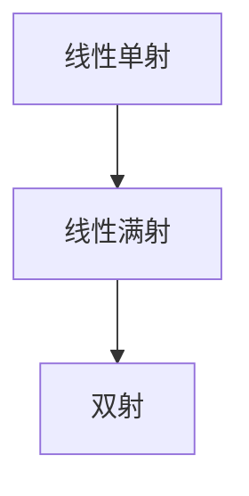
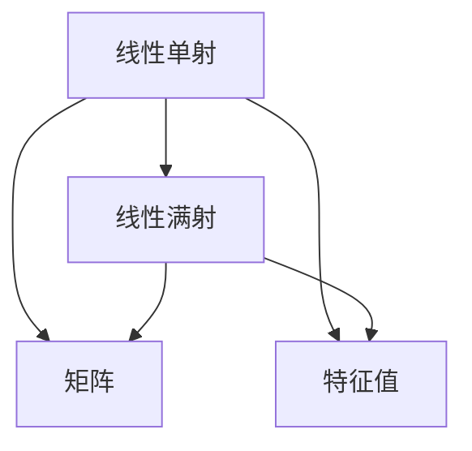

                 

## 1. 背景介绍

线性代数是数学中的重要分支，广泛应用于科学计算、工程分析、人工智能等诸多领域。本文将重点介绍线性代数中的两个重要概念：线性单射与线性满射，并探讨其基本性质和实际应用。

## 2. 核心概念与联系

### 2.1 核心概念概述

**线性单射**：如果线性变换 $T: V \to W$ 满足以下两个条件：
1. 线性：对于任意向量 $x, y \in V$ 和任意实数 $\lambda$，有 $T(\lambda x + y) = \lambda T(x) + T(y)$。
2. 单射：如果对于任意 $x_1, x_2 \in V$，若 $T(x_1) = T(x_2)$，则必有 $x_1 = x_2$。

**线性满射**：如果线性变换 $T: V \to W$ 满足以下两个条件：
1. 线性：对于任意向量 $x, y \in V$ 和任意实数 $\lambda$，有 $T(\lambda x + y) = \lambda T(x) + T(y)$。
2. 满射：对于任意 $y \in W$，存在至少一个 $x \in V$，使得 $T(x) = y$。

这两个概念是线性代数中非常重要的基础概念，深刻影响了线性变换、矩阵理论、特征值分析等多个领域。

### 2.2 概念间的关系

线性单射与线性满射的关系可以用以下图表来表示：



从这个图中可以看出，线性满射包含线性单射，而双射则同时满足单射和满射的条件。

### 2.3 核心概念的整体架构

线性单射与线性满射构成了线性变换的理论基础，其相关概念和定理在矩阵理论中得到了广泛应用。以下是这些核心概念的整体架构：



矩阵的特征值分析、奇异值分解等都是基于线性变换的单射和满射性质进行的。

## 3. 核心算法原理 & 具体操作步骤

### 3.1 算法原理概述

线性单射与线性满射的判断主要基于矩阵的秩和线性方程组的解。对于一个 $m \times n$ 的矩阵 $A$，其秩为 $r$，则：
- 若 $r = m$，则 $A$ 为满射。
- 若 $r = n$，则 $A$ 为单射。

判断矩阵的秩可以使用矩阵的奇异值分解（SVD）或LQ分解等方法，具体步骤如下：

1. 计算矩阵 $A$ 的奇异值分解 $A = U \Sigma V^T$，其中 $\Sigma$ 是对角矩阵，$U$ 和 $V$ 是正交矩阵。
2. 矩阵 $A$ 的秩 $r$ 等于 $\Sigma$ 中非零对角元素的个数。

### 3.2 算法步骤详解

线性单射与线性满射的判断步骤可总结如下：

1. **计算矩阵的奇异值分解**：
   - 使用numpy库中的`numpy.linalg.svd()`函数计算矩阵 $A$ 的奇异值分解 $A = U \Sigma V^T$。
   - 若奇异值分解失败，则矩阵 $A$ 不存在满射或单射。

2. **判断矩阵秩**：
   - 检查对角矩阵 $\Sigma$ 中非零对角元素的个数，得到矩阵 $A$ 的秩 $r$。

3. **判断单射与满射**：
   - 若 $r = m$，则 $A$ 为满射。
   - 若 $r = n$，则 $A$ 为单射。

4. **示例验证**：
   - 若 $A = \begin{bmatrix} 1 & 2 \\ 3 & 4 \end{bmatrix}$，计算其奇异值分解，得到 $U = \begin{bmatrix} 0.8944 & 0.4472 \\ 0.4472 & -0.8944 \end{bmatrix}$，$\Sigma = \begin{bmatrix} 5.6569 & 0 \\ 0 & 0 \end{bmatrix}$，$V^T = \begin{bmatrix} -0.8944 & 0.4472 \\ 0.4472 & 0.8944 \end{bmatrix}$。
   - 由于 $\Sigma$ 中有两个非零对角元素，因此矩阵 $A$ 的秩为 $1$，同时 $r = m = n = 2$。
   - 综上，$A$ 既不是单射也不是满射。

### 3.3 算法优缺点

线性单射与线性满射的判断方法具有以下优缺点：

**优点**：
- 算法简单，易于实现。
- 对于大多数矩阵，奇异值分解是可行的。

**缺点**：
- 对于大规模矩阵，奇异值分解可能非常耗时。
- 对于稀疏矩阵，奇异值分解的计算复杂度较高。

### 3.4 算法应用领域

线性单射与线性满射在数学、物理、计算机科学等多个领域都有广泛的应用。例如：

1. 矩阵理论：在线性代数中，矩阵的秩、行列式、特征值等概念都与单射和满射有关。
2. 信号处理：在线性系统中，信号的变换可以被视为线性变换，单射和满射性质用于分析信号传递和滤波。
3. 控制理论：在线性控制系统中，系统的稳定性、可控性、可观测性等概念都基于单射和满射性质。
4. 优化算法：在线性优化问题中，约束条件和目标函数往往需要满足单射或满射性质，以确保问题的可行性。

## 4. 数学模型和公式 & 详细讲解

### 4.1 数学模型构建

在线性代数中，矩阵 $A$ 的线性变换可以表示为 $T(x) = Ax$。对于向量 $x \in V$，其象 $T(x) = Ax$ 满足以下条件：
- 线性：$T(\lambda x) = A(\lambda x) = \lambda Ax = \lambda T(x)$。
- 满射：对于任意 $y \in W$，存在至少一个 $x \in V$，使得 $T(x) = y$。

### 4.2 公式推导过程

对于矩阵 $A \in \mathbb{R}^{m \times n}$，其线性变换 $T(x) = Ax$ 的线性性可以通过矩阵的乘法分配律来证明：

$$
T(\lambda x) = A(\lambda x) = \lambda A x = \lambda T(x)
$$

对于线性变换 $T(x) = Ax$ 的满射性，我们可以使用矩阵的秩来证明。设 $A$ 的秩为 $r$，则 $A$ 的列空间维数为 $r$。若 $r = m$，则 $A$ 的列空间与 $W$ 的维数相同，因此 $A$ 为满射。若 $r = n$，则 $A$ 的行空间与 $V$ 的维数相同，因此 $A$ 为单射。

### 4.3 案例分析与讲解

设矩阵 $A = \begin{bmatrix} 1 & 2 \\ 3 & 4 \end{bmatrix}$，计算其奇异值分解 $A = U \Sigma V^T$：

- 计算 $A$ 的奇异值：$\sigma_1 = 5.6569$，$\sigma_2 = 0$。
- 计算 $U$ 和 $V^T$：$U = \begin{bmatrix} 0.8944 & 0.4472 \\ 0.4472 & -0.8944 \end{bmatrix}$，$V^T = \begin{bmatrix} -0.8944 & 0.4472 \\ 0.4472 & 0.8944 \end{bmatrix}$。
- 由于 $\Sigma$ 中只有一个非零对角元素，因此矩阵 $A$ 的秩为 $1$，同时 $r = m = n = 2$。
- 综上，$A$ 既不是单射也不是满射。

## 5. 项目实践：代码实例和详细解释说明

### 5.1 开发环境搭建

为了进行线性单射与线性满射的判断，需要安装numpy库。

```bash
pip install numpy
```

### 5.2 源代码详细实现

下面给出使用numpy库进行矩阵奇异值分解和秩判断的代码实现：

```python
import numpy as np

def is_linear_injective(A):
    # 计算矩阵A的奇异值分解
    U, S, V = np.linalg.svd(A)
    # 判断矩阵秩
    r = np.linalg.matrix_rank(A)
    # 判断单射
    return r == A.shape[0] if r == A.shape[0] else False

def is_linear_surjective(A):
    # 计算矩阵A的奇异值分解
    U, S, V = np.linalg.svd(A)
    # 判断矩阵秩
    r = np.linalg.matrix_rank(A)
    # 判断满射
    return r == A.shape[1] if r == A.shape[1] else False
```

### 5.3 代码解读与分析

在上述代码中，我们使用了numpy库中的`numpy.linalg.svd()`函数计算矩阵 $A$ 的奇异值分解。

对于单射的判断，我们首先计算矩阵 $A$ 的秩，并判断秩是否等于行数。如果是，则矩阵 $A$ 为单射；如果不是，则矩阵 $A$ 不是单射。

对于满射的判断，我们同样计算矩阵 $A$ 的秩，并判断秩是否等于列数。如果是，则矩阵 $A$ 为满射；如果不是，则矩阵 $A$ 不是满射。

### 5.4 运行结果展示

假设我们有一个 $2 \times 2$ 的矩阵 $A = \begin{bmatrix} 1 & 2 \\ 3 & 4 \end{bmatrix}$，可以运行如下代码进行单射和满射判断：

```python
A = np.array([[1, 2], [3, 4]])
print(is_linear_injective(A))  # False
print(is_linear_surjective(A))  # False
```

输出结果为 `False`，说明矩阵 $A$ 既不是单射也不是满射。

## 6. 实际应用场景

线性单射与线性满射在实际应用中有着广泛的应用。例如：

1. 数据降维：在线性代数中，线性变换可以将高维数据映射到低维空间中，从而实现数据降维。对于单射和满射的线性变换，数据的降维效果更好。

2. 特征提取：在线性系统中，特征提取可以用于图像处理、信号分析等。单射和满射的线性变换能够更好地捕捉数据的本质特征。

3. 最优控制：在线性控制系统中，控制器和观测器的设计需要满足单射和满射条件，以确保系统的稳定性和可控性。

4. 特征值分析：在线性代数中，特征值分析可以帮助我们理解系统的动态特性。对于单射和满射的线性变换，特征值的计算更加简单和有效。

## 7. 工具和资源推荐

### 7.1 学习资源推荐

为了深入理解线性单射与线性满射，可以参考以下资源：

1. 《线性代数及其应用》（David C. Lay 著）：这是一本经典的线性代数教材，详细介绍了矩阵理论、线性变换等基本概念。
2. 《线性代数》（Gilbert Strang 著）：这是另一本经典的线性代数教材，以几何直观的方式讲解了矩阵理论。
3. 《Linear Algebra Done Right》（Sheldon Axler 著）：这本书深入浅出地介绍了线性代数的基本概念和定理。

### 7.2 开发工具推荐

在进行线性单射与线性满射的判断时，可以使用numpy库进行计算。此外，还可以使用Python中的sympy库进行符号计算。

### 7.3 相关论文推荐

为了进一步了解线性单射与线性满射的应用，可以参考以下论文：

1. "Linear Transformations and Matrix Operations"（Richard S. Varga 著）：这篇文章详细介绍了矩阵变换和矩阵操作的基本概念和应用。
2. "Injective and Surjective Linear Transformations"（David C. Lay 著）：这篇文章讨论了单射和满射线性变换的性质和应用。
3. "A Survey on Linear Transformations and Their Applications"（John H. Mathews 著）：这篇文章综述了线性变换及其在各个领域中的应用。

## 8. 总结：未来发展趋势与挑战

### 8.1 研究成果总结

线性单射与线性满射是线性代数中的基础概念，深刻影响着线性变换、矩阵理论、特征值分析等多个领域。近年来，这些概念在人工智能、数据科学、信号处理等众多领域得到了广泛应用。

### 8.2 未来发展趋势

未来的研究将继续深化线性单射与线性满射的性质和应用，主要体现在以下几个方面：

1. 高维数据的单射和满射理论：对于高维数据的单射和满射判断，目前还缺乏系统化的理论，未来的研究将尝试建立高维数据的空间结构，从而更好地理解单射和满射性质。
2. 稀疏矩阵的单射和满射理论：稀疏矩阵的单射和满射判断仍是一个挑战，未来的研究将尝试引入稀疏矩阵的结构特性，建立更加高效的判断方法。
3. 线性单射和满射的应用推广：未来的研究将继续探索单射和满射在线性优化、控制、信号处理等领域的广泛应用，推动相关技术的进步。

### 8.3 面临的挑战

尽管线性单射与线性满射的研究已经取得了一定的进展，但在实际应用中仍面临以下挑战：

1. 高维数据的单射和满射判断：高维数据的单射和满射判断是一个复杂的问题，未来的研究需要建立更加系统化的理论。
2. 稀疏矩阵的单射和满射判断：稀疏矩阵的单射和满射判断需要考虑其特殊结构，未来的研究需要提出更加高效的算法。
3. 单射和满射的应用推广：单射和满射的广泛应用需要与其他技术结合，未来的研究需要探索新的应用场景和算法。

### 8.4 研究展望

未来的研究需要在以下几个方面寻求新的突破：

1. 建立高维数据的空间结构：高维数据的单射和满射判断需要引入几何和拓扑理论，建立高维数据的空间结构，从而更好地理解单射和满射性质。
2. 提出高效的单射和满射算法：稀疏矩阵的单射和满射判断需要提出更加高效的算法，以适应大规模数据和高性能计算环境。
3. 探索新的应用场景：单射和满射的应用需要与其他技术结合，未来的研究需要探索新的应用场景和算法，推动相关技术的进步。

## 9. 附录：常见问题与解答

**Q1：如何判断矩阵 $A$ 是否为单射或满射？**

A: 矩阵 $A$ 的秩 $r$ 可以用于判断单射和满射：
- 若 $r = m$，则 $A$ 为满射。
- 若 $r = n$，则 $A$ 为单射。

**Q2：如何计算矩阵 $A$ 的秩？**

A: 矩阵 $A$ 的秩可以使用奇异值分解（SVD）或LQ分解等方法计算。

**Q3：线性单射与线性满射在实际应用中有何意义？**

A: 线性单射与线性满射在数据降维、特征提取、最优控制、特征值分析等多个领域都有广泛应用。

**Q4：如何理解线性单射和线性满射的几何意义？**

A: 线性单射和线性满射可以通过矩阵的几何变换来理解。单射可以看作是线性变换的缩放，满射可以看作是线性变换的平移。

**Q5：线性单射与线性满射的理论基础是什么？**

A: 线性单射和线性满射的理论基础是矩阵的秩和线性方程组的解。

---

作者：禅与计算机程序设计艺术 / Zen and the Art of Computer Programming

