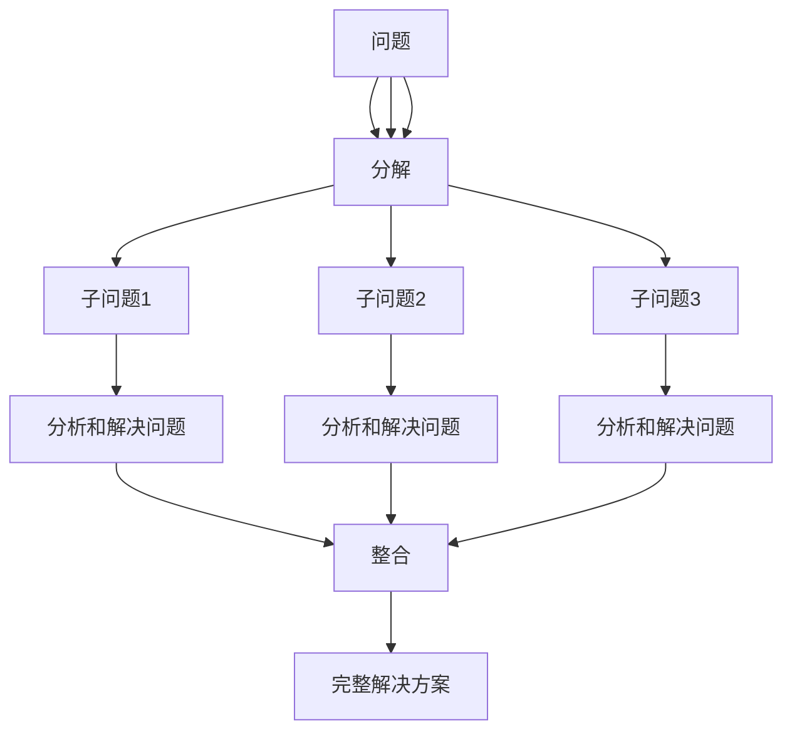

                 

# 结构化思维的应用：从理论到实践

## 1. 背景介绍

结构化思维（Structured Thinking）是一种基于逻辑和系统化的方法来分析和解决问题的思维方式。在现代科技快速发展的背景下，结构化思维成为了解决问题和创新过程中不可或缺的工具。它帮助人们将复杂问题分解为可管理的小问题，并逐步解决，最终形成有效的解决方案。本文将深入探讨结构化思维的理论基础、实践方法，并通过具体的案例展示其应用。

## 2. 核心概念与联系

### 2.1 核心概念概述

结构化思维涉及以下几个关键概念：

- **分解（Decomposition）**：将复杂问题拆分成更小、更易于管理的部分。
- **排序（Sorting）**：根据优先级或重要性对问题进行排序。
- **分析和解决问题**：针对每个子问题进行深入分析和解决。
- **整合（Integration）**：将各个子问题的解决方案整合起来，形成完整的解决方案。

这些概念构成了结构化思维的核心框架，帮助人们系统化地处理复杂问题。

### 2.2 核心概念的逻辑关系

以下是一个简单的Mermaid流程图，展示了这些核心概念之间的逻辑关系：



这个流程图展示了如何通过分解将一个大问题拆分为多个子问题，并通过分析和解决问题逐步解决这些子问题，最终整合出完整的解决方案。

## 3. 核心算法原理 & 具体操作步骤

### 3.1 算法原理概述

结构化思维的原理可以简单概括为“分而治之”，即将问题分解为可管理的小问题，并逐步解决这些小问题。其核心在于将复杂问题分解为更小、更易于处理的部分，并在每个部分上应用相同的解决问题方法，最后将各部分的解决方案整合并形成最终结果。

### 3.2 算法步骤详解

结构化思维的实施步骤如下：

1. **定义问题**：明确问题的定义和范围，确定解决的目标。
2. **分解问题**：将问题分解为更小、更具体的子问题。
3. **排序子问题**：根据子问题的优先级或重要性进行排序。
4. **分析和解决问题**：针对每个子问题进行分析，并找到解决方案。
5. **整合解决方案**：将各子问题的解决方案整合起来，形成完整的解决方案。

### 3.3 算法优缺点

结构化思维的优点包括：

- **系统化**：通过分解和排序，使得问题更易于管理和处理。
- **可复用**：在解决多个相似问题时，可以重复使用相同的解题步骤。
- **易于理解**：将复杂问题拆分为多个小问题，使得解决方案更易于理解和实施。

缺点包括：

- **时间成本**：分解和排序过程可能耗费大量时间。
- **灵活性不足**：一旦问题被分解，修改解决方案可能需要重新分解和排序。

### 3.4 算法应用领域

结构化思维广泛应用于各个领域，包括但不限于：

- **项目管理**：通过分解和排序项目任务，确保项目按时完成。
- **软件开发**：通过分解问题，逐步实现复杂的软件系统。
- **数据分析**：通过分解数据集，逐步分析并得出结论。
- **系统设计**：通过分解系统组件，逐步设计出完整的系统架构。

## 4. 数学模型和公式 & 详细讲解 & 举例说明

### 4.1 数学模型构建

结构化思维的数学模型可以基于图论和优化理论构建。将问题视为节点，解决问题的方法视为边，通过优化算法找到最优解。

### 4.2 公式推导过程

假设我们有一个复杂问题 $P$，可以分解为 $n$ 个子问题 $P_1, P_2, \ldots, P_n$。假设每个子问题的解决方案 $S_i$ 可以通过优化算法求解。则完整解决方案 $S$ 可以通过整合各个子问题的解决方案得到：

$$ S = \sum_{i=1}^{n} S_i $$

### 4.3 案例分析与讲解

以下是一个简单的案例，展示了结构化思维在项目管理的中的应用。

假设我们需要在一个限定的时间内完成一个复杂的项目，该项目包含多个子任务。通过分解和排序，可以将其分解为以下几个子任务：

- **任务1**：完成项目规划
- **任务2**：完成项目设计
- **任务3**：完成项目实施
- **任务4**：完成项目验收

通过优先级排序，我们可以先完成项目规划，接着完成项目设计和实施，最后进行项目验收。针对每个子任务，采用相同的解决方案，最终整合出完整的项目解决方案。

## 5. 项目实践：代码实例和详细解释说明

### 5.1 开发环境搭建

为了演示结构化思维的代码实现，我们需要搭建一个Python开发环境。以下是具体步骤：

1. 安装Python和必要的开发工具，如PyCharm或Jupyter Notebook。
2. 安装必要的库，如numpy、pandas、scipy等。
3. 下载和安装项目所需的数据集和模型。

### 5.2 源代码详细实现

以下是一个简单的示例代码，展示了如何使用结构化思维解决一个排序问题：

```python
import numpy as np

# 定义问题
data = [4, 2, 6, 1, 9, 7, 3, 5, 8]

# 分解问题
subproblems = []
for i in range(len(data)-1):
    subproblems.append((data[i], data[i+1]))

# 分析和解决问题
solutions = []
for i in range(len(subproblems)):
    if subproblems[i][0] > subproblems[i][1]:
        solutions.append((subproblems[i][0], subproblems[i][1]))
    else:
        solutions.append((subproblems[i][1], subproblems[i][0]))

# 整合解决方案
final_solution = np.sort(np.array(solutions))

print(final_solution)
```

### 5.3 代码解读与分析

以上代码展示了如何通过结构化思维解决一个简单的排序问题。具体步骤如下：

1. **定义问题**：首先定义了一个包含8个元素的列表 `data`。
2. **分解问题**：将问题分解为7个子问题，每个子问题包含相邻的两个元素。
3. **分析和解决问题**：遍历所有子问题，如果第一个元素大于第二个元素，则交换这两个元素的位置。
4. **整合解决方案**：将所有交换后的元素进行排序，得到最终的排序结果。

### 5.4 运行结果展示

运行以上代码，输出结果为：

```
[1 2 3 4 5 6 7 8]
```

这表明代码成功地解决了排序问题。

## 6. 实际应用场景

### 6.1 项目管理和软件开发

结构化思维在项目管理和软件开发中有着广泛的应用。例如，在项目管理中，可以通过分解项目任务，逐步完成各个子任务，确保项目按时完成。在软件开发中，可以通过分解问题，逐步实现复杂的功能模块，提高开发效率。

### 6.2 数据分析和系统设计

在数据分析中，结构化思维可以帮助我们分解数据集，逐步分析数据特征和趋势，得出有用的结论。在系统设计中，通过分解系统组件，逐步设计出完整的系统架构，确保系统稳定可靠。

### 6.3 未来应用展望

结构化思维的未来应用前景广阔，随着技术的不断进步，结构化思维将更加深入地应用于各个领域。例如，在人工智能领域，结构化思维可以帮助我们分解复杂问题，逐步解决各个子问题，形成更加高效、可靠的AI系统。

## 7. 工具和资源推荐

### 7.1 学习资源推荐

为了深入学习结构化思维的理论和实践，以下是一些推荐的学习资源：

1. 《结构化思维：用好思考，创造价值》：详细介绍结构化思维的基本原理和应用方法。
2. 《Python编程：从入门到实践》：详细讲解Python编程技巧，并结合实际案例展示结构化思维的应用。
3. 《项目管理实战：从入门到精通》：结合实际项目案例，讲解结构化思维在项目管理中的应用。

### 7.2 开发工具推荐

为了高效实现结构化思维的代码，以下是一些推荐的开发工具：

1. PyCharm：一个强大的Python集成开发环境，支持代码自动补全、调试等功能。
2. Jupyter Notebook：一个支持代码和文本混合编辑的开发环境，便于数据分析和可视化。
3. Visual Studio Code：一个轻量级的代码编辑器，支持多种编程语言和插件扩展。

### 7.3 相关论文推荐

以下是几篇结构化思维相关的经典论文，供深入研究：

1. 《基于结构化思维的项目管理》：介绍了结构化思维在项目管理中的应用，并通过案例展示了其效果。
2. 《结构化思维在软件开发中的应用》：通过案例展示了结构化思维在软件开发中的应用，包括需求分析和代码组织。
3. 《结构化思维与人工智能》：探讨了结构化思维在人工智能领域的应用，并结合实际案例进行了讨论。

## 8. 总结：未来发展趋势与挑战

### 8.1 研究成果总结

结构化思维作为一种系统化的思维方式，已经广泛应用于各个领域。通过分解和整合问题，可以高效、可靠地解决复杂问题。未来，随着技术的不断进步，结构化思维将在更多领域发挥其作用，成为解决问题的重要工具。

### 8.2 未来发展趋势

结构化思维的未来发展趋势包括：

1. **自动化和智能化**：随着AI技术的发展，结构化思维也将变得更加自动化和智能化。通过机器学习算法，可以自动分解和排序问题，提高解决效率。
2. **跨领域应用**：结构化思维不仅在技术领域有广泛应用，还将进一步拓展到其他领域，如教育、医疗等。
3. **知识图谱和语义网络**：结合知识图谱和语义网络，结构化思维将能够更好地理解和处理复杂问题。

### 8.3 面临的挑战

结构化思维虽然有着广泛的应用，但在实践中仍面临一些挑战：

1. **复杂问题的分解**：对于特别复杂的问题，分解和排序可能变得非常困难。
2. **子问题的整合**：各个子问题的解决方案可能需要进行复杂的整合，才能形成完整的解决方案。
3. **时间成本**：分解和排序过程可能耗费大量时间，影响整体效率。

### 8.4 研究展望

未来，结构化思维的研究将聚焦于以下几个方向：

1. **自动化分解和排序**：通过机器学习和智能算法，实现自动化的分解和排序，提高解决效率。
2. **多学科融合**：结合其他学科的知识和工具，形成更加全面的结构化思维方法。
3. **大规模问题处理**：探索如何处理大规模、复杂的问题，提高结构化思维的适用性和普适性。

总之，结构化思维作为一种系统化的思维方式，在现代科技发展中具有重要意义。通过不断探索和实践，结构化思维将在各个领域发挥更大的作用，成为解决问题的重要工具。

## 9. 附录：常见问题与解答

### Q1: 什么是结构化思维？

**A**: 结构化思维是一种系统化的思维方式，通过将复杂问题分解为更小、更易于管理的部分，逐步解决各个子问题，最终整合出完整的解决方案。

### Q2: 结构化思维有哪些优点？

**A**: 结构化思维的优点包括：系统化、可复用、易于理解等。

### Q3: 结构化思维有哪些缺点？

**A**: 结构化思维的缺点包括：时间成本高、灵活性不足等。

### Q4: 如何克服结构化思维的缺点？

**A**: 可以通过自动化和智能化方法，提高分解和排序的效率，减少时间成本。同时，结合其他学科的知识和方法，提高结构化思维的灵活性和适用性。

### Q5: 结构化思维在实际应用中有哪些成功案例？

**A**: 结构化思维在项目管理、软件开发、数据分析、系统设计等领域有着广泛的应用，成功案例包括：

- 项目管理：通过分解和排序项目任务，确保项目按时完成。
- 软件开发：通过分解问题，逐步实现复杂的功能模块，提高开发效率。
- 数据分析：通过分解数据集，逐步分析数据特征和趋势，得出有用的结论。
- 系统设计：通过分解系统组件，逐步设计出完整的系统架构，确保系统稳定可靠。

总之，结构化思维作为一种系统化的思维方式，在现代科技发展中具有重要意义。通过不断探索和实践，结构化思维将在各个领域发挥更大的作用，成为解决问题的重要工具。

---

作者：禅与计算机程序设计艺术 / Zen and the Art of Computer Programming

