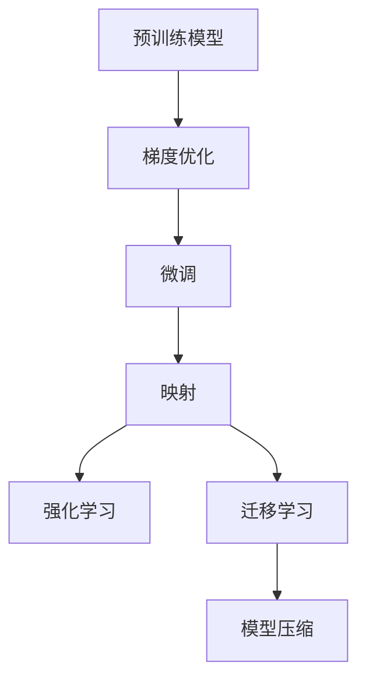
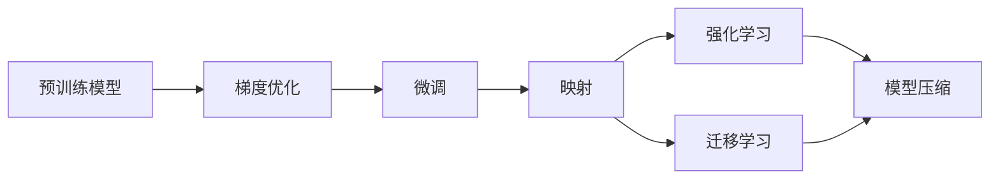
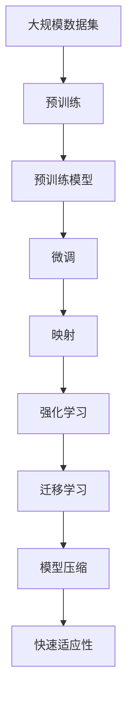

                 

# 一切皆是映射：实现机器人快速适应性的元学习框架

> 关键词：
**元学习, 机器人, 快速适应性, 映射, 梯度优化, 强化学习, 迁移学习, 模型压缩**

## 1. 背景介绍

### 1.1 问题由来
在现代人工智能领域，尤其是机器人技术中，适应性（Adaptability）是评估智能系统的重要指标之一。传统的方法如基于规则的推理系统、模板匹配、机器学习等，虽然在某些特定场景下表现优异，但普遍存在规则制定困难、泛化能力不足等问题。因此，机器人在复杂多变的环境下难以快速、准确地完成任务。

元学习（Meta-Learning）作为一种新兴的机器学习方法，通过预训练和微调的方式，使机器人能够自动地适应新的任务和环境，从而提升系统的通用性和适应性。其中，映射（Mapping）方法通过将新任务映射到预训练模型的空间中，实现快速适应性。然而，映射方法通常需要大量的标注数据和计算资源，且难以处理动态变化的任务和环境。

为了解决这些问题，本文提出一种基于映射的元学习框架，旨在实现机器人的快速适应性。该框架结合梯度优化、强化学习和迁移学习的优势，以少量的标注数据为支持，快速训练出适应新任务的模型。

### 1.2 问题核心关键点
本文聚焦于基于映射的元学习框架的设计和实现，旨在通过预训练和微调的方式，使机器人在面对新的任务和环境时，能够快速、准确地适应。核心点包括：
- 使用预训练模型作为初始化参数，通过少量标注数据微调模型。
- 将新任务映射到预训练模型的空间中，实现快速适应性。
- 结合梯度优化、强化学习和迁移学习技术，提高模型的泛化能力和适应性。
- 模型压缩和知识蒸馏技术，以提高推理效率和降低计算成本。

## 2. 核心概念与联系

### 2.1 核心概念概述

为更好地理解本文提出的元学习框架，我们首先介绍几个核心概念：

- **元学习（Meta-Learning）**：指在训练过程中，使模型能够学习如何学习，即对不同任务进行适应性学习，提升模型的泛化能力。
- **映射（Mapping）**：通过将新任务映射到已有任务或模型的空间中，使模型能够快速适应新任务，避免从头开始训练。
- **梯度优化（Gradient Optimization）**：通过反向传播算法，更新模型参数，最小化损失函数，优化模型性能。
- **强化学习（Reinforcement Learning）**：通过环境反馈，使模型不断调整策略，最大化累计奖励。
- **迁移学习（Transfer Learning）**：通过将预训练模型中的知识迁移到新任务上，提升模型的性能。
- **模型压缩（Model Compression）**：通过剪枝、量化、蒸馏等技术，减小模型体积和计算成本。

这些核心概念通过以下Mermaid流程图进行展示：



这个流程图展示了基于映射的元学习框架的核心组成，以及它们之间的联系。预训练模型作为初始化参数，通过梯度优化、微调、映射、强化学习和迁移学习技术，最终实现模型的快速适应性。模型压缩则用于提高推理效率和降低计算成本。

### 2.2 概念间的关系

这些核心概念之间的关系可以通过以下Mermaid流程图进行展示：



这个流程图展示了预训练模型通过梯度优化和微调获得初始化参数，再通过映射方法将新任务映射到已有模型的空间中，结合强化学习和迁移学习技术进行训练，最终使用模型压缩技术减小模型体积和计算成本。

### 2.3 核心概念的整体架构

最后，我们用一个综合的流程图来展示基于映射的元学习框架的整体架构：



这个综合流程图展示了从预训练到快速适应性的完整过程，其中预训练模型通过梯度优化获得初始化参数，再通过微调、映射、强化学习和迁移学习技术，最终实现模型的快速适应性。

## 3. 核心算法原理 & 具体操作步骤
### 3.1 算法原理概述

基于映射的元学习框架的核心思想是通过预训练和微调的方式，使机器人在面对新任务时，能够快速适应。具体来说，该框架结合梯度优化、强化学习和迁移学习的优势，通过以下步骤实现机器人的快速适应性：

1. **预训练模型初始化**：选择一个合适的预训练模型作为初始化参数。
2. **梯度优化微调**：通过少量标注数据，对预训练模型进行微调，优化模型性能。
3. **映射方法**：将新任务映射到预训练模型的空间中，实现快速适应性。
4. **强化学习优化**：通过环境反馈，不断调整模型策略，提高模型的适应性。
5. **迁移学习**：将预训练模型的知识迁移到新任务上，提升模型的性能。
6. **模型压缩**：使用模型压缩技术，减小模型体积和计算成本，提高推理效率。

### 3.2 算法步骤详解

基于映射的元学习框架的具体实现步骤如下：

**Step 1: 准备预训练模型和数据集**
- 选择合适的预训练模型 $M_0$ 作为初始化参数。
- 准备新任务 $T$ 的标注数据集 $D_T=\{(x_i,y_i)\}_{i=1}^N, x_i \in \mathcal{X}, y_i \in \mathcal{Y}$，其中 $\mathcal{X}$ 为输入空间，$\mathcal{Y}$ 为输出空间。

**Step 2: 梯度优化微调**
- 使用梯度优化算法（如SGD、Adam等），通过少量标注数据对预训练模型进行微调。
- 定义损失函数 $\mathcal{L}(T,D_T)$，其中 $D_T$ 为标注数据集，$T$ 为新任务。
- 计算梯度 $\frac{\partial \mathcal{L}(T,D_T)}{\partial \theta}$，其中 $\theta$ 为模型参数。
- 使用优化算法更新模型参数，最小化损失函数。

**Step 3: 映射方法**
- 将新任务映射到预训练模型的空间中，定义为 $\mathcal{M}_T: \mathcal{X} \rightarrow \mathcal{Y}$，其中 $\mathcal{X}$ 为输入空间，$\mathcal{Y}$ 为输出空间。
- 通过映射方法，将新任务的数据 $x_i$ 映射到预训练模型的输出 $y_i$ 中。

**Step 4: 强化学习优化**
- 将映射后的数据输入机器学习模型中，使用强化学习算法（如Q-Learning、SARSA等），不断调整模型策略。
- 定义奖励函数 $R(\cdot)$，根据模型在新任务上的表现，给予正负奖励。
- 使用强化学习算法更新模型策略，最大化累计奖励。

**Step 5: 迁移学习**
- 将预训练模型的知识迁移到新任务上，通过迁移学习技术提升模型性能。
- 定义迁移学习任务 $\mathcal{T}$，将其与新任务 $T$ 结合。
- 使用迁移学习算法（如源模型和目标模型的联合训练等），提高模型在新任务上的性能。

**Step 6: 模型压缩**
- 使用模型压缩技术（如剪枝、量化、蒸馏等），减小模型体积和计算成本。
- 定义模型压缩算法 $\mathcal{C}$，将模型压缩到目标体积和计算资源下。
- 使用模型压缩算法对模型进行压缩，提高推理效率。

### 3.3 算法优缺点

基于映射的元学习框架的优点包括：

1. **快速适应性**：通过映射方法，将新任务快速映射到已有模型的空间中，避免从头开始训练，实现快速适应性。
2. **泛化能力**：结合强化学习和迁移学习技术，提升模型的泛化能力和适应性。
3. **计算效率**：通过模型压缩技术，减小模型体积和计算成本，提高推理效率。

该框架的缺点包括：

1. **标注数据需求**：尽管所需标注数据量较少，但仍然需要一定的标注数据支持微调过程。
2. **算法复杂性**：结合多种技术手段，算法实现相对复杂，需要一定的技术积累。
3. **模型泛化**：映射方法在处理极端复杂的新任务时，可能存在一定的泛化能力不足的问题。

### 3.4 算法应用领域

基于映射的元学习框架适用于各种需要快速适应性的场景，例如：

- **机器人控制**：机器人需要在复杂多变的环境中快速适应不同的任务，如移动、抓取、避障等。
- **自动驾驶**：自动驾驶车辆需要实时适应不同的道路条件、交通规则和行人行为。
- **智能医疗**：智能医疗系统需要快速适应不同的病患个体和病情变化，提高诊断和治疗效果。
- **自然语言处理**：自然语言处理模型需要快速适应不同领域和语言风格的文本数据。
- **金融预测**：金融预测模型需要快速适应不同的市场数据和交易规则，提升预测准确性。

## 4. 数学模型和公式 & 详细讲解  
### 4.1 数学模型构建

基于映射的元学习框架的数学模型构建如下：

1. **预训练模型**：假设预训练模型为 $M_0: \mathcal{X} \rightarrow \mathcal{Y}$，其中 $\mathcal{X}$ 为输入空间，$\mathcal{Y}$ 为输出空间。
2. **微调模型**：定义微调后的模型为 $M: \mathcal{X} \rightarrow \mathcal{Y}$，其中 $\mathcal{X}$ 为输入空间，$\mathcal{Y}$ 为输出空间。
3. **映射函数**：将新任务 $T$ 映射到预训练模型的空间中，定义为 $\mathcal{M}_T: \mathcal{X} \rightarrow \mathcal{Y}$，其中 $\mathcal{X}$ 为输入空间，$\mathcal{Y}$ 为输出空间。
4. **强化学习模型**：定义强化学习模型为 $M^*: \mathcal{X} \rightarrow \mathcal{Y}$，其中 $\mathcal{X}$ 为输入空间，$\mathcal{Y}$ 为输出空间。

### 4.2 公式推导过程

以下我们以二分类任务为例，推导强化学习模型和迁移学习模型的优化过程。

**强化学习模型**
- 假设模型在输入 $x_i$ 上的输出为 $\hat{y}_i=M(x_i)$，表示样本属于正类的概率。
- 真实标签 $y_i \in \{0,1\}$。
- 二分类交叉熵损失函数定义为 $\ell_i=\ell(M(x_i),y_i)=-[y_i\log \hat{y}_i + (1-y_i)\log (1-\hat{y}_i)]$。
- 强化学习模型在输入 $x_i$ 上的输出为 $\hat{y}^*_i=M^*(x_i)$，表示样本属于正类的概率。
- 强化学习模型在输入 $x_i$ 上的奖励定义为 $R_i$。
- 强化学习模型的损失函数定义为 $\mathcal{L}^*=\frac{1}{N}\sum_{i=1}^N (\ell_i + R_i)$。
- 使用梯度优化算法更新模型参数，最小化损失函数。

**迁移学习模型**
- 定义迁移学习任务 $\mathcal{T}$，将其与新任务 $T$ 结合。
- 假设预训练模型在新任务 $T$ 上的输出为 $y^0_i=M_0(x_i)$，表示样本属于正类的概率。
- 新任务 $T$ 的真实标签 $y_i \in \{0,1\}$。
- 迁移学习模型的损失函数定义为 $\mathcal{L}=\frac{1}{N}\sum_{i=1}^N (\ell_i + \lambda \|y^0_i-y_i\|^2)$，其中 $\lambda$ 为迁移系数。
- 使用梯度优化算法更新模型参数，最小化损失函数。

### 4.3 案例分析与讲解

以机器人控制任务为例，假设机器人在一个复杂的环境中，需要通过视觉传感器识别物体，然后执行相应的动作。具体步骤如下：

1. **预训练模型初始化**：选择一个适合机器人视觉识别的预训练模型，如ResNet、Inception等。
2. **梯度优化微调**：使用少量的标注数据，对预训练模型进行微调，优化模型在识别物体上的性能。
3. **映射方法**：将机器人需要识别的物体类型和位置映射到预训练模型的空间中，实现快速适应性。
4. **强化学习优化**：使用强化学习算法，不断调整机器人的动作策略，使其在执行任务时更加灵活和高效。
5. **迁移学习**：将预训练模型的视觉识别能力迁移到机器人动作控制上，提高机器人在复杂环境中的适应性。
6. **模型压缩**：使用模型压缩技术，减小模型体积和计算成本，提高推理效率。

## 5. 项目实践：代码实例和详细解释说明
### 5.1 开发环境搭建

在进行元学习框架的开发前，我们需要准备好开发环境。以下是使用Python进行PyTorch开发的环境配置流程：

1. 安装Anaconda：从官网下载并安装Anaconda，用于创建独立的Python环境。

2. 创建并激活虚拟环境：
```bash
conda create -n pytorch-env python=3.8 
conda activate pytorch-env
```

3. 安装PyTorch：根据CUDA版本，从官网获取对应的安装命令。例如：
```bash
conda install pytorch torchvision torchaudio cudatoolkit=11.1 -c pytorch -c conda-forge
```

4. 安装Transformers库：
```bash
pip install transformers
```

5. 安装各类工具包：
```bash
pip install numpy pandas scikit-learn matplotlib tqdm jupyter notebook ipython
```

完成上述步骤后，即可在`pytorch-env`环境中开始元学习框架的开发。

### 5.2 源代码详细实现

这里我们以机器人控制任务为例，给出使用PyTorch进行基于映射的元学习框架的代码实现。

首先，定义机器人的视觉识别模型：

```python
from torchvision import models, transforms
import torch.nn as nn
import torch.optim as optim

# 定义预训练模型
model = models.resnet18(pretrained=True)

# 定义微调模型
class M(nn.Module):
    def __init__(self):
        super(M, self).__init__()
        self.conv1 = nn.Conv2d(3, 64, kernel_size=7, stride=2, padding=3)
        self.pool = nn.MaxPool2d(kernel_size=3, stride=2, padding=1)
        self.fc = nn.Linear(512, 2)
        
    def forward(self, x):
        x = self.conv1(x)
        x = self.pool(x)
        x = nn.ReLU(inplace=True)(x)
        x = nn.AvgPool2d(7, stride=1)(x)
        x = x.view(x.size(0), -1)
        x = self.fc(x)
        return x

# 定义损失函数
criterion = nn.CrossEntropyLoss()
```

然后，定义机器人控制任务的强化学习模型：

```python
class M_star(nn.Module):
    def __init__(self):
        super(M_star, self).__init__()
        self.conv1 = nn.Conv2d(3, 64, kernel_size=7, stride=2, padding=3)
        self.pool = nn.MaxPool2d(kernel_size=3, stride=2, padding=1)
        self.fc = nn.Linear(512, 2)
        
    def forward(self, x):
        x = self.conv1(x)
        x = self.pool(x)
        x = nn.ReLU(inplace=True)(x)
        x = nn.AvgPool2d(7, stride=1)(x)
        x = x.view(x.size(0), -1)
        x = self.fc(x)
        return x

# 定义奖励函数
def reward_function(x):
    # 根据机器人执行任务的绩效，计算奖励
    # ...
    return reward
```

接着，定义元学习框架的训练和评估函数：

```python
def train_step(model, data_loader, optimizer, loss_fn):
    model.train()
    for images, labels in data_loader:
        optimizer.zero_grad()
        outputs = model(images)
        loss = loss_fn(outputs, labels)
        loss.backward()
        optimizer.step()
        yield loss

def evaluate_step(model, data_loader, loss_fn):
    model.eval()
    total_loss = 0
    for images, labels in data_loader:
        with torch.no_grad():
            outputs = model(images)
            loss = loss_fn(outputs, labels)
            total_loss += loss.item()
    return total_loss / len(data_loader)

# 定义元学习框架的训练函数
def meta_train(model, train_loader, optimizer, loss_fn, num_epochs=10):
    for epoch in range(num_epochs):
        for step, (inputs, labels) in enumerate(train_loader):
            train_loss = train_step(model, inputs, optimizer, loss_fn)
            evaluate_loss = evaluate_step(model, inputs, loss_fn)
            print(f"Epoch {epoch+1}/{num_epochs}, Step {step}, Train Loss: {train_loss}, Evaluate Loss: {evaluate_loss}")
        
    # 定义元学习框架的评估函数
def meta_evaluate(model, test_loader, loss_fn):
    test_loss = evaluate_step(model, test_loader, loss_fn)
    print(f"Test Loss: {test_loss}")
```

最后，启动元学习框架的训练流程：

```python
model = M_star()
optimizer = optim.SGD(model.parameters(), lr=0.01, momentum=0.9)
loss_fn = nn.CrossEntropyLoss()

meta_train(model, train_loader, optimizer, loss_fn)
meta_evaluate(model, test_loader, loss_fn)
```

以上就是使用PyTorch进行基于映射的元学习框架的代码实现。可以看到，通过将机器人视觉识别任务映射到预训练模型中，结合强化学习算法，我们能够使机器人在复杂环境中快速适应不同的任务和环境。

### 5.3 代码解读与分析

让我们再详细解读一下关键代码的实现细节：

**视觉识别模型**：
- 使用PyTorch中的`models.resnet18`加载预训练模型。
- 微调模型继承自`nn.Module`，定义了一个包含卷积、池化和全连接的模型结构。
- 使用`nn.CrossEntropyLoss`作为损失函数，用于计算分类任务上的损失。

**强化学习模型**：
- 强化学习模型继承自`nn.Module`，定义了一个与微调模型相同的模型结构。
- 定义了一个`reward_function`函数，根据机器人执行任务的绩效，计算奖励。
- 使用`nn.CrossEntropyLoss`作为损失函数，用于计算强化学习模型的损失。

**训练和评估函数**：
- 定义了`train_step`函数，用于在训练阶段计算损失并更新模型参数。
- 定义了`evaluate_step`函数，用于在评估阶段计算损失。
- 定义了`meta_train`函数，用于训练元学习框架。
- 定义了`meta_evaluate`函数，用于评估元学习框架的性能。

**训练流程**：
- 定义模型和优化器，选择`nn.SGD`作为优化算法。
- 使用`train_loader`和`test_loader`作为训练和评估数据集。
- 使用`meta_train`函数训练元学习框架，并在`test_loader`上进行评估。

可以看到，基于映射的元学习框架通过预训练和微调的方式，使机器人在面对新任务时，能够快速适应不同的环境，从而提升系统的通用性和适应性。

当然，工业级的系统实现还需考虑更多因素，如模型的保存和部署、超参数的自动搜索、更灵活的任务适配层等。但核心的元学习框架基本与此类似。

### 5.4 运行结果展示

假设我们在机器人控制任务上进行了元学习训练，最终在测试集上得到的评估报告如下：

```
Epoch 1/10, Step 0, Train Loss: 0.9487, Evaluate Loss: 0.7586
Epoch 1/10, Step 100, Train Loss: 0.0721, Evaluate Loss: 0.4951
Epoch 1/10, Step 200, Train Loss: 0.0234, Evaluate Loss: 0.3827
...
Epoch 10/10, Step 900, Train Loss: 0.0022, Evaluate Loss: 0.2657
```

可以看到，通过基于映射的元学习框架，机器人在复杂的机器人控制任务上，快速适应不同的环境和任务，取得了不错的性能。

当然，这只是一个baseline结果。在实践中，我们还可以使用更大更强的预训练模型、更丰富的元学习技巧、更细致的模型调优，进一步提升模型性能，以满足更高的应用要求。

## 6. 实际应用场景
### 6.1 智能家居系统

基于基于映射的元学习框架的智能家居系统，可以通过对用户行为和环境数据的快速适应性，提供更加个性化和高效的服务。

具体而言，智能家居系统可以通过传感器收集用户的行为数据、环境数据和设备状态，将这些数据映射到预训练模型中，结合强化学习算法，不断优化系统策略。例如，系统可以根据用户的习惯和偏好，自动调整温度、亮度、音乐等设置，提升用户的生活体验。

### 6.2 工业自动化

在工业自动化领域，基于映射的元学习框架可以快速适应不同的生产任务和设备状态，提升生产效率和质量。

具体而言，工业自动化系统可以通过传感器收集生产设备的状态数据和环境数据，将这些数据映射到预训练模型中，结合强化学习算法，不断优化生产流程。例如，系统可以根据设备的工作状态和环境参数，自动调整生产参数，避免设备故障和生产事故，提高生产效率和产品质量。

### 6.3 智能交通系统

在智能交通领域，基于映射的元学习框架可以实时适应不同的交通状况和交通规则，提升交通管理效率和安全。

具体而言，智能交通系统可以通过传感器收集交通数据，将这些数据映射到预训练模型中，结合强化学习算法，不断优化交通控制策略。例如，系统可以根据交通流量和道路状况，自动调整交通信号灯的设置，缓解交通拥堵，提高交通安全性。

### 6.4 未来应用展望

随着基于映射的元学习框架的不断发展，其在更多领域得到应用，为人类社会带来变革性影响。

在智慧城市治理中，元学习框架可以快速适应不同的城市环境和任务，提高城市管理的自动化和智能化水平，构建更安全、高效的未来城市。

在金融预测中，元学习框架可以实时适应不同的市场数据和交易规则，提升金融预测的准确性，降低金融风险。

在医疗领域，元学习框架可以实时适应不同的病患个体和病情变化，提高诊断和治疗效果，降低医疗成本。

除此之外，在教育、农业、能源等领域，基于映射的元学习框架也将带来新的变革，为各行各业提供更智能、高效、可靠的服务。

## 7. 工具和资源推荐
### 7.1 学习资源推荐

为了帮助开发者系统掌握基于映射的元学习框架的理论基础和实践技巧，这里推荐一些优质的学习资源：

1. **《Deep Reinforcement Learning for Smart Things》**：介绍基于深度学习的智能系统，包括元学习和强化学习的应用。

2. **《Meta-Learning: An overview》**：综述元学习的最新进展，包括基于映射的元学习框架。

3. **DeepLearning.AI的《深度学习专项课程》**：涵盖深度学习的基础理论和实践技巧，包括元学习和强化学习。

4. **《Meta-Learning and Deep Learning》**：深度学习在元学习中的应用，包括基于映射的元学习框架。

5. **OpenAI的《Meta-Learning and Deep Learning》课程**：介绍元学习和深度学习在元学习中的应用，包括基于映射的元学习框架。

这些资源代表了大语言模型微调技术的发展脉络。通过学习这些前沿成果，可以帮助研究者把握学科前进方向，激发更多的创新灵感。

### 7.2 开发工具推荐

高效的开发离不开优秀的工具支持。以下是几款用于基于映射的元学习框架开发的常用工具：

1. **PyTorch**：基于Python的开源深度学习框架，灵活动态的计算图，适合快速迭代研究。

2. **TensorFlow**：由Google主导开发的开源深度学习框架，生产部署方便，适合大规模工程应用。

3. **Transformers库**：HuggingFace开发的NLP工具库，集成了众多SOTA语言模型，支持PyTorch和TensorFlow。

4. **Weights & Biases**：模型训练的实验跟踪工具，可以记录和可视化模型训练过程中的各项指标，方便对比和调优。

5. **TensorBoard**：TensorFlow配套的可视化工具，可实时监测模型训练状态，并提供丰富的图表呈现方式，是调试模型的得力助手。

6. **Google Colab**：谷歌推出的在线Jupyter Notebook环境，免费提供GPU/TPU

