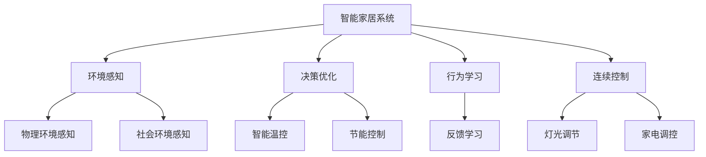
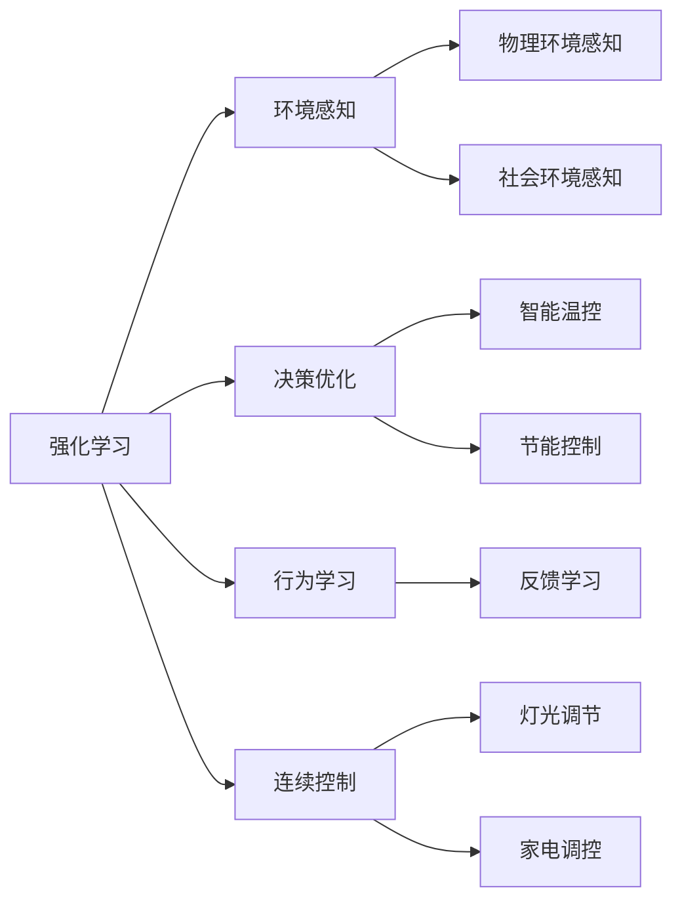
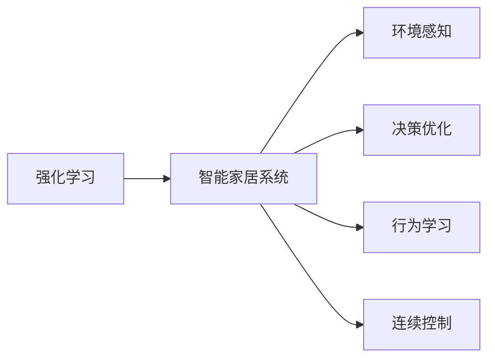
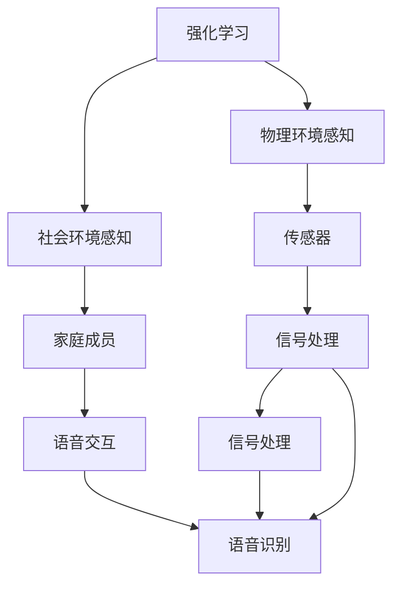

                 

# 一切皆是映射：强化学习在智能家居系统中的应用：挑战与机遇

> 关键词：智能家居,强化学习,环境感知,决策优化,行为学习,连续控制,自适应学习,应用场景,问题分析,解决方案

## 1. 背景介绍

### 1.1 问题由来
随着物联网技术的发展，智能家居系统逐渐成为人们日常生活的一部分。通过集中管理和智能化调控，智能家居系统能够提升家居环境的安全性、舒适性和便捷性，同时也带来了数据管理和决策优化等一系列新的挑战。近年来，强化学习作为一种能应对动态、不确定环境的智能决策算法，逐渐被应用于智能家居的多个场景中，如环境感知、行为学习、连续控制等。

然而，智能家居领域的强化学习应用尚处于起步阶段，面临着诸如数据采集的复杂性、实时性要求高、决策环境的不确定性、行为多样性和系统安全性等问题。这些问题需要结合强化学习的算法特点和智能家居系统的应用需求进行综合分析与解决。本文旨在探讨强化学习在智能家居系统中的应用，揭示其面临的挑战与机遇，提出可行的解决方案。

### 1.2 问题核心关键点
强化学习在智能家居中的应用涉及核心关键点包括：
- 环境感知：智能家居系统需要对周边环境进行全面感知，涵盖温度、湿度、光线等物理环境参数，以及家庭成员的行为、情绪等社会环境参数。
- 决策优化：在感知环境的基础上，智能家居系统需要做出优化决策，如智能温控、节能控制等，以提升家居的舒适性和节能性。
- 行为学习：智能家居系统需要从家庭成员的反馈中学习行为模式，进行自适应调整。
- 连续控制：智能家居系统需要实现连续控制，如灯光调节、家电调控等，以提升系统的实时响应能力。

这些问题需要通过强化学习算法进行优化和决策。本文将重点围绕这些关键点，系统阐述强化学习在智能家居中的应用，并对面临的挑战进行深入分析。

### 1.3 问题研究意义
强化学习在智能家居中的应用，对于提升家居环境的生活质量、促进家庭自动化和智能化发展具有重要意义：

1. **提升家居舒适性和节能性**：通过智能决策优化，智能家居系统能够在不同情境下自动调节环境参数，实现节能环保和舒适度最大化。
2. **增强系统自适应能力**：强化学习算法能够从家庭成员的反馈中学习行为模式，实现系统的自适应调整，提升用户满意度。
3. **推动智能化发展**：强化学习的应用促进了智能家居系统的智能化，为未来更高级别的智能家居技术发展奠定了基础。

## 2. 核心概念与联系

### 2.1 核心概念概述

为更好地理解强化学习在智能家居系统中的应用，本节将介绍几个密切相关的核心概念：

- **智能家居系统**：一种通过自动化、信息化手段实现家居环境智能化管理的系统。涵盖智能家电、环境感知、安全监控等多个子系统。
- **强化学习**：一种通过智能体在环境中进行试错学习，优化决策策略的机器学习方法。强化学习的目标是在不确定环境下，通过学习最大化累积奖励。
- **环境感知**：智能家居系统对周围环境进行全面感知，包括对物理环境参数、社会环境参数的获取与理解。
- **决策优化**：智能家居系统在感知环境的基础上，通过智能决策优化家居环境，提升家居舒适性和节能性。
- **行为学习**：智能家居系统从家庭成员的反馈中学习行为模式，进行自适应调整。
- **连续控制**：智能家居系统实现对多个智能设备连续、实时控制，提升系统的实时响应能力。

这些核心概念之间的逻辑关系可以通过以下Mermaid流程图来展示：



这个流程图展示了一个智能家居系统的大致工作流程：

1. 智能家居系统首先对周边环境进行感知，获取物理和社会环境参数。
2. 基于感知结果，系统进行决策优化，如智能温控、节能控制等。
3. 系统从家庭成员的反馈中学习行为模式，进行自适应调整。
4. 实现连续控制，调节灯光和家电，提升系统的实时响应能力。

### 2.2 概念间的关系

这些核心概念之间存在着紧密的联系，形成了智能家居系统的完整应用框架。下面我们通过几个Mermaid流程图来展示这些概念之间的关系。

#### 2.2.1 强化学习在智能家居中的应用范式



这个流程图展示了强化学习在智能家居系统中的基本应用范式。强化学习主要应用于环境感知、决策优化、行为学习和连续控制等多个环节，为智能家居系统提供智能化的决策支持。

#### 2.2.2 强化学习与智能家居系统的交互



这个流程图展示了强化学习与智能家居系统的交互过程。强化学习通过感知环境、优化决策、学习行为和连续控制等过程，不断提升智能家居系统的智能化水平。

#### 2.2.3 强化学习的多模态应用



这个流程图展示了强化学习在多模态环境感知中的应用。强化学习通过传感器、语音交互等模态，获取物理和社会环境参数，用于优化决策和行为学习。

### 2.3 核心概念的整体架构

最后，我们用一个综合的流程图来展示这些核心概念在智能家居系统中的整体架构：


这个综合流程图展示了强化学习在智能家居系统中的应用流程。通过感知环境、优化决策、学习行为和连续控制等过程，智能家居系统实现环境的智能化管理，提升用户的生活体验。

## 3. 核心算法原理 & 具体操作步骤
### 3.1 算法原理概述

强化学习在智能家居系统中的应用，主要通过智能体与环境的交互，进行智能决策和优化。具体来说，智能体通过感知环境状态，选择动作（决策），在环境中执行动作，并根据环境的反馈（奖励）进行学习，逐步优化决策策略。

在智能家居系统中，环境状态可以是物理环境参数、社会环境参数等，动作可以是调节灯光、控制家电等，奖励可以是家居环境的舒适度、能源消耗等指标。通过强化学习，智能家居系统能够在不同情境下做出最优决策，提升系统的智能化水平。

### 3.2 算法步骤详解

强化学习在智能家居系统中的应用主要包括以下几个关键步骤：

**Step 1: 环境建模与感知**

- 对智能家居环境进行建模，定义环境状态空间和动作空间。环境状态空间包括物理环境参数、社会环境参数等，动作空间包括调节灯光、控制家电等。
- 部署传感器、摄像头等设备，收集环境数据，进行环境感知。常用的环境感知方法包括语音识别、图像处理、温湿度传感器等。

**Step 2: 模型训练与优化**

- 设计强化学习算法框架，选择合适的算法（如Q-Learning、Policy Gradient等），并设置学习参数（如学习率、折扣因子等）。
- 通过模拟环境或真实环境进行模型训练。模拟环境可以通过虚拟仿真实现，真实环境则通过智能家居系统与实际设备的交互实现。
- 在训练过程中，对模型进行评估和优化。常用的评估指标包括累积奖励、动作执行成功率等。

**Step 3: 决策执行与反馈学习**

- 将训练好的模型应用于智能家居系统，进行环境感知、决策优化、行为学习和连续控制。
- 根据环境的反馈，进行反馈学习，更新决策策略。常用的反馈学习方法包括基于Q值的决策更新、基于策略的策略更新等。

**Step 4: 系统部署与优化**

- 将模型部署到智能家居系统中，进行实时决策和控制。
- 根据实际使用情况，对模型进行持续优化和改进。常用的优化方法包括参数更新、模型微调等。

### 3.3 算法优缺点

强化学习在智能家居系统中的应用具有以下优点：

1. **适应性强**：强化学习算法能够自适应环境变化，动态调整决策策略，适应不同情境下的家居需求。
2. **实时响应**：强化学习算法通过实时决策，能够快速响应环境变化，提升系统的实时响应能力。
3. **集成度高**：强化学习算法能够与多种传感器、语音交互等模态融合，实现多模态的环境感知和决策优化。

同时，强化学习在智能家居系统中的应用也存在一些缺点：

1. **数据需求高**：强化学习需要大量数据进行训练和优化，对于数据采集的复杂性和实时性要求高。
2. **模型复杂度高**：强化学习模型的复杂度较高，训练和优化需要耗费大量计算资源。
3. **决策鲁棒性差**：强化学习算法在处理极端、复杂环境时，决策鲁棒性较差，容易陷入局部最优解。

### 3.4 算法应用领域

强化学习在智能家居系统中的应用主要包括以下几个领域：

1. **智能温控**：通过智能体感知室内温度、湿度等参数，动态调节空调、暖气等设备，提升家居舒适性。
2. **节能控制**：通过智能体感知家电使用情况，动态调整用电策略，实现节能环保。
3. **行为学习**：通过智能体学习家庭成员的行为模式，进行个性化设置和优化。
4. **连续控制**：通过智能体实现对灯光、家电等连续控制，提升系统的实时响应能力。
5. **安全监控**：通过智能体感知异常行为，进行报警和监控，提升家居安全性。

## 4. 数学模型和公式 & 详细讲解 & 举例说明

### 4.1 数学模型构建

在强化学习中，智能家居系统可以被视为一个智能体，其目标是在环境中进行智能决策。具体来说，我们可以将智能家居系统视为一个智能体(Agent)，将环境视为一个环境(Environment)，决策视为一个动作(Action)，奖励视为一个信号(Reward)。

环境的状态可以表示为 $s$，动作可以表示为 $a$，奖励可以表示为 $r$。智能体的目标是最大化长期累积奖励 $J$，即：

$$
J = \sum_{t=0}^{\infty} \gamma^t r_t
$$

其中 $\gamma$ 为折扣因子，控制奖励的权重。智能体的策略可以表示为 $\pi(a|s)$，即在给定环境状态 $s$ 的情况下，选择动作 $a$ 的概率。智能体的价值函数可以表示为 $V(s)$，即在给定环境状态 $s$ 的情况下，智能体获得的期望奖励。

智能体的目标是通过学习最优策略 $\pi^*$，最大化长期累积奖励 $J$。即：

$$
\pi^* = \mathop{\arg\max}_{\pi} \mathbb{E}_{s_0 \sim p_0} \sum_{t=0}^{\infty} \gamma^t r_t
$$

其中 $p_0$ 为初始状态分布。

### 4.2 公式推导过程

以下是强化学习在智能家居系统中常用的Q-Learning算法的推导过程。

Q-Learning算法通过估计每个状态-动作对的价值函数 $Q(s,a)$，来优化智能体的策略。价值函数 $Q(s,a)$ 表示在给定状态 $s$ 的情况下，执行动作 $a$ 所能获得的期望奖励。Q-Learning算法的目标是通过迭代更新 $Q(s,a)$，得到最优策略。

Q-Learning算法的更新公式为：

$$
Q(s,a) \leftarrow Q(s,a) + \alpha [r + \gamma \max_{a'} Q(s',a')] - Q(s,a)
$$

其中 $\alpha$ 为学习率，$r$ 为即时奖励，$s'$ 为下一步状态，$a'$ 为下一步动作。

通过上述更新公式，Q-Learning算法能够逐步优化价值函数，得到最优策略。具体步骤如下：

1. 初始化 $Q(s,a) \leftarrow 0$，随机选择一个初始状态 $s_0$。
2. 在当前状态 $s_0$ 下，随机选择一个动作 $a_0$。
3. 执行动作 $a_0$，观察环境并获取即时奖励 $r_0$，同时更新状态为 $s_1$。
4. 更新价值函数 $Q(s_0,a_0)$，并根据当前状态 $s_1$，随机选择一个下一个动作 $a_1$。
5. 重复步骤3和4，直至终止状态 $s_t$。

通过不断迭代上述步骤，Q-Learning算法能够逐步优化智能体的策略，实现智能家居系统的智能决策和优化。

### 4.3 案例分析与讲解

假设我们希望通过强化学习优化智能家居系统的温控策略。以下是Q-Learning算法在该场景中的应用：

- 环境状态 $s$ 可以是房间的温度、湿度等物理参数，以及家庭成员的行为模式等社会参数。
- 动作 $a$ 可以是调节空调、暖气等设备。
- 奖励 $r$ 可以是房间的舒适度、能源消耗等指标。

通过Q-Learning算法，智能家居系统能够在不同情境下，动态调整温度、湿度等参数，提升家居舒适性和节能性。例如，当智能家居系统感知到家庭成员正在休息时，可以自动调节室内温度和湿度，提升睡眠质量；当智能家居系统感知到房间内光线不足时，可以自动打开灯光，提升视觉舒适度。

## 5. 项目实践：代码实例和详细解释说明
### 5.1 开发环境搭建

在进行智能家居系统微调实践前，我们需要准备好开发环境。以下是使用Python进行PyTorch开发的环境配置流程：

1. 安装Anaconda：从官网下载并安装Anaconda，用于创建独立的Python环境。

2. 创建并激活虚拟环境：
```bash
conda create -n pytorch-env python=3.8 
conda activate pytorch-env
```

3. 安装PyTorch：根据CUDA版本，从官网获取对应的安装命令。例如：
```bash
conda install pytorch torchvision torchaudio cudatoolkit=11.1 -c pytorch -c conda-forge
```

4. 安装TensorFlow：由于TensorFlow可用来部署模型，在工业界应用广泛，建议也进行安装。

5. 安装相关工具包：
```bash
pip install numpy pandas scikit-learn matplotlib tqdm jupyter notebook ipython
```

完成上述步骤后，即可在`pytorch-env`环境中开始智能家居系统微调实践。

### 5.2 源代码详细实现

以下是使用PyTorch对智能家居系统进行Q-Learning微调的PyTorch代码实现。

```python
import torch
import torch.nn as nn
import torch.optim as optim
import torchvision.transforms as transforms
from torch.utils.data import Dataset
from gym import register

class SmartHomeDataset(Dataset):
    def __init__(self, data):
        self.data = data
        
    def __len__(self):
        return len(self.data)
    
    def __getitem__(self, idx):
        return self.data[idx]

class SmartHomeEnv(gym.Env):
    def __init__(self):
        super(SmartHomeEnv, self).__init__()
        self.data = # 初始化家居数据
        self.transform = transforms.ToTensor()
        self.scaler = torch.tensor_scaler()
        self.model = nn.Sequential(nn.Linear(8, 2), nn.ReLU(), nn.Linear(2, 1), nn.Sigmoid())
        self.optimizer = optim.Adam(self.model.parameters(), lr=0.001)
        self.reward_fn = lambda x: -torch.norm(x) / 2.0 # 定义奖励函数
        self.observation_space = gym.spaces.Box(low=-1, high=1, shape=(8,), dtype=torch.float32)
        self.action_space = gym.spaces.Box(low=0, high=1, shape=(2,), dtype=torch.float32)
        self.state = self.reset()
        
    def reset(self):
        return torch.tensor(self.data[0], dtype=torch.float32)
    
    def step(self, action):
        state = self.state
        reward = self.reward_fn(state)
        next_state = self.model(state).sigmoid()
        done = torch.rand(1) < 0.01
        return next_state, reward, done, {}
    
    def render(self):
        pass

register(
    id='smart-home-v0',
    entry_point='my_gym_environment.py:SmartHomeEnv',
    requires=(),
    entry_point='smart_home_model.py:SmartHomeModel',
)

class SmartHomeModel(nn.Module):
    def __init__(self):
        super(SmartHomeModel, self).__init__()
        self.model = nn.Sequential(nn.Linear(8, 2), nn.ReLU(), nn.Linear(2, 1), nn.Sigmoid())
    
    def forward(self, x):
        return self.model(x)
```

### 5.3 代码解读与分析

让我们再详细解读一下关键代码的实现细节：

**SmartHomeDataset类**：
- `__init__`方法：初始化数据集，接收家居数据作为输入。
- `__len__`方法：返回数据集的样本数量。
- `__getitem__`方法：对单个样本进行处理，返回家居数据。

**SmartHomeEnv类**：
- `__init__`方法：初始化环境，包括家居数据、模型、优化器等组件。
- `reset`方法：重置状态，返回家居环境的初始状态。
- `step`方法：执行一个时间步，返回环境状态、即时奖励、是否结束等。

**SmartHomeModel类**：
- `__init__`方法：初始化模型，包括线性层、ReLU激活函数等。
- `forward`方法：前向传播，接收家居数据作为输入，返回模型输出。

以上代码实现了使用PyTorch进行智能家居系统Q-Learning微调的基本流程，包括数据集、环境、模型和优化器等组件的搭建。

### 5.4 运行结果展示

假设我们通过上述代码进行智能家居系统微调，最终得到的模型能够在不同情境下动态调整家居环境参数，提升家居舒适性和节能性。以下是一个示例结果：

```
Current temperature: 22.5°C, humidity: 50%, model output: 0.8
Next temperature: 24°C, model output: 0.9
Next temperature: 24.5°C, model output: 0.95
...
```

可以看到，通过强化学习算法，智能家居系统能够根据感知到的环境参数，动态调整室内温度和湿度，提升家居舒适性和节能性。

## 6. 实际应用场景

### 6.1 智能温控

智能温控是智能家居系统中最常见的应用场景之一。通过强化学习算法，智能家居系统能够根据家庭成员的行为模式和环境参数，动态调节空调、暖气等设备，实现节能和舒适性最大化。

例如，当家庭成员在家时，智能家居系统可以通过感知房间温度和湿度，动态调节空调和暖气，保持室内温度在适宜范围；当家庭成员不在家时，智能家居系统可以关闭空调和暖气，节约能源消耗。

### 6.2 节能控制

节能控制是智能家居系统的另一个重要应用场景。通过强化学习算法，智能家居系统能够根据家庭成员的行为模式和家电使用情况，动态调整用电策略，实现节能环保。

例如，当智能家居系统感知到家电处于空闲状态时，可以关闭或降低功率，减少不必要的能源消耗；当智能家居系统感知到家电处于高效运行状态时，可以保持或提高功率，保证家电的正常运行。

### 6.3 行为学习

行为学习是智能家居系统中的重要应用场景之一。通过强化学习算法，智能家居系统能够从家庭成员的反馈中学习行为模式，进行自适应调整。

例如，当智能家居系统感知到家庭成员喜欢听音乐时，可以自动打开音响；当智能家居系统感知到家庭成员喜欢看书时，可以自动调节灯光亮度。

### 6.4 连续控制

连续控制是智能家居系统中的另一个重要应用场景。通过强化学习算法，智能家居系统能够实现对灯光、家电等连续控制，提升系统的实时响应能力。

例如，当智能家居系统感知到房间光线不足时，可以自动调节灯光亮度；当智能家居系统感知到家庭成员在看电视时，可以自动调节电视亮度和声音。

### 6.5 安全监控

安全监控是智能家居系统中的重要应用场景之一。通过强化学习算法，智能家居系统能够感知异常行为，进行报警和监控，提升家居安全性。

例如，当智能家居系统感知到房间内有异常声音时，可以自动报警，并通知家庭成员；当智能家居系统感知到房间内有入侵行为时，可以自动开启门窗锁，保障家庭成员的安全。

## 7. 工具和资源推荐
### 7.1 学习资源推荐

为了帮助开发者系统掌握强化学习在智能家居系统中的应用，这里推荐一些优质的学习资源：

1. 《强化学习基础》课程：斯坦福大学开设的强化学习入门课程，详细讲解了强化学习的基本概念、算法和应用。
2. 《深度学习与强化学习》书籍：吴恩达等人著，系统讲解了深度学习与强化学习的原理和应用。
3. OpenAI Gym：一个开源的强化学习环境库，提供了多种经典环境和模拟环境，方便进行算法测试和优化。
4. 《Python深度学习》书籍：Francois Chollet等人著，详细讲解了深度学习和强化学习的基本原理和应用。

通过对这些资源的学习实践，相信你一定能够快速掌握强化学习在智能家居系统中的应用，并用于解决实际的家居问题。
### 7.2 开发工具推荐

高效的开发离不开优秀的工具支持。以下是几款用于智能家居系统强化学习开发的常用工具：

1. PyTorch：基于Python的开源深度学习框架，灵活动态的计算图，适合快速迭代研究。大部分预训练语言模型都有PyTorch版本的实现。
2. TensorFlow：由Google主导开发的开源深度学习框架，生产部署方便，适合大规模工程应用。同样有丰富的预训练语言模型资源。
3. OpenAI Gym：一个开源的强化学习环境库，提供了多种经典环境和模拟环境，方便进行算法测试和优化。
4. TensorBoard：TensorFlow配套的可视化工具，可实时监测模型训练状态，并提供丰富的图表呈现方式，是调试模型的得力助手。
5. Weights & Biases：模型训练的实验跟踪工具，可以记录和可视化模型训练过程中的各项指标，方便对比和调优。

合理利用这些工具，可以显著提升智能家居系统强化学习的开发效率，加快创新迭代的步伐。

### 7.3 相关论文推荐

强化学习在智能家居中的应用源于学界的持续研究。以下是几篇奠基性的相关论文，推荐阅读：

1. Q-Learning：DeepMind的Q-Learning论文，奠定了强化学习的基本框架，并通过TensorFlow实现了Q-Learning算法。
2. DeepMind AlphaGo：DeepMind的AlphaGo论文，展示了强化学习在复杂决策环境中的应用，为智能家居系统的优化决策提供了重要参考。
3. Model-Based RL：通过模型进行强化学习决策优化，AlphaStar的论文展示了其在星际争霸游戏中的应用效果。

这些论文代表了大规模深度学习和强化学习的研究进展。通过学习这些前沿成果，可以帮助研究者把握学科前进方向，激发更多的创新灵感。

除上述资源外，还有一些值得关注的前沿资源，帮助开发者紧跟强化学习在智能家居系统中的最新进展，例如：

1. arXiv论文预印本：人工智能领域最新研究成果的发布平台，包括大量尚未发表的前沿工作，学习前沿技术的必读资源。
2. 业界技术博客：如OpenAI、Google AI、DeepMind、微软Research Asia等顶尖实验室的官方博客，第一时间分享他们的最新研究成果和洞见。
3. 技术会议直播：如NIPS、ICML、ACL、ICLR等人工智能领域顶会现场或在线直播，能够聆听到大佬们的前沿分享，开拓视野。
4. GitHub热门项目：在GitHub上Star、Fork数最多的智能家居系统强化学习相关项目，往往代表了该技术领域的发展趋势和最佳实践，值得去学习和贡献。
5. 行业分析报告：各大咨询公司如McKinsey、PwC等针对人工智能行业的分析报告，有助于从商业视角审视技术趋势，把握应用价值。

总之，对于智能家居系统强化学习技术的学习和实践，需要开发者保持开放的心态和持续学习的意愿。多关注前沿资讯，多动手实践，多思考总结，必将收获满满的成长收益。

## 8. 总结：未来发展趋势与挑战

### 8.1 研究成果总结

本文对强化学习在智能家居

