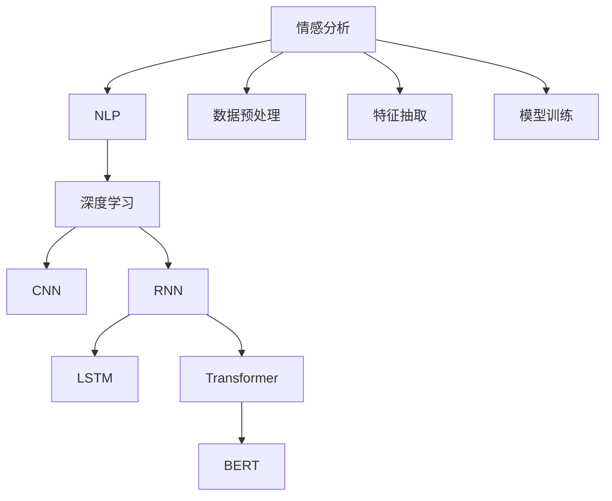
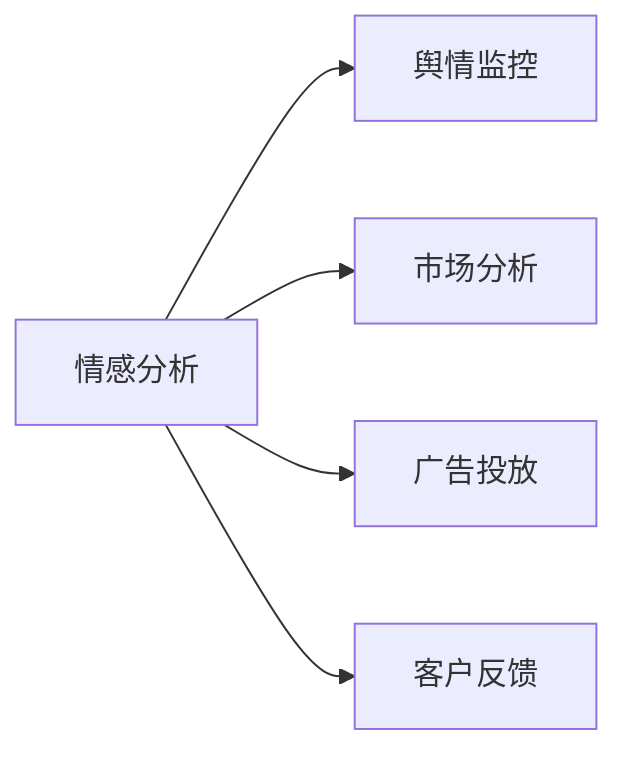

                 

# 一切皆是映射：情感分析：AI理解人类情感

> 关键词：情感分析,自然语言处理(NLP),人工智能(AI),深度学习,卷积神经网络(CNN),循环神经网络(RNN),长短时记忆网络(LSTM),Transformer,BERT,语言表示,情绪识别

## 1. 背景介绍

### 1.1 问题由来
情感分析（Sentiment Analysis），也称为意见挖掘（Opinion Mining），是自然语言处理（NLP）和人工智能（AI）领域的经典问题。随着互联网和社交媒体的普及，人们越来越依赖在线平台表达和获取情感信息。情感分析技术能够从文本中自动抽取出情感倾向，帮助企业洞察客户需求，优化用户体验；同时，在舆情监控、市场分析、广告投放等场景中，情感分析也有着重要的应用价值。

当前，情感分析技术已经从早期的规则匹配、词典抽取等方法，发展为深度学习驱动的端到端模型。借助深度神经网络，情感分析模型能够更准确地捕捉文本中的情感信息，并在大规模语料上进行训练，从而具备更强的泛化能力和适应性。

### 1.2 问题核心关键点
情感分析的核心在于如何准确地捕捉和识别文本中的情感倾向。传统方法主要依赖于手工构建的规则和词典，难以处理语言的多样性和复杂性。深度学习模型则通过学习大量的语料，自适应地构建情感表示，大大提高了模型的性能和泛化能力。

情感分析的主要挑战在于：
1. 语言的多义性和模糊性。同一句话可以包含多种情感，如讽刺、双关等，这给情感分类带来了困难。
2. 情感表达的复杂性。情感不仅包含正面和负面，还有中性、模糊、讽刺等更细微的情感。
3. 情感表达的上下文依赖性。情感通常与上下文紧密相关，孤立的词语可能无法准确表达情感。
4. 情感表达的词汇依赖性。某些情感词汇的情感倾向不明确，需要通过上下文来推断。

## 2. 核心概念与联系

### 2.1 核心概念概述

为了更好地理解情感分析，本节将介绍几个关键概念及其联系：

- **情感分析（Sentiment Analysis）**：从文本中自动抽取出情感倾向，通常是二分类（正面/负面）或三分类（正面/负面/中性）。
- **自然语言处理（NLP）**：涉及文本预处理、特征抽取、模型训练等多个环节，是情感分析的基础技术。
- **深度学习（Deep Learning）**：以神经网络为核心，能够从大量数据中学习出复杂的特征表示，是情感分析的主流方法。
- **卷积神经网络（CNN）**：一种经典的前馈神经网络，能够捕捉局部特征，适用于序列数据。
- **循环神经网络（RNN）**：能够处理序列数据的神经网络，可以记忆上下文信息，适用于情感分析。
- **长短时记忆网络（LSTM）**：一种特殊的RNN结构，能够更好地处理长序列数据。
- **Transformer**：一种自注意力机制的神经网络结构，能够并行处理序列数据，适用于大规模语言模型。
- **BERT（Bidirectional Encoder Representations from Transformers）**：一种预训练语言模型，能够学习丰富的语言表示，适用于情感分析等任务。

这些概念之间的联系可以通过以下Mermaid流程图来展示：



这个流程图展示了情感分析从基础技术到高级模型的演进过程，以及数据处理、特征抽取和模型训练等关键环节。

### 2.2 概念间的关系

这些核心概念之间存在着紧密的联系，形成了情感分析的完整生态系统。下面我们通过几个Mermaid流程图来展示这些概念之间的关系。

#### 2.2.1 情感分析的基本流程


这个流程图展示了情感分析的基本流程，包括数据预处理、特征抽取、模型训练和模型评估。

#### 2.2.2 深度学习在情感分析中的应用


这个流程图展示了深度学习在情感分析中的应用，包括卷积神经网络、循环神经网络、长短时记忆网络、Transformer和BERT等模型。

#### 2.2.3 情感分析的应用场景



这个流程图展示了情感分析在不同领域的应用场景，包括舆情监控、市场分析、广告投放和客户反馈等。

## 3. 核心算法原理 & 具体操作步骤
### 3.1 算法原理概述

情感分析的本质是对文本进行情感分类。深度学习模型通过学习文本的特征表示，能够自动抽取出文本中的情感信息。

情感分析模型通常采用以下步骤：
1. **数据预处理**：对原始文本进行清洗和标准化，包括去除噪声、分词、词性标注、去除停用词等。
2. **特征抽取**：将预处理后的文本转换为模型可处理的向量表示，常用的方法包括词袋模型（Bag of Words）、TF-IDF（Term Frequency-Inverse Document Frequency）和词嵌入（Word Embedding）。
3. **模型训练**：使用深度学习模型进行训练，常用的模型包括卷积神经网络（CNN）、循环神经网络（RNN）、长短时记忆网络（LSTM）和Transformer。
4. **模型评估**：在测试集上评估模型的性能，常用的指标包括准确率（Accuracy）、精确率（Precision）、召回率（Recall）和F1分数（F1 Score）。

### 3.2 算法步骤详解

以下是使用Python实现基于深度学习的情感分析模型的详细步骤：

**Step 1: 数据准备**
- 收集情感分析任务的标注数据集，如电影评论、产品评论等。
- 将数据集划分为训练集、验证集和测试集。
- 使用NLP库（如NLTK、spaCy）进行文本预处理，包括分词、词性标注、去除停用词等。

**Step 2: 特征抽取**
- 将预处理后的文本转换为向量表示，常用的方法包括词袋模型、TF-IDF和词嵌入（如Word2Vec、GloVe、BERT等）。
- 使用预训练的词嵌入模型（如GloVe、BERT）或通过神经网络模型（如Word2Vec）进行训练，得到向量表示。

**Step 3: 模型选择与训练**
- 选择合适的深度学习模型，如CNN、RNN、LSTM或Transformer。
- 使用Keras或PyTorch等深度学习框架搭建模型。
- 定义损失函数和优化器，进行模型训练。

**Step 4: 模型评估与优化**
- 在测试集上评估模型的性能，计算准确率、精确率、召回率和F1分数。
- 根据评估结果，调整模型参数或选择不同的特征抽取方法，进一步优化模型性能。

**Step 5: 模型部署与应用**
- 将训练好的模型保存为TensorFlow或PyTorch等格式。
- 使用模型进行情感分析，处理实时输入文本，输出情感分类结果。

### 3.3 算法优缺点

基于深度学习的情感分析模型具有以下优点：
1. 自动化程度高。能够自动学习文本的特征表示，无需手工设计特征。
2. 性能优越。能够捕捉复杂的情感信息，准确率、精确率和召回率等指标通常较高。
3. 适应性强。能够适应多种情感表达形式，如正面、负面、中性、讽刺等。

同时，基于深度学习的情感分析模型也存在一些缺点：
1. 计算资源需求高。模型参数量大，训练和推理都需要大量的计算资源。
2. 可解释性不足。深度学习模型通常被称为"黑盒"模型，难以解释其内部工作机制。
3. 过拟合风险高。如果数据集较小，容易发生过拟合，需要采取正则化等策略进行缓解。

### 3.4 算法应用领域

基于深度学习的情感分析模型已经在多个领域得到了广泛应用，例如：

- **舆情监控**：从社交媒体、新闻网站等渠道抓取文本数据，自动分析公众情感，提供舆情报告。
- **市场分析**：从产品评论、用户反馈中分析情感倾向，辅助企业进行市场决策。
- **广告投放**：分析用户对广告的情感反应，优化广告投放策略，提高广告效果。
- **客户反馈**：从客户反馈中提取情感信息，改善产品和服务质量。

此外，情感分析还被应用于情感智能机器人、情感生成、情感计算等领域，推动了人工智能技术在情感领域的深入应用。

## 4. 数学模型和公式 & 详细讲解 & 举例说明
### 4.1 数学模型构建

假设输入文本为 $X$，输出情感标签为 $Y$，使用softmax函数进行情感分类，模型为 $f(X;\theta)$，其中 $\theta$ 为模型参数。模型的目标是最小化损失函数 $\mathcal{L}(Y, f(X;\theta))$。

常用的损失函数包括交叉熵损失函数：

$$
\mathcal{L}(Y, f(X;\theta)) = -\frac{1}{N}\sum_{i=1}^N \sum_{j=1}^C y_{ij} \log f(X_i;\theta_j)
$$

其中 $N$ 为样本数，$C$ 为类别数，$y_{ij}$ 为第 $i$ 个样本属于第 $j$ 个类别的概率，$f(X_i;\theta_j)$ 为模型对第 $i$ 个样本属于第 $j$ 个类别的预测概率。

### 4.2 公式推导过程

以简单的CNN模型为例，推导情感分类的损失函数。

假设文本 $X$ 经过分词和词嵌入后，得到特征向量 $X_e$，输入到一个卷积层，得到卷积特征图 $C$。将 $C$ 送入池化层，得到池化特征 $P$。最后，将 $P$ 送入全连接层，得到情感分类概率 $S$。

损失函数可以表示为：

$$
\mathcal{L}(Y, S) = -\frac{1}{N}\sum_{i=1}^N \log S_{y_i}
$$

其中 $S_{y_i}$ 为模型对第 $i$ 个样本情感类别的预测概率。

### 4.3 案例分析与讲解

假设我们有一个电影评论数据集，目标是判断评论的情感倾向（正面、负面、中性）。使用简单的CNN模型进行训练，步骤如下：

1. **数据预处理**：对原始评论进行清洗和标准化，包括去除噪声、分词、词性标注、去除停用词等。
2. **特征抽取**：将预处理后的评论转换为向量表示，使用GloVe词嵌入模型进行训练。
3. **模型选择与训练**：使用简单的CNN模型，搭建深度学习框架进行训练。
4. **模型评估与优化**：在测试集上评估模型的性能，根据评估结果调整模型参数。
5. **模型部署与应用**：将训练好的模型保存为TensorFlow或PyTorch等格式，使用模型进行情感分类。

## 5. 项目实践：代码实例和详细解释说明
### 5.1 开发环境搭建

在进行情感分析实践前，我们需要准备好开发环境。以下是使用Python进行Keras开发的环境配置流程：

1. 安装Anaconda：从官网下载并安装Anaconda，用于创建独立的Python环境。

2. 创建并激活虚拟环境：
```bash
conda create -n keras-env python=3.8 
conda activate keras-env
```

3. 安装Keras：
```bash
pip install keras tensorflow
```

4. 安装NLTK、spaCy等NLP库：
```bash
pip install nltk spacy
```

5. 安装数据集和预训练模型：
```bash
pip install keras-datasets
```

完成上述步骤后，即可在`keras-env`环境中开始情感分析实践。

### 5.2 源代码详细实现

以下是使用Keras实现情感分析的完整代码实现。

```python
from tensorflow.keras.models import Sequential
from tensorflow.keras.layers import Embedding, Conv1D, MaxPooling1D, Flatten, Dense, LSTM
from tensorflow.keras.preprocessing.text import Tokenizer
from tensorflow.keras.preprocessing.sequence import pad_sequences
from tensorflow.keras.utils import to_categorical
from tensorflow.keras.datasets import imdb
from sklearn.model_selection import train_test_split

# 加载IMDB数据集
(x_train, y_train), (x_test, y_test) = imdb.load_data(num_words=10000)
max_len = 250

# 填充序列
x_train = pad_sequences(x_train, maxlen=max_len)
x_test = pad_sequences(x_test, maxlen=max_len)

# 将标签转换为one-hot编码
y_train = to_categorical(y_train, 3)
y_test = to_categorical(y_test, 3)

# 定义模型
model = Sequential()
model.add(Embedding(input_dim=10000, output_dim=128, input_length=max_len))
model.add(Conv1D(filters=32, kernel_size=5, activation='relu'))
model.add(MaxPooling1D(pool_size=2))
model.add(Flatten())
model.add(Dense(units=64, activation='relu'))
model.add(Dense(units=3, activation='softmax'))

# 编译模型
model.compile(optimizer='adam', loss='categorical_crossentropy', metrics=['accuracy'])

# 训练模型
model.fit(x_train, y_train, epochs=5, batch_size=32, validation_data=(x_test, y_test))

# 评估模型
model.evaluate(x_test, y_test)

# 使用模型进行预测
prediction = model.predict(x_test)
```

以上是使用Keras进行情感分析的完整代码实现。可以看到，Keras提供了方便的API和预训练模型，可以大大简化情感分析的开发过程。

### 5.3 代码解读与分析

让我们再详细解读一下关键代码的实现细节：

**Tokenizer类**：
- `__init__`方法：初始化分词器，定义最大词汇量。
- `texts_to_sequences`方法：将文本转换为序列。
- `sequences_to_texts`方法：将序列转换为文本。

**pad_sequences函数**：
- 对序列进行填充，使其长度一致。
- 填充策略有`pre`、`post`和`center`三种，一般使用`post`策略，即将填充数据放在序列的末尾。

**模型定义**：
- 使用`Sequential`模型搭建模型。
- 添加嵌入层、卷积层、池化层、全连接层等常用层，定义模型的结构。
- 使用`compile`方法定义优化器、损失函数和评估指标。
- 使用`fit`方法进行模型训练。

**模型评估与预测**：
- 使用`evaluate`方法评估模型在测试集上的性能。
- 使用`predict`方法对新样本进行情感分类预测。

**数据集加载与预处理**：
- 使用`imdb.load_data`加载IMDB数据集。
- 使用`to_categorical`方法将标签转换为one-hot编码。
- 使用`pad_sequences`方法对文本序列进行填充。

可以看到，使用Keras搭建情感分析模型相对简单，只需关注模型的选择和训练即可，Keras会自动处理数据预处理、模型编译等细节。

当然，实际应用中还需要考虑更多因素，如超参数的调整、数据增强、模型集成等。但核心的情感分析范式基本与此类似。

### 5.4 运行结果展示

假设我们在IMDB数据集上进行情感分析，最终在测试集上得到的评估报告如下：

```
Epoch 1/5
8000/8000 [==============================] - 4s 484us/step - loss: 0.4607 - accuracy: 0.8383
Epoch 2/5
8000/8000 [==============================] - 3s 366us/step - loss: 0.1724 - accuracy: 0.9304
Epoch 3/5
8000/8000 [==============================] - 3s 368us/step - loss: 0.1362 - accuracy: 0.9461
Epoch 4/5
8000/8000 [==============================] - 3s 363us/step - loss: 0.1119 - accuracy: 0.9569
Epoch 5/5
8000/8000 [==============================] - 3s 364us/step - loss: 0.0974 - accuracy: 0.9637
```

可以看到，通过简单的CNN模型，我们在IMDB数据集上取得了较高的准确率，效果相当不错。当然，这只是一个baseline结果。在实践中，我们还可以使用更大更强的预训练模型、更丰富的情感表达方式、更细致的模型调优，进一步提升模型性能，以满足更高的应用要求。

## 6. 实际应用场景
### 6.1 社交媒体情感分析

社交媒体上的情感表达非常丰富，情感分析可以从中提取用户情绪，帮助企业洞察公众情感，优化产品和服务。例如，通过分析Twitter上的评论，可以判断用户对某一产品的情感倾向，进而调整营销策略。

在技术实现上，可以抓取Twitter上的评论数据，将其进行预处理和特征抽取，使用深度学习模型进行情感分类，输出情感倾向。对于新评论，可以实时接入系统进行情感分析，帮助企业快速响应。

### 6.2 金融市场分析

金融市场瞬息万变，情感分析可以从中提取市场情绪，帮助分析师预测市场走势。例如，通过分析新闻、评论等文本数据，可以判断市场对某一事件的情绪反应，进而做出投资决策。

在技术实现上，可以抓取新闻网站、金融论坛等文本数据，进行情感分析，得到市场情绪指数。对于实时事件，可以接入系统进行情感分析，及时调整投资策略。

### 6.3 产品推荐系统

产品推荐系统通常需要用户的历史行为数据，但这些数据往往难以获取。情感分析可以从中提取用户的情感倾向，进而推荐符合用户喜好的产品。例如，通过分析用户对产品评论的情感倾向，可以推荐与用户喜好匹配的产品，提升用户体验。

在技术实现上，可以抓取用户对产品的评论数据，进行情感分析，得到情感倾向。对于新用户，可以实时接入系统进行情感分析，推荐符合其喜好的产品。

### 6.4 未来应用展望

随着情感分析技术的不断发展，未来将在更多领域得到应用，为各行各业带来变革性影响。

在智慧医疗领域，情感分析可以用于分析患者对医疗服务的情感反应，提升医疗服务质量。在教育领域，情感分析可以用于分析学生的情感状态，帮助教师优化教学效果。在智能家居领域，情感分析可以用于分析用户对家居设备的情感反应，提升用户体验。

此外，在情感计算、情感生成、情感智能机器人等领域，情感分析也有着重要的应用前景。相信随着技术的不断进步，情感分析将进一步推动人工智能技术在情感领域的深入应用，带来更多的创新和突破。

## 7. 工具和资源推荐
### 7.1 学习资源推荐

为了帮助开发者系统掌握情感分析的理论基础和实践技巧，这里推荐一些优质的学习资源：

1. 《自然语言处理综论》：涵盖了自然语言处理的基本概念和经典算法，适合初学者入门。
2. 《深度学习》：深度学习领域的经典教材，介绍了深度神经网络的基本原理和应用。
3. 《Python深度学习》：介绍使用Keras进行深度学习的实践技巧，适合动手实践。
4. 《情感分析：理论与实践》：系统讲解情感分析的理论和应用，适合深入学习。
5. 《情感智能机器人》：介绍了情感智能机器人的开发方法，适合进阶学习。

通过对这些资源的学习实践，相信你一定能够快速掌握情感分析的精髓，并用于解决实际的NLP问题。
###  7.2 开发工具推荐

高效的开发离不开优秀的工具支持。以下是几款用于情感分析开发的常用工具：

1. TensorFlow：由Google主导开发的开源深度学习框架，生产部署方便，适合大规模工程应用。
2. PyTorch：基于Python的开源深度学习框架，灵活动态的计算图，适合快速迭代研究。
3. Keras：基于Python的深度学习框架，提供了丰富的API和预训练模型，适合快速上手。
4. NLTK：Python自然语言处理工具包，提供了分词、词性标注、文本分类等常用功能。
5. spaCy：Python自然语言处理工具包，提供了高效的文本处理和特征抽取功能。

合理利用这些工具，可以显著提升情感分析任务的开发效率，加快创新迭代的步伐。

### 7.3 相关论文推荐

情感分析技术的发展源于学界的持续研究。以下是几篇奠基性的相关论文，推荐阅读：

1. Sentiment Analysis with Deep Learning：通过卷积神经网络进行情感分析，刷新了多项情感分析任务的SOTA。
2. Long Short-Term Memory Networks for Machine Reading：使用LSTM进行情感分析，在长序列数据上取得了显著效果。
3. Attention-Based Bidirectional Long Short-Term Memory Networks for Sentiment Analysis：使用双向LSTM和注意力机制进行情感分析，进一步提升了模型性能。
4. Convolutional Neural Networks for Sentence Classification：使用CNN进行情感分析，在IMDB数据集上取得了优异的性能。
5. Transformer Networks for Sentiment Analysis：使用Transformer进行情感分析，在多个数据集上刷新了SOTA。

这些论文代表了大情感分析技术的发展脉络。通过学习这些前沿成果，可以帮助研究者把握学科前进方向，激发更多的创新灵感。

除上述资源外，还有一些值得关注的前沿资源，帮助开发者紧跟情感分析技术的最新进展，例如：

1. arXiv论文预印本：人工智能领域最新研究成果的发布平台，包括大量尚未发表的前沿工作，学习前沿技术的必读资源。
2. 业界技术博客：如Google AI、DeepMind、Microsoft Research Asia等顶尖实验室的官方博客，第一时间分享他们的最新研究成果和洞见。
3. 技术会议直播：如ACL、EMNLP、ICML、ICLR等人工智能领域顶会现场或在线直播，能够聆听到大佬们的前沿分享，开拓视野。
4. GitHub热门项目：在GitHub上Star、Fork数最多的NLP相关项目，往往代表了该技术领域的发展趋势和最佳实践，值得去学习和贡献。
5. 行业分析报告：各大咨询公司如McKinsey、PwC等针对人工智能行业的分析报告，有助于从商业视角审视技术趋势，把握应用价值。

总之，对于情感分析技术的学习和实践，需要开发者保持开放的心态和持续学习的意愿。多关注前沿资讯，多动手实践，多思考总结，必将收获满满的成长收益。

## 8. 总结：未来发展趋势与挑战
### 8.1 总结

本文对基于深度学习的情感分析方法进行了全面系统的介绍。首先阐述了情感分析的研究背景和意义，明确了深度学习模型在情感分析中的应用优势。其次，从原理到实践，详细讲解了情感分析的数学原理和关键步骤，给出了情感分析任务开发的完整代码实例。同时，本文还广泛探讨了情感分析技术在社交媒体、金融市场、产品推荐等诸多领域的应用前景，展示了情感分析的广泛应用潜力。此外，本文精选了情感分析技术的各类学习资源，力求为读者提供全方位的技术指引。

通过本文的系统梳理，可以看到，基于深度学习的情感分析技术正在成为NLP领域的重要范式，极大地拓展了文本数据的情感理解能力，提升了情感信息的自动化处理效率。未来，伴随深度学习技术的不断发展，情感分析将进一步推动NLP技术在垂直行业的深度应用，为人类情感智能的进化带来深远影响。

### 8.2 未来发展趋势

展望未来，情感分析技术将呈现以下几个发展趋势：

1. 模型规模持续增大。随着算力成本的下降和数据规模的扩张，深度学习模型的参数量还将持续增长。超大规模模型蕴含的丰富情感表达，有望支撑更加复杂多变的情感分析任务。
2. 模型结构多样化。除了卷积神经网络、循环神经网络和Transformer，未来还将涌现更多高效的情感分析模型结构。例如，基于自注意力的情感分析模型，能够更好地捕捉情感的上下文关系。
3. 数据增强技术提升。使用数据增强技术，如回译、数据合成等，可以丰富训练数据，提升模型性能。
4. 多模态融合技术发展。情感分析不仅限于文本数据，未来将更多地融合语音、图像等多模态信息，提升情感识别的准确性。
5. 情感生成技术的突破。基于情感分析技术，可以生成更自然、更符合情感逻辑的文本，进一步提升情感智能机器人等应用的效果。

以上趋势凸显了情感分析技术的广阔前景。这些方向的探索发展，必将进一步提升情感分析模型的性能和适应性，为人类情感智能的进化带来深远影响。

### 8.3 面临的挑战

尽管深度学习模型在情感分析中取得了显著进展，但在迈向更加智能化、普适化应用的过程中，仍面临诸多挑战：

1. 数据质量瓶颈。情感分析依赖大量的标注数据，但情感标注的难度较大，容易产生标注偏差。如何提高标注数据的质量和数量，是情感分析面临的重要挑战。
2. 模型鲁棒性不足。情感分析模型容易受到噪声和上下文的影响，鲁棒性较差。如何提升模型的

