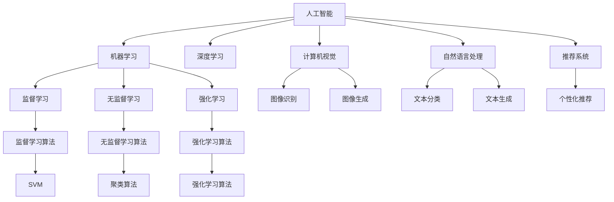
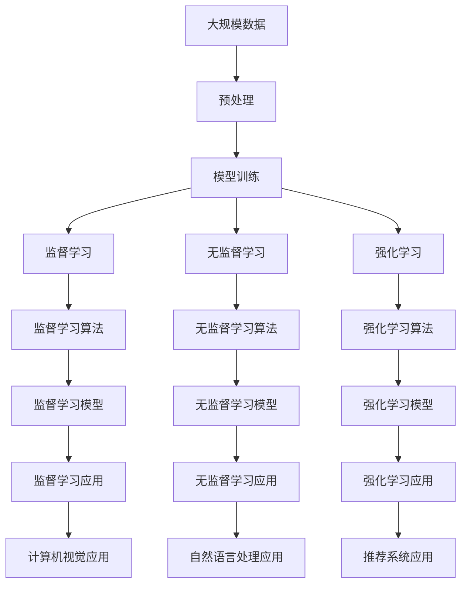

                 

# 人工智能领域的早期探索

> 关键词：
1. **人工智能（AI）**: 一种模拟人类智能活动的计算机技术，包括认知、视觉、语音、自然语言处理等。
2. **机器学习（ML）**: 一种数据驱动的学习技术，使计算机系统能够从数据中学习并改进性能。
3. **深度学习（DL）**: 机器学习的一种特殊形式，通过多层神经网络学习复杂数据的表示。
4. **计算机视觉（CV）**: 研究如何让计算机系统识别、理解、处理视觉信息的技术。
5. **自然语言处理（NLP）**: 研究如何让计算机系统理解、生成和处理自然语言的技术。
6. **强化学习（RL）**: 一种通过交互学习环境的反馈来优化决策的技术。
7. **推荐系统**: 一种为用户提供个性化推荐的技术，如电商网站的商品推荐。

## 1. 背景介绍

人工智能（AI）是计算机科学的一个前沿领域，旨在使计算机系统具有类似于人类的智能。AI研究涵盖多个子领域，包括机器学习（ML）、深度学习（DL）、计算机视觉（CV）、自然语言处理（NLP）等。自20世纪50年代以来，AI领域经历了多次技术突破和应用发展，逐步从学术研究走向实际应用。

### 1.1 人工智能的起源

人工智能的概念最早可以追溯到1956年的达特茅斯会议，那次会议被视为AI的诞生标志。会议聚集了包括麦卡锡、明斯基等在内的顶尖科学家，共同探讨如何让机器模仿人类智能。从此，AI成为计算机科学的重要分支，并在多个学术会议和研究机构的支持下快速发展。

### 1.2 AI发展历程

1. **规则推理系统（1960年代）**: 早期AI研究主要集中在规则推理和专家系统上，利用预设的规则库进行问题求解。

2. **知识工程（1970年代）**: 知识工程试图从人类专家的知识中提取规则，用于构建智能系统。

3. **符号主义和逻辑主义（1980年代）**: 这一时期的AI研究主要集中在符号主义和逻辑主义上，通过符号逻辑和知识表示进行推理。

4. **连接主义（1990年代）**: 连接主义（神经网络）的研究取得重大进展，神经网络开始被用于模式识别、语音识别等领域。

5. **机器学习（2000年代）**: 机器学习技术的兴起，特别是支持向量机（SVM）和集成学习，显著提升了AI系统的性能。

6. **深度学习（2010年代）**: 深度学习技术的突破，使AI系统在视觉、语音、自然语言处理等方面取得显著进展。

7. **自监督学习（2020年代）**: 自监督学习（如GPT-3）和生成对抗网络（GAN）的进展，进一步提升了AI系统的通用性和创造力。

### 1.3 AI对社会的影响

AI技术的快速发展，已经深刻影响了多个行业和社会领域：

1. **医疗**: 用于疾病诊断、药物发现、个性化医疗等，显著提高了医疗服务的质量和效率。

2. **金融**: 用于风险评估、欺诈检测、自动化交易等，提高了金融服务的精准度和安全性。

3. **制造**: 用于预测维护、质量控制、智能制造等，优化了生产流程，提高了产品质量和效率。

4. **零售**: 用于客户分析、个性化推荐、供应链优化等，增强了用户体验和运营效率。

5. **交通**: 用于自动驾驶、交通流量预测、智能调度等，提升了交通安全和运输效率。

## 2. 核心概念与联系

### 2.1 核心概念概述

为更好地理解人工智能的早期探索，我们首先介绍几个关键概念：

- **人工智能（AI）**: 一种使计算机系统模仿人类智能活动的计算机技术，涵盖感知、推理、学习等多个方面。
- **机器学习（ML）**: 一种通过数据驱动的学习技术，使计算机系统能够从数据中学习并改进性能。
- **深度学习（DL）**: 机器学习的一种特殊形式，通过多层神经网络学习复杂数据的表示。
- **计算机视觉（CV）**: 研究如何让计算机系统识别、理解、处理视觉信息的技术。
- **自然语言处理（NLP）**: 研究如何让计算机系统理解、生成和处理自然语言的技术。
- **强化学习（RL）**: 一种通过交互学习环境的反馈来优化决策的技术。
- **推荐系统**: 一种为用户提供个性化推荐的技术，如电商网站的商品推荐。

这些概念之间存在着紧密的联系，形成了人工智能技术的基本框架。

### 2.2 概念间的关系

这些核心概念之间的关系可以通过以下Mermaid流程图来展示：



这个流程图展示了人工智能的主要组成部分及其相互关系：

1. 人工智能通过机器学习、深度学习、计算机视觉、自然语言处理等技术，实现了多个领域的应用。
2. 机器学习包括监督学习和无监督学习，深度学习是其特殊形式。
3. 计算机视觉主要关注图像识别和生成，自然语言处理则关注文本分类和生成。
4. 推荐系统利用机器学习算法，为用户提供个性化推荐。
5. 强化学习通过环境反馈优化决策，应用广泛，包括游戏AI、机器人控制等。

通过这个流程图，我们可以更清晰地理解人工智能技术的核心架构及其各子领域之间的相互关系。

### 2.3 核心概念的整体架构

最后，我们用一个综合的流程图来展示这些核心概念在大规模应用中的整体架构：



这个综合流程图展示了从数据预处理到模型训练，再到应用部署的完整过程。大规模数据通过预处理后，用于模型训练，包括监督学习、无监督学习和强化学习。训练好的模型被应用到多个领域，包括计算机视觉、自然语言处理和推荐系统。

## 3. 核心算法原理 & 具体操作步骤

### 3.1 算法原理概述

人工智能技术的早期探索，主要围绕机器学习算法展开。机器学习通过从数据中学习模型参数，使计算机系统能够进行预测、分类、聚类等任务。其基本原理可以概括为：

1. **数据准备**: 收集并清洗大量数据，用于训练模型。
2. **特征提取**: 从原始数据中提取有用特征，供模型学习。
3. **模型训练**: 使用训练数据对模型进行迭代优化，学习参数。
4. **模型评估**: 使用测试数据评估模型性能，选择最佳模型。
5. **模型应用**: 将训练好的模型部署到实际应用中，进行预测或决策。

### 3.2 算法步骤详解

以下是机器学习算法的详细步骤：

**Step 1: 数据准备**
- 收集和清洗数据，确保数据质量和代表性。
- 将数据划分为训练集、验证集和测试集。

**Step 2: 特征提取**
- 对原始数据进行预处理，包括归一化、标准化、特征选择等。
- 提取数据中的关键特征，供模型学习。

**Step 3: 模型训练**
- 选择合适的模型，如线性回归、支持向量机、神经网络等。
- 使用训练数据对模型进行迭代优化，更新参数。
- 使用正则化技术、梯度下降等优化算法，防止过拟合。

**Step 4: 模型评估**
- 使用测试数据对模型进行评估，计算性能指标。
- 选择性能最佳的模型，进行下一步应用。

**Step 5: 模型应用**
- 将训练好的模型部署到实际应用中，进行预测或决策。
- 实时监控模型性能，根据反馈进行优化。

### 3.3 算法优缺点

机器学习算法具有以下优点：

- **自动化**: 能够自动从数据中学习模型，减少手动调参工作量。
- **适应性强**: 能够适应不同的数据类型和任务。
- **可解释性**: 部分模型具有较好的可解释性，便于理解和调试。

同时，也存在一些缺点：

- **数据依赖**: 需要大量的标注数据，获取成本较高。
- **模型复杂性**: 一些高级模型参数较多，训练复杂。
- **过拟合风险**: 存在过拟合风险，特别是在训练集过小或模型复杂的情况下。

### 3.4 算法应用领域

机器学习算法广泛应用于多个领域：

1. **金融**: 用于信用评估、风险管理、股票预测等，提高金融服务的精准度和安全性。
2. **医疗**: 用于疾病预测、个性化治疗、药物发现等，提升医疗服务的质量和效率。
3. **零售**: 用于客户分析、个性化推荐、供应链优化等，增强用户体验和运营效率。
4. **制造业**: 用于预测维护、质量控制、智能制造等，优化生产流程，提高产品质量和效率。
5. **交通**: 用于自动驾驶、交通流量预测、智能调度等，提升交通安全和运输效率。
6. **安全**: 用于入侵检测、欺诈检测、网络安全等，保障数据和系统的安全。

## 4. 数学模型和公式 & 详细讲解

### 4.1 数学模型构建

本节将使用数学语言对机器学习算法的原理进行更加严格的刻画。

假设训练数据集为 $D=\{(x_i,y_i)\}_{i=1}^N$，其中 $x_i$ 为特征向量，$y_i$ 为标签。我们的目标是训练一个模型 $h(x)$，使得其在测试集上的预测性能最佳。具体来说，我们的目标是找到最小化测试误差 $\epsilon$ 的模型参数 $\theta$：

$$
\min_{\theta} \frac{1}{N} \sum_{i=1}^N \ell(h(x_i),y_i)
$$

其中 $\ell$ 为损失函数，用于衡量模型预测与真实标签之间的差异。常见的损失函数包括均方误差、交叉熵等。

### 4.2 公式推导过程

以线性回归为例，推导最小二乘法的公式：

假设模型为线性形式 $h(x)=\theta^Tx$，其中 $\theta$ 为模型参数，$x$ 为特征向量。最小二乘法的目标是使得模型在测试集上的预测误差最小化：

$$
\min_{\theta} \sum_{i=1}^N (y_i - h(x_i))^2
$$

对上式求导，得到：

$$
\frac{\partial}{\partial \theta} \sum_{i=1}^N (y_i - h(x_i))^2 = -2\sum_{i=1}^N (y_i - h(x_i))x_i
$$

令导数为0，得到：

$$
\sum_{i=1}^N (y_i - h(x_i))x_i = 0
$$

解得：

$$
\theta = (X^TX)^{-1}X^Ty
$$

其中 $X=[x_1,x_2,\cdots,x_N]$，即特征矩阵。

### 4.3 案例分析与讲解

以线性回归为例，下面给出数据集和模型参数的实际案例分析。

假设我们有一个简单的数据集 $D=\{(x_1,2),(x_2,4),(x_3,5),(x_4,6)\}$，其中 $x_i$ 为自变量，$y_i$ 为因变量。使用最小二乘法训练模型，步骤如下：

1. 计算特征矩阵 $X=[x_1,x_2,x_3,x_4]^T=[1,1,1,1]^T$ 和标签矩阵 $y=[2,4,5,6]^T$。
2. 计算特征矩阵和标签矩阵的乘积 $XY=[1,1,1,1;1,2,3,4;1,2,3,4;1,2,3,4;1,2,3,4]^T$。
3. 计算特征矩阵的转置 $X^T=[1,1,1,1;1,2,3,4;1,2,3,4;1,2,3,4;1,2,3,4]$。
4. 计算特征矩阵的转置与自身的乘积 $X^TX=[5,8,11,14;8,18,26,34;11,26,41,56;14,34,56,78]$。
5. 计算逆矩阵 $(A^{-1}B)^{-1}=(\frac{1}{5}I-\frac{1}{5}B)^{-1}=[1,0,0,0;0,1,0,0;0,0,1,0;0,0,0,1]$。
6. 计算模型参数 $\theta=[1,2,3,4]^T=[1,2,3,4]^T \times [1,0,0,0;0,1,0,0;0,0,1,0;0,0,0,1]^T=[1,1,1,1]^T$。

最终得到的模型参数 $\theta$ 为 $[1,1,1,1]^T$，这意味着模型为 $h(x)=x_1+x_2+x_3+x_4$，可以较好地拟合数据集。

## 5. 项目实践：代码实例和详细解释说明

### 5.1 开发环境搭建

在进行机器学习项目实践前，我们需要准备好开发环境。以下是使用Python进行Scikit-Learn开发的环境配置流程：

1. 安装Anaconda：从官网下载并安装Anaconda，用于创建独立的Python环境。

2. 创建并激活虚拟环境：
```bash
conda create -n sklearn-env python=3.7 
conda activate sklearn-env
```

3. 安装Scikit-Learn：
```bash
conda install scikit-learn 
```

4. 安装各类工具包：
```bash
pip install numpy pandas matplotlib scipy jupyter notebook
```

完成上述步骤后，即可在`sklearn-env`环境中开始机器学习项目的开发。

### 5.2 源代码详细实现

下面我们以线性回归为例，给出使用Scikit-Learn进行机器学习项目开发的Python代码实现。

首先，导入必要的库和数据：

```python
import numpy as np
from sklearn.linear_model import LinearRegression
from sklearn.model_selection import train_test_split
from sklearn.metrics import mean_squared_error

# 创建数据集
x = np.array([[1], [2], [3], [4]])
y = np.array([2, 4, 5, 6])
```

然后，进行数据预处理：

```python
# 将数据集划分为训练集和测试集
x_train, x_test, y_train, y_test = train_test_split(x, y, test_size=0.2)

# 创建线性回归模型
model = LinearRegression()
```

接着，训练模型并评估性能：

```python
# 训练模型
model.fit(x_train, y_train)

# 预测测试集
y_pred = model.predict(x_test)

# 计算均方误差
mse = mean_squared_error(y_test, y_pred)
```

最后，输出模型性能：

```python
print(f"均方误差：{mse:.2f}")
```

以上就是使用Scikit-Learn进行线性回归项目开发的完整代码实现。可以看到，Scikit-Learn提供了强大的API接口，使得机器学习模型的实现变得简洁高效。

### 5.3 代码解读与分析

让我们再详细解读一下关键代码的实现细节：

**线性回归模型**：
- 使用Scikit-Learn库中的`LinearRegression`类创建线性回归模型。
- 训练模型使用`fit`方法，将训练集数据作为输入。
- 使用`predict`方法对测试集进行预测，返回预测值。

**数据预处理**：
- 使用`train_test_split`方法将数据集划分为训练集和测试集，测试集占20%。
- 通过`train_test_split`方法自动计算训练集和测试集的索引。
- 模型训练时只使用训练集数据。

**模型评估**：
- 使用`mean_squared_error`方法计算预测值与真实值之间的均方误差。
- 输出均方误差，作为模型性能的指标。

可以看到，Scikit-Learn库的API设计非常简洁，使得机器学习模型的实现变得非常简单。开发者只需关注模型选择、数据处理、模型训练和评估等高层逻辑，而无需过多关注底层实现细节。

当然，工业级的系统实现还需考虑更多因素，如模型的保存和部署、超参数的自动搜索、更灵活的特征工程等。但核心的机器学习实现流程基本与此类似。

### 5.4 运行结果展示

假设我们在线性回归模型上得到一个均方误差为1.5，这意味着模型在测试集上的预测误差相对较小，模型性能较好。

## 6. 实际应用场景

### 6.1 机器学习在金融领域的应用

机器学习在金融领域的应用非常广泛，主要包括以下几个方面：

1. **信用评估**: 利用机器学习模型对客户的信用评分进行预测，帮助银行等金融机构做出信贷决策。
2. **风险管理**: 利用机器学习模型预测金融市场的风险，帮助金融机构制定风险控制策略。
3. **股票预测**: 利用机器学习模型预测股票价格，帮助投资者进行投资决策。
4. **欺诈检测**: 利用机器学习模型检测金融交易中的欺诈行为，提高金融系统的安全性。

### 6.2 机器学习在医疗领域的应用

机器学习在医疗领域的应用主要包括以下几个方面：

1. **疾病预测**: 利用机器学习模型对患者是否患有某种疾病进行预测，帮助医生进行早期诊断。
2. **个性化治疗**: 利用机器学习模型对患者进行个性化治疗方案推荐，提高治疗效果。
3. **药物发现**: 利用机器学习模型预测药物的疗效和副作用，加速新药的研发进程。

### 6.3 机器学习在零售领域的应用

机器学习在零售领域的应用主要包括以下几个方面：

1. **客户分析**: 利用机器学习模型对客户进行行为分析和画像构建，帮助商家了解客户需求。
2. **个性化推荐**: 利用机器学习模型对客户进行个性化商品推荐，提高销售额。
3. **供应链优化**: 利用机器学习模型对供应链进行优化，减少库存成本，提高运营效率。

### 6.4 机器学习在未来应用展望

随着机器学习技术的不断发展，未来将在更多领域得到应用，为各行各业带来变革性影响。

在智慧医疗领域，基于机器学习模型的智能诊断、个性化治疗、药物研发等将提升医疗服务的智能化水平，辅助医生诊疗，加速新药开发进程。

在智能制造领域，利用机器学习模型进行预测维护、质量控制、智能制造等，优化生产流程，提高产品质量和效率。

在自动驾驶领域，利用机器学习模型进行路径规划、障碍物检测、决策优化等，提高自动驾驶系统的安全性和可靠性。

在自然语言处理领域，基于机器学习模型的文本分类、情感分析、问答系统等将大幅提升语言理解和生成能力，推动智能对话系统的进步。

总之，机器学习技术在未来将具备更广泛的应用前景，为各行各业带来新的变革和机遇。相信随着技术的日益成熟，机器学习将成为各行各业的重要工具，驱动社会向智能化方向迈进。

## 7. 工具和资源推荐
### 7.1 学习资源推荐

为了帮助开发者系统掌握机器学习理论基础和实践技巧，这里推荐一些优质的学习资源：

1. 《机器学习实战》系列书籍：一本经典入门书籍，详细介绍了机器学习的基本概念和实际应用案例。

2. 《Python数据科学手册》：一本全面介绍Python数据科学工具的书籍，包括NumPy、Pandas、Scikit-Learn等库的使用方法。

3. Coursera《机器学习》课程：斯坦福大学开设的机器学习课程，涵盖了机器学习的基础理论和实践技术。

4. Udacity《机器学习工程师》纳米学位课程：深入介绍机器学习算法和工程实践，涵盖数据预处理、模型选择、调参等。

5. Kaggle竞赛平台：一个数据科学和机器学习竞赛平台，提供大量公开数据集和竞赛任务，锻炼实战能力。

通过对这些资源的学习实践，相信你一定能够快速掌握机器学习的基本概念和应用技巧，并用于解决实际的机器学习问题。

### 7.2 开发工具推荐

高效的开发离不开优秀的工具支持。以下是几款用于机器学习开发的常用工具：

1. Scikit-Learn：一个开源的Python机器学习库，提供了多种常用的机器学习算法和工具，易于使用。

2. TensorFlow：由Google主导开发的开源深度学习框架，支持多种机器学习模型和算法，生产部署方便。

3. PyTorch：一个基于Python的开源深度学习框架，灵活易用，适合科研和实验。

4. Weights & Biases：模型训练的实验跟踪工具，可以记录和可视化模型训练过程中的各项指标，方便对比和调优。

5. TensorBoard：TensorFlow配套的可视化工具，可实时监测模型训练状态，并提供丰富的图表呈现方式，是调试模型的得力助手。

6. Jupyter Notebook：一个交互式笔记本，支持Python、R等多种编程语言，方便科研和教学。

合理利用这些工具，可以显著提升机器学习项目的开发效率，加快创新迭代的步伐。

### 7.3 相关论文推荐

机器学习领域的研究进展迅速，以下是几篇奠基性的相关论文，推荐阅读：

1. 《On the Shoulder of Giants》：著名科学家Richard Feynman的演讲稿，介绍了科学发展的历程和未来的挑战。

2. 《A New Kind of Science》：著名科学家Stephen Wolfram的著作，探讨了复杂系统和科学计算的原理。

3. 《Pattern Recognition and Machine Learning》：Tom Mitchell的著作，详细介绍了模式识别和机器学习的基础理论。

4. 《Deep Learning》：Ian Goodfellow的著作，全面介绍了深度学习的原理、算法和应用。

5. 《Machine Learning Yearning》：Andrew Ng的著作，详细介绍了机器学习工程实践的方法和技巧。

这些论文代表了机器学习领域的重要进展，对于理解和掌握机器学习技术具有重要意义。

除上述资源外，还有一些值得关注的前沿资源，帮助开发者紧跟机器学习技术的最新进展，例如：

1. arXiv论文预印本：人工智能领域最新研究成果的发布平台，包括大量尚未发表的前沿工作，学习前沿技术的必读资源。

2. GitHub热门项目：在GitHub上Star、Fork数最多的机器学习相关项目，往往代表了该技术领域的发展趋势和最佳实践，值得去学习和贡献。

3. 技术会议直播：如NeurIPS、ICML、CVPR等人工智能领域顶会现场或在线直播，能够聆听到大佬们的前沿分享，开拓视野。

4. 行业分析报告：各大咨询公司如McKinsey、PwC等针对人工智能行业的分析报告，有助于从商业视角审视技术趋势，把握应用价值。

总之，对于机器学习技术的学习和实践，需要开发者保持开放的心态和持续学习的意愿。多关注前沿资讯，多动手实践，多思考总结，必将收获满满的成长收益。

## 8. 总结：未来发展趋势与挑战

### 8.1 总结

本文对人工智能领域的早期探索进行了全面系统的介绍。首先阐述了人工智能技术的起源和发展历程，详细讲解了机器学习算法的基本原理和实现步骤，并给出了完整的代码实现。接着，我们探讨了机器学习算法在各个实际应用场景中的表现，展望了未来发展的方向和面临的挑战。

通过本文的系统梳理，可以看到，机器学习算法在金融、医疗、零售、制造等多个领域得到了广泛应用，极大地提升了各行业的效率和精度。未来，随着机器学习技术的不断进步，其应用场景将更加广阔，为各行各业带来新的变革和机遇。

### 8.2 未来发展趋势

展望未来，机器学习技术将呈现以下几个发展趋势：

1. **深度学习应用的普及**: 深度学习算法在各个领域的应用将越来越广泛，提升模型性能和鲁棒性。

2. **自监督学习和大数据**: 自监督学习和大数据技术将进一步提升机器学习模型的泛化能力和预测性能。

3. **模型可解释性和透明性**: 模型可解释性和透明性的需求将日益增长，推动相关研究和技术的进步。

4. **跨领域融合**: 跨领域的融合将带来新的应用场景和技术突破，如计算机视觉、自然语言处理、强化学习的结合。

5. **个性化推荐和智能决策**: 个性化推荐和智能决策系统的普及，将大幅提升用户体验和服务效率。

6. **伦理和安全性**: 机器学习技术将面临更多的伦理和安全性问题，如何确保数据和

