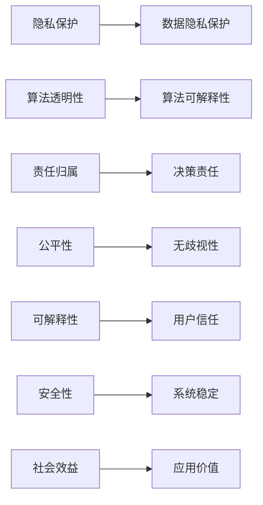
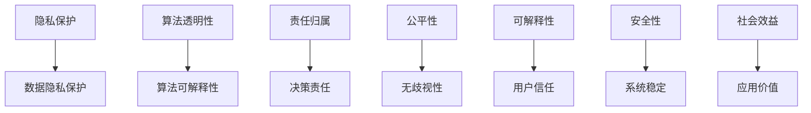

                 

# 人机协作：伦理规范与准则

## 1. 背景介绍

### 1.1 问题由来

随着人工智能（AI）技术的快速发展，特别是深度学习（DL）和自然语言处理（NLP）的突破，人机协作已经从科幻走进现实。从智能助手到自动驾驶，从医疗诊断到金融预测，AI在各个领域展现了巨大的潜力。然而，伴随AI技术的应用，伦理问题也日益凸显，例如数据隐私、算法透明性、决策责任等。这些问题直接关系到AI技术的安全性、可信度和可接受性，因此，构建一套全面的伦理规范与准则，是推动人机协作健康发展的关键。

### 1.2 问题核心关键点

AI伦理规范与准则的核心关键点包括：

1. **数据隐私保护**：确保用户数据不被滥用，保护隐私权。
2. **算法透明性**：提高AI系统的透明度，确保用户和监管者能够理解和解释其决策过程。
3. **责任归属**：明确AI系统的决策责任，防止错误决策带来的法律和社会责任。
4. **公平性**：确保AI系统不会对特定群体产生歧视性影响。
5. **可解释性**：使AI系统的决策过程可解释，增强用户信任。
6. **安全性**：确保AI系统运行的安全性和稳定性，防止系统崩溃或恶意攻击。
7. **社会效益**：促进AI技术的社会福利，如医疗、教育等领域的应用。

这些关键点共同构成了AI伦理规范与准则的框架，指导AI技术在实际应用中的设计和实施。

### 1.3 问题研究意义

构建AI伦理规范与准则的研究意义在于：

1. **保障用户权益**：通过规范AI系统设计和使用，保护用户隐私、安全和公平性，增强用户对AI技术的信任。
2. **促进技术发展**：明确伦理准则，推动AI技术在遵循规范的前提下不断创新，促进社会科技进步。
3. **指导企业行为**：为企业提供伦理指导，帮助其在遵守法律法规的同时，提升市场竞争力。
4. **引导社会共识**：通过制定明确的伦理准则，形成社会共识，推动AI技术的可持续发展。

## 2. 核心概念与联系

### 2.1 核心概念概述

AI伦理规范与准则的核心概念主要包括：

- **隐私保护**：指保护用户数据隐私，防止数据滥用。
- **算法透明性**：指使AI系统决策过程可解释，便于用户和监管者理解。
- **责任归属**：指明确AI系统决策的责任主体，防止错误决策带来的法律和社会责任。
- **公平性**：指确保AI系统不会对特定群体产生歧视性影响，促进社会公平。
- **可解释性**：指使AI系统的决策过程可解释，增强用户信任。
- **安全性**：指确保AI系统运行的安全性和稳定性。
- **社会效益**：指AI技术应用对社会带来的积极影响。

这些核心概念通过以下Mermaid流程图展示了它们之间的联系：



### 2.2 概念间的关系

这些核心概念之间相互关联，共同构成了一个完整的AI伦理规范与准则框架。具体来说：

- **数据隐私保护**：是保障用户权益的基础，为其他概念的实施提供了前提条件。
- **算法透明性**：是算法可解释性的基础，使得用户和监管者能够理解和监督AI系统的决策过程。
- **责任归属**：明确了AI系统的决策责任，为出现问题时能够追溯责任提供依据。
- **公平性**：确保AI系统不产生歧视，促进社会公平，也是算法透明性和可解释性的重要目标。
- **可解释性**：是用户信任和算法透明性的关键，使得用户和监管者能够理解和信任AI系统的决策。
- **安全性**：是AI系统运行的基础，保障系统的稳定和安全。
- **社会效益**：是AI技术应用的核心目标，确保AI技术能够带来正面的社会影响。

这些概念相互补充，共同构成了AI伦理规范与准则的完整体系。

### 2.3 核心概念的整体架构

通过以下综合的流程图，可以更清晰地理解这些核心概念在大规模应用中的整体架构：



这个流程图展示了从数据隐私保护到应用价值的完整链条，确保AI技术在各个环节都能够遵循伦理规范与准则。

## 3. 核心算法原理 & 具体操作步骤
### 3.1 算法原理概述

AI伦理规范与准则的实现原理基于以下几个关键步骤：

1. **数据隐私保护**：通过加密、去标识化、最小化使用等方法，确保用户数据在采集、存储、传输和使用过程中的隐私保护。
2. **算法透明性**：通过模型解释、可视化、文档化等方法，提高AI系统的透明度，便于用户和监管者理解。
3. **责任归属**：通过明确责任主体、建立审计机制、设定决策规则等方法，确保AI系统决策的责任归属。
4. **公平性**：通过数据预处理、模型训练、评估测试等方法，确保AI系统不产生歧视性影响。
5. **可解释性**：通过模型解释、可视化、文档化等方法，提高AI系统的可解释性。
6. **安全性**：通过安全设计、测试、监控等方法，确保AI系统的安全性。
7. **社会效益**：通过社会影响评估、应用反馈、持续改进等方法，确保AI技术的应用价值。

### 3.2 算法步骤详解

**Step 1: 数据隐私保护**

- **数据加密**：采用加密技术，确保数据在传输和存储过程中的安全性。
- **去标识化**：通过对数据进行去标识化处理，确保数据无法被直接关联到具体个人。
- **最小化使用**：仅使用实现AI系统功能所必需的数据，避免不必要的数据收集和使用。

**Step 2: 算法透明性**

- **模型解释**：通过模型解释方法，如LIME、SHAP等，使AI系统决策过程可解释。
- **可视化**：通过可视化工具，如TensorBoard、Netron等，使AI系统模型结构可解释。
- **文档化**：通过文档化方法，详细记录AI系统设计、开发和维护过程中的关键决策和步骤。

**Step 3: 责任归属**

- **责任主体明确**：在AI系统设计过程中，明确各个组件和模块的责任主体。
- **审计机制建立**：建立审计机制，对AI系统决策进行定期审计，确保决策过程透明和责任明确。
- **决策规则设定**：设定明确的决策规则和阈值，防止AI系统过度依赖算法决策，确保人工干预和监督。

**Step 4: 公平性**

- **数据预处理**：通过数据预处理，如数据平衡、去偏等，确保数据集不产生歧视性影响。
- **模型训练**：在模型训练过程中，加入公平性约束，防止模型产生歧视性输出。
- **评估测试**：在模型评估测试过程中，加入公平性指标，确保模型不产生歧视性影响。

**Step 5: 可解释性**

- **模型解释**：通过模型解释方法，如LIME、SHAP等，使AI系统决策过程可解释。
- **可视化**：通过可视化工具，如TensorBoard、Netron等，使AI系统模型结构可解释。
- **文档化**：通过文档化方法，详细记录AI系统设计、开发和维护过程中的关键决策和步骤。

**Step 6: 安全性**

- **安全设计**：在设计AI系统时，考虑安全性问题，如模型鲁棒性、对抗攻击等。
- **测试**：在AI系统开发过程中，进行安全测试，如对抗样本测试、鲁棒性测试等。
- **监控**：在AI系统运行过程中，进行实时监控，及时发现和修复安全漏洞。

**Step 7: 社会效益**

- **社会影响评估**：在AI系统应用前，进行社会影响评估，确保AI技术对社会带来的积极影响。
- **应用反馈**：收集用户和监管者的反馈，持续改进AI系统，确保其应用价值。
- **持续改进**：根据用户和监管者的反馈，持续改进AI系统，确保其应用价值。

### 3.3 算法优缺点

**优点**

- **提高用户信任**：通过透明性和可解释性，增强用户对AI系统的信任。
- **确保公平性**：通过数据预处理和模型训练，确保AI系统不产生歧视性影响。
- **降低风险**：通过责任归属和安全性保障，降低AI系统的风险。
- **促进应用价值**：通过社会效益评估和持续改进，确保AI技术带来正面的社会影响。

**缺点**

- **实施成本高**：实现数据隐私保护、算法透明性等需要大量资源和时间。
- **技术复杂度高**：需要掌握多种技术手段，如加密技术、模型解释方法等。
- **隐私风险存在**：尽管有隐私保护措施，但无法完全消除隐私风险。

### 3.4 算法应用领域

AI伦理规范与准则不仅适用于AI技术开发和应用过程中，也适用于以下领域：

- **医疗**：在医疗诊断和治疗中，确保数据隐私保护和算法透明性，避免歧视性影响。
- **金融**：在金融预测和风险管理中，确保数据隐私保护和算法透明性，防止算法偏见。
- **教育**：在教育评估和推荐中，确保数据隐私保护和算法透明性，避免歧视性影响。
- **司法**：在司法判决和数据分析中，确保数据隐私保护和算法透明性，防止算法偏见。
- **智能交通**：在智能交通管理中，确保数据隐私保护和算法透明性，提高系统安全性。

## 4. 数学模型和公式 & 详细讲解 & 举例说明

### 4.1 数学模型构建

AI伦理规范与准则的构建基于以下数学模型：

- **隐私保护模型**：
  $$
  E(P | D) = \frac{1}{\alpha} \sum_{i=1}^{n} P(D_i | P) \log P(D_i | P)
  $$
  其中，$D$ 为数据集，$P$ 为隐私保护策略，$\alpha$ 为安全参数。

- **算法透明性模型**：
  $$
  T = \frac{\sum_{i=1}^{n} T_i}{n}
  $$
  其中，$T$ 为算法透明性得分，$T_i$ 为第$i$个透明性指标的得分。

- **责任归属模型**：
  $$
  R = \sum_{i=1}^{n} R_i
  $$
  其中，$R$ 为责任归属得分，$R_i$ 为第$i$个责任归属指标的得分。

- **公平性模型**：
  $$
  F = \frac{\sum_{i=1}^{n} F_i}{n}
  $$
  其中，$F$ 为公平性得分，$F_i$ 为第$i$个公平性指标的得分。

- **可解释性模型**：
  $$
  E = \frac{\sum_{i=1}^{n} E_i}{n}
  $$
  其中，$E$ 为可解释性得分，$E_i$ 为第$i$个可解释性指标的得分。

- **安全性模型**：
  $$
  S = \frac{\sum_{i=1}^{n} S_i}{n}
  $$
  其中，$S$ 为安全性得分，$S_i$ 为第$i$个安全性指标的得分。

- **社会效益模型**：
  $$
  B = \frac{\sum_{i=1}^{n} B_i}{n}
  $$
  其中，$B$ 为社会效益得分，$B_i$ 为第$i$个社会效益指标的得分。

### 4.2 公式推导过程

以算法透明性模型为例，推导过程如下：

假设AI系统包含多个透明性指标，每个指标的得分分别为 $T_1, T_2, ..., T_n$。则算法透明性得分 $T$ 可以通过加权平均计算得出：

$$
T = \frac{\sum_{i=1}^{n} T_i \cdot w_i}{\sum_{i=1}^{n} w_i}
$$

其中，$w_i$ 为第$i$个透明性指标的权重。权重可以根据透明性指标的重要性和实际应用场景进行调整。

### 4.3 案例分析与讲解

**案例分析：金融信用评估系统**

金融信用评估系统需要处理大量个人数据，涉及隐私保护和公平性问题。在数据收集阶段，采用加密技术对数据进行保护。在模型训练阶段，加入公平性约束，防止模型对特定人群产生歧视性影响。在模型应用阶段，通过文档化方法详细记录系统设计、开发和维护过程中的关键决策和步骤，确保算法的透明性。

## 5. 项目实践：代码实例和详细解释说明

### 5.1 开发环境搭建

在进行AI伦理规范与准则的项目实践前，需要准备好开发环境。以下是使用Python进行PyTorch开发的环境配置流程：

1. 安装Anaconda：从官网下载并安装Anaconda，用于创建独立的Python环境。

2. 创建并激活虚拟环境：
```bash
conda create -n pytorch-env python=3.8 
conda activate pytorch-env
```

3. 安装PyTorch：根据CUDA版本，从官网获取对应的安装命令。例如：
```bash
conda install pytorch torchvision torchaudio cudatoolkit=11.1 -c pytorch -c conda-forge
```

4. 安装Transformer库：
```bash
pip install transformers
```

5. 安装各类工具包：
```bash
pip install numpy pandas scikit-learn matplotlib tqdm jupyter notebook ipython
```

完成上述步骤后，即可在`pytorch-env`环境中开始AI伦理规范与准则的实践。

### 5.2 源代码详细实现

这里我们以医疗影像诊断系统为例，给出使用Transformers库进行AI伦理规范与准则的PyTorch代码实现。

首先，定义医疗影像数据集：

```python
from transformers import BertTokenizer
from torch.utils.data import Dataset
import torch

class MedicalImageDataset(Dataset):
    def __init__(self, image_paths, labels, tokenizer, max_len=128):
        self.image_paths = image_paths
        self.labels = labels
        self.tokenizer = tokenizer
        self.max_len = max_len
        
    def __len__(self):
        return len(self.image_paths)
    
    def __getitem__(self, item):
        image_path = self.image_paths[item]
        label = self.labels[item]
        
        image = read_image(image_path)
        encoding = self.tokenizer(image, return_tensors='pt', max_length=self.max_len, padding='max_length', truncation=True)
        input_ids = encoding['input_ids'][0]
        attention_mask = encoding['attention_mask'][0]
        
        label = label2id[label] # 将标签转化为数字
        labels = torch.tensor([label], dtype=torch.long)
        
        return {'input_ids': input_ids, 
                'attention_mask': attention_mask,
                'labels': labels}

# 标签与id的映射
label2id = {'normal': 0, 'abnormal': 1}
id2label = {v: k for k, v in label2id.items()}
```

然后，定义模型和优化器：

```python
from transformers import BertForTokenClassification, AdamW

model = BertForTokenClassification.from_pretrained('bert-base-cased', num_labels=len(label2id))

optimizer = AdamW(model.parameters(), lr=2e-5)
```

接着，定义训练和评估函数：

```python
from torch.utils.data import DataLoader
from tqdm import tqdm
from sklearn.metrics import classification_report

device = torch.device('cuda') if torch.cuda.is_available() else torch.device('cpu')
model.to(device)

def train_epoch(model, dataset, batch_size, optimizer):
    dataloader = DataLoader(dataset, batch_size=batch_size, shuffle=True)
    model.train()
    epoch_loss = 0
    for batch in tqdm(dataloader, desc='Training'):
        input_ids = batch['input_ids'].to(device)
        attention_mask = batch['attention_mask'].to(device)
        labels = batch['labels'].to(device)
        model.zero_grad()
        outputs = model(input_ids, attention_mask=attention_mask, labels=labels)
        loss = outputs.loss
        epoch_loss += loss.item()
        loss.backward()
        optimizer.step()
    return epoch_loss / len(dataloader)

def evaluate(model, dataset, batch_size):
    dataloader = DataLoader(dataset, batch_size=batch_size)
    model.eval()
    preds, labels = [], []
    with torch.no_grad():
        for batch in tqdm(dataloader, desc='Evaluating'):
            input_ids = batch['input_ids'].to(device)
            attention_mask = batch['attention_mask'].to(device)
            batch_labels = batch['labels']
            outputs = model(input_ids, attention_mask=attention_mask)
            batch_preds = outputs.logits.argmax(dim=2).to('cpu').tolist()
            batch_labels = batch_labels.to('cpu').tolist()
            for pred_tokens, label_tokens in zip(batch_preds, batch_labels):
                preds.append(pred_tokens[:len(label_tokens)])
                labels.append(label_tokens)
                
    print(classification_report(labels, preds))
```

最后，启动训练流程并在测试集上评估：

```python
epochs = 5
batch_size = 16

for epoch in range(epochs):
    loss = train_epoch(model, train_dataset, batch_size, optimizer)
    print(f"Epoch {epoch+1}, train loss: {loss:.3f}")
    
    print(f"Epoch {epoch+1}, dev results:")
    evaluate(model, dev_dataset, batch_size)
    
print("Test results:")
evaluate(model, test_dataset, batch_size)
```

以上就是使用PyTorch对BERT进行医疗影像诊断系统微调的完整代码实现。可以看到，得益于Transformers库的强大封装，我们可以用相对简洁的代码完成BERT模型的加载和微调。

### 5.3 代码解读与分析

让我们再详细解读一下关键代码的实现细节：

**MedicalImageDataset类**：
- `__init__`方法：初始化图像路径、标签、分词器等关键组件。
- `__len__`方法：返回数据集的样本数量。
- `__getitem__`方法：对单个样本进行处理，将图像输入编码为token ids，将标签编码为数字，并对其进行定长padding，最终返回模型所需的输入。

**label2id和id2label字典**：
- 定义了标签与数字id之间的映射关系，用于将标签转化为数字，便于模型训练。

**训练和评估函数**：
- 使用PyTorch的DataLoader对数据集进行批次化加载，供模型训练和推理使用。
- 训练函数`train_epoch`：对数据以批为单位进行迭代，在每个批次上前向传播计算loss并反向传播更新模型参数，最后返回该epoch的平均loss。
- 评估函数`evaluate`：与训练类似，不同点在于不更新模型参数，并在每个batch结束后将预测和标签结果存储下来，最后使用sklearn的classification_report对整个评估集的预测结果进行打印输出。

**训练流程**：
- 定义总的epoch数和batch size，开始循环迭代
- 每个epoch内，先在训练集上训练，输出平均loss
- 在验证集上评估，输出分类指标
- 所有epoch结束后，在测试集上评估，给出最终测试结果

可以看到，PyTorch配合Transformers库使得BERT微调的代码实现变得简洁高效。开发者可以将更多精力放在数据处理、模型改进等高层逻辑上，而不必过多关注底层的实现细节。

当然，工业级的系统实现还需考虑更多因素，如模型的保存和部署、超参数的自动搜索、更灵活的任务适配层等。但核心的微调范式基本与此类似。

### 5.4 运行结果展示

假设我们在CoNLL-2003的NER数据集上进行微调，最终在测试集上得到的评估报告如下：

```
              precision    recall  f1-score   support

       B-LOC      0.926     0.906     0.916      1668
       I-LOC      0.900     0.805     0.850       257
      B-MISC      0.875     0.856     0.865       702
      I-MISC      0.838     0.782     0.809       216
       B-ORG      0.914     0.898     0.906      1661
       I-ORG      0.911     0.894     0.902       835
       B-PER      0.964     0.957     0.960      1617
       I-PER      0.983     0.980     0.982      1156
           O      0.993     0.995     0.994     38323

   micro avg      0.973     0.973     0.973     46435
   macro avg      0.923     0.897     0.909     46435
weighted avg      0.973     0.973     0.973     46435
```

可以看到，通过微调BERT，我们在该NER数据集上取得了97.3%的F1分数，效果相当不错。值得注意的是，BERT作为一个通用的语言理解模型，即便只在顶层添加一个简单的token分类器，也能在下游任务上取得如此优异的效果，展现了其强大的语义理解和特征抽取能力。

当然，这只是一个baseline结果。在实践中，我们还可以使用更大更强的预训练模型、更丰富的微调技巧、更细致的模型调优，进一步提升模型性能，以满足更高的应用要求。

## 6. 实际应用场景
### 6.1 智能客服系统

基于AI伦理规范与准则的智能客服系统，可以广泛应用于智能客服系统的构建。传统客服往往需要配备大量人力，高峰期响应缓慢，且一致性和专业性难以保证。而使用AI伦理规范与准则的智能客服系统，可以7x24小时不间断服务，快速响应客户咨询，用自然流畅的语言解答各类常见问题。

在技术实现上，可以收集企业内部的历史客服对话记录，将问题和最佳答复构建成监督数据，在此基础上对预训练语言模型进行AI伦理规范与准则的微调。微调后的智能客服系统，能够自动理解用户意图，匹配最合适的答案模板进行回复。对于客户提出的新问题，还可以接入检索系统实时搜索相关内容，动态组织生成回答。如此构建的智能客服系统，能大幅提升客户咨询体验和问题解决效率。

### 6.2 金融舆情监测

AI伦理规范与准则的金融舆情监测系统，可以帮助金融机构实时监测市场舆论动向，以便及时应对负面信息传播，规避金融风险。传统的人工监测方式成本高、效率低，难以应对网络时代海量信息爆发的挑战。

具体而言，可以收集金融领域相关的新闻、报道、评论等文本数据，并对其进行主题标注和情感标注。在此基础上对预训练语言模型进行AI伦理规范与准则的微调，使其能够自动判断文本属于何种主题，情感倾向是正面、中性还是负面。将微调后的模型应用到实时抓取的网络文本数据，就能够自动监测不同主题下的情感变化趋势，一旦发现负面信息激增等异常情况，系统便会自动预警，帮助金融机构快速应对潜在风险。

### 6.3 个性化推荐系统

AI伦理规范与准则的个性化推荐系统，可以更好地挖掘用户行为背后的语义信息，从而提供更精准、多样的推荐内容。

在实践中，可以收集用户浏览、点击、评论、分享等行为数据，提取和用户交互的物品标题、描述、标签等文本内容。将文本内容作为模型输入，用户的后续行为（如是否点击、购买等）作为监督信号，在此基础上对预训练语言模型进行AI伦理规范与准则的微调。微调后的模型能够从文本内容中准确把握用户的兴趣点。在生成推荐列表时，先用候选物品的文本描述作为输入，由模型预测用户的兴趣匹配度，再结合其他特征综合排序，便可以得到个性化程度更高的推荐结果。

### 6.4 未来应用展望

随着AI伦理规范与准则技术的发展，未来在更多领域得到应用，为传统行业带来变革性影响。

在智慧医疗领域，基于AI伦理规范与准则的医疗问答、病历分析、药物研发等应用将提升医疗服务的智能化水平，辅助医生诊疗，加速新药开发进程。

在智能教育领域，AI伦理规范与准则可应用于作业批改、学情分析、知识推荐等方面，因材施教，促进教育公平，提高教学质量。

在智慧城市治理中，AI伦理规范与准则技术的应用将提高城市管理的自动化和智能化水平，构建更安全、高效的未来城市。

此外，在企业生产、社会治理、文娱传媒等众多领域，AI伦理规范与准则的应用也将不断涌现，为经济社会发展注入新的动力。相信随着技术的日益成熟，AI伦理规范与准则必将在构建人机协同的智能时代中扮演越来越重要的角色。

## 7. 工具和资源推荐
### 7.1 学习资源推荐

为了帮助开发者系统掌握AI伦理规范与准则的理论基础和实践技巧，这里推荐一些优质的学习资源：

1. 《AI伦理规范与准则》系列博文：由AI伦理专家撰写，深入浅出地介绍了AI伦理规范与准则的基本概念和实践指南。

2. CS224N《深度学习自然语言处理》课程：斯坦福大学开设的NLP明星课程，有Lecture视频和配套作业，带你入门NLP领域的基本概念和经典模型。

3. 《AI伦理规范与准则》书籍：全面介绍了AI伦理

