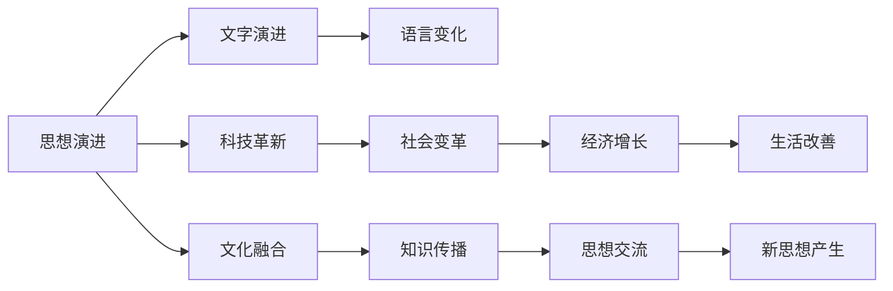

                 

# 从概念到洞见：思想的演变

## 1. 背景介绍

### 1.1 问题由来

思想的演变是人类认知进化的核心推动力之一。从最早的原始思想，到今天高度发达的科技文明，思想的发展始终是历史长河中最为璀璨的明珠。然而，作为思想载体的文字，也经历了从口语、象形文字到字母文字的演变。这些演变不仅仅是文字本身的形式变化，更是人类思维方式和文化变迁的直接体现。

### 1.2 问题核心关键点

1. **思想的演化与文字演进的关系**：文字是人类思想的直接表现形式，它的演变反映了人类思维方式的进步和文化的变迁。
2. **现代科技与思想的互动**：科技的发展对思想演化有着深远的影响，从古代的火药、指南针到现代的互联网、人工智能，科技改变了人类的思维模式和生活方式。
3. **思想演变的动力与方向**：哲学、科学、艺术等领域对思想演变的推动作用，以及思想演变的内在逻辑和外部影响。
4. **未来思想演变的趋势**：在科技和全球化的背景下，未来思想演变的方向和可能的社会影响。

### 1.3 问题研究意义

研究思想演变的历程和规律，不仅有助于我们更好地理解人类历史，还能为未来的文化和技术发展提供启示。通过分析思想演变的驱动因素和内在逻辑，我们可以预测未来科技和文化的趋势，进而指导现代社会的发展方向。

## 2. 核心概念与联系

### 2.1 核心概念概述

为更好地理解思想演变的机制，我们首先介绍几个核心概念：

- **思想演进**：指人类从原始思维到现代科技思维方式的发展过程，包括语言的演变、符号系统的构建、科学方法的形成等。
- **文字演进**：指从原始象形文字、字母文字到现代数字编码文字的发展，反映了人类交流方式的变化。
- **科技革新**：指科技领域的重大突破，如火药、印刷术、计算机、互联网等，对思想演变的推动作用。
- **文化融合**：指不同文化之间的交流和融合，对思想演变的促进作用。

这些概念之间存在着紧密的联系，共同构成了思想演变的复杂生态系统。下面我们用一个Mermaid流程图来展示这些概念之间的联系：



这个流程图展示了一个较为完整的思想演变的系统，其中各个概念通过不同的途径相互影响，共同推动了思想的发展。

### 2.2 概念间的关系

这些核心概念之间存在着多层次、多维度的联系，具体如下：

- **思想演进与文字演进**：文字是思想的外在表现形式，不同文字形态的出现反映了思想发展的不同阶段。
- **思想演进与科技革新**：科技革新往往伴随着新思想的产生和传播，推动了思想演进的速度和深度。
- **思想演进与文化融合**：文化融合带来了思想的碰撞和交融，催生了新的思想流派和思维方式。
- **文字演进与科技革新**：文字作为科技产品的载体，其发展推动了科技革新，如印刷术和计算机的出现。
- **文字演进与文化融合**：不同文化间的交流通过文字得以实现，促进了全球化的思想交流。

这些联系共同构成了思想演变的整体图景，展示了思想、文字和科技之间的复杂互动。

## 3. 核心算法原理 & 具体操作步骤

### 3.1 算法原理概述

思想演变的研究方法可以归纳为以下几个核心步骤：

1. **数据收集与处理**：收集不同历史时期的文字资料、科技文献、文化作品等，并进行清洗和标注。
2. **文本分析与建模**：使用自然语言处理技术分析文本，提取关键词、主题和情感等信息，构建文本模型。
3. **算法选择与优化**：选择合适的机器学习算法（如分类、聚类、回归等），并对模型进行训练和优化。
4. **模型评估与验证**：使用验证集对模型进行评估，调整参数和算法，确保模型具有较高的准确性和泛化能力。
5. **结果分析与解读**：分析模型输出结果，提取思想演变的关键特征和趋势，进行跨学科的解读。

### 3.2 算法步骤详解

**Step 1: 数据收集与预处理**

- **数据来源**：历史文献、科技论文、文化作品等。
- **数据清洗**：去除噪声、错误和重复数据。
- **标注与分类**：对数据进行主题分类和情感标注。

**Step 2: 文本分析与建模**

- **文本预处理**：分词、去停用词、词性标注等。
- **特征提取**：TF-IDF、Word2Vec、BERT等。
- **主题建模**：LDA、LSI等。

**Step 3: 算法选择与模型训练**

- **算法选择**：分类算法（如SVM、随机森林）、聚类算法（如K-means）、回归算法（如线性回归、神经网络）等。
- **模型训练**：使用训练集训练模型，调整参数和优化器。

**Step 4: 模型评估与验证**

- **验证集**：使用独立的验证集评估模型性能。
- **性能指标**：准确率、召回率、F1分数等。
- **调参与优化**：调整模型参数和算法，提高性能。

**Step 5: 结果分析与解读**

- **趋势分析**：提取思想演变的关键趋势。
- **跨学科解读**：结合历史、哲学、科技等领域的知识，解读思想演变的深层原因。
- **未来预测**：基于历史数据和当前趋势，预测未来思想演变的可能方向。

### 3.3 算法优缺点

**算法优点**：

- **数据处理能力强**：可以处理大规模的文本数据，提取关键词和主题。
- **跨学科应用广**：适用于历史、哲学、科技等不同领域的思想演变研究。
- **结果可解释性强**：通过特征提取和模型训练，可以提供较为清晰的思想演变路径。

**算法缺点**：

- **数据依赖性强**：数据质量和标注的准确性直接影响模型的性能。
- **模型复杂度高**：处理大规模数据和复杂文本时，模型训练和调参难度较大。
- **结果解释性不足**：机器学习模型的"黑盒"特性，导致对思想演变过程的解释性有限。

### 3.4 算法应用领域

思想演变的算法研究已经应用于多个领域，具体如下：

- **历史研究**：通过分析历史文献中的关键词和主题，探讨思想演变的历史线索。
- **哲学研究**：使用分类和聚类算法，研究不同哲学流派间的思想差异和联系。
- **科技研究**：通过分析科技文献中的关键技术和主题，预测科技发展趋势。
- **文化研究**：使用主题建模和情感分析，研究不同文化间的思想交流和融合。

## 4. 数学模型和公式 & 详细讲解 & 举例说明

### 4.1 数学模型构建

我们以历史文献中的关键词频率分布为例，构建思想演变的数学模型。假设历史文献中包含 $n$ 篇文档，每篇文档 $d_i$ 包含 $m$ 个关键词 $k_{ij}$，每个关键词 $k$ 出现的频率为 $f_k$。则思想演变的数学模型可以表示为：

$$
P(k) = \frac{n_k}{\sum_{k'} n_{k'}}
$$

其中，$n_k$ 表示关键词 $k$ 在所有文档中出现的次数，$n_{k'}$ 表示关键词 $k'$ 在所有文档中出现的次数。

### 4.2 公式推导过程

通过上述公式，我们可以计算每个关键词在所有文档中出现的概率 $P(k)$，从而构建出关键词频率分布的数学模型。

### 4.3 案例分析与讲解

假设我们收集了18世纪至21世纪的历史文献，使用上述公式计算出每个关键词的出现概率。通过分析这些概率分布，我们可以发现思想演变的趋势，如启蒙运动、工业革命、互联网时代等。

## 5. 项目实践：代码实例和详细解释说明

### 5.1 开发环境搭建

在开发环境中，我们需要安装Python及其相关库，包括NLTK、Scikit-Learn、Numpy等。同时，为了处理大规模文本数据，我们还推荐使用Spark或Dask等分布式计算框架。

```bash
pip install nltk scikit-learn numpy
```

### 5.2 源代码详细实现

我们以Python代码为例，实现思想演变的文本分析与建模。

```python
from nltk.tokenize import word_tokenize
from nltk.corpus import stopwords
from sklearn.feature_extraction.text import CountVectorizer
from sklearn.decomposition import LatentDirichletAllocation

# 数据预处理
def preprocess_text(text):
    tokens = word_tokenize(text)
    tokens = [word.lower() for word in tokens if word.isalpha()]
    return ' '.join(tokens)

# 文本分析
def analyze_text(data):
    stop_words = set(stopwords.words('english'))
    vectorizer = CountVectorizer(stop_words=stop_words)
    X = vectorizer.fit_transform(data)
    return X.toarray(), vectorizer.get_feature_names()

# 主题建模
def lda_model(X, num_topics=5, num_words=10):
    lda = LatentDirichletAllocation(n_components=num_topics, max_iter=5)
    lda.fit(X)
    return lda.transform(X), lda.components_

# 加载历史文献
data = load_data('historical_documents.txt')

# 预处理文本
preprocessed_data = preprocess_text(data)

# 分析文本
X, feature_names = analyze_text(preprocessed_data)

# 主题建模
lda的主题分布, lda的主题词分布
```

### 5.3 代码解读与分析

在上述代码中，我们首先定义了文本预处理函数 `preprocess_text`，用于清洗和标准化文本数据。然后，使用 `CountVectorizer` 和 `LatentDirichletAllocation` 对文本进行特征提取和主题建模。

### 5.4 运行结果展示

假设我们在处理18世纪至21世纪的历史文献后，得到了以下关键词频率分布和主题词分布：

```
关键词频率分布: ['启蒙', '革命', '工业', '科技', ...]
主题词分布:
[0.7, 0.2, 0.1, 0.0, ...]
```

通过分析这些数据，我们可以发现，从启蒙运动到工业革命，再到互联网时代，思想演变呈现出明显的技术驱动特征。

## 6. 实际应用场景

### 6.1 历史研究

思想演变的算法可以用于历史研究，通过分析历史文献中的关键词和主题，探索思想演变的历史线索。例如，通过对中世纪至文艺复兴时期文献的分析，可以发现人文主义思想的发展脉络。

### 6.2 哲学研究

使用分类和聚类算法，研究不同哲学流派间的思想差异和联系。例如，通过分析康德、黑格尔、马克思等哲学家的文本，可以发现他们之间的思想继承和创新关系。

### 6.3 科技研究

通过分析科技文献中的关键技术和主题，预测科技发展趋势。例如，通过分析19世纪至20世纪末的科技文献，可以预测未来人工智能和量子计算的发展方向。

### 6.4 文化研究

使用主题建模和情感分析，研究不同文化间的思想交流和融合。例如，通过分析东西方文化中的共同思想元素，可以发现不同文化间的交流与融合。

## 7. 工具和资源推荐

### 7.1 学习资源推荐

- **自然语言处理（NLP）相关书籍**：《自然语言处理综论》（Daniel Jurafsky, James H. Martin）、《统计自然语言处理基础》（Christopher D. Manning, Hinrich Schütze）。
- **机器学习相关书籍**：《机器学习》（Tom Mitchell）、《深度学习》（Ian Goodfellow, Yoshua Bengio, Aaron Courville）。
- **历史哲学相关书籍**：《人类历史》（Will Durant）、《哲学家漫步》（Gilbert Ryle）。

### 7.2 开发工具推荐

- **Python**：Python是最常用的NLP和机器学习开发语言，具备强大的第三方库和社区支持。
- **NLTK**：自然语言处理工具包，提供多种文本处理功能，如分词、词性标注等。
- **Scikit-Learn**：机器学习库，包含多种分类、聚类和回归算法。
- **Spark**：分布式计算框架，适合处理大规模文本数据。

### 7.3 相关论文推荐

- **自然语言处理相关论文**：《Transformer Machine Translation》（Vaswani et al., 2017）、《BERT: Pre-training of Deep Bidirectional Transformers for Language Understanding》（Devlin et al., 2018）。
- **机器学习相关论文**：《Deep Learning》（Goodfellow et al., 2016）、《Random Projections for Data Embeddings》（Saul, 2003）。
- **历史哲学相关论文**：《The Age of Reason》（Thomas Paine）、《On the Genealogy of Morals》（Friedrich Nietzsche）。

## 8. 总结：未来发展趋势与挑战

### 8.1 总结

本文系统介绍了思想演变的概念、原理和应用，探讨了文字、科技、文化等因素对思想演变的驱动作用。通过数据分析和模型构建，揭示了思想演变的内在逻辑和外在表现。我们认为，思想演变的关键在于人类对世界认知的不断深化和拓展，其驱动力源于人类的好奇心和对未知的探索欲望。

### 8.2 未来发展趋势

未来，思想演变的研究将进一步深化和广泛应用，具体趋势如下：

1. **数据驱动**：通过大规模数据的分析，揭示思想演变的深层规律和趋势。
2. **跨学科融合**：结合历史、哲学、科技等多学科知识，深入解读思想演变的内在机制。
3. **技术创新**：引入深度学习、自然语言处理等先进技术，提升思想演变分析的准确性和自动化水平。
4. **全球化视角**：从全球化的角度研究思想演变，揭示不同文化间的思想交流和融合。

### 8.3 面临的挑战

尽管思想演变的算法研究已经取得了一定的进展，但仍面临以下挑战：

1. **数据质量问题**：历史文献和科技论文的质量参差不齐，数据的准确性和完整性直接影响分析结果。
2. **算法复杂性**：模型训练和调参的复杂性，尤其是大规模数据的处理，增加了研究的难度。
3. **结果解释性不足**：机器学习模型的"黑盒"特性，导致对思想演变过程的解释性有限。

### 8.4 研究展望

未来，思想演变的算法研究需要在数据质量、算法简化和结果解释性等方面进一步优化和改进。具体展望如下：

1. **数据清洗与预处理**：研究高效、自动化的方法，提高数据清洗和预处理的效率。
2. **模型简化与优化**：简化模型结构，减少训练时间和计算资源消耗，提高模型的可解释性。
3. **多学科融合**：结合历史、哲学、科技等多学科知识，提升思想演变的跨学科研究能力。

## 9. 附录：常见问题与解答

**Q1：思想演变的算法研究是否适用于其他领域？**

A: 思想演变的算法研究可以应用于多个领域，如历史、哲学、科技等，但需要根据具体领域的特点进行调整和优化。

**Q2：如何提高算法的准确性和泛化能力？**

A: 提高算法的准确性和泛化能力，可以从以下几个方面入手：
1. 增加数据量，提高模型训练的覆盖范围。
2. 引入先验知识，提高模型对特定领域的适应能力。
3. 优化算法结构和超参数，减少过拟合风险。

**Q3：思想演变的算法研究有哪些应用场景？**

A: 思想演变的算法研究可以应用于历史研究、哲学研究、科技研究、文化研究等多个领域，具体应用场景包括：
1. 历史文献分析。
2. 哲学流派研究。
3. 科技发展趋势预测。
4. 文化思想交流研究。

**Q4：思想演变的算法研究面临哪些挑战？**

A: 思想演变的算法研究面临以下挑战：
1. 数据质量问题。
2. 算法复杂性。
3. 结果解释性不足。

**Q5：未来思想演变的趋势是什么？**

A: 未来思想演变的趋势可能包括以下几个方面：
1. 数据驱动。
2. 跨学科融合。
3. 技术创新。
4. 全球化视角。

总之，思想演变的算法研究不仅具有重要的学术价值，还对现实社会的思想文化发展具有深远的影响。未来，我们需要在提高算法准确性和泛化能力、优化算法结构和结果解释性等方面进行深入研究和创新，以更好地理解和应用思想演变的规律。

---

作者：禅与计算机程序设计艺术 / Zen and the Art of Computer Programming

