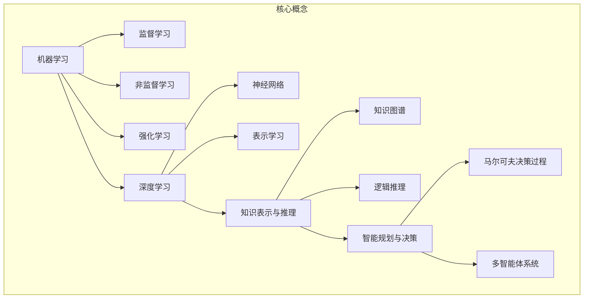
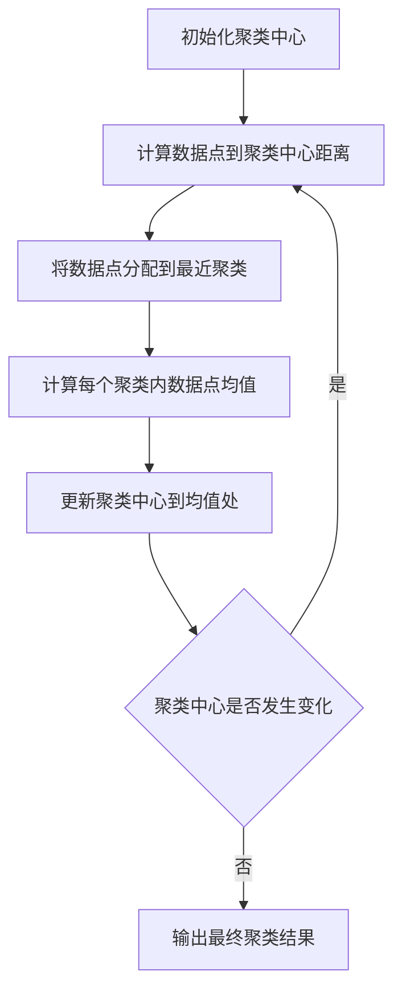

以下是根据您的要求撰写的技术博客文章《Artificial Intelligence (AI)原理与代码实例讲解》的正文内容：

# Artificial Intelligence (AI)原理与代码实例讲解

## 1. 背景介绍

### 1.1 问题的由来

人工智能(Artificial Intelligence, AI)是当代科技发展的热点领域,旨在模拟人类智能,创造出能够执行特定任务的智能系统。随着大数据、云计算和高性能计算等技术的飞速发展,AI也获得了前所未有的发展机遇。

然而,AI技术的复杂性和多样性给开发者带来了诸多挑战。理解AI的核心概念、算法原理、数学模型以及实现细节,对于构建高质量的AI系统至关重要。因此,有必要对AI的理论基础和实践技巧进行系统性的阐述和讲解。

### 1.2 研究现状

目前,AI领域的研究主要集中在以下几个方面:

1. 机器学习算法:包括监督学习、非监督学习、强化学习等,旨在从数据中提取模式和规律。
2. 深度学习模型:基于人工神经网络,能够自动从大量数据中学习特征表示,在计算机视觉、自然语言处理等领域取得突破性进展。
3. 知识表示与推理:探索如何在计算机系统中表示和推理人类知识。
4. 智能规划与决策:研究如何在不确定环境下做出最优决策。
5. 多智能体系统:研究多个智能体之间的协作、竞争和交互。

### 1.3 研究意义

AI技术的发展对于提高生产效率、优化资源配置、推动科技创新具有重要意义。掌握AI原理和实践技能,有助于开发人员构建智能化系统,解决复杂的现实问题。同时,深入探讨AI的理论基础和技术细节,也将推动AI领域的持续创新和发展。

### 1.4 本文结构

本文将全面阐述AI的核心概念、算法原理、数学模型,并通过代码实例详细讲解AI系统的实现细节。文章结构安排如下:

- 核心概念与联系
- 核心算法原理与具体操作步骤
- 数学模型和公式详细讲解与案例分析
- 项目实践:代码实例和详细解释说明
- 实际应用场景
- 工具和资源推荐
- 总结:未来发展趋势与挑战
- 附录:常见问题与解答

## 2. 核心概念与联系

人工智能涵盖了多个核心概念,包括机器学习、深度学习、知识表示与推理、智能规划与决策等,这些概念相互关联、相辅相成。

机器学习旨在从数据中自动分析获取模式,包括监督学习(如分类、回归)、非监督学习(如聚类、降维)和强化学习。深度学习是机器学习的一个分支,基于人工神经网络,能够自动从数据中学习特征表示,在计算机视觉、自然语言处理等领域取得突破性进展。

知识表示与推理则关注如何在计算机系统中表示和推理人类知识,涉及知识图谱、逻辑推理等技术。智能规划与决策则研究在不确定环境下如何做出最优决策,包括马尔可夫决策过程、多智能体系统等。

上述核心概念相互交织、环环相扣。例如,深度学习模型可以作为知识表示与推理系统的组成部分;智能规划与决策也可以应用机器学习和深度学习技术等。理解这些概念及其内在联系,对于全面掌握AI理论知识至关重要。

## 3. 核心算法原理与具体操作步骤

### 3.1 算法原理概述

AI领域中有许多经典算法,包括:

1. **监督学习算法**:
   - K近邻(KNN)
   - 支持向量机(SVM)
   - 决策树和随机森林
   - 朴素贝叶斯
   - 逻辑回归
   - 线性回归

2. **非监督学习算法**:
   - K-Means聚类
   - DBSCAN聚类
   - 高斯混合模型(GMM)
   - 主成分分析(PCA)

3. **深度学习算法**:
   - 前馈神经网络
   - 卷积神经网络(CNN)
   - 循环神经网络(RNN)
   - 长短期记忆网络(LSTM)

4. **强化学习算法**:
   - Q-Learning
   - Sarsa
   - 策略梯度
   - 深度Q网络(DQN)

这些算法分别基于不同的原理和假设,适用于不同的任务场景。例如,监督学习算法通过学习带标签的训练数据,构建能够对新数据进行预测的模型;非监督学习算法则从未标记的数据中发现潜在模式;深度学习算法通过多层神经网络自动学习数据特征表示;强化学习算法则通过试错和奖惩机制,学习在特定环境下的最优行为策略。

### 3.2 算法步骤详解

以K-Means聚类算法为例,其主要步骤如下:

1. **初始化**:随机选择K个数据点作为初始聚类中心。
2. **分配数据点**:计算每个数据点到K个聚类中心的距离,将其分配到距离最近的那一个聚类。
3. **更新聚类中心**:计算每个聚类中所有数据点的均值,并将聚类中心移动到该均值处。
4. **重复分配和更新**:重复执行步骤2和3,直到聚类中心不再发生明显变化。
5. **输出结果**:输出最终的K个聚类及其中心。

该算法的核心思想是通过迭代的方式不断优化聚类中心,使得同一聚类内的数据点相似度较高,不同聚类间的数据点相似度较低。算法的时间复杂度为O(nkt),其中n为数据点个数,k为聚类数量,t为迭代次数。

### 3.3 算法优缺点

K-Means算法的主要优点包括:

- 原理简单,实现方便
- 可以处理大规模数据集
- 计算效率较高

但也存在一些缺陷:

- 需要预先确定聚类数量K
-对噪声和异常值敏感
- 无法发现非凸形状的聚类
- 收敛到局部最优解的可能性较大

### 3.4 算法应用领域

K-Means聚类算法广泛应用于多个领域,包括:

- 图像分割和计算机视觉
- 基因表达数据分析
- 网页和文档聚类
- 市场细分和客户分群
- 异常检测和欺诈识别

## 4. 数学模型和公式详细讲解与举例说明

### 4.1 数学模型构建

在AI领域,数学模型扮演着重要角色,用于形式化描述问题并寻求解决方案。以K-Means聚类为例,我们可以构建如下数学模型:

给定一个数据集 $X = \{x_1, x_2, \dots, x_n\}$,其中 $x_i \in \mathbb{R}^d$ 是一个 $d$ 维数据点,目标是将数据集划分为 $k$ 个互不相交的聚类 $C = \{C_1, C_2, \dots, C_k\}$,使得同一聚类内的数据点相似度较高,不同聚类间的数据点相似度较低。

我们定义聚类的目标函数(objective function)为:

$$J(C) = \sum_{i=1}^k \sum_{x \in C_i} \left\Vert x - \mu_i \right\Vert^2$$

其中 $\mu_i$ 是第 $i$ 个聚类的质心(centroid),定义为:

$$\mu_i = \frac{1}{|C_i|} \sum_{x \in C_i} x$$

目标是找到一种聚类方式 $C^*$,使得目标函数 $J(C^*)$ 最小化。

### 4.2 公式推导过程

K-Means算法的目标是最小化目标函数 $J(C)$。我们可以通过迭代的方式不断优化聚类结果,从而逼近最优解。

具体地,在每一次迭代中,算法执行以下两个步骤:

1. **分配步骤**:对于每个数据点 $x$,计算它到所有聚类中心的距离,并将其分配到距离最近的那一个聚类 $C_i$:

$$c^{(t)}(x) = \underset{i}{\operatorname{argmin}} \left\Vert x - \mu_i^{(t)} \right\Vert^2$$

2. **更新步骤**:根据新的聚类分配结果,重新计算每个聚类的质心:

$$\mu_i^{(t+1)} = \frac{1}{|C_i^{(t)}|} \sum_{x \in C_i^{(t)}} x$$

通过不断重复上述两个步骤,直到聚类结果收敛(即聚类分配不再发生变化),我们可以得到一个局部最优解。

### 4.3 案例分析与讲解

让我们通过一个简单的二维数据集来演示K-Means聚类算法。假设我们有以下数据点:

$$X = \begin{bmatrix}
1 & 2 \
2 & 3 \
5 & 6 \
7 & 8 \
9 & 7
\end{bmatrix}$$

我们希望将这些数据点划分为两个聚类 $(k=2)$。初始时,我们随机选择两个数据点作为初始聚类中心,例如 $(1, 2)$ 和 $(9, 7)$。

**第一次迭代**:

1. 分配步骤:计算每个数据点到两个聚类中心的距离,并将其分配到最近的那一个聚类。
   - 聚类1: $(1, 2)$, $(2, 3)$
   - 聚类2: $(5, 6)$, $(7, 8)$, $(9, 7)$

2. 更新步骤:计算每个聚类的新质心。
   - 聚类1的新质心: $\mu_1 = \frac{1}{2}(1+2, 2+3) = (1.5, 2.5)$
   - 聚类2的新质心: $\mu_2 = \frac{1}{3}(5+7+9, 6+8+7) = (7, 7)$

**第二次迭代**:

1. 分配步骤:根据新的聚类中心重新分配数据点。
   - 聚类1: $(1, 2)$, $(2, 3)$
   - 聚类2: $(5, 6)$, $(7, 8)$, $(9, 7)$
   (分配结果与上一次迭代相同,算法收敛)

2. 更新步骤:聚类中心保持不变。

因此,最终的聚类结果为:
- 聚类1: $(1, 2)$, $(2, 3)$,质心为 $(1.5, 2.5)$
- 聚类2: $(5, 6)$, $(7, 8)$, $(9, 7)$,质心为 $(7, 7)$

可以看出,K-Means算法能够较好地将相似的数据点聚集在一起,并找到每个聚类的代表性质心。

### 4.4 常见问题解答

**Q: K-Means算法如何选择最佳的聚类数量K?**

A: 选择合适的K值是K-Means算法的一个关键问题。常见的方法包括:

1. 先验知识:根据对