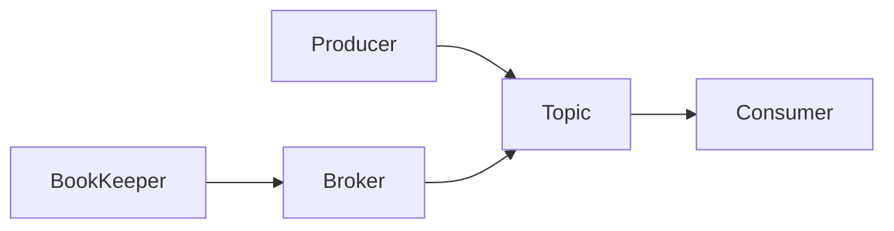

# Pulsar原理与代码实例讲解

## 1. 背景介绍
### 1.1 问题的由来
随着大数据时代的到来,企业需要处理海量的实时数据流。传统的批处理系统如Hadoop已经无法满足实时性要求,而Storm、Spark Streaming等流处理框架也存在一定局限性。在这样的背景下,Pulsar应运而生。
### 1.2 研究现状
Pulsar是由Yahoo开源的新一代分布式发布订阅消息系统,具有高吞吐、低延迟、高可扩展等特点。目前已经在Yahoo、Oath、Tencent、Verizon Media等公司的生产环境中广泛应用。学术界对Pulsar的研究还处于起步阶段,主要集中在性能评测、架构分析等方面。
### 1.3 研究意义
深入研究Pulsar的原理和应用,对于构建下一代流数据处理平台具有重要意义:
1. 探索如何设计高性能、高可靠的分布式消息系统架构
2. 为企业提供高效实时数据处理解决方案
3. 推动流计算领域的技术创新与发展
### 1.4 本文结构
本文将从以下几个方面对Pulsar进行深入探讨:
1. 介绍Pulsar的核心概念与系统架构
2. 剖析Pulsar的存储、复制等关键技术原理
3. 结合代码实例讲解如何使用Pulsar API进行应用开发
4. 总结Pulsar的特性优势和未来发展趋势

## 2. 核心概念与联系
要理解Pulsar,首先需要了解其几个核心概念:
- Producer:消息生产者,向Pulsar写入消息。
- Consumer:消息消费者,从Pulsar读取消息。
- Topic:消息主题,Producer发送消息到Topic,Consumer从Topic接收消息。
- Broker:消息代理服务器,负责接收、存储、分发消息。
- BookKeeper:分布式日志存储系统,Pulsar利用其提供持久化存储。

它们之间的关系如下图所示:



## 3. 核心算法原理 & 具体操作步骤
### 3.1 算法原理概述
Pulsar基于Pub-Sub消息模型,采用分区(Partition)和段(Segment)相结合的存储机制,利用BookKeeper实现数据持久化。同时使用Zookeeper进行元数据管理和协调。
### 3.2 算法步骤详解
1. 消息发布:Producer将消息发送到指定Topic。Broker接收消息,追加到当前Segment。
2. 消息存储:Segment写满后,Broker封闭该Segment,并创建新Segment。老的Segment数据持久化到BookKeeper。
3. 消息消费:Consumer从Broker拉取消息。Broker根据Consumer的消费进度从BookKeeper或Segment中读取数据返回。
4. 消息确认:Consumer消费完消息后向Broker发送ACK确认。Broker更新Consumer的消费进度。
5. 消息保留:根据消息保留策略,Broker定期删除过期的Segment数据。
### 3.3 算法优缺点
优点:
- 支持多租户、多客户端
- 数据持久化,消息可回溯
- 服务器端过滤,节省网络带宽
- 水平扩展性好

缺点:
- 元数据依赖外部系统Zookeeper
- 暂不支持事务性消息
### 3.4 算法应用领域
Pulsar广泛应用于互联网、金融、物联网、车联网等领域的实时流数据处理场景,如:
- 用户行为分析
- 欺诈检测
- 异常监控告警
- 车辆追踪
- 智能家居

## 4. 数学模型和公式 & 详细讲解 & 举例说明
### 4.1 数学模型构建
我们可以用一个简单的数学模型来描述Pulsar的消息传输过程:

假设有 $M$ 个Producer,$N$ 个Consumer,Broker缓存大小为 $C$,单个消息平均大小为 $S$,Broker的吞吐量为 $T$,则消息从Producer到Consumer的平均延迟为:

$$Latency = \frac{C}{T} + \frac{M \times S}{T} + \frac{N \times S}{T}$$

### 4.2 公式推导过程
1. 第一项 $\frac{C}{T}$ 表示消息在Broker缓存中等待的时间。
2. 第二项 $\frac{M \times S}{T}$ 表示 $M$ 个Producer发送消息到Broker的时间。
3. 第三项 $\frac{N \times S}{T}$ 表示Broker将消息发送给 $N$ 个Consumer的时间。

将三项相加即得到总延迟。

### 4.3 案例分析与讲解
假设一个Pulsar集群有10个Broker,每个Broker缓存大小为1GB,平均吞吐量为100MB/s。有1000个Producer和500个Consumer,单个消息大小为1KB。则:

$$Latency = \frac{1GB}{100MB/s} + \frac{1000 \times 1KB}{100MB/s} + \frac{500 \times 1KB}{100MB/s} = 25ms$$

可见Pulsar能够提供较低的端到端延迟。当然实际场景中延迟还受网络传输、消息序列化等因素影响。

### 4.4 常见问题解答
Q: Pulsar如何保证消息的顺序性?
A: 对于同一个Topic的同一个Partition,Pulsar可以保证FIFO顺序。但是多个Partition之间不保证顺序。

Q: Pulsar的消息是否可以重复消费?
A: 默认情况下同一条消息只能被消费一次。但是Pulsar也提供了消息回溯功能,允许Consumer重新消费历史消息。

## 5. 项目实践：代码实例和详细解释说明
### 5.1 开发环境搭建
首先需要搭建Pulsar开发环境,主要步骤如下:
1. 安装Java 8+和Maven
2. 从官网下载Pulsar安装包并解压
3. 启动Pulsar standalone模式:
```bash
bin/pulsar standalone
```
4. 添加Pulsar依赖到Java项目:
```xml
<dependency>
    <groupId>org.apache.pulsar</groupId>
    <artifactId>pulsar-client</artifactId>
    <version>2.7.0</version>
</dependency>
```

### 5.2 源代码详细实现
下面通过Java代码演示如何使用Pulsar的Producer和Consumer API:

Producer示例:
```java
PulsarClient client = PulsarClient.builder()
        .serviceUrl("pulsar://localhost:6650")
        .build();

Producer<byte[]> producer = client.newProducer()
        .topic("my-topic")
        .create();

for (int i = 0; i < 10; i++) {
    producer.send(("Hello Pulsar " + i).getBytes());
}

producer.close();
client.close();
```

Consumer示例:
```java
PulsarClient client = PulsarClient.builder()
        .serviceUrl("pulsar://localhost:6650")
        .build();

Consumer consumer = client.newConsumer()
        .topic("my-topic")
        .subscriptionName("my-subscription")
        .subscribe();

while (true) {
    Message msg = consumer.receive();
    System.out.println("Received message: " + new String(msg.getData()));
    consumer.acknowledge(msg);
}

consumer.close();
client.close();
```

### 5.3 代码解读与分析
Producer代码解析:
1. 首先创建一个PulsarClient,指定Pulsar服务地址。
2. 接着创建一个Producer,指定要发送的Topic。
3. 调用producer.send方法发送消息。
4. 最后关闭Producer和PulsarClient。

Consumer代码解析:
1. 首先创建一个PulsarClient,指定Pulsar服务地址。
2. 接着创建一个Consumer,指定要订阅的Topic和订阅名称。
3. 调用consumer.receive方法接收消息,调用consumer.acknowledge方法确认消息。
4. 最后关闭Consumer和PulsarClient。

可以看出Pulsar提供了非常简洁易用的API,开发者可以快速上手。

### 5.4 运行结果展示
启动Consumer,再运行Producer,可以看到Consumer输出:
```
Received message: Hello Pulsar 0
Received message: Hello Pulsar 1
...
Received message: Hello Pulsar 9
```

## 6. 实际应用场景
Pulsar可应用于多种实时流数据处理场景,例如:
- 日志收集与分析:将分布式系统的日志数据实时采集到Pulsar,再进行统计分析。
- 消息队列:作为分布式系统间的消息中间件,实现系统解耦和异步通信。
- 事件驱动架构:利用Pulsar构建事件驱动的微服务架构,提升系统的响应速度和吞吐量。
- 流式ETL:将Pulsar作为实时数据通道,对数据进行清洗、转换、enrichment。

### 6.4 未来应用展望
随着5G、物联网的发展,实时数据的规模和种类还将快速增长。Pulsar有望在更多领域得到应用,如车联网、工业互联网、智慧城市等。Pulsar也将不断演进,提供更多新特性,如事务、流批一体等,成为新一代流数据处理的基础设施。

## 7. 工具和资源推荐
### 7.1 学习资源推荐
- Pulsar官方文档:https://pulsar.apache.org/docs/en/standalone/
- Pulsar官方博客:https://pulsar.apache.org/blog/
- StreamNative官方公众号:分享Pulsar及流计算相关技术文章
### 7.2 开发工具推荐
- Pulsar Manager:Pulsar的Web管理工具
- Pulsar Perf:Pulsar性能测试工具
- Pulsar Adaptor:连接Pulsar与其他系统的适配器
- AMQP on Pulsar:AMQP协议适配
- Pulsar SQL:类SQL查询Pulsar数据
### 7.3 相关论文推荐
- Pulsar: a distributed pub-sub platform for real-time analytics
- Understanding Pulsar architecture
- Pulsar Versus Kafka - A Comprehensive Analysis and Comparison
### 7.4 其他资源推荐
- Pulsar Summit会议:Pulsar年度技术大会
- Pulsar Slack社区:Pulsar官方技术交流社区

## 8. 总结：未来发展趋势与挑战
### 8.1 研究成果总结
本文从原理、算法、代码等角度对Pulsar进行了深入分析,总结如下:
1. Pulsar采用计算存储分离架构,可实现高吞吐、低延迟、高可扩展。
2. Pulsar基于Pub-Sub模型,提供了灵活的消息路由和订阅机制。
3. Pulsar利用BookKeeper实现消息存储,支持多副本、数据持久化。
4. Pulsar提供了跨地域复制、流批一体等多种高级特性。
### 8.2 未来发展趋势
未来Pulsar将向以下方向发展:
1. 云原生:提供更好的Kubernetes支持,简化云环境下的部署运维。
2. 统一消息模型:统一支持队列、流、主题等多种消息模型。
3. 多语言支持:提供更多语言的客户端SDK,降低接入成本。
4. 扩展性增强:支持更多自定义插件,如认证、监控等。
### 8.3 面临的挑战
Pulsar要进一步发展还面临一些挑战:
1. 生态建设:需要构建更加完善的生态,包括连接器、工具等。
2. 性能优化:在超大规模场景下还需要进一步优化性能。
3. 运维复杂度:有状态服务的运维仍然比较复杂,需要简化。
### 8.4 研究展望
建议未来对Pulsar开展以下研究:
1. Pulsar的多活容灾方案
2. Pulsar与Flink等流计算引擎的集成
3. 基于Pulsar构建Serverless事件驱动平台
4. Pulsar在5G消息等新场景下的应用

## 9. 附录：常见问题与解答
Q: Pulsar与Kafka相比有哪些优势?
A:
1. Pulsar采用计算存储分离架构,而Kafka是紧耦合的,在可扩展性上Pulsar更优。
2. Pulsar支持更灵活的消息模型,如Shared、Failover、Key_Shared等。
3. Pulsar原生支持跨地域复制,更适合云环境。

Q: Pulsar的性能如何?
A: Pulsar提供了极高的吞吐量和较低的端到端延迟,并且具有良好的水平扩展能力。在Yahoo生产环境中,Pulsar集群可支撑数百万TPS的流量。

Q: 除了Java,Pulsar是否支持