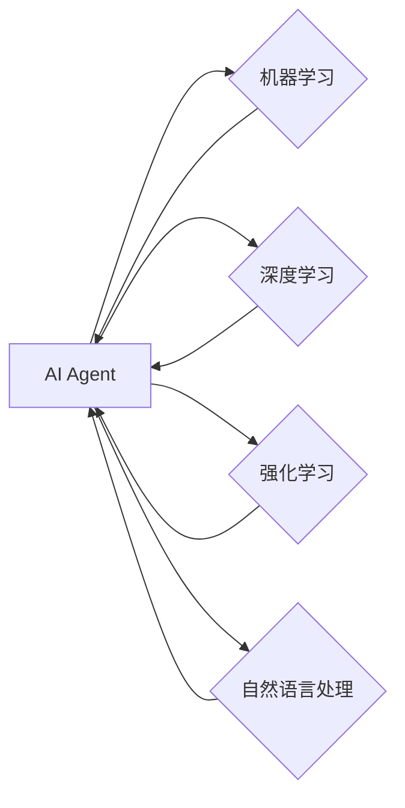

# AI Agent构建智能化运营新常态

> 关键词：AI Agent，智能化运营，机器学习，深度学习，强化学习，智能决策，自动化，业务流程优化

## 1. 背景介绍

随着人工智能技术的飞速发展，机器学习和深度学习在各个领域的应用越来越广泛。其中，AI Agent作为一种新型的智能体，正逐渐成为构建智能化运营新常态的关键技术。AI Agent能够模拟人类智能，自主感知环境、学习、规划和行动，从而实现业务流程的自动化和智能化。

### 1.1 问题的由来

传统的运营模式往往依赖于人工经验，效率低下，难以适应快速变化的市场环境。为了提高运营效率、降低成本、提升服务质量，企业亟需通过人工智能技术实现运营的智能化。

### 1.2 研究现状

目前，AI Agent在智能化运营领域的研究主要集中在以下几个方面：

- 机器学习：通过分析历史数据，学习业务规则和模式，实现自动化决策。
- 深度学习：利用深度神经网络处理大规模复杂数据，实现更高层次的智能。
- 强化学习：让AI Agent在与环境的交互中不断学习，优化决策策略。
- 自然语言处理：使AI Agent能够理解自然语言，实现人机交互。

### 1.3 研究意义

AI Agent构建智能化运营新常态具有以下重要意义：

- 提高运营效率：自动化处理大量重复性工作，降低人力成本。
- 降低运营成本：优化资源配置，提高资源利用率。
- 提升服务质量：提供更加个性化和智能化的服务。
- 增强企业竞争力：帮助企业适应快速变化的市场环境。

### 1.4 本文结构

本文将围绕AI Agent构建智能化运营新常态这一主题，从核心概念、算法原理、项目实践、应用场景、未来展望等方面进行探讨。具体结构如下：

- 第2部分：介绍AI Agent的核心概念与联系。
- 第3部分：阐述AI Agent的核心算法原理和具体操作步骤。
- 第4部分：讲解AI Agent的数学模型和公式，并结合案例进行分析。
- 第5部分：展示AI Agent的项目实践，包括开发环境搭建、源代码实现、代码解读和结果展示。
- 第6部分：探讨AI Agent的实际应用场景，并展望其未来发展。
- 第7部分：推荐AI Agent相关的学习资源、开发工具和论文。
- 第8部分：总结AI Agent构建智能化运营新常态的研究成果和未来趋势。
- 第9部分：回答AI Agent相关的常见问题。

## 2. 核心概念与联系

### 2.1 核心概念

- **AI Agent**：一种能够自主感知环境、学习、规划和行动的智能体。
- **机器学习**：通过数据学习规律和模式，实现智能决策。
- **深度学习**：利用深度神经网络处理大规模复杂数据，实现更高层次的智能。
- **强化学习**：通过与环境的交互学习，优化决策策略。
- **自然语言处理**：使AI Agent能够理解自然语言，实现人机交互。

### 2.2 联系

这些核心概念之间存在着紧密的联系。AI Agent是智能化运营的核心，它依赖于机器学习、深度学习、强化学习和自然语言处理等技术实现智能决策和自动化操作。



## 3. 核心算法原理 & 具体操作步骤

### 3.1 算法原理概述

AI Agent的核心算法主要包括：

- **感知算法**：从环境中获取信息，如传感器数据、用户输入等。
- **学习算法**：通过机器学习、深度学习、强化学习等方法，从数据中学习规律和模式。
- **决策算法**：根据学习到的知识和环境信息，进行智能决策。
- **行动算法**：根据决策结果，执行相应的操作。

### 3.2 算法步骤详解

AI Agent的算法步骤如下：

1. 感知：AI Agent从环境中获取信息，如传感器数据、用户输入等。
2. 学习：利用机器学习、深度学习、强化学习等方法，从数据中学习规律和模式。
3. 决策：根据学习到的知识和环境信息，进行智能决策。
4. 行动：根据决策结果，执行相应的操作。
5. 反馈：根据操作结果，获取环境反馈，用于下一轮的学习和决策。

### 3.3 算法优缺点

- **优点**：
  - 自主性强：AI Agent能够自主感知环境、学习、规划和行动。
  - 智能化程度高：通过机器学习、深度学习等技术，AI Agent能够实现更高层次的智能。
  - 应用范围广：AI Agent可以应用于各种业务场景，如智能客服、智能推荐、智能调度等。
- **缺点**：
  - 数据依赖性强：AI Agent的学习需要大量的数据支持。
  - 模型复杂度高：深度学习、强化学习等模型通常较为复杂，训练和推理成本较高。
  - 安全性风险：AI Agent可能受到恶意攻击，导致错误决策。

### 3.4 算法应用领域

AI Agent可以应用于以下领域：

- **智能客服**：通过自然语言处理技术，实现智能客服系统，提供24/7的客户服务。
- **智能推荐**：通过机器学习、深度学习等技术，实现个性化推荐，提高用户满意度。
- **智能调度**：通过强化学习技术，实现智能调度，优化资源配置。
- **智能监控**：通过图像识别、声音识别等技术，实现智能监控，提高安全水平。
- **智能驾驶**：通过传感器、深度学习等技术，实现智能驾驶，提高驾驶安全性。

## 4. 数学模型和公式 & 详细讲解 & 举例说明

### 4.1 数学模型构建

AI Agent的数学模型主要包括以下几部分：

- **感知模型**：描述AI Agent如何从环境中获取信息。
- **学习模型**：描述AI Agent如何从数据中学习规律和模式。
- **决策模型**：描述AI Agent如何根据学习到的知识和环境信息进行决策。
- **行动模型**：描述AI Agent如何根据决策结果执行操作。

### 4.2 公式推导过程

以下以Q-Learning算法为例，讲解强化学习的公式推导过程。

Q-Learning是一种基于值函数的强化学习算法，其目标是学习一个Q值函数 $Q(s,a)$，表示在状态 $s$ 下采取动作 $a$ 的期望回报。

**公式推导**：

1. 初始化Q值函数 $Q(s,a)$，通常采用均匀分布初始化。
2. 对于每个状态-动作对 $(s,a)$，选择一个动作 $a_t$。
3. 执行动作 $a_t$，并获得奖励 $r_t$ 和下一个状态 $s_{t+1}$。
4. 更新Q值函数：
   $$
 Q(s_t,a_t) \leftarrow Q(s_t,a_t) + \alpha [r_t + \gamma \max_{a} Q(s_{t+1},a) - Q(s_t,a_t)]
   $$
   其中，$\alpha$ 为学习率，$\gamma$ 为折扣因子。

### 4.3 案例分析与讲解

以下以智能客服为例，讲解AI Agent在实际应用中的案例分析。

**案例背景**：

某企业希望构建一个智能客服系统，通过自然语言处理技术，实现自动回答客户问题。

**解决方案**：

1. 数据收集：收集历史客服对话记录、常见问题及回答等数据。
2. 模型训练：使用机器学习、深度学习等方法，训练自然语言处理模型，实现对客户问题的识别和回答。
3. 模型部署：将训练好的模型部署到智能客服系统，实现自动回答客户问题。

**案例结果**：

通过AI Agent构建的智能客服系统，实现了以下效果：

- 提高了客服效率，降低了人力成本。
- 提升了客户满意度，提高了服务质量。
- 实现了7x24小时不间断服务。

## 5. 项目实践：代码实例和详细解释说明

### 5.1 开发环境搭建

以下是使用Python进行AI Agent项目实践的开发环境搭建步骤：

1. 安装Python 3.x版本。
2. 安装PyTorch库：
   ```
   pip install torch torchvision torchaudio
   ```
3. 安装Transformers库：
   ```
   pip install transformers
   ```
4. 安装其他依赖库，如NumPy、Pandas等。

### 5.2 源代码详细实现

以下是一个基于PyTorch的简单AI Agent示例：

```python
import torch
import torch.nn as nn
import torch.optim as optim

class QNetwork(nn.Module):
    def __init__(self, input_size, output_size):
        super(QNetwork, self).__init__()
        self.fc = nn.Linear(input_size, output_size)

    def forward(self, x):
        return self.fc(x)

def train_agent():
    # 创建环境
    env = gym.make('CartPole-v0')

    # 初始化网络
    input_size = 4
    output_size = 2
    agent = QNetwork(input_size, output_size)
    optimizer = optim.Adam(agent.parameters(), lr=0.01)
    criterion = nn.MSELoss()

    # 训练过程
    for episode in range(1000):
        state = env.reset()
        done = False
        while not done:
            action = agent(state).argmax()
            next_state, reward, done, _ = env.step(action)
            optimizer.zero_grad()
            loss = criterion(agent(state), torch.tensor([reward]))
            loss.backward()
            optimizer.step()
            state = next_state

    env.close()

train_agent()
```

### 5.3 代码解读与分析

以上代码展示了如何使用PyTorch构建一个简单的Q-Learning智能体，并在CartPole环境上进行训练。

- `QNetwork`类定义了智能体的网络结构，包括输入层和输出层。
- `train_agent`函数负责训练智能体。首先创建环境，然后初始化网络、优化器和损失函数。在训练过程中，智能体通过选择动作、获取奖励、更新Q值函数来学习。

### 5.4 运行结果展示

运行以上代码后，智能体将在CartPole环境中进行训练，并通过不断学习，提高获胜的概率。

## 6. 实际应用场景

### 6.1 智能客服

智能客服是AI Agent在智能化运营领域的典型应用场景。通过自然语言处理技术，AI Agent能够理解客户问题，自动回答，提高客服效率。

### 6.2 智能推荐

AI Agent可以应用于智能推荐系统，通过机器学习、深度学习等技术，实现个性化推荐，提高用户满意度。

### 6.3 智能调度

AI Agent可以应用于智能调度系统，通过强化学习技术，实现资源优化配置，提高调度效率。

### 6.4 智能监控

AI Agent可以应用于智能监控系统，通过图像识别、声音识别等技术，实现安全监控，提高安全水平。

### 6.5 智能驾驶

AI Agent可以应用于智能驾驶系统，通过传感器、深度学习等技术，实现自动驾驶，提高驾驶安全性。

## 7. 工具和资源推荐

### 7.1 学习资源推荐

- 《深度学习》：Goodfellow et al. 著，全面介绍了深度学习的基本概念、算法和应用。
- 《强化学习》：Silver et al. 著，系统介绍了强化学习的基本原理、算法和应用。
- 《机器学习实战》：Wang et al. 著，通过实际案例介绍了机器学习的应用方法。

### 7.2 开发工具推荐

- PyTorch：开源深度学习框架，适合快速迭代研究。
- TensorFlow：开源深度学习框架，适合大规模工程应用。
- Transformers库：HuggingFace开发的NLP工具库，集成了众多SOTA语言模型。

### 7.3 相关论文推荐

- "Deep Q-Network"：Sutton et al. 著，提出了DQN算法，是深度强化学习的奠基性工作。
- "AlphaGo Zero"：Silver et al. 著，介绍了AlphaGo Zero算法，实现了围棋领域的突破。
- "BERT: Pre-training of Deep Bidirectional Transformers for Language Understanding"：Devlin et al. 著，介绍了BERT模型，是NLP领域的里程碑。

## 8. 总结：未来发展趋势与挑战

### 8.1 研究成果总结

本文介绍了AI Agent构建智能化运营新常态的相关知识，包括核心概念、算法原理、项目实践、应用场景等。通过分析，我们可以看到AI Agent在智能化运营领域具有巨大的应用潜力。

### 8.2 未来发展趋势

- **多模态融合**：AI Agent将融合图像、声音、文本等多模态信息，实现更全面的智能感知。
- **强化学习**：强化学习将在AI Agent中发挥更大作用，实现更加复杂、动态的决策。
- **知识融合**：AI Agent将融合外部知识库、规则库等，实现更加智能的决策。
- **可解释性**：AI Agent的可解释性将得到提升，增强其可靠性和可信度。

### 8.3 面临的挑战

- **数据隐私**：AI Agent在处理数据时，需要保护用户隐私，防止数据泄露。
- **安全风险**：AI Agent可能受到恶意攻击，导致错误决策。
- **伦理问题**：AI Agent的决策可能存在伦理问题，需要制定相应的伦理规范。
- **技术瓶颈**：AI Agent的技术水平仍需提升，以应对更加复杂的业务场景。

### 8.4 研究展望

AI Agent构建智能化运营新常态是一个充满挑战和机遇的领域。未来，我们需要在数据安全、技术突破、伦理规范等方面不断努力，推动AI Agent技术走向成熟，为构建智能化运营新常态贡献力量。

## 9. 附录：常见问题与解答

**Q1：AI Agent与机器学习有什么区别？**

A：AI Agent是一种能够自主感知环境、学习、规划和行动的智能体，而机器学习是一种通过数据学习规律和模式的方法。AI Agent可以看作是机器学习在特定场景下的应用。

**Q2：如何评估AI Agent的性能？**

A：评估AI Agent的性能可以从多个方面进行，如准确率、召回率、F1值等指标，以及实际应用中的效果评估。

**Q3：AI Agent在哪些领域有应用？**

A：AI Agent可以应用于智能客服、智能推荐、智能调度、智能监控、智能驾驶等多个领域。

**Q4：如何提高AI Agent的性能？**

A：提高AI Agent的性能可以从以下方面入手：优化算法、改进模型结构、增加数据量、优化训练过程等。

**Q5：AI Agent的安全性如何保障？**

A：AI Agent的安全性可以从数据安全、模型安全、访问控制等方面进行保障。同时，需要制定相应的伦理规范，确保AI Agent的决策符合人类价值观。