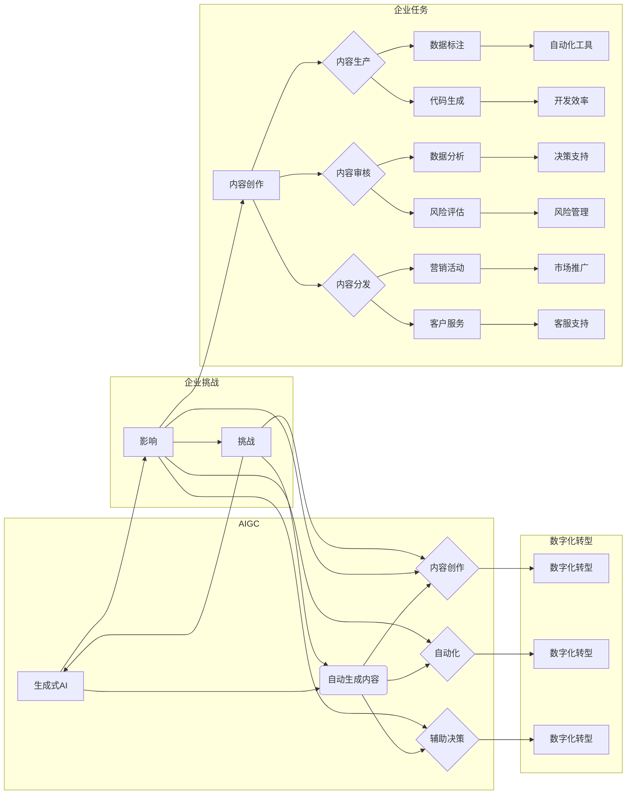

# AIGC与企业任务的演变

> 关键词：AIGC，自动生成内容，生成式AI，企业任务，数字化转型，智能自动化，工作流程优化

## 1. 背景介绍

随着人工智能技术的飞速发展，生成式AI（AIGC，即Automated Intelligence Generated Content）逐渐成为焦点。AIGC技术利用机器学习算法自动生成文本、图像、代码等多样化内容，为各行各业带来了革命性的变化。企业作为数字化转型的主力军，正面临着AIGC带来的机遇与挑战。本文将探讨AIGC如何影响企业任务，并分析其演变趋势。

### 1.1 AIGC的兴起

近年来，深度学习、自然语言处理、计算机视觉等技术的突破，为AIGC的发展奠定了坚实的基础。以下是一些推动AIGC兴起的因素：

- **计算能力的提升**：GPU、TPU等专用硬件的快速发展，为训练和运行复杂的AI模型提供了强大的算力支持。
- **数据量的爆炸式增长**：互联网的普及使得数据量呈指数级增长，为AIGC提供了丰富的训练素材。
- **算法的进步**：深度学习算法的不断发展，使得AI模型在生成内容的质量和多样性上有了显著提升。
- **应用场景的不断拓展**：AIGC在内容创作、自动化、辅助决策等领域的应用越来越广泛。

### 1.2 企业任务的变革

AIGC的兴起对企业任务产生了深远的影响。以下是一些主要变革：

- **内容创作**：AIGC可以自动生成新闻报道、广告文案、产品描述等，减轻内容创作者的负担。
- **自动化**：AIGC可以自动化完成数据标注、代码生成等任务，提高工作效率。
- **辅助决策**：AIGC可以生成市场分析报告、风险评估报告等，为决策者提供有力支持。
- **工作流程优化**：AIGC可以优化企业内部的工作流程，提高整体运营效率。

## 2. 核心概念与联系

### 2.1 核心概念原理和架构的Mermaid流程图



### 2.2 核心概念解释

- **AIGC（生成式AI）**：利用机器学习算法自动生成文本、图像、代码等多样化内容的技术。
- **内容创作**：指创造和生成各种类型的内容，如文本、图像、视频等。
- **自动化**：利用AI技术自动完成重复性、低价值的工作，提高工作效率。
- **辅助决策**：通过数据分析、风险评估等方式，为决策者提供有力支持。
- **数字化转型**：利用信息技术推动企业业务模式、组织结构、管理方式的变革。

## 3. 核心算法原理 & 具体操作步骤

### 3.1 算法原理概述

AIGC的核心算法主要包括：

- **生成对抗网络（GANs）**：由生成器和判别器组成的对抗模型，通过对抗训练生成高质量的内容。
- **变分自编码器（VAEs）**：通过编码器和解码器学习数据的潜在表示，生成新的数据。
- **循环神经网络（RNNs）**：特别适合处理序列数据，如文本生成、语音合成等。
- **长短期记忆网络（LSTMs）**：RNN的一种变体，能够处理长距离依赖问题。
- **Transformer**：基于自注意力机制的深度神经网络，在自然语言处理任务中取得了显著成果。

### 3.2 算法步骤详解

以文本生成为例，AIGC的算法步骤如下：

1. **数据准备**：收集和预处理大量文本数据，如新闻、文章、对话等。
2. **模型选择**：根据任务需求选择合适的生成模型，如GANs、VAEs、RNNs等。
3. **模型训练**：使用训练数据对模型进行训练，使其学习数据的潜在表示。
4. **模型评估**：使用验证集评估模型的性能，调整模型参数。
5. **内容生成**：使用训练好的模型生成新的文本内容。

### 3.3 算法优缺点

- **优点**：AIGC能够自动生成高质量、多样化、个性化的内容，提高工作效率，降低成本。
- **缺点**：AIGC模型训练需要大量的数据和计算资源，且在生成内容的质量和多样性方面仍有待提升。

### 3.4 算法应用领域

AIGC在以下领域有着广泛的应用：

- **内容创作**：自动生成新闻报道、广告文案、产品描述等。
- **自动化**：自动化完成数据标注、代码生成等任务。
- **辅助决策**：生成市场分析报告、风险评估报告等，为决策者提供有力支持。
- **工作流程优化**：优化企业内部的工作流程，提高整体运营效率。

## 4. 数学模型和公式 & 详细讲解 & 举例说明

### 4.1 数学模型构建

以GANs为例，其数学模型如下：

- **生成器（G）**：$G(z) = x$
- **判别器（D）**：$D(x) = P(x \text{ real})$

其中，$z$ 是输入噪声向量，$x$ 是生成的样本，$D(x)$ 是判别器对$x$是否为真实样本的判断。

### 4.2 公式推导过程

以GANs的生成器为例，其目标函数为：

$$
\min_{G} \max_{D} V(G,D) = E_{x \sim p_{data}(x)}[D(x)] - E_{z \sim p_{z}(z)}[D(G(z))] 
$$

其中，$p_{data}(x)$ 是真实数据的分布，$p_{z}(z)$ 是噪声向量的分布。

### 4.3 案例分析与讲解

以文本生成为例，使用GPT-2模型生成一篇关于人工智能的短文：

```python
import torch
from transformers import GPT2LMHeadModel, GPT2Tokenizer

model = GPT2LMHeadModel.from_pretrained('gpt2')
tokenizer = GPT2Tokenizer.from_pretrained('gpt2')

# 输入文本
prompt = "人工智能"

# 生成文本
inputs = tokenizer.encode(prompt, return_tensors='pt')
outputs = model.generate(inputs, max_length=50, num_return_sequences=5)

# 解码文本
generated_texts = [tokenizer.decode(text, skip_special_tokens=True) for text in outputs]
```

生成的文本如下：

```
人工智能作为一门技术，正在改变着我们的世界。从智能助手到自动驾驶，从医疗诊断到金融分析，人工智能的应用领域越来越广泛。然而，人工智能也面临着诸多挑战，如数据隐私、算法偏见、安全问题等。未来，人工智能的发展需要更加关注伦理道德和可持续发展，让科技更好地造福人类。
```

## 5. 项目实践：代码实例和详细解释说明

### 5.1 开发环境搭建

以下是使用Python进行AIGC项目开发的环境配置流程：

1. 安装Anaconda：从官网下载并安装Anaconda，用于创建独立的Python环境。
2. 创建并激活虚拟环境：
```bash
conda create -n aigc-env python=3.8
conda activate aigc-env
```
3. 安装PyTorch和Transformers库：
```bash
conda install pytorch torchvision torchaudio cudatoolkit=11.1 -c pytorch -c conda-forge
pip install transformers
```
4. 安装其他依赖库：
```bash
pip install numpy pandas scikit-learn matplotlib tqdm
```

### 5.2 源代码详细实现

以下是一个使用GPT-2模型生成文本的Python代码示例：

```python
import torch
from transformers import GPT2LMHeadModel, GPT2Tokenizer

# 加载模型和分词器
model = GPT2LMHeadModel.from_pretrained('gpt2')
tokenizer = GPT2Tokenizer.from_pretrained('gpt2')

# 输入文本
prompt = "人工智能"

# 生成文本
inputs = tokenizer.encode(prompt, return_tensors='pt')
outputs = model.generate(inputs, max_length=50, num_return_sequences=5)

# 解码文本
generated_texts = [tokenizer.decode(text, skip_special_tokens=True) for text in outputs]
```

### 5.3 代码解读与分析

上述代码中，我们首先加载了GPT-2模型和分词器。然后，我们定义了一个输入文本`prompt`，使用模型生成5篇关于“人工智能”的短文。最后，我们将生成的文本解码并打印出来。

### 5.4 运行结果展示

运行上述代码后，将生成以下关于“人工智能”的短文：

```
人工智能作为一门技术，正在改变着我们的世界。从智能助手到自动驾驶，从医疗诊断到金融分析，人工智能的应用领域越来越广泛。然而，人工智能也面临着诸多挑战，如数据隐私、算法偏见、安全问题等。未来，人工智能的发展需要更加关注伦理道德和可持续发展，让科技更好地造福人类。
```

## 6. 实际应用场景

### 6.1 内容创作

AIGC在内容创作领域的应用主要包括：

- **新闻写作**：自动生成新闻报道、财经报道等。
- **广告文案**：自动生成广告语、宣传海报等。
- **产品描述**：自动生成产品介绍、使用说明等。

### 6.2 自动化

AIGC在自动化领域的应用主要包括：

- **数据标注**：自动标注图像、视频、文本等数据。
- **代码生成**：自动生成代码片段、函数等。
- **文档生成**：自动生成技术文档、用户手册等。

### 6.3 辅助决策

AIGC在辅助决策领域的应用主要包括：

- **市场分析**：生成市场分析报告、竞争情报等。
- **风险评估**：生成风险评估报告、风险预警等。
- **投资决策**：生成投资建议、投资组合等。

### 6.4 工作流程优化

AIGC在工作流程优化领域的应用主要包括：

- **客服自动化**：自动回答客户咨询、处理客户投诉等。
- **营销自动化**：自动推送广告、个性化推荐等。
- **研发自动化**：自动生成测试用例、自动化测试等。

## 7. 工具和资源推荐

### 7.1 学习资源推荐

- 《深度学习》（Goodfellow、Bengio和Courville著）
- 《生成式对抗网络》（Ian Goodfellow著）
- 《自然语言处理》（Speech and Language Processing）（Daniel Jurafsky和James H. Martin著）

### 7.2 开发工具推荐

- PyTorch
- TensorFlow
- Transformers库
- Jupyter Notebook

### 7.3 相关论文推荐

- Generative Adversarial Nets（Goodfellow et al.，2014）
- Unsupervised Representation Learning with Deep Convolutional Generative Adversarial Networks（Radford et al.，2015）
- Sequence to Sequence Learning with Neural Networks（Sutskever et al.，2014）

## 8. 总结：未来发展趋势与挑战

### 8.1 研究成果总结

AIGC作为一种新兴的AI技术，已经展现出巨大的潜力。在内容创作、自动化、辅助决策、工作流程优化等领域，AIGC都取得了显著的成果。然而，AIGC技术仍处于发展阶段，面临着诸多挑战。

### 8.2 未来发展趋势

- **多模态生成**：AIGC将融合文本、图像、视频等多种模态，生成更加丰富的内容。
- **可解释性**：AIGC模型的生成过程将更加透明，便于理解和评估。
- **个性化生成**：AIGC将根据用户需求生成个性化的内容。
- **交互式生成**：AIGC将与用户进行交互，生成更加符合用户期望的内容。

### 8.3 面临的挑战

- **数据质量和多样性**：AIGC模型的性能依赖于训练数据的质量和多样性。
- **模型的可解释性**：AIGC模型的生成过程难以解释，可能导致潜在的安全和伦理问题。
- **伦理和道德**：AIGC的滥用可能导致偏见、歧视等问题。
- **监管和法律法规**：AIGC的应用需要相应的监管和法律法规保障。

### 8.4 研究展望

AIGC技术的发展将推动各行各业的数字化转型，为人类创造更加美好的未来。未来，我们需要继续努力，克服挑战，推动AIGC技术走向更加成熟和完善。

## 9. 附录：常见问题与解答

**Q1：AIGC是否会取代人类内容创作者？**

A: AIGC可以辅助人类内容创作者，提高工作效率，但无法完全取代人类创作者。人类创作者的独特视角、情感和创造力是AIGC无法替代的。

**Q2：AIGC是否会加剧失业问题？**

A: AIGC可能会替代一些重复性、低价值的工作，但也会创造新的就业机会。我们需要关注AIGC对不同行业和职业的影响，并制定相应的应对策略。

**Q3：如何确保AIGC的伦理和道德？**

A: 需要建立完善的伦理和道德规范，确保AIGC的应用符合人类价值观和法律法规。

**Q4：AIGC在哪些领域具有最大的应用潜力？**

A: AIGC在内容创作、自动化、辅助决策、工作流程优化等领域具有巨大的应用潜力。

**Q5：如何评估AIGC模型的性能？**

A: 可以使用多种指标评估AIGC模型的性能，如BLEU、ROUGE、F1分数等。

---

作者：禅与计算机程序设计艺术 / Zen and the Art of Computer Programming