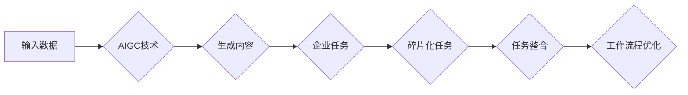

# AIGC与企业任务的碎片化

> 关键词：AIGC, 企业任务, 碎片化, 自动化, 人工智能, 工作流程, 系统集成, 创造力

## 1. 背景介绍

随着人工智能技术的迅猛发展，人工智能生成内容（AIGC，Artificial Intelligence Generated Content）逐渐成为可能。AIGC利用人工智能技术自动生成文本、图像、视频等内容，为企业带来了前所未有的效率提升和创新可能。然而，随着AIGC技术的应用日益广泛，企业任务也呈现出碎片化的趋势。本文将探讨AIGC与企业任务碎片化的关系，分析其背后的原因、影响以及应对策略。

### 1.1 AIGC的兴起

AIGC的兴起源于深度学习、自然语言处理、计算机视觉等技术的发展。这些技术使得计算机能够理解和生成人类语言、图像和视频，从而实现内容的自动生成。AIGC的应用领域包括但不限于：

- 文本生成：自动撰写新闻报道、文章、报告等。
- 图像生成：自动生成商品图片、设计图、艺术作品等。
- 视频生成：自动生成视频剪辑、动画、教学视频等。
- 代码生成：自动生成代码，提高开发效率。

### 1.2 企业任务的碎片化

随着AIGC的应用，企业任务呈现出碎片化的趋势。具体表现在以下几个方面：

- 任务分解：原本由人工完成的工作被分解为更小的、可自动化的任务。
- 工作流程重构：工作流程被重新设计，以适应AIGC的应用。
- 专业界限模糊：不同专业之间的界限逐渐模糊，需要跨领域知识。

## 2. 核心概念与联系

为了更好地理解AIGC与企业任务碎片化的关系，我们需要先明确以下核心概念：

- AIGC：人工智能生成内容，指利用人工智能技术自动生成内容的过程。
- 企业任务：企业在运营过程中需要完成的各项工作，如生产、销售、服务、管理等。
- 碎片化：将原本连续的、完整的任务分解为若干个小的、分散的任务。
- 自动化：利用技术手段，使工作流程自动执行，减少人工干预。

以下是AIGC与企业任务碎片化关系的Mermaid流程图：



从图中可以看出，AIGC技术通过对输入数据进行处理，生成内容，进而影响企业任务的碎片化和工作流程的优化。

## 3. 核心算法原理 & 具体操作步骤

### 3.1 算法原理概述

AIGC的核心算法主要涉及以下几个方面：

- 深度学习：利用神经网络模型从数据中学习特征和规律。
- 自然语言处理（NLP）：理解和生成人类语言。
- 计算机视觉：理解和生成图像和视频。
- 优化算法：寻找最优的内容生成方案。

### 3.2 算法步骤详解

AIGC的具体操作步骤如下：

1. 数据收集：收集与任务相关的数据，如文本、图像、视频等。
2. 数据预处理：对收集到的数据进行清洗、标注、格式化等处理。
3. 模型选择：根据任务类型选择合适的模型，如NLP模型、图像模型等。
4. 模型训练：使用预处理后的数据对模型进行训练，使其学会生成内容。
5. 内容生成：利用训练好的模型生成所需内容。
6. 内容评估：评估生成内容的质量和效果，并根据需要进行调整。

### 3.3 算法优缺点

AIGC的优缺点如下：

**优点**：

- 提高效率：自动化生成内容，减少人工工作量。
- 创新能力：生成新颖、独特的创意内容。
- 降低成本：减少人力成本，提高资源利用率。

**缺点**：

- 质量控制：生成的内容可能存在偏差或错误。
- 隐私问题：可能涉及数据隐私和安全问题。
- 依赖性：过度依赖AIGC可能导致创造力下降。

### 3.4 算法应用领域

AIGC的应用领域包括但不限于：

- 内容创作：自动生成新闻报道、文章、广告等。
- 设计：自动生成图形、图像、视频等设计作品。
- 教育：自动生成教学视频、习题等教学资源。
- 娱乐：自动生成游戏、动画等娱乐内容。

## 4. 数学模型和公式 & 详细讲解 & 举例说明

### 4.1 数学模型构建

AIGC的数学模型主要包括以下几个方面：

- 深度学习模型：如循环神经网络（RNN）、卷积神经网络（CNN）、Transformer等。
- 自然语言处理模型：如语言模型、文本生成模型等。
- 计算机视觉模型：如图像分类模型、目标检测模型等。

### 4.2 公式推导过程

以Transformer模型为例，其核心的注意力机制可以表示为：

$$
\text{Attention}(Q, K, V) = \text{softmax}\left(\frac{QK^T}{\sqrt{d_k}}\right)V
$$

其中，$Q, K, V$ 分别为查询（Query）、键（Key）、值（Value）向量，$d_k$ 为键向量的维度，$\text{softmax}$ 为Softmax函数。

### 4.3 案例分析与讲解

以下以文本生成模型GPT为例，讲解其工作原理：

1. 数据收集：收集大量文本数据，如书籍、新闻、文章等。
2. 数据预处理：对文本数据进行清洗、分词、编码等处理。
3. 模型训练：使用预处理后的数据对GPT模型进行训练，使其学会生成文本。
4. 内容生成：给定一个起始文本，GPT模型根据训练结果生成后续的文本内容。

## 5. 项目实践：代码实例和详细解释说明

### 5.1 开发环境搭建

以Python为例，搭建AIGC项目开发环境需要以下步骤：

1. 安装Python：从官网下载并安装Python。
2. 安装深度学习框架：如TensorFlow、PyTorch等。
3. 安装自然语言处理库：如NLTK、SpaCy等。
4. 安装其他依赖库：如NumPy、Pandas等。

### 5.2 源代码详细实现

以下是一个简单的文本生成模型GPT的代码实现：

```python
import torch
import torch.nn as nn

class GPT(nn.Module):
    def __init__(self, vocab_size, d_model, n_layers, n_heads):
        super(GPT, self).__init__()
        self.embedding = nn.Embedding(vocab_size, d_model)
        self.transformer = nn.Transformer(d_model, n_layers, n_heads)
        self.fc = nn.Linear(d_model, vocab_size)
    
    def forward(self, x):
        x = self.embedding(x)
        x = self.transformer(x)
        x = self.fc(x)
        return x
```

### 5.3 代码解读与分析

以上代码定义了一个简单的GPT模型，包括词嵌入层、Transformer编码器层和全连接层。词嵌入层将输入的词索引转换为词向量，Transformer编码器层对词向量进行处理，全连接层将编码后的向量转换为输出概率分布。

### 5.4 运行结果展示

运行上述代码后，可以通过输入一个起始文本，让模型生成后续的文本内容。

## 6. 实际应用场景

AIGC在企业中的应用场景非常广泛，以下列举几个典型案例：

### 6.1 自动化文案生成

企业可以利用AIGC技术自动生成产品介绍、营销文案、新闻稿件等，提高内容创作效率。

### 6.2 智能客服

AIGC可以用于构建智能客服系统，自动解答客户问题，提高客户服务效率。

### 6.3 自动化报告生成

企业可以利用AIGC技术自动生成财务报告、市场分析报告等，提高报告生成效率。

## 7. 工具和资源推荐

### 7.1 学习资源推荐

- 《深度学习》：Goodfellow等著，介绍了深度学习的基本原理和应用。
- 《自然语言处理综论》：Jurafsky等著，介绍了自然语言处理的基本概念和技术。
- 《计算机视觉：算法与应用》：Daugman等著，介绍了计算机视觉的基本原理和应用。

### 7.2 开发工具推荐

- TensorFlow：Google开源的深度学习框架。
- PyTorch：Facebook开源的深度学习框架。
- NLTK：Python自然语言处理库。
- SpaCy：Python自然语言处理库。

### 7.3 相关论文推荐

- Attention is All You Need：提出了Transformer模型，开启了NLP领域的新时代。
- BERT：提出了BERT模型，推动了自然语言处理技术的发展。
- Generative Adversarial Nets：提出了GAN模型，推动了生成模型的发展。

## 8. 总结：未来发展趋势与挑战

### 8.1 研究成果总结

本文探讨了AIGC与企业任务碎片化的关系，分析了其背后的原因、影响以及应对策略。随着AIGC技术的不断发展，企业任务将更加碎片化，对工作流程和人力资源的配置提出新的挑战。

### 8.2 未来发展趋势

- AIGC技术将更加成熟，生成内容的质量和效果将进一步提升。
- AIGC将应用于更多领域，如医疗、教育、金融等。
- AIGC与人类创造力将更加协同，共同推动社会进步。

### 8.3 面临的挑战

- AIGC技术的伦理道德问题。
- AIGC与人类就业的冲突。
- AIGC技术的可解释性和可控性。

### 8.4 研究展望

未来，我们需要关注以下几个方面：

- 探索AIGC的伦理道德规范。
- 研究AIGC与人类就业的协同发展。
- 开发可解释和可控的AIGC技术。

## 9. 附录：常见问题与解答

**Q1：AIGC是否会取代人类工作者？**

A: AIGC可以自动化完成一些重复性、低价值的工作，但无法完全取代人类工作者。人类具有创造力、情感和道德判断等AIGC无法替代的能力。

**Q2：如何确保AIGC生成的内容的真实性？**

A: 通过对AIGC生成的内容进行事实核查和人工审核，确保内容的真实性。

**Q3：如何平衡AIGC与人类创造力？**

A: AIGC可以作为人类创造力的辅助工具，帮助人类提高工作效率和创作质量。

**Q4：AIGC技术是否具有可解释性？**

A: 目前AIGC技术的可解释性较差，但已有一些研究致力于提高AIGC的可解释性。

**Q5：如何评估AIGC生成的内容？**

A: 可以从内容的质量、准确性、相关性等方面评估AIGC生成的内容。

---

作者：禅与计算机程序设计艺术 / Zen and the Art of Computer Programming