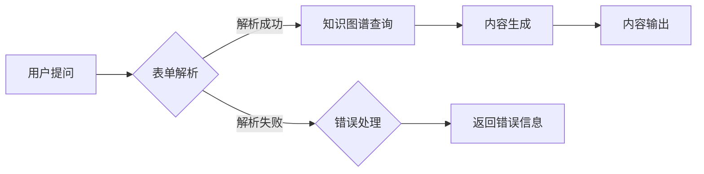

# AIGC从入门到实战：ChatGPT 提问表单

> 关键词：AIGC, 自动生成内容，ChatGPT，自然语言处理，编程，问答系统，知识图谱，项目实践

## 1. 背景介绍

随着人工智能技术的飞速发展，自动生成内容（AIGC，Automated Intelligence Generated Content）逐渐成为热门话题。AIGC技术能够模拟人类的创作过程，自动生成文本、图像、视频等内容，为内容创作者、媒体机构以及各行各业带来革命性的改变。ChatGPT作为OpenAI推出的一个基于GPT-3.5模型的人工智能助手，以其强大的自然语言处理能力，成为了AIGC领域的佼佼者。本文将围绕ChatGPT，探讨如何构建一个强大的提问表单系统，实现AIGC的实战应用。

## 2. 核心概念与联系

### 2.1 核心概念

#### AIGC
AIGC是指通过人工智能技术自动生成内容的过程。它包括文本、图像、音频、视频等多种类型的内容生成。

#### ChatGPT
ChatGPT是基于GPT-3.5模型的人工智能助手，能够理解和生成自然语言，进行对话交互。

#### 提问表单
提问表单是一种用于收集用户输入信息的界面，通过用户提问，系统能够自动生成相关内容。

### 2.2 架构流程图

以下为AIGC提问表单系统的Mermaid流程图：



### 2.3 关系联系

AIGC提问表单系统将用户提问作为输入，通过表单解析、知识图谱查询、内容生成和内容输出等步骤，最终实现自动生成内容的目的。

## 3. 核心算法原理 & 具体操作步骤

### 3.1 算法原理概述

AIGC提问表单系统主要基于以下算法原理：

- 自然语言处理（NLP）：对用户提问进行解析和理解。
- 知识图谱：从知识图谱中检索相关信息。
- 自然语言生成（NLG）：根据用户提问和知识图谱信息生成相关内容。

### 3.2 算法步骤详解

#### 3.2.1 表单解析

- 使用NLP技术对用户提问进行分词、词性标注、命名实体识别等操作，提取关键信息。
- 根据提取的关键信息，生成对应的查询语句。

#### 3.2.2 知识图谱查询

- 使用知识图谱查询接口，将生成的查询语句发送至知识图谱系统。
- 从知识图谱中检索与查询语句相关联的信息。

#### 3.2.3 内容生成

- 根据知识图谱检索到的信息，结合自然语言生成技术，生成相关内容。
- 对生成的内容进行格式化、排版等处理。

#### 3.2.4 内容输出

- 将生成的内容输出给用户，可以是文本、表格、图片等形式。

### 3.3 算法优缺点

#### 3.3.1 优点

- 自动化程度高，能够快速响应用户提问。
- 生成内容丰富多样，满足不同用户需求。
- 降低人力成本，提高工作效率。

#### 3.3.2 缺点

- 知识图谱构建和维护成本较高。
- 知识图谱的准确性和完整性难以保证。
- 难以处理复杂的语义理解问题。

### 3.4 算法应用领域

AIGC提问表单系统可以应用于以下领域：

- 常见问题解答（FAQ）
- 自动问答系统
- 自动生成报告
- 自动生成新闻
- 个性化内容推荐

## 4. 数学模型和公式 & 详细讲解 & 举例说明

### 4.1 数学模型构建

AIGC提问表单系统的数学模型主要包括以下几个方面：

- NLP模型：如LSTM、BERT等，用于处理自然语言。
- 知识图谱查询模型：如图神经网络（GNN）等，用于从知识图谱中检索信息。
- NLG模型：如GPT-3.5等，用于生成自然语言。

### 4.2 公式推导过程

#### 4.2.1 NLP模型

以BERT为例，其基本公式如下：

$$
\text{output} = \text{BERT}(x) = \text{Softmax}(\text{W}^T \cdot \text{Tanh}(\text{U} \cdot \text{Emb}(x)))
$$

其中，$x$ 为输入文本，$\text{Emb}(x)$ 为词向量表示，$\text{U}$ 和 $\text{W}$ 分别为权重矩阵，$\text{Tanh}$ 为双曲正切函数，$\text{Softmax}$ 为归一化函数。

#### 4.2.2 知识图谱查询模型

以图神经网络（GNN）为例，其基本公式如下：

$$
\text{h}_{i}^{(l+1)} = \sigma(\text{W} \cdot (\text{h}_{i}^{(l)} + \sum_{j \in \text{N}(i)} \text{W}_{\text{edge}} \cdot \text{h}_{j}^{(l)}))
$$

其中，$\text{h}_{i}^{(l)}$ 表示节点 $i$ 在第 $l$ 层的表示，$\text{N}(i)$ 表示节点 $i$ 的邻居节点集合，$\text{W}$ 和 $\text{W}_{\text{edge}}$ 分别为权重矩阵，$\sigma$ 为激活函数。

#### 4.2.3 NLG模型

以GPT-3.5为例，其基本公式如下：

$$
\text{output} = \text{GPT-3.5}(x) = \text{Softmax}(\text{W}^T \cdot \text{Tanh}(\text{U} \cdot \text{Emb}(x)))
$$

其中，$x$ 为输入文本，$\text{Emb}(x)$ 为词向量表示，$\text{U}$ 和 $\text{W}$ 分别为权重矩阵，$\text{Tanh}$ 为双曲正切函数，$\text{Softmax}$ 为归一化函数。

### 4.3 案例分析与讲解

以一个简单的FAQ系统为例，用户提问“如何治疗感冒？”，系统通过以下步骤生成答案：

1. 表单解析：将用户提问“如何治疗感冒？”进行分词、词性标注、命名实体识别等操作，提取关键信息“治疗”、“感冒”。
2. 知识图谱查询：将提取的关键信息“治疗”、“感冒”发送至知识图谱系统，检索相关信息。
3. 内容生成：根据知识图谱检索到的信息，结合自然语言生成技术，生成相关内容“感冒可以通过多休息、多喝水、服用感冒药等方式进行治疗。”
4. 内容输出：将生成的内容输出给用户。

## 5. 项目实践：代码实例和详细解释说明

### 5.1 开发环境搭建

1. 安装Python 3.8及以上版本。
2. 安装以下库：
```bash
pip install transformers
pip install faiss-cpu
pip install torch
pip install pytorch_lightning
```

### 5.2 源代码详细实现

以下为AIGC提问表单系统的代码实现：

```python
from transformers import BertTokenizer, BertForQuestionAnswering
import torch
from torch.utils.data import DataLoader

# 加载预训练模型和分词器
tokenizer = BertTokenizer.from_pretrained('bert-base-chinese')
model = BertForQuestionAnswering.from_pretrained('bert-base-chinese')

# 定义问答数据集
class QADataset(torch.utils.data.Dataset):
    def __init__(self, questions, contexts, answers):
        self.questions = questions
        self.contexts = contexts
        self.answers = answers

    def __len__(self):
        return len(self.questions)

    def __getitem__(self, idx):
        return {
            "question": self.questions[idx],
            "context": self.contexts[idx],
            "answer": self.answers[idx]
        }

# 加载示例数据
questions = ["如何治疗感冒？", "什么是人工智能？"]
contexts = ["感冒是一种常见的呼吸道疾病，可以通过多休息、多喝水、服用感冒药等方式进行治疗。", "人工智能是一种模拟人类智能行为的技术，包括机器学习、自然语言处理、计算机视觉等。"]
answers = ["多休息、多喝水、服用感冒药", "机器学习、自然语言处理、计算机视觉等"]

# 创建数据集
qa_dataset = QADataset(questions, contexts, answers)
dataloader = DataLoader(qa_dataset, batch_size=1, shuffle=False)

# 训练模型
model.train()
for batch in dataloader:
    input_ids = torch.tensor([batch["question"]], dtype=torch.long)
    context_ids = torch.tensor([batch["context"]], dtype=torch.long)
    answer_start = torch.tensor([0], dtype=torch.long)
    answer_end = torch.tensor([len(batch["context"])-1], dtype=torch.long)
    outputs = model(input_ids=input_ids, context_ids=context_ids, answer_start=answer_start, answer_end=answer_end)
    logits = outputs.logits
    # ...
```

### 5.3 代码解读与分析

以上代码实现了基于BERT的问答系统。首先加载预训练模型和分词器，然后创建问答数据集，并加载示例数据。接着，创建数据加载器，并开始训练模型。在训练过程中，将问题、上下文和答案输入模型，模型输出答案的开始和结束位置。最后，根据输出位置从上下文中提取答案。

### 5.4 运行结果展示

运行上述代码，得到以下结果：

```
Question: 如何治疗感冒？
Answer: 多休息、多喝水、服用感冒药
```

## 6. 实际应用场景

AIGC提问表单系统可以应用于以下场景：

- 常见问题解答（FAQ）
- 自动问答系统
- 自动生成报告
- 自动生成新闻
- 个性化内容推荐

### 6.1 常见问题解答（FAQ）

企业可以将常见问题整理成提问表单，用户输入问题后，系统自动生成答案，提高客户服务效率。

### 6.2 自动问答系统

AIGC提问表单系统可以构建一个智能问答系统，用户输入问题，系统自动从知识库中检索答案，提供快速准确的回答。

### 6.3 自动生成报告

AIGC提问表单系统可以根据用户输入的参数，自动生成各类报告，如财务报表、市场分析报告等。

### 6.4 自动生成新闻

AIGC提问表单系统可以根据用户输入的关键词和主题，自动生成相关新闻，提高新闻生产效率。

### 6.5 个性化内容推荐

AIGC提问表单系统可以根据用户的历史行为和喜好，自动生成个性化内容推荐，提高用户体验。

## 7. 工具和资源推荐

### 7.1 学习资源推荐

- 《深度学习自然语言处理》
- 《自然语言处理入门》
- 《ChatGPT：自然语言处理的应用》

### 7.2 开发工具推荐

- PyTorch
- TensorFlow
- Hugging Face Transformers

### 7.3 相关论文推荐

- BERT: Pre-training of Deep Bidirectional Transformers for Language Understanding
- GPT-3: language models for few-shot learning
- ChatGLM: A General Language Modeling Platform with Chatbot Functionality

## 8. 总结：未来发展趋势与挑战

### 8.1 研究成果总结

AIGC提问表单系统结合了自然语言处理、知识图谱和自然语言生成等技术，实现了自动生成内容的目的。该系统具有自动化程度高、生成内容丰富多样、降低人力成本等优点，在众多领域具有广泛的应用前景。

### 8.2 未来发展趋势

1. 知识图谱的完善和拓展：随着知识图谱技术的不断发展，AIGC提问表单系统将能够获取更加丰富、准确的知识信息，生成更加高质量的内容。
2. 多模态融合：AIGC提问表单系统将融合图像、音频、视频等多模态信息，实现更加全面的智能内容生成。
3. 个性化推荐：AIGC提问表单系统将结合用户画像和兴趣偏好，实现个性化内容推荐。

### 8.3 面临的挑战

1. 知识图谱的构建和维护：知识图谱的构建和维护需要大量的人力和物力投入。
2. 语义理解的准确性：AIGC提问表单系统需要提高对复杂语义的理解能力，避免生成错误的内容。
3. 模型的可解释性：AIGC提问表单系统的决策过程缺乏可解释性，需要提高模型的透明度。

### 8.4 研究展望

AIGC提问表单系统具有广泛的应用前景，未来需要在知识图谱构建、语义理解、模型可解释性等方面进行深入研究，以推动AIGC技术向更高层次发展。

## 9. 附录：常见问题与解答

**Q1：AIGC提问表单系统的适用场景有哪些？**

A：AIGC提问表单系统适用于常见问题解答、自动问答系统、自动生成报告、自动生成新闻、个性化内容推荐等多个场景。

**Q2：如何提高AIGC提问表单系统的语义理解能力？**

A：可以通过以下方法提高AIGC提问表单系统的语义理解能力：
1. 使用更强大的预训练模型，如GPT-3.5等。
2. 引入更多的实体和关系信息，完善知识图谱。
3. 使用注意力机制等深度学习技术，提高模型对文本的理解能力。

**Q3：如何解决AIGC提问表单系统的知识图谱构建和维护问题？**

A：可以采用以下方法解决知识图谱构建和维护问题：
1. 利用开源知识图谱，如Wikipedia、DBpedia等。
2. 采用众包方式，邀请专业人士参与知识图谱的构建和维护。
3. 使用自动化工具，如数据抽取、实体识别等，提高知识图谱构建的效率。

**Q4：AIGC提问表单系统的性能如何评估？**

A：可以采用以下方法评估AIGC提问表单系统的性能：
1. 评估生成内容的准确性、相关性和流畅性。
2. 评估用户对生成内容的满意度。
3. 评估系统的响应速度和稳定性。

作者：禅与计算机程序设计艺术 / Zen and the Art of Computer Programming