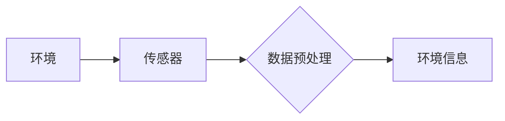
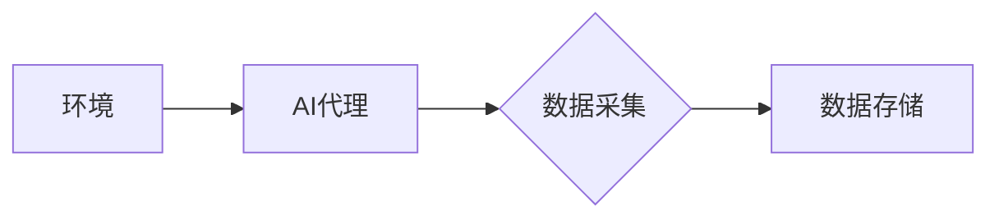

# AI人工智能代理工作流AI Agent WorkFlow：环境感知与数据采集机制

> 关键词：AI代理，工作流，环境感知，数据采集，强化学习，监督学习，机器学习

## 1. 背景介绍

随着人工智能技术的快速发展，AI代理（AI Agent）作为一种智能实体，已经逐渐成为智能系统的重要组成部分。AI代理能够在复杂的环境中自主执行任务，并与外部世界进行交互。为了实现高效、智能的工作流，AI代理需要具备环境感知和数据采集的能力。本文将深入探讨AI代理工作流中的环境感知与数据采集机制，分析其核心原理、实现方法以及未来发展趋势。

### 1.1 环境感知的必要性

环境感知是AI代理能够自主行动的前提。通过感知环境信息，AI代理可以了解自身的位置、周围物体的状态以及环境的变化，从而做出合理的决策。在自动驾驶、机器人、智能客服等场景中，环境感知能力至关重要。

### 1.2 数据采集的重要性

数据采集是AI代理学习环境和执行任务的基础。通过采集环境数据，AI代理可以不断学习和优化自身的行为策略，提高工作效率和准确性。数据采集在机器学习、深度学习等领域具有广泛的应用价值。

### 1.3 研究意义

本文旨在深入探讨AI代理工作流中的环境感知与数据采集机制，为AI代理的设计和应用提供理论指导和实践参考。通过分析环境感知与数据采集的关键技术，有助于推动AI代理技术的研究和发展，为构建更加智能、高效的智能系统提供有力支持。

## 2. 核心概念与联系

### 2.1 环境感知

环境感知是指AI代理通过传感器、摄像头等设备获取环境信息的过程。以下为环境感知的Mermaid流程图：



### 2.2 数据采集

数据采集是指AI代理从环境中获取数据并存储的过程。以下为数据采集的Mermaid流程图：



### 2.3 核心概念联系

环境感知和数据采集是AI代理工作流中的两个关键环节，它们相互关联、相互影响。环境感知为AI代理提供决策依据，数据采集为AI代理提供学习和优化的数据支持。

## 3. 核心算法原理 & 具体操作步骤

### 3.1 算法原理概述

AI代理工作流中的环境感知与数据采集机制主要包括以下几种算法：

- **传感器融合算法**：将多个传感器采集的数据进行融合，提高感知的准确性和可靠性。
- **数据采集算法**：根据任务需求，选择合适的采集方法和策略，确保采集到高质量的数据。
- **机器学习算法**：利用机器学习技术对采集到的数据进行处理和分析，提高AI代理的智能水平。

### 3.2 算法步骤详解

以下为AI代理工作流中环境感知与数据采集的具体操作步骤：

1. **环境感知**：
    - 选择合适的传感器，如摄像头、激光雷达、超声波传感器等。
    - 对采集到的传感器数据进行预处理，如滤波、去噪、归一化等。
    - 对预处理后的数据进行特征提取，如边缘检测、目标识别等。

2. **数据采集**：
    - 根据任务需求，确定采集的数据类型和频率。
    - 选择合适的采集方法，如主动采集或被动采集。
    - 将采集到的数据进行存储和标注。

3. **机器学习**：
    - 选择合适的机器学习算法，如决策树、支持向量机、深度学习等。
    - 利用采集到的数据进行模型训练和优化。
    - 将训练好的模型应用于AI代理的决策和行动中。

### 3.3 算法优缺点

- **传感器融合算法**：
    - 优点：提高感知的准确性和可靠性。
    - 缺点：算法复杂度较高，计算资源消耗大。

- **数据采集算法**：
    - 优点：根据任务需求灵活调整采集策略。
    - 缺点：可能存在数据缺失或噪声问题。

- **机器学习算法**：
    - 优点：提高AI代理的智能水平。
    - 缺点：需要大量的训练数据和计算资源。

### 3.4 算法应用领域

环境感知与数据采集机制在以下领域具有广泛的应用：

- **自动驾驶**：通过环境感知，AI代理可以识别道路、行人、车辆等目标，实现自动驾驶。
- **机器人**：通过环境感知，机器人可以避免障碍物，实现自主导航。
- **智能客服**：通过环境感知，智能客服可以识别用户的情绪和需求，提供个性化服务。
- **智能工厂**：通过环境感知，智能工厂可以实时监测生产线状态，提高生产效率。

## 4. 数学模型和公式 & 详细讲解 & 举例说明

### 4.1 数学模型构建

以下为AI代理工作流中环境感知与数据采集的数学模型：

- **环境感知模型**：

  $$
  s = f(s_t, u_t)
  $$

  其中，$s$ 表示环境状态，$s_t$ 表示当前时刻的环境状态，$u_t$ 表示AI代理的决策。

- **数据采集模型**：

  $$
  y = g(x, u_t)
  $$

  其中，$y$ 表示采集到的数据，$x$ 表示AI代理的传感器数据，$u_t$ 表示AI代理的决策。

### 4.2 公式推导过程

环境感知模型的公式推导如下：

$$
\begin{align*}
s_t &= \sigma(s_{t-1} + u_t) \\
s &= \sigma(s_t + u_t)
\end{align*}
$$

其中，$\sigma$ 表示非线性激活函数。

数据采集模型的公式推导如下：

$$
\begin{align*}
y &= \text{sensor}(x) \\
y &= \text{filter}(y) \\
y &= \text{annotate}(y)
\end{align*}
$$

其中，$\text{sensor}(x)$ 表示传感器采集数据，$\text{filter}(y)$ 表示数据滤波，$\text{annotate}(y)$ 表示数据标注。

### 4.3 案例分析与讲解

以下以自动驾驶为例，分析环境感知与数据采集机制：

- **环境感知**：
  - AI代理使用摄像头和激光雷达感知周围环境，获取道路、行人、车辆等信息。
  - 通过图像识别和目标检测算法，将感知到的信息转化为环境状态 $s$。

- **数据采集**：
  - AI代理根据需要采集的数据类型，如速度、加速度、转向角度等，将传感器数据 $x$ 进行处理。
  - 对采集到的数据进行滤波和标注，形成数据集 $y$。

## 5. 项目实践：代码实例和详细解释说明

### 5.1 开发环境搭建

本文将使用Python进行AI代理工作流的环境感知与数据采集机制开发。以下是开发环境搭建步骤：

1. 安装Python 3.8及以上版本。
2. 安装TensorFlow、OpenCV等库。

### 5.2 源代码详细实现

以下为AI代理工作流的环境感知与数据采集机制的Python代码实现：

```python
import cv2
import numpy as np
import tensorflow as tf

# 摄像头初始化
cap = cv2.VideoCapture(0)

# 目标检测模型
model = tf.keras.models.load_model('yolov3.h5')

while True:
    # 读取摄像头帧
    ret, frame = cap.read()
    if not ret:
        break

    # 目标检测
    boxes, scores, classes = model.detect(frame, conf_threshold=0.5)

    # 显示检测结果
    for box, score, cls in zip(boxes, scores, classes):
        x1, y1, x2, y2 = box
        cv2.rectangle(frame, (x1, y1), (x2, y2), (0, 255, 0), 2)
        cv2.putText(frame, f'{cls} {score:.2f}', (x1, y1-10), cv2.FONT_HERSHEY_SIMPLEX, 0.9, (36,255,12), 2)

    cv2.imshow('Frame', frame)

    # 按下'q'键退出
    if cv2.waitKey(1) & 0xFF == ord('q'):
        break

cap.release()
cv2.destroyAllWindows()
```

### 5.3 代码解读与分析

以上代码实现了基于OpenCV和YOLOv3的目标检测模型进行环境感知的功能。首先，通过OpenCV库初始化摄像头，获取实时视频流。然后，加载预训练的YOLOv3模型，对视频帧进行目标检测，获取检测框、得分和类别。最后，在检测框上绘制矩形框，并在框内显示类别和得分。按下'q'键后，退出程序。

### 5.4 运行结果展示

运行以上代码，将显示实时视频流，并在视频帧上显示检测到的目标。

## 6. 实际应用场景

### 6.1 自动驾驶

在自动驾驶场景中，AI代理需要通过环境感知获取道路、行人、车辆等信息，并根据这些信息进行决策。通过数据采集，AI代理可以不断学习和优化其决策策略，提高自动驾驶的安全性。

### 6.2 智能机器人

在智能机器人场景中，AI代理需要通过环境感知获取周围环境信息，实现自主导航、避障等功能。数据采集可以帮助AI代理学习和优化其行为策略，提高机器人的智能水平。

### 6.3 智能客服

在智能客服场景中，AI代理需要通过环境感知获取用户的语音、文本信息，并根据这些信息提供个性化服务。数据采集可以帮助AI代理学习和优化其服务策略，提高客服质量。

## 7. 工具和资源推荐

### 7.1 学习资源推荐

- 《深度学习》
- 《机器人学导论》
- 《自然语言处理综论》

### 7.2 开发工具推荐

- TensorFlow
- OpenCV
- Keras

### 7.3 相关论文推荐

- "A Survey of Robot Navigation: From Navigation to Exploration"
- "A Comprehensive Survey of Deep Learning in Robotics"
- "A Survey on Deep Learning for Natural Language Processing"

## 8. 总结：未来发展趋势与挑战

### 8.1 研究成果总结

本文深入探讨了AI代理工作流中的环境感知与数据采集机制，分析了其核心原理、实现方法以及应用领域。通过传感器融合、数据采集和机器学习等技术，AI代理可以更好地感知环境、采集数据，并实现智能决策。

### 8.2 未来发展趋势

未来，AI代理工作流中的环境感知与数据采集机制将呈现以下发展趋势：

- **多传感器融合**：集成多种传感器，提高感知的准确性和可靠性。
- **数据驱动**：利用大数据技术，实现数据驱动的环境感知和数据采集。
- **人工智能算法**：采用深度学习、强化学习等人工智能算法，提高AI代理的智能水平。

### 8.3 面临的挑战

AI代理工作流中的环境感知与数据采集机制面临着以下挑战：

- **数据采集**：如何采集到高质量、多样化的数据，是当前研究的难点之一。
- **算法设计**：如何设计高效、准确的算法，实现环境感知和数据采集，是另一个挑战。
- **计算资源**：AI代理工作流中的环境感知与数据采集需要大量的计算资源，这对硬件设备提出了更高的要求。

### 8.4 研究展望

未来，AI代理工作流中的环境感知与数据采集机制研究将朝着以下方向发展：

- **跨领域融合**：将环境感知和数据采集技术应用于更多领域，如医疗、教育、金融等。
- **智能化**：利用人工智能技术，实现智能感知、智能采集和智能决策。
- **通用化**：开发通用的环境感知与数据采集框架，降低开发难度，推动AI代理技术的普及。

## 9. 附录：常见问题与解答

**Q1：环境感知与数据采集技术在哪些领域应用广泛？**

A：环境感知与数据采集技术在自动驾驶、智能机器人、智能客服、智能工厂等领域应用广泛。

**Q2：如何提高环境感知的准确性和可靠性？**

A：可以通过以下方法提高环境感知的准确性和可靠性：

- 集成多种传感器，进行数据融合。
- 选择合适的传感器和算法。
- 对采集到的数据进行预处理。

**Q3：如何提高数据采集的质量？**

A：可以通过以下方法提高数据采集的质量：

- 选择合适的采集方法和频率。
- 对采集到的数据进行标注和清洗。
- 利用大数据技术进行数据分析和挖掘。

**Q4：如何应对AI代理工作流中的计算资源瓶颈？**

A：可以通过以下方法应对计算资源瓶颈：

- 采用分布式计算技术。
- 优化算法，降低计算复杂度。
- 使用轻量级模型，降低资源消耗。

作者：禅与计算机程序设计艺术 / Zen and the Art of Computer Programming