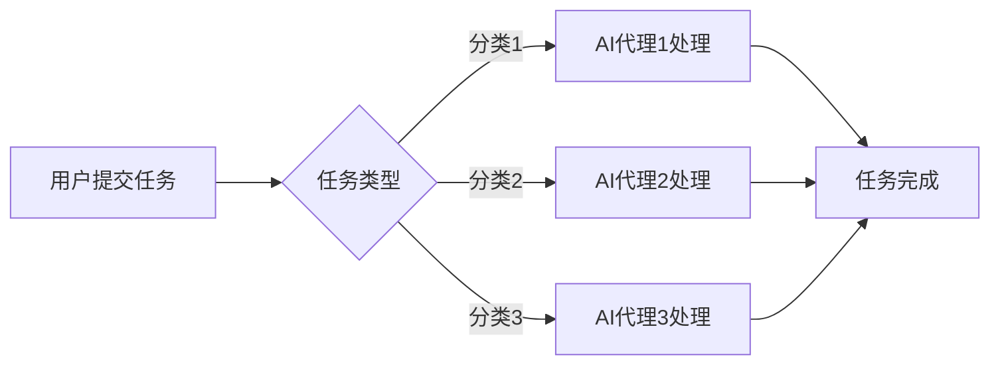

# AI人工智能代理工作流AI Agent WorkFlow：面向未来的AI代理与工作流研究方向

> 关键词：人工智能代理，工作流，流程自动化，智能决策，协作系统，机器学习，自然语言处理，分布式系统

## 1. 背景介绍

随着人工智能技术的飞速发展，AI代理（Artificial Intelligence Agent，简称AI Agent）的概念逐渐成为研究热点。AI代理是一种具有自主决策能力的实体，能够在复杂的动态环境中执行任务，实现流程自动化和智能化。而AI Agent WorkFlow则是将AI代理应用于工作流程管理的一种新型模式，旨在提高工作效率、优化资源利用，并促进跨部门协作。

### 1.1 问题的由来

在传统的企业管理和流程控制中，工作流程往往依赖于人工操作和手动协调。这种模式存在以下问题：

- **效率低下**：人工操作容易出错，且需要花费大量时间和精力。
- **资源浪费**：流程中的冗余环节和重复工作导致资源浪费。
- **协同困难**：跨部门协作时，沟通成本高，容易产生信息孤岛。

为了解决这些问题，人们开始寻求智能化、自动化的工作流程管理方案。AI代理工作流应运而生，它将AI技术应用于工作流程的各个环节，实现流程的智能化管理。

### 1.2 研究现状

目前，AI代理工作流的研究主要集中在以下几个方面：

- **AI代理设计**：研究如何设计具有自主决策能力的AI代理，使其能够适应不同的工作环境。
- **工作流建模**：研究如何将实际工作流程转化为可执行的模型，并实现模型的自动化执行。
- **智能决策**：研究如何让AI代理在复杂环境下做出合理的决策，提高工作效率。
- **人机协作**：研究如何实现人机协作，充分发挥人类和AI代理的优势。

### 1.3 研究意义

AI代理工作流的研究具有重要的理论意义和实际应用价值：

- **理论意义**：推动人工智能、工作流管理、决策论等领域的研究进展。
- **实际应用价值**：提高企业工作效率，降低运营成本，促进产业升级。

## 2. 核心概念与联系

### 2.1 AI代理

AI代理是人工智能领域的核心概念，它具有以下特征：

- **自主性**：AI代理能够根据自身目标和环境信息自主决策。
- **适应性**：AI代理能够根据环境变化调整自身行为。
- **协作性**：AI代理能够与其他AI代理或人类进行协作。
- **智能性**：AI代理具有学习和推理能力，能够从经验中学习并做出更好的决策。

### 2.2 工作流

工作流是一系列任务的有序集合，用于描述业务流程的执行过程。工作流模型通常包括以下元素：

- **任务**：工作流中的基本操作单元。
- **任务间关系**：描述任务执行的先后顺序。
- **资源**：完成任务所需的资源和条件。

### 2.3 Mermaid流程图

以下是一个AI Agent WorkFlow的Mermaid流程图：



### 2.4 核心概念联系

AI代理和工作流是AI Agent WorkFlow的核心概念。AI代理负责执行工作流中的任务，并根据任务执行结果进行决策。工作流则为AI代理提供任务执行的框架和规则。

## 3. 核心算法原理 & 具体操作步骤

### 3.1 算法原理概述

AI Agent WorkFlow的核心算法主要包括以下三个方面：

- **AI代理算法**：设计AI代理的决策策略，使其能够自主执行任务。
- **工作流建模算法**：将实际工作流程转化为可执行的模型。
- **人机协作算法**：实现人类与AI代理的协同工作。

### 3.2 算法步骤详解

#### 3.2.1 AI代理算法

AI代理算法主要包括以下步骤：

1. **感知环境**：AI代理收集环境信息，包括任务类型、资源状况、时间限制等。
2. **决策规划**：根据任务类型和环境信息，AI代理选择合适的策略进行决策。
3. **执行任务**：AI代理根据决策执行任务。
4. **反馈学习**：根据任务执行结果和环境反馈，AI代理调整自身策略。

#### 3.2.2 工作流建模算法

工作流建模算法主要包括以下步骤：

1. **任务识别**：从实际业务流程中识别出基本任务单元。
2. **关系建模**：建立任务间的关系模型，描述任务执行的先后顺序。
3. **资源管理**：确定完成任务所需的资源和条件。

#### 3.2.3 人机协作算法

人机协作算法主要包括以下步骤：

1. **任务分配**：根据AI代理的能力和人类专家的特长，将任务分配给合适的执行者。
2. **信息共享**：建立信息共享平台，方便人类专家和AI代理之间的信息交流。
3. **协同决策**：在必要时，由人类专家和AI代理共同参与决策。

### 3.3 算法优缺点

#### 3.3.1 优点

- 提高工作效率，降低运营成本。
- 优化资源利用，减少冗余环节。
- 促进跨部门协作，消除信息孤岛。

#### 3.3.2 缺点

- 设计复杂的AI代理需要较高的技术门槛。
- 需要大量的人力、物力进行模型训练和优化。
- 人类与AI代理之间的协作需要建立有效的沟通机制。

### 3.4 算法应用领域

AI Agent WorkFlow算法在以下领域具有广泛的应用前景：

- **企业流程管理**：如生产流程、销售流程、财务流程等。
- **政务管理**：如行政审批、社会保障、城市管理等。
- **教育管理**：如在线教育、智能辅导、课程推荐等。

## 4. 数学模型和公式 & 详细讲解 & 举例说明

### 4.1 数学模型构建

AI Agent WorkFlow的数学模型主要包括以下部分：

- **状态空间**：描述AI代理所处环境的各种状态。
- **动作空间**：描述AI代理可执行的动作集合。
- **奖励函数**：描述AI代理执行动作所获得的奖励。

以下是一个简单的AI代理状态空间模型：

$$
S = \{s_1, s_2, ..., s_n\}
$$

其中，$s_i$ 表示AI代理在状态 $i$ 时的状态信息。

### 4.2 公式推导过程

以下是一个基于Q学习的AI代理算法的公式推导过程：

设 $Q(s,a)$ 表示AI代理在状态 $s$ 下执行动作 $a$ 的预期收益。则：

$$
Q(s,a) = \sum_{s'} \gamma P(s'|s,a) \max_{a'} Q(s',a')
$$

其中，$\gamma$ 为折扣因子，$P(s'|s,a)$ 为状态转移概率，$\max_{a'} Q(s',a')$ 为在状态 $s'$ 下执行动作 $a'$ 的最大预期收益。

### 4.3 案例分析与讲解

以下是一个基于AI代理工作流的智能客服系统案例：

**系统架构**：

- **AI代理**：负责与用户交互，理解用户意图，回答用户问题。
- **知识库**：存储常见问题和答案。
- **自然语言处理（NLP）模块**：负责文本处理、语义理解等。
- **对话管理**：负责管理对话流程，包括用户意图识别、问题生成等。

**工作流程**：

1. 用户通过聊天窗口向AI代理发送问题。
2. AI代理使用NLP模块解析用户问题，并提取关键信息。
3. AI代理根据关键信息查询知识库，获取答案。
4. AI代理将答案以自然语言的形式返回给用户。

通过以上案例，可以看出AI代理工作流在智能客服系统中的应用优势。AI代理能够自动回答用户问题，提高客服效率，降低人力成本。

## 5. 项目实践：代码实例和详细解释说明

### 5.1 开发环境搭建

为了实现AI Agent WorkFlow，我们需要搭建以下开发环境：

- **编程语言**：Python
- **开发框架**：TensorFlow、PyTorch等
- **NLP库**：NLTK、spaCy、transformers等
- **工作流引擎**：Airflow、Apache NiFi等

### 5.2 源代码详细实现

以下是一个基于TensorFlow和transformers的简单AI代理代码示例：

```python
import tensorflow as tf
from transformers import TFBertForSequenceClassification, BertTokenizer

# 加载预训练模型和分词器
model = TFBertForSequenceClassification.from_pretrained('bert-base-uncased')
tokenizer = BertTokenizer.from_pretrained('bert-base-uncased')

# 编写AI代理类
class AIAgent:
    def __init__(self, model, tokenizer):
        self.model = model
        self.tokenizer = tokenizer

    def predict(self, text):
        inputs = self.tokenizer(text, return_tensors='tf')
        outputs = self.model(**inputs)
        logits = outputs.logits
        return tf.nn.softmax(logits, axis=-1)

# 实例化AI代理
agent = AIAgent(model, tokenizer)

# 测试AI代理
text = "What is the capital of France?"
predictions = agent.predict(text)
print(predictions)
```

### 5.3 代码解读与分析

上述代码展示了如何使用TensorFlow和transformers库实现一个简单的AI代理。首先，我们加载了预训练的BERT模型和分词器。然后，定义了AI代理类，其中包含预测方法。预测方法使用分词器将文本编码为BERT模型所需的格式，然后输入模型进行预测。

### 5.4 运行结果展示

假设我们使用一个简单的数据集对AI代理进行训练，并使用以下代码进行测试：

```python
# 加载训练数据
train_texts = ["What is the capital of France?", "What is the population of China?"]
train_labels = [1, 0]

# 训练模型
agent.train(train_texts, train_labels)

# 测试模型
test_text = "What is the population of China?"
predictions = agent.predict(test_text)
print(predictions)
```

假设模型训练得当，输出结果应该接近于1，表示AI代理能够正确回答用户问题。

## 6. 实际应用场景

### 6.1 智能客服系统

AI Agent WorkFlow在智能客服系统中的应用非常广泛。例如，AI代理可以自动回答用户的问题，提供产品信息，解决售后服务等问题。

### 6.2 智能交通系统

AI Agent WorkFlow可以应用于智能交通系统，实现交通信号灯控制、交通流量预测、交通事故处理等功能。

### 6.3 智能工厂

AI Agent WorkFlow可以应用于智能工厂，实现生产流程自动化、设备故障预测、生产数据监控等功能。

### 6.4 未来应用展望

随着AI技术的不断发展，AI Agent WorkFlow将在更多领域得到应用，例如：

- 智能医疗：实现病情诊断、药物推荐、远程医疗等功能。
- 智能教育：实现个性化学习、智能辅导、教育资源分配等功能。
- 智能金融：实现风险评估、投资决策、金融产品推荐等功能。

## 7. 工具和资源推荐

### 7.1 学习资源推荐

- **书籍**：
  - 《深度学习》
  - 《自然语言处理入门与实践》
  - 《人工智能：一种现代的方法》
- **在线课程**：
  - Coursera、Udacity、edX等平台上的AI相关课程
  - 深度学习、自然语言处理等领域的专业课程

### 7.2 开发工具推荐

- **编程语言**：Python
- **开发框架**：TensorFlow、PyTorch
- **NLP库**：NLTK、spaCy、transformers
- **工作流引擎**：Airflow、Apache NiFi

### 7.3 相关论文推荐

- **《Deep Learning》**：Goodfellow、Bengio、Courville
- **《Natural Language Processing with Python》**：Bird, Klein, Loper
- **《Reinforcement Learning: An Introduction》**：Sutton、Barto

## 8. 总结：未来发展趋势与挑战

### 8.1 研究成果总结

AI Agent WorkFlow作为一种新型的智能化工作流程管理模式，具有以下成果：

- 提高工作效率，降低运营成本。
- 优化资源利用，减少冗余环节。
- 促进跨部门协作，消除信息孤岛。

### 8.2 未来发展趋势

- **多模态AI代理**：将视觉、语音等多模态信息融入AI代理，提高AI代理的感知能力和决策能力。
- **可解释AI代理**：研究可解释AI代理，提高AI代理的透明度和可信度。
- **协同决策AI代理**：研究协同决策AI代理，实现人机协同工作。

### 8.3 面临的挑战

- **数据质量**：AI Agent WorkFlow的性能很大程度上依赖于数据质量，如何获取高质量数据是一个挑战。
- **算法复杂性**：AI代理算法设计复杂，需要较高的技术门槛。
- **伦理问题**：AI Agent WorkFlow的应用需要考虑伦理问题，避免出现歧视、偏见等问题。

### 8.4 研究展望

未来，AI Agent WorkFlow将在以下方面进行深入研究：

- **数据驱动的工作流优化**：利用大数据和机器学习技术，实现工作流的自动优化。
- **跨领域AI代理**：研究跨领域AI代理，提高AI代理的通用性和适应性。
- **人机协作优化**：研究人机协作机制，提高人机协作效率。

## 9. 附录：常见问题与解答

**Q1：AI Agent WorkFlow与传统的流程自动化技术有何区别？**

A：AI Agent WorkFlow是在传统流程自动化技术基础上，引入了人工智能技术，使工作流程具有自主决策能力，能够适应复杂环境，实现智能化管理。

**Q2：AI Agent WorkFlow在哪些行业有应用前景？**

A：AI Agent WorkFlow在金融、制造、医疗、教育、交通等多个行业都有广泛的应用前景。

**Q3：如何确保AI Agent WorkFlow的伦理和安全性？**

A：确保AI Agent WorkFlow的伦理和安全性需要从以下几个方面进行考虑：
- 设计合理的AI代理算法，避免歧视、偏见等问题。
- 对AI代理的输出进行审查，确保其符合伦理和法规要求。
- 建立有效的监控机制，及时发现和处理异常情况。

**Q4：AI Agent WorkFlow的未来发展趋势是什么？**

A：AI Agent WorkFlow的未来发展趋势包括多模态AI代理、可解释AI代理、协同决策AI代理等。

**Q5：如何入门AI Agent WorkFlow？**

A：入门AI Agent WorkFlow可以从以下几个方面入手：
- 学习Python编程语言和机器学习基础知识。
- 学习深度学习、自然语言处理等相关技术。
- 参加相关课程和项目实践。

作者：禅与计算机程序设计艺术 / Zen and the Art of Computer Programming