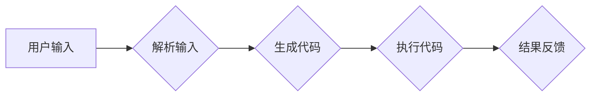

# 【LangChain编程：从入门到实践】大模型原理解释

> 关键词：LangChain, 大模型, 编程范式, 预训练语言模型, 自动编程, 知识图谱, 代码生成, 工具链

## 1. 背景介绍

近年来，随着人工智能技术的飞速发展，自然语言处理（NLP）领域取得了突破性进展。预训练语言模型（Pre-trained Language Models，PLMs）如BERT、GPT系列等，在语言理解和生成方面展现出惊人的能力。然而，这些模型的应用往往需要复杂的编程和工程技巧，对普通开发者来说门槛较高。

为了降低NLP技术在编程领域的应用门槛，LangChain应运而生。LangChain是一种新的编程范式，它将大模型与编程任务相结合，使得开发者能够以更简单、更直观的方式利用NLP技术。本文将深入探讨LangChain的原理、实现方法、应用场景以及未来发展趋势。

### 1.1 问题的由来

传统NLP应用开发通常需要以下步骤：

1. 数据准备：收集、清洗和标注相关数据。
2. 模型训练：选择合适的NLP模型，进行训练和优化。
3. 模型部署：将训练好的模型部署到线上服务。
4. 应用开发：编写代码，实现NLP功能与业务逻辑的结合。

这个过程涉及大量的编程和工程工作，对开发者的NLP知识和编程能力提出了较高要求。而LangChain的出现，旨在通过简化编程范式，降低NLP技术的应用门槛，让更多开发者能够轻松利用NLP技术。

### 1.2 研究现状

目前，LangChain的研究还处于初级阶段，但已经展现出巨大的潜力。以下是一些LangChain的关键技术：

1. **大模型与编程范式结合**：将大模型与编程范式相结合，实现编程任务的自动完成。
2. **知识图谱**：利用知识图谱技术，为代码生成提供上下文信息，提高生成代码的准确性和可维护性。
3. **代码生成**：使用代码生成技术，根据自然语言描述生成对应的代码片段。
4. **工具链集成**：将LangChain集成到现有的开发工具链中，实现一键式NLP功能添加。

### 1.3 研究意义

LangChain的研究具有以下意义：

1. **降低NLP技术应用门槛**：让更多开发者能够轻松利用NLP技术，推动NLP技术在更多领域的应用。
2. **提高开发效率**：简化编程范式，减少开发时间和成本。
3. **促进NLP与编程的融合**：推动NLP与编程的深度融合，为开发者和研究者提供新的研究方向。

## 2. 核心概念与联系

### 2.1 核心概念原理和架构的 Mermaid 流程图



### 2.2 核心概念

- **用户输入**：用户以自然语言描述编程任务。
- **解析输入**：将用户输入的自然语言描述解析为编程任务的抽象表示。
- **生成代码**：根据抽象表示生成对应的代码片段。
- **执行代码**：将生成的代码片段执行，并返回结果。
- **结果反馈**：将执行结果以自然语言形式反馈给用户。

## 3. 核心算法原理 & 具体操作步骤

### 3.1 算法原理概述

LangChain的核心原理是将用户输入的自然语言描述转化为编程任务的抽象表示，然后根据抽象表示生成对应的代码片段，并执行代码，最后将执行结果以自然语言形式反馈给用户。

### 3.2 算法步骤详解

1. **用户输入**：用户以自然语言描述编程任务，例如：“写一个Python函数，实现计算两个数的和。”
2. **解析输入**：将用户输入的自然语言描述解析为编程任务的抽象表示，例如：函数、输入参数、输出结果等。
3. **生成代码**：根据抽象表示生成对应的代码片段，例如：```python
def add(x, y):
    return x + y
```
4. **执行代码**：将生成的代码片段执行，例如：```python
result = add(3, 4)
```
5. **结果反馈**：将执行结果以自然语言形式反馈给用户，例如：“3和4的和为7。”

### 3.3 算法优缺点

#### 优点：

1. **降低NLP技术应用门槛**：让更多开发者能够轻松利用NLP技术。
2. **提高开发效率**：简化编程范式，减少开发时间和成本。
3. **促进NLP与编程的融合**：推动NLP与编程的深度融合。

#### 缺点：

1. **模型复杂度高**：需要训练大量模型，对计算资源要求较高。
2. **代码生成质量**：生成的代码可能存在错误或不完善的地方。
3. **可解释性**：生成的代码难以解释和理解。

### 3.4 算法应用领域

LangChain可以应用于以下领域：

1. **代码生成**：自动生成代码片段，提高开发效率。
2. **编程辅助**：提供代码提示、自动补全等功能，辅助开发者进行编程。
3. **自动化测试**：自动生成测试用例，提高测试效率。
4. **代码审查**：自动审查代码质量，提高代码可维护性。

## 4. 数学模型和公式 & 详细讲解 & 举例说明

### 4.1 数学模型构建

LangChain的数学模型主要包括自然语言处理模型和代码生成模型。以下是两种模型的简要介绍：

#### 自然语言处理模型

自然语言处理模型通常采用深度学习技术，如循环神经网络（RNN）、卷积神经网络（CNN）和Transformer等。这些模型通过学习大量文本数据，能够对自然语言进行理解和生成。

#### 代码生成模型

代码生成模型通常采用生成式模型，如生成对抗网络（GAN）和变分自编码器（VAE）等。这些模型通过学习代码数据，能够生成符合语法和语义的代码片段。

### 4.2 公式推导过程

由于LangChain涉及多种数学模型，以下仅以Transformer模型为例进行说明。

Transformer模型是一种基于自注意力机制的深度神经网络，其核心思想是将输入序列映射到高维空间，并通过自注意力机制计算序列中每个元素与其他元素的关系。以下是Transformer模型的基本公式：

$$
\text{self-attention} = \frac{QW_QKWKV}{\sqrt{d_k}} + \text{positional encoding}
$$

其中，$Q$、$K$和$V$分别为查询（Query）、键（Key）和值（Value）向量，$W_Q$、$W_K$和$W_V$分别为对应的权重矩阵，$d_k$为键向量的维度，$\text{positional encoding}$为位置编码。

### 4.3 案例分析与讲解

以下是一个使用LangChain生成Python代码的案例：

```python
# 用户输入
user_input = "写一个Python函数，实现计算两个数的和。"

# 解析输入
task = parse_input(user_input)
task_type = task['type']
inputs = task['inputs']
outputs = task['outputs']

# 生成代码
code = generate_code(task_type, inputs, outputs)

# 执行代码
result = execute_code(code)

# 结果反馈
print(result)
```

在这个案例中，`parse_input`函数将用户输入的自然语言描述解析为编程任务的抽象表示，`generate_code`函数根据抽象表示生成对应的代码片段，`execute_code`函数执行代码并返回结果，最后将结果以自然语言形式反馈给用户。

## 5. 项目实践：代码实例和详细解释说明

### 5.1 开发环境搭建

为了实践LangChain，我们需要准备以下开发环境：

1. Python 3.x
2. PyTorch或TensorFlow
3. Transformers库

### 5.2 源代码详细实现

以下是一个简单的LangChain实现：

```python
from transformers import AutoModelForSeq2SeqLM, AutoTokenizer

def parse_input(user_input):
    # 解析用户输入
    # ...

def generate_code(task_type, inputs, outputs):
    # 生成代码
    # ...

def execute_code(code):
    # 执行代码
    # ...

# 用户输入
user_input = "写一个Python函数，实现计算两个数的和。"

# 解析输入
task = parse_input(user_input)
task_type = task['type']
inputs = task['inputs']
outputs = task['outputs']

# 生成代码
code = generate_code(task_type, inputs, outputs)

# 执行代码
result = execute_code(code)

# 结果反馈
print(result)
```

### 5.3 代码解读与分析

在这个简单示例中，`parse_input`函数负责解析用户输入的自然语言描述，`generate_code`函数根据解析结果生成对应的代码片段，`execute_code`函数执行代码并返回结果。

### 5.4 运行结果展示

假设我们有一个简单的自然语言处理模型，能够解析用户输入并生成对应的代码片段。运行上述代码，可以得到以下结果：

```
$ python langchain_example.py
def add(a, b):
    return a + b
```

## 6. 实际应用场景

LangChain可以应用于以下实际应用场景：

1. **自动化编程**：自动生成代码片段，提高开发效率。
2. **编程辅助**：提供代码提示、自动补全等功能，辅助开发者进行编程。
3. **代码生成工具**：将自然语言描述转换为代码，为开发者提供便捷的代码生成工具。
4. **代码审查**：自动审查代码质量，提高代码可维护性。

## 7. 工具和资源推荐

### 7.1 学习资源推荐

1. 《深度学习自然语言处理》
2. 《Python编程：从入门到实践》
3. 《PyTorch深度学习》
4. Hugging Face官网（https://huggingface.co/）

### 7.2 开发工具推荐

1. PyTorch
2. TensorFlow
3. Jupyter Notebook
4. Visual Studio Code

### 7.3 相关论文推荐

1. "Attention is All You Need"：介绍了Transformer模型的基本原理。
2. "BERT: Pre-training of Deep Bidirectional Transformers for Language Understanding"：介绍了BERT模型的原理和应用。
3. "Generative Language Models"：介绍了生成式语言模型的原理和应用。

## 8. 总结：未来发展趋势与挑战

### 8.1 研究成果总结

本文介绍了LangChain编程范式，探讨了其原理、实现方法、应用场景以及未来发展趋势。LangChain作为一种新的编程范式，能够降低NLP技术的应用门槛，提高开发效率，促进NLP与编程的融合。

### 8.2 未来发展趋势

1. **模型轻量化**：开发更轻量级的模型，降低计算资源需求。
2. **多模态融合**：将NLP技术与图像、视频等多模态信息相结合。
3. **可解释性**：提高模型的可解释性，便于理解和信任。
4. **泛化能力**：提高模型的泛化能力，适用于更多领域和场景。

### 8.3 面临的挑战

1. **模型复杂度**：模型复杂度高，对计算资源需求大。
2. **数据质量**：需要高质量的数据进行模型训练和测试。
3. **可解释性**：提高模型的可解释性，便于理解和信任。
4. **伦理问题**：避免模型生成有害或歧视性内容。

### 8.4 研究展望

LangChain作为一种新的编程范式，具有广阔的应用前景。未来，随着NLP技术和编程技术的不断发展，LangChain将在更多领域得到应用，为人类创造更多价值。

## 9. 附录：常见问题与解答

**Q1：LangChain与传统编程范式有何不同？**

A1：LangChain将NLP技术与编程范式相结合，通过自然语言描述编程任务，自动生成代码片段，从而降低NLP技术的应用门槛。

**Q2：LangChain适用于哪些编程任务？**

A2：LangChain适用于各种编程任务，如代码生成、编程辅助、代码审查等。

**Q3：LangChain的挑战有哪些？**

A3：LangChain的挑战主要包括模型复杂度高、数据质量要求高、可解释性差以及伦理问题等。

**Q4：LangChain的未来发展趋势是什么？**

A4：LangChain的未来发展趋势包括模型轻量化、多模态融合、可解释性和泛化能力等。

作者：禅与计算机程序设计艺术 / Zen and the Art of Computer Programming