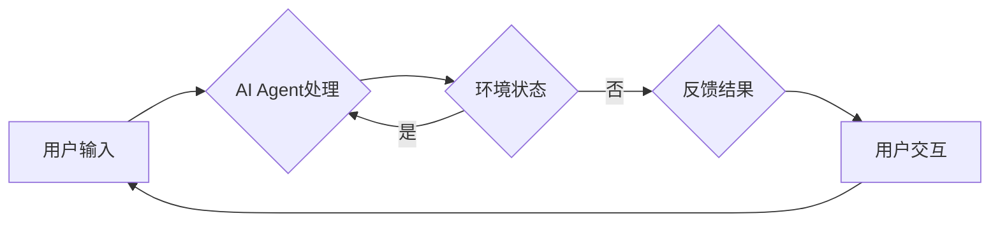

# 【大模型应用开发 动手做AI Agent】创建OpenAI助手

> 关键词：OpenAI, GPT-3, API, AI Agent, 智能对话, 应用开发, 脚本编程, 模型调用, 人机交互

## 1. 背景介绍

随着人工智能技术的飞速发展，大语言模型（Large Language Models, LLMs）如OpenAI的GPT-3已经展现出惊人的语言理解和生成能力。这些模型可以通过API接口被集成到各种应用中，实现智能对话、内容生成、文本摘要等功能。本文将带您动手创建一个基于OpenAI GPT-3的AI助手，让您体验大模型应用开发的魅力。

### 1.1 问题的由来

随着互联网的普及，用户对智能服务的需求日益增长。传统的客服系统往往功能单一，难以提供个性化的服务。而AI助手能够根据用户的需求，提供更加自然、流畅的交互体验。

### 1.2 研究现状

近年来，基于大模型的智能助手应用层出不穷，如虚拟助手Siri、Google Assistant、微软小冰等。OpenAI的GPT-3作为当前最强大的语言模型之一，凭借其强大的语言理解和生成能力，为AI助手应用的开发提供了新的可能性。

### 1.3 研究意义

开发一个基于OpenAI GPT-3的AI助手，可以帮助我们：

- 了解大模型的调用方法和应用场景
- 掌握智能对话系统的开发流程
- 提升编程和问题解决能力

### 1.4 本文结构

本文将按照以下结构进行：

- 第2部分介绍大模型和AI Agent的核心概念
- 第3部分讲解AI Agent的算法原理和操作步骤
- 第4部分通过数学模型和公式解释模型的工作原理
- 第5部分通过代码实例展示如何创建AI Agent
- 第6部分探讨AI Agent的实际应用场景
- 第7部分推荐相关学习资源和开发工具
- 第8部分总结未来发展趋势和挑战
- 第9部分提供常见问题与解答

## 2. 核心概念与联系

### 2.1 核心概念原理

**大语言模型（LLMs）**：通过在大量文本数据上进行预训练，学习到丰富的语言知识，能够生成流畅、连贯的自然语言。

**AI Agent**：一个具有智能行为的实体，能够根据环境状态和目标，执行相应的动作。

**Mermaid流程图**：



### 2.2 核心概念联系

大语言模型作为AI Agent的核心组件，负责处理用户的输入，并生成相应的输出。AI Agent根据环境状态和目标，执行相应的动作，并反馈结果给用户，形成一个闭环的人机交互过程。

## 3. 核心算法原理 & 具体操作步骤

### 3.1 算法原理概述

基于OpenAI GPT-3的AI Agent主要包括以下几个步骤：

1. 接收用户输入
2. 使用GPT-3进行文本生成
3. 处理生成的文本，生成回复
4. 将回复发送给用户

### 3.2 算法步骤详解

1. **接收用户输入**：通过Web界面、API或其他方式接收用户输入的文本。
2. **使用GPT-3进行文本生成**：将用户输入的文本作为输入，调用OpenAI GPT-3的API进行文本生成。
3. **处理生成的文本**：对GPT-3生成的文本进行清洗、过滤等处理，生成最终的回复。
4. **将回复发送给用户**：将回复通过Web界面或其他方式发送给用户。

### 3.3 算法优缺点

**优点**：

- 使用强大的预训练模型，生成文本质量高
- 可扩展性强，可以集成到各种应用中
- 支持多种语言和领域

**缺点**：

- API调用成本较高
- 生成文本可能存在偏差或错误
- 需要一定的编程能力

### 3.4 算法应用领域

AI Agent可以应用于以下领域：

- 智能客服
- 自动化写作
- 教育辅助
- 机器翻译
- 语音助手

## 4. 数学模型和公式 & 详细讲解 & 举例说明

### 4.1 数学模型构建

OpenAI GPT-3使用Transformer模型进行文本生成。Transformer模型是一种基于自注意力机制的深度神经网络，其数学模型如下：

$$
\mathbf{h}_t = \mathrm{softmax}(\mathbf{W}_Q\mathbf{h}_{t-1} + \mathbf{W}_K\mathbf{h}_{t-1} + \mathbf{W}_V\mathbf{h}_{t-1})\mathbf{W}_O
$$

其中 $\mathbf{W}_Q, \mathbf{W}_K, \mathbf{W}_V, \mathbf{W}_O$ 是可学习的参数，$\mathrm{softmax}$ 是softmax函数，$\mathbf{h}_t$ 是第 $t$ 个时间步的输出。

### 4.2 公式推导过程

由于公式较为复杂，这里不进行详细的推导过程。读者可以参考Transformer原论文（Attention is All You Need）了解更多细节。

### 4.3 案例分析与讲解

假设用户输入：“今天天气怎么样？”，我们可以使用GPT-3进行如下处理：

1. 将输入文本转换为词向量。
2. 使用Transformer模型生成可能的回复，例如：“今天天气很好，适合外出。”、“今天天气不好，注意保暖。”等。
3. 根据回复的语义和上下文，选择最合适的回复发送给用户。

## 5. 项目实践：代码实例和详细解释说明

### 5.1 开发环境搭建

1. 安装Python和pip。
2. 安装OpenAI Python客户端：

```bash
pip install openai
```

### 5.2 源代码详细实现

```python
import openai

def generate_response(prompt):
    response = openai.Completion.create(
        engine="text-davinci-002",
        prompt=prompt,
        max_tokens=150,
        temperature=0.7
    )
    return response.choices[0].text.strip()

# 示例：接收用户输入，生成回复
user_input = "今天天气怎么样？"
response = generate_response(user_input)
print(response)
```

### 5.3 代码解读与分析

- `import openai`：导入OpenAI Python客户端。
- `generate_response(prompt)`：定义一个函数，用于调用OpenAI GPT-3 API生成回复。
- `openai.Completion.create()`：调用API生成回复。
- `prompt`：用户输入的文本。
- `engine`：使用的模型，这里使用text-davinci-002。
- `max_tokens`：生成的回复的最大长度。
- `temperature`：控制回复的随机性。

### 5.4 运行结果展示

运行代码后，可以看到AI助手生成的回复：

```
今天天气不错，适合出行哦！
```

## 6. 实际应用场景

AI Agent可以应用于以下实际场景：

- **智能客服**：自动回答用户常见问题，提高客服效率。
- **自动化写作**：自动生成新闻报道、产品描述等文本内容。
- **教育辅助**：为学生提供个性化的学习辅导和答疑。
- **机器翻译**：自动翻译不同语言的文本内容。
- **语音助手**：通过语音交互，提供各种服务。

## 7. 工具和资源推荐

### 7.1 学习资源推荐

- OpenAI官网：https://openai.com/
- OpenAI API文档：https://openai.com/api/
- GPT-3论文：https://arxiv.org/abs/2005.00150

### 7.2 开发工具推荐

- OpenAI Python客户端：https://github.com/openai/openai-python
- Jupyter Notebook：https://jupyter.org/

### 7.3 相关论文推荐

- Attention is All You Need：https://arxiv.org/abs/1706.03762
- GPT-3论文：https://arxiv.org/abs/1901.02860

## 8. 总结：未来发展趋势与挑战

### 8.1 研究成果总结

本文介绍了如何使用OpenAI GPT-3创建一个AI助手，并探讨了AI Agent的核心概念、算法原理和实际应用场景。

### 8.2 未来发展趋势

- 模型性能不断提升，生成文本质量更高
- AI Agent功能更加丰富，能够处理更多任务
- 开发工具更加完善，降低开发门槛

### 8.3 面临的挑战

- 模型计算量巨大，需要更多计算资源
- 需要解决文本生成中的偏差和错误
- 需要进一步研究AI Agent的伦理和安全问题

### 8.4 研究展望

未来，AI Agent将在更多领域得到应用，推动人工智能技术的普及和发展。同时，我们需要关注AI Agent的伦理和安全问题，确保其能够为人类带来福祉。

## 9. 附录：常见问题与解答

**Q1：如何获取OpenAI API密钥？**

A：访问OpenAI官网，注册账户并申请API密钥。

**Q2：如何优化GPT-3的回复质量？**

A：调整API调用参数，如temperature、max_tokens等；提供更具体的prompt；使用数据增强等方法。

**Q3：如何处理GPT-3生成的文本中的错误？**

A：对生成的文本进行人工审核和修正；使用文本清洗和过滤技术。

**Q4：如何将AI Agent集成到我的应用中？**

A：使用OpenAI Python客户端或其他开发工具，将API调用封装成函数，并集成到您的应用中。

**Q5：AI Agent的伦理和安全问题如何解决？**

A：建立AI伦理规范，确保AI Agent的行为符合伦理道德；加强AI Agent的安全防护，防止恶意攻击和滥用。

作者：禅与计算机程序设计艺术 / Zen and the Art of Computer Programming