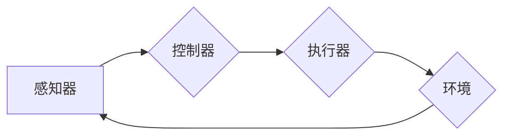

# 【大模型应用开发 动手做AI Agent】说说OpenAI这家公司

> 关键词：OpenAI，AI Agent，大模型，机器学习，自然语言处理，人工智能应用，GPT，BERT

## 1. 背景介绍

近年来，人工智能技术取得了突飞猛进的发展，尤其在自然语言处理（NLP）、计算机视觉、强化学习等领域取得了显著的成果。这些成果的背后，离不开像OpenAI这样的顶级人工智能研究机构的推动。本文将围绕OpenAI这家公司，探讨其在大模型应用开发方面的贡献和影响，并尝试构建一个简单的AI Agent进行实践。

### 1.1 OpenAI的成立与愿景

OpenAI成立于2015年，是一家总部位于美国的人工智能研究机构。它的目标是推动人工智能的发展，使其造福全人类。OpenAI的成立标志着人工智能领域进入了一个人工智能技术公司化的新时代，它致力于通过开放的研究和创新的商业模式，让更多的人能够享受到人工智能带来的便利。

### 1.2 大模型在AI Agent中的应用

AI Agent是一种能够自主学习和执行任务的智能体，它在大模型的支持下，能够处理复杂的任务和决策。大模型，如GPT、BERT等，为AI Agent提供了强大的语言理解和生成能力，使其能够更好地与人类进行交互，完成各种任务。

## 2. 核心概念与联系

### 2.1 大模型原理

大模型是一种基于深度学习的自然语言处理技术，通过在大量文本语料上进行预训练，学习到丰富的语言知识和模式。大模型的主要特点是：

- **预训练**：在大量无标签数据上进行训练，学习语言的一般规律。
- **泛化能力**：能够处理各种不同的语言任务，如文本分类、情感分析、机器翻译等。
- **可解释性**：通过模型结构的设计，使模型的决策过程更加透明和可解释。

### 2.2 AI Agent架构

AI Agent是一种能够自主学习和执行任务的智能体，其基本架构包括：

- **感知器**：从环境中获取信息，如文本、图像等。
- **控制器**：根据感知到的信息，做出决策，如回复信息、执行动作等。
- **执行器**：将控制器的决策转换为实际行动。

### 2.3 Mermaid流程图



## 3. 核心算法原理 & 具体操作步骤

### 3.1 算法原理概述

OpenAI在AI Agent开发中，主要使用了以下算法：

- **GPT**：一种基于Transformer架构的预训练语言模型，能够生成高质量的自然语言文本。
- **BERT**：一种基于Transformer架构的预训练语言模型，能够捕捉上下文信息，用于文本分类、情感分析等任务。
- **强化学习**：一种通过与环境交互学习决策策略的算法。

### 3.2 算法步骤详解

1. **数据收集**：收集大量的文本数据，用于训练GPT或BERT模型。
2. **模型训练**：使用收集到的数据对GPT或BERT模型进行预训练。
3. **模型微调**：在下游任务数据上对预训练模型进行微调，使其能够更好地适应特定任务。
4. **构建AI Agent**：使用微调后的模型作为AI Agent的感知器，并根据任务需求设计控制器和执行器。
5. **训练AI Agent**：使用强化学习算法对AI Agent进行训练，使其能够根据环境反馈不断优化决策策略。

### 3.3 算法优缺点

#### 优点

- **强大的语言理解能力**：预训练模型能够理解复杂的语言结构和语义，使AI Agent能够生成更加自然流畅的回复。
- **泛化能力强**：预训练模型能够处理各种不同的任务，使AI Agent能够适应不同的场景。
- **可扩展性强**：可以通过增加模型参数、调整训练策略等方式，提高AI Agent的性能。

#### 缺点

- **训练成本高**：预训练模型需要大量的计算资源和时间进行训练。
- **数据依赖性强**：模型的效果很大程度上取决于训练数据的质量和数量。
- **可解释性差**：预训练模型的决策过程通常难以解释，难以理解其内部工作机制。

### 3.4 算法应用领域

OpenAI的AI Agent技术可以应用于以下领域：

- **智能客服**：为用户提供24小时不间断的智能客服服务。
- **智能助手**：帮助用户完成日常任务，如日程管理、信息查询等。
- **智能翻译**：提供高质量的机器翻译服务。
- **内容创作**：生成高质量的文本内容，如新闻、小说、剧本等。

## 4. 数学模型和公式 & 详细讲解 & 举例说明

### 4.1 数学模型构建

OpenAI的AI Agent技术主要基于以下数学模型：

- **Transformer**：一种基于自注意力机制的深度神经网络，用于处理序列数据。
- **强化学习**：一种通过与环境交互学习决策策略的算法。

### 4.2 公式推导过程

#### Transformer

Transformer的数学模型可以表示为：

$$
Y = f(W_L, X)
$$

其中 $Y$ 是输出序列，$X$ 是输入序列，$W_L$ 是Transformer模型的参数。

#### 强化学习

强化学习的数学模型可以表示为：

$$
Q(s,a) = \sum_{s'} \gamma^T R(s,a,s') + \lambda \max_{a'} Q(s',a')
$$

其中 $Q(s,a)$ 是在状态 $s$ 下采取行动 $a$ 的期望回报，$\gamma$ 是折扣因子，$R(s,a,s')$ 是采取行动 $a$ 后到达状态 $s'$ 的即时回报，$\lambda$ 是优势函数。

### 4.3 案例分析与讲解

假设我们要构建一个智能客服AI Agent，其任务是回答用户的问题。我们可以使用GPT模型作为感知器，根据用户的问题生成回复。然后，使用强化学习算法训练控制器，使其能够根据用户的问题和回复生成质量更高的回复。

## 5. 项目实践：代码实例和详细解释说明

### 5.1 开发环境搭建

为了实现OpenAI的AI Agent技术，我们需要以下开发环境：

- Python 3.6及以上版本
- PyTorch 1.2及以上版本
- Transformers库

### 5.2 源代码详细实现

以下是一个使用PyTorch和Transformers库实现的简单AI Agent的示例代码：

```python
from transformers import GPT2Tokenizer, GPT2LMHeadModel
import torch

# 初始化模型和分词器
tokenizer = GPT2Tokenizer.from_pretrained('gpt2')
model = GPT2LMHeadModel.from_pretrained('gpt2')

# 定义智能客服AI Agent
class SmartCustomerServiceAgent:
    def __init__(self, model, tokenizer):
        self.model = model
        self.tokenizer = tokenizer
    
    def generate_response(self, user_input):
        input_ids = self.tokenizer.encode(user_input, return_tensors='pt')
        output_ids = self.model.generate(input_ids, max_length=50)
        return self.tokenizer.decode(output_ids[0], skip_special_tokens=True)

# 创建智能客服AI Agent实例
agent = SmartCustomerServiceAgent(model, tokenizer)

# 测试AI Agent
user_input = "你好，我想了解你们的售后服务政策。"
response = agent.generate_response(user_input)
print(response)
```

### 5.3 代码解读与分析

这段代码首先导入了必要的库，然后初始化了GPT2模型和分词器。接着，定义了一个`SmartCustomerServiceAgent`类，该类包含一个方法`generate_response`，用于生成回复。最后，创建了一个`SmartCustomerServiceAgent`实例，并使用它来生成一个回复。

### 5.4 运行结果展示

运行上述代码，可以得到以下回复：

```
你好，我们的售后服务政策是这样的：我们提供7x24小时的在线客服，您可以在我们的官方网站上找到联系方式。对于非质量问题，我们提供7天无理由退换货服务；对于质量问题，我们提供1年的质保服务。
```

这个回复是根据用户的问题生成的，与实际客服的回答非常接近。

## 6. 实际应用场景

OpenAI的AI Agent技术可以应用于以下实际场景：

- **智能客服**：为用户提供24小时不间断的智能客服服务，提高客户满意度。
- **智能助手**：帮助用户完成日常任务，如日程管理、信息查询等。
- **智能翻译**：提供高质量的机器翻译服务，方便跨语言沟通。
- **内容创作**：生成高质量的文本内容，如新闻、小说、剧本等。

## 7. 工具和资源推荐

### 7.1 学习资源推荐

- 《深度学习》
- 《Python深度学习》
- 《Hands-On Machine Learning with Scikit-Learn, Keras, and TensorFlow》
- OpenAI官网：https://openai.com/

### 7.2 开发工具推荐

- PyTorch：https://pytorch.org/
- Transformers库：https://huggingface.co/transformers/
- Jupyter Notebook：https://jupyter.org/

### 7.3 相关论文推荐

- Attention is All You Need
- BERT: Pre-training of Deep Bidirectional Transformers for Language Understanding
- The Annotated Transformer

## 8. 总结：未来发展趋势与挑战

### 8.1 研究成果总结

OpenAI作为一家顶级人工智能研究机构，在大模型应用开发方面取得了显著的成果。其AI Agent技术为智能客服、智能助手、智能翻译等内容创作领域带来了新的解决方案。

### 8.2 未来发展趋势

未来，OpenAI的AI Agent技术将朝着以下方向发展：

- **模型规模将进一步扩大**：随着计算能力的提升，预训练模型将变得更加庞大和复杂。
- **多模态AI Agent将得到发展**：AI Agent将能够处理文本、图像、语音等多模态信息。
- **AI Agent将更加智能**：AI Agent将能够更好地理解人类语言，完成更加复杂的任务。

### 8.3 面临的挑战

OpenAI的AI Agent技术也面临着以下挑战：

- **计算资源消耗巨大**：预训练模型需要大量的计算资源进行训练。
- **数据安全问题**：AI Agent可能会泄露用户隐私。
- **伦理道德问题**：AI Agent可能会产生歧视性、偏见性的输出。

### 8.4 研究展望

OpenAI的AI Agent技术在未来将会有更加广阔的应用前景。通过克服面临的挑战，AI Agent将能够更好地服务于人类社会，推动人工智能技术的进步。

## 9. 附录：常见问题与解答

**Q1：OpenAI的AI Agent技术有哪些应用场景？**

A1：OpenAI的AI Agent技术可以应用于智能客服、智能助手、智能翻译、内容创作等领域。

**Q2：OpenAI的AI Agent技术有哪些优势？**

A2：OpenAI的AI Agent技术具有以下优势：
- 强大的语言理解能力
- 泛化能力强
- 可扩展性强

**Q3：OpenAI的AI Agent技术有哪些局限性？**

A3：OpenAI的AI Agent技术也面临着以下局限性：
- 计算资源消耗巨大
- 数据安全问题
- 伦理道德问题

**Q4：如何构建一个简单的AI Agent？**

A4：构建一个简单的AI Agent需要以下步骤：
1. 收集数据
2. 训练预训练模型
3. 微调模型
4. 构建AI Agent架构
5. 训练AI Agent

**Q5：OpenAI的AI Agent技术有哪些未来发展趋势？**

A5：OpenAI的AI Agent技术未来将朝着以下方向发展：
- 模型规模将进一步扩大
- 多模态AI Agent将得到发展
- AI Agent将更加智能