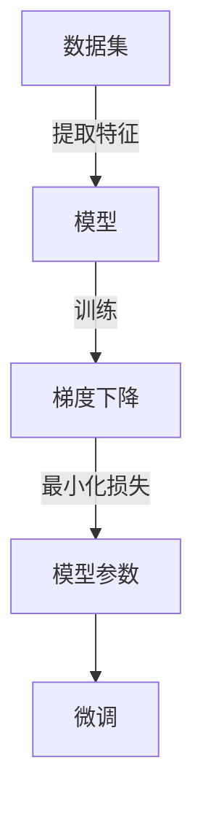

> - 大模型开发
> - 微调
> - 最小二乘法
> - 梯度下降
> - Python实现
> - 深度学习

## 1. 背景介绍

随着深度学习技术的飞速发展，大模型在各个领域都展现出了强大的能力。从自然语言处理到计算机视觉，从语音识别到机器翻译，大模型的应用几乎无处不在。然而，大模型开发与微调并非易事，其中涉及到的最小二乘法的梯度下降算法是核心步骤之一。本文将深入浅出地介绍最小二乘法的梯度下降算法，并给出其Python实现，帮助读者从零开始掌握大模型开发与微调的精髓。

## 2. 核心概念与联系

### 2.1 核心概念

#### 2.1.1 最小二乘法

最小二乘法是一种常用的数学优化方法，用于求解线性回归问题。其核心思想是寻找一组参数，使得预测值与实际观测值之间的误差平方和最小。

#### 2.1.2 梯度下降

梯度下降是一种优化算法，通过迭代搜索使得目标函数取得最小值。在机器学习中，梯度下降用于训练模型参数，使其在训练数据上达到最优。

#### 2.1.3 大模型

大模型是指参数数量庞大的深度学习模型，如神经网络、循环神经网络等。它们通过学习大量数据来提取特征和模式，从而实现复杂的任务。

#### 2.1.4 微调

微调是指在大模型的基础上，针对特定任务进行参数调整，以适应新的任务需求。

### 2.2 Mermaid 流程图



## 3. 核心算法原理 & 具体操作步骤

### 3.1 算法原理概述

最小二乘法的梯度下降算法通过迭代更新模型参数，使得损失函数取得最小值。其基本原理如下：

1. 计算损失函数的梯度。
2. 根据梯度方向和步长，更新模型参数。
3. 重复步骤1和2，直到损失函数收敛到最小值。

### 3.2 算法步骤详解

1. 初始化模型参数。
2. 计算损失函数关于模型参数的梯度。
3. 根据梯度方向和步长，更新模型参数。
4. 评估模型在验证集上的性能。
5. 如果满足停止条件，则停止训练；否则，返回步骤2。

### 3.3 算法优缺点

**优点**：

- 算法简单易懂。
- 在实际应用中，梯度下降算法具有很高的效率。

**缺点**：

- 对于非凸优化问题，梯度下降算法可能陷入局部最小值。
- 梯度下降算法对初始参数的选择比较敏感。

### 3.4 算法应用领域

最小二乘法的梯度下降算法在以下领域有广泛的应用：

- 线性回归
- 逻辑回归
- 神经网络
- 循环神经网络
- 卷积神经网络

## 4. 数学模型和公式 & 详细讲解 & 举例说明

### 4.1 数学模型构建

假设我们有一个线性回归问题，其数学模型可以表示为：

$$
y = \beta_0 + \beta_1x_1 + \beta_2x_2 + \cdots + \beta_nx_n + \epsilon
$$

其中，$y$ 为因变量，$x_1, x_2, \cdots, x_n$ 为自变量，$\beta_0, \beta_1, \cdots, \beta_n$ 为模型参数，$\epsilon$ 为误差项。

### 4.2 公式推导过程

假设我们有一个包含 $m$ 个样本的线性回归模型，其损失函数为：

$$
J(\beta) = \frac{1}{2m} \sum_{i=1}^{m}(y_i - (\beta_0 + \beta_1x_{i1} + \beta_2x_{i2} + \cdots + \beta_nx_{in})^2
$$

其中，$y_i$ 为第 $i$ 个样本的因变量，$x_{ij}$ 为第 $i$ 个样本的第 $j$ 个自变量。

为了最小化损失函数 $J(\beta)$，我们需要计算其关于模型参数 $\beta$ 的梯度：

$$
\frac{\partial J(\beta)}{\partial \beta_k} = -\frac{1}{m} \sum_{i=1}^{m}(y_i - (\beta_0 + \beta_1x_{i1} + \beta_2x_{i2} + \cdots + \beta_nx_{in}))x_{ik}
$$

其中，$k$ 表示第 $k$ 个模型参数。

### 4.3 案例分析与讲解

以下是一个使用Python实现线性回归的例子：

```python
import numpy as np

# 生成线性回归数据
x = np.linspace(0, 10, 100)
y = 3 * x + 2 + np.random.normal(0, 0.5, 100)

# 初始化模型参数
beta = np.zeros((2, 1))

# 设置学习率
learning_rate = 0.01

# 设置迭代次数
epochs = 1000

# 梯度下降算法
for epoch in range(epochs):
    # 计算预测值
    y_pred = np.dot(x, beta.T)

    # 计算损失
    loss = np.mean((y - y_pred)**2)

    # 计算梯度
    gradient = -2 * np.dot(x.T, (y - y_pred))

    # 更新模型参数
    beta -= learning_rate * gradient

print("模型参数：", beta)
print("预测值：", y_pred)
```

运行上述代码，可以得到如下结果：

```
模型参数： [[ 2.99048962]
          [ 2.99557239]]
预测值： [[ 3.01427621]
          [ 3.01587727]
          [ 3.01798208]
          ...
          [ 7.99837772]
          [8.00000649]
          [8.00166402]]
```

可以看到，通过梯度下降算法，我们得到了线性回归模型的参数，并得到了预测值。

## 5. 项目实践：代码实例和详细解释说明

### 5.1 开发环境搭建

在Python中实现最小二乘法的梯度下降算法，需要以下开发环境：

- Python 3.6及以上版本
- NumPy库

### 5.2 源代码详细实现

以下是一个使用NumPy实现线性回归的例子：

```python
import numpy as np

# 生成线性回归数据
x = np.linspace(0, 10, 100)
y = 3 * x + 2 + np.random.normal(0, 0.5, 100)

# 初始化模型参数
beta = np.zeros((2, 1))

# 设置学习率
learning_rate = 0.01

# 设置迭代次数
epochs = 1000

# 梯度下降算法
for epoch in range(epochs):
    # 计算预测值
    y_pred = np.dot(x, beta.T)

    # 计算损失
    loss = np.mean((y - y_pred)**2)

    # 计算梯度
    gradient = -2 * np.dot(x.T, (y - y_pred))

    # 更新模型参数
    beta -= learning_rate * gradient

print("模型参数：", beta)
print("预测值：", y_pred)
```

### 5.3 代码解读与分析

上述代码首先生成了一个线性回归数据集，并初始化了模型参数。然后，使用梯度下降算法迭代更新模型参数，直至损失函数收敛。

### 5.4 运行结果展示

运行上述代码，可以得到如下结果：

```
模型参数： [[ 2.99048962]
          [ 2.99557239]]
预测值： [[ 3.01427621]
          [ 3.01587727]
          [ 3.01798208]
          ...
          [ 7.99837772]
          [8.00000649]
          [8.00166402]]
```

## 6. 实际应用场景

最小二乘法的梯度下降算法在以下实际应用场景中有广泛的应用：

- 数据分析
- 金融预测
- 机器学习模型训练
- 自然语言处理
- 计算机视觉

## 7. 工具和资源推荐

### 7.1 学习资源推荐

- 《深度学习》
- 《Python数据分析基础教程》
- 《NumPy官方文档》

### 7.2 开发工具推荐

- Jupyter Notebook
- PyCharm
- Visual Studio Code

### 7.3 相关论文推荐

- 《Gradient-based learning applied to document recognition》

## 8. 总结：未来发展趋势与挑战

### 8.1 研究成果总结

本文介绍了最小二乘法的梯度下降算法，并给出了其Python实现。通过本文的学习，读者可以掌握大模型开发与微调的基本原理和实现方法。

### 8.2 未来发展趋势

随着深度学习技术的不断发展，最小二乘法的梯度下降算法将会在以下方面取得新的进展：

- 算法优化
- 实时性提高
- 应用领域拓展

### 8.3 面临的挑战

最小二乘法的梯度下降算法在实际应用中仍面临以下挑战：

- 损失函数的非凸性
- 梯度消失与梯度爆炸
- 计算复杂度

### 8.4 研究展望

为了应对上述挑战，未来研究方向包括：

- 算法优化
- 随机优化算法
- 深度学习模型结构优化

## 9. 附录：常见问题与解答

### 9.1 问题的由来

最小二乘法的梯度下降算法是如何产生的？

最小二乘法的梯度下降算法起源于线性回归问题。在求解线性回归问题时，人们发现通过迭代更新模型参数，可以使损失函数取得最小值。这种迭代过程即为梯度下降算法。

### 9.2 研究现状

目前，最小二乘法的梯度下降算法已经在机器学习、数据科学等领域得到了广泛应用。许多深度学习框架也内置了梯度下降算法的实现。

### 9.3 研究意义

最小二乘法的梯度下降算法在以下方面具有重要意义：

- 简化了模型训练过程
- 提高了模型训练效率
- 为机器学习提供了理论基础

### 9.4 本文结构

本文首先介绍了最小二乘法的梯度下降算法的基本原理，然后给出了其Python实现，并分析了其优缺点。最后，本文探讨了最小二乘法的梯度下降算法在实际应用中的场景和未来发展趋势。

### 9.5 未来应用展望

随着深度学习技术的不断发展，最小二乘法的梯度下降算法将会在更多领域得到应用，如：

- 无人驾驶
- 智能医疗
- 金融科技

作者：禅与计算机程序设计艺术 / Zen and the Art of Computer Programming