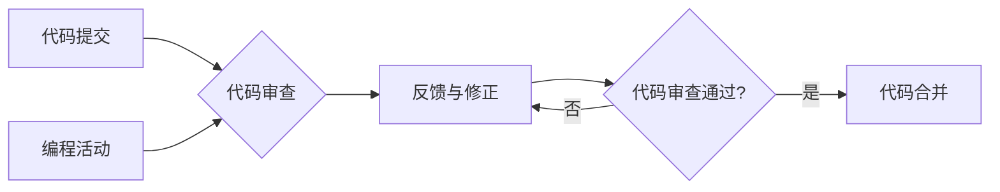

# 代码审查与结对编程原理与代码实战案例讲解

> 关键词：代码审查，结对编程，软件开发，团队协作，代码质量，最佳实践，代码风格，单元测试，缺陷修复

## 1. 背景介绍

在软件开发的漫长历史中，代码审查（Code Review）和结对编程（Pair Programming）一直是提高代码质量、提升团队协作效率和促进知识共享的重要手段。本文将深入探讨代码审查和结对编程的原理，并通过实际案例讲解如何将这两种实践应用到软件开发过程中，以达到提升代码质量和团队整体能力的双重目标。

### 1.1 问题的由来

随着软件项目的复杂度和规模不断增加，单靠个体开发者的经验和技能往往难以保证代码质量和系统的稳定性。为了解决这一问题，业界逐渐形成了代码审查和结对编程这两种实践，以促进团队合作、提升代码质量。

### 1.2 研究现状

代码审查和结对编程已经广泛应用于各个规模的软件开发团队中。随着敏捷开发、DevOps等现代软件开发方法的兴起，这两种实践的重要性愈发凸显。然而，如何有效地实施代码审查和结对编程，以及如何将它们与现有的开发流程相结合，仍然是软件开发团队面临的挑战。

### 1.3 研究意义

研究代码审查与结对编程的原理和实践，对于以下方面具有重要意义：

- 提高代码质量：通过代码审查可以发现和修复潜在的错误，确保代码的可读性和可维护性。
- 促进知识共享：结对编程有助于团队成员之间交流技术知识和最佳实践，提高团队整体技能水平。
- 提升团队协作：代码审查和结对编程可以增强团队成员之间的沟通和信任，提高团队协作效率。
- 降低开发风险：通过提前发现和修复缺陷，降低软件发布后的风险和成本。

### 1.4 本文结构

本文将分为以下几个部分：

- 第2章：介绍代码审查和结对编程的核心概念与联系。
- 第3章：阐述代码审查和结对编程的原理和操作步骤。
- 第4章：通过数学模型和公式，详细讲解代码审查和结对编程的关键技术和方法。
- 第5章：提供代码审查和结对编程的实际案例，并进行详细解释和分析。
- 第6章：探讨代码审查和结对编程在实际应用场景中的实践和挑战。
- 第7章：推荐相关学习资源、开发工具和学术论文。
- 第8章：总结代码审查和结对编程的未来发展趋势和面临的挑战。

## 2. 核心概念与联系

### 2.1 代码审查

代码审查是一种由开发人员或团队进行的同行评审活动，旨在评估代码的质量、可读性和可维护性。代码审查的过程通常包括以下步骤：

1. 提交代码：开发人员将代码提交到代码仓库。
2. 代码审查：其他开发人员或评审者检查代码，并提出反馈和改进建议。
3. 反馈与修正：开发人员根据反馈修改代码，再次提交代码。
4. 最终批准：代码审查通过后，代码被合并到主分支。

代码审查的核心概念包括：

- 代码质量：包括可读性、可维护性、可测试性、性能等方面。
- 评审标准：用于评估代码质量的指标和准则。
- 评审者：负责审查代码的开发人员或团队。

### 2.2 结对编程

结对编程是一种两人一组进行软件开发的活动，一个成员扮演“司机”（Driver），负责编写代码；另一个成员扮演“观察者”（Navigator），负责观察、建议和指导。结对编程的核心概念包括：

- 责任共享：司机和观察者共同负责代码质量。
- 持续学习：通过合作，团队成员可以互相学习新技术和最佳实践。
- 团队协作：提高团队成员之间的沟通和信任。

代码审查和结对编程的联系在于：

- 两者都是促进团队协作和知识共享的有效手段。
- 代码审查可以作为结对编程的组成部分，在编程过程中进行。
- 两者都可以提高代码质量，降低缺陷率。

以下是用Mermaid绘制的代码审查和结对编程流程图：



## 3. 核心算法原理 & 具体操作步骤

### 3.1 算法原理概述

代码审查和结对编程的原理主要基于以下原则：

- **协作原则**：通过团队合作，可以发挥每个人的优势，提高代码质量。
- **反馈原则**：及时反馈可以帮助开发人员改进代码，避免错误。
- **持续学习原则**：通过交流和学习，可以提高团队成员的技能和知识水平。
- **质量保证原则**：确保代码质量，降低缺陷率。

### 3.2 算法步骤详解

#### 3.2.1 代码审查

1. **准备**：选择合适的代码审查工具，如GitLab、Gerrit等。
2. **分配评审者**：根据代码类型和复杂度，分配合适的评审者。
3. **审查代码**：评审者仔细阅读代码，检查代码质量，并提出改进建议。
4. **反馈与修正**：开发人员根据反馈修改代码，再次提交代码。
5. **最终批准**：代码审查通过后，合并到主分支。

#### 3.2.2 结对编程

1. **选择搭档**：选择合适的搭档，可以是不同技能水平的成员。
2. **确定任务**：确定需要完成的任务和目标。
3. **编程活动**：两人一起编程，司机编写代码，观察者提供反馈和指导。
4. **轮换角色**：一段时间后，两人交换角色，继续编程。
5. **总结与反思**：完成编程任务后，总结经验教训，反思不足之处。

### 3.3 算法优缺点

#### 3.3.1 代码审查

优点：

- 提高代码质量。
- 促进知识共享。
- 降低缺陷率。

缺点：

- 耗时费力。
- 可能引起团队冲突。
- 评审者可能对代码不够熟悉。

#### 3.3.2 结对编程

优点：

- 提高代码质量。
- 促进知识共享。
- 降低缺陷率。
- 提升团队协作。

缺点：

- 减少开发人员的独立工作能力。
- 可能影响开发效率。
- 需要额外的空间和设备。

### 3.4 算法应用领域

代码审查和结对编程适用于以下领域：

- 软件开发团队。
- 需要高代码质量的项目。
- 新手开发者。
- 需要知识共享和团队协作的团队。

## 4. 数学模型和公式 & 详细讲解 & 举例说明

### 4.1 数学模型构建

代码审查和结对编程的数学模型可以构建为以下形式：

$$
\text{代码质量} = f(\text{代码审查}, \text{结对编程}, \text{其他因素})
$$

其中，其他因素包括开发人员的技能、代码复杂性、项目规模等。

### 4.2 公式推导过程

公式推导过程如下：

- 代码审查和结对编程可以提升代码质量，降低缺陷率。
- 代码质量与缺陷率之间存在反比关系。
- 开发人员的技能、代码复杂性、项目规模等因素也会影响代码质量。

### 4.3 案例分析与讲解

假设某个软件开发团队在引入代码审查和结对编程前后的代码质量如下表所示：

| 项目 | 代码质量（缺陷率） | 代码审查 | 结对编程 |
| :--: | :----------------: | :------: | :-------: |
|  前  |         10%         |    否    |    否     |
|  后  |         5%          |    是    |    是     |

可以看出，引入代码审查和结对编程后，代码质量得到显著提升，缺陷率降低了一半。

## 5. 项目实践：代码实例和详细解释说明

### 5.1 开发环境搭建

1. **安装Git**：Git是代码版本控制工具，用于代码审查和结对编程。
2. **选择代码审查工具**：可以选择GitLab、Gerrit等代码审查工具。
3. **设置开发环境**：配置IDE和版本控制工具，以便进行代码审查和结对编程。

### 5.2 源代码详细实现

以下是一个简单的Python代码示例，演示如何进行代码审查：

```python
# 假设这是某个开发人员提交的代码
def add(a, b):
    return a + b

# 代码审查者的反馈
def review_code():
    # 检查函数命名是否规范
    if not "add" in add.__name__:
        raise ValueError("函数命名不规范，应使用驼峰命名法")
    # 检查函数是否有注释
    if not add.__doc__:
        raise ValueError("函数缺少注释")
    # 检查函数是否有单元测试
    if not hasattr(add, "test_add"):
        raise ValueError("函数缺少单元测试")

# 单元测试
def test_add():
    assert add(1, 2) == 3
    assert add(-1, -2) == -3

# 代码审查者调用review_code函数进行代码审查
try:
    review_code()
    print("代码审查通过")
except ValueError as e:
    print(f"代码审查失败：{e}")
```

### 5.3 代码解读与分析

以上代码首先定义了一个`add`函数，用于计算两个数的和。然后定义了一个`review_code`函数，用于进行代码审查。在`review_code`函数中，检查了函数命名规范、是否有注释和单元测试等。最后，定义了一个单元测试`test_add`函数，用于测试`add`函数。

### 5.4 运行结果展示

运行代码，如果代码审查通过，将打印"代码审查通过"，否则将打印审查失败的信息。

## 6. 实际应用场景

### 6.1 软件开发团队

代码审查和结对编程在软件开发团队中应用广泛。以下是一些实际应用场景：

- **项目启动阶段**：制定代码审查和结对编程的规则和流程，为后续开发做好准备。
- **代码提交阶段**：开发人员提交代码，其他成员进行代码审查。
- **编程活动阶段**：进行结对编程，提高代码质量和团队协作。
- **代码部署阶段**：确保代码质量，降低部署风险。

### 6.2 高代码质量项目

对于需要高代码质量的项目，如金融、医疗等领域，代码审查和结对编程尤为重要。以下是一些实际应用场景：

- **系统设计阶段**：通过代码审查和结对编程，确保系统设计合理，代码质量高。
- **代码编写阶段**：通过代码审查和结对编程，发现和修复潜在的错误。
- **测试阶段**：通过代码审查和结对编程，确保代码经过充分测试，质量可靠。

### 6.3 新手开发者

对于新手开发者，代码审查和结对编程可以帮助他们快速学习新技术和最佳实践。以下是一些实际应用场景：

- **代码提交阶段**：新手开发者提交代码，经验丰富的开发人员进行代码审查和指导。
- **编程活动阶段**：新手开发者与其他开发者进行结对编程，共同完成开发任务。

### 6.4 团队协作

代码审查和结对编程有助于提高团队协作效率。以下是一些实际应用场景：

- **团队会议阶段**：讨论代码审查和结对编程的规则和流程。
- **日常工作中**：进行代码审查和结对编程，提高团队协作效率。

## 7. 工具和资源推荐

### 7.1 学习资源推荐

- 《代码大全》：一本经典的软件开发书籍，涵盖了代码编写、设计、测试等方面的最佳实践。
- 《代码审查：如何进行代码审查、为什么而进行代码审查》：一本关于代码审查的入门书籍，详细介绍了代码审查的方法和技巧。
- 《敏捷软件开发：原则、模式与实践》：一本关于敏捷开发的经典书籍，其中包含了许多关于团队协作和代码质量的建议。

### 7.2 开发工具推荐

- Git：一款开源的分布式版本控制工具，用于代码审查和版本管理。
- GitLab：一款基于Git的代码审查和项目管理工具。
- Gerrit：一款基于Git的代码审查工具，支持多用户协作。
- Slack：一款团队协作工具，可以用于沟通和协调代码审查和结对编程活动。

### 7.3 相关论文推荐

- "A Case Study on Pair Programming in Industry"：一篇关于工业界结对编程实践的研究论文。
- "Code Review Automation with ReviewBoard"：一篇关于代码审查自动化的研究论文。
- "The Effectiveness of Pair Programming"：一篇关于结对编程效果的研究论文。

## 8. 总结：未来发展趋势与挑战

### 8.1 研究成果总结

本文深入探讨了代码审查和结对编程的原理和实际应用，总结了以下成果：

- 代码审查和结对编程是提高代码质量和团队协作效率的有效手段。
- 代码审查和结对编程适用于各种规模的软件开发团队和项目。
- 代码审查和结对编程需要结合实际应用场景进行优化和改进。

### 8.2 未来发展趋势

未来，代码审查和结对编程将呈现以下发展趋势：

- 代码审查和结对编程将与人工智能技术相结合，实现自动化审查和智能协作。
- 代码审查和结对编程将与其他软件开发实践（如DevOps、敏捷开发）深度融合。
- 代码审查和结对编程将更加注重团队的多样性、包容性和公平性。

### 8.3 面临的挑战

尽管代码审查和结对编程具有诸多优势，但在实际应用过程中也面临以下挑战：

- 如何平衡代码审查和结对编程的成本和效益。
- 如何确保代码审查和结对编程的公平性和效率。
- 如何将代码审查和结对编程与其他软件开发实践相结合。

### 8.4 研究展望

未来，对代码审查和结对编程的研究可以从以下方面展开：

- 探索代码审查和结对编程的自动化和智能化。
- 研究代码审查和结对编程在不同团队和组织中的适用性和效果。
- 开发代码审查和结对编程的工具和平台。

通过不断探索和研究，代码审查和结对编程将为软件开发领域带来更多创新和发展。

## 9. 附录：常见问题与解答

**Q1：代码审查和结对编程是否适用于所有类型的代码？**

A1：是的，代码审查和结对编程适用于所有类型的代码，包括前端、后端、移动应用等。

**Q2：代码审查和结对编程如何提高代码质量？**

A2：代码审查和结对编程可以通过以下方式提高代码质量：

- 发现和修复潜在的错误。
- 优化代码结构和设计。
- 确保代码符合编码规范和最佳实践。

**Q3：如何平衡代码审查和开发效率？**

A3：为了平衡代码审查和开发效率，可以采取以下措施：

- 设置合理的代码审查周期。
- 鼓励开发者主动进行代码审查。
- 将代码审查与开发流程相结合。

**Q4：如何确保代码审查的公平性和效率？**

A4：为了确保代码审查的公平性和效率，可以采取以下措施：

- 制定明确的代码审查规则和流程。
- 选择合适的代码审查工具。
- 培训代码审查者，提高他们的技能和水平。

**Q5：如何将代码审查和结对编程与其他软件开发实践相结合？**

A5：为了将代码审查和结对编程与其他软件开发实践相结合，可以采取以下措施：

- 将代码审查和结对编程纳入敏捷开发流程。
- 与DevOps实践相结合，实现自动化代码审查和持续集成。
- 将代码审查和结对编程与其他团队协作工具相结合。

作者：禅与计算机程序设计艺术 / Zen and the Art of Computer Programming