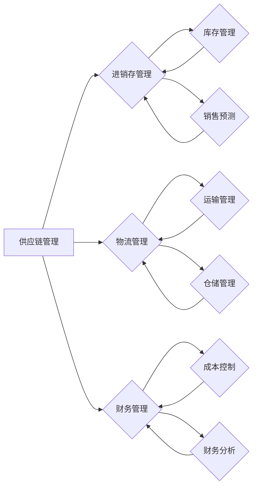

# 供应链进销存、物流、财务系统设计

> 关键词：供应链管理，进销存，物流系统，财务系统，集成，流程优化，数据驱动，数字化转型

## 1. 背景介绍

供应链管理是现代企业运营的核心环节，涉及从原材料采购到最终产品交付给消费者的整个流程。随着市场竞争的加剧和企业规模的扩大，供应链管理的复杂性不断增加。进销存管理、物流管理、财务管理是供应链管理的三大支柱。本文将深入探讨如何设计一个高效、集成、智能的供应链进销存、物流、财务系统，以实现流程优化、成本降低、效率提升和决策支持。

### 1.1 问题的由来

传统的供应链管理往往依赖于人工操作和纸质记录，存在着信息不透明、流程复杂、决策困难等问题。随着信息技术的快速发展，构建一个集成的供应链进销存、物流、财务系统成为企业提升竞争力的重要手段。

### 1.2 研究现状

目前，许多企业已经采用了ERP（企业资源计划）、WMS（仓库管理系统）、TMS（运输管理系统）等软件来管理供应链。然而，这些系统往往功能单一，缺乏集成，难以满足企业对实时数据分析和智能决策的需求。

### 1.3 研究意义

研究供应链进销存、物流、财务系统设计，对于提升企业供应链管理水平、降低运营成本、提高客户满意度具有重要意义。

### 1.4 本文结构

本文将分为以下章节：
- 第二章：介绍供应链管理、进销存、物流、财务等核心概念及其相互联系。
- 第三章：阐述供应链系统设计的原则、方法和步骤。
- 第四章：探讨供应链系统的数学模型和公式，并举例说明。
- 第五章：通过代码实例和详细解释说明供应链系统的实现。
- 第六章：分析供应链系统的实际应用场景。
- 第七章：展望供应链系统的未来发展趋势与挑战。
- 第八章：总结研究成果，并给出研究展望。
- 第九章：提供常见问题的解答。

## 2. 核心概念与联系

### 2.1 核心概念

- **供应链管理（SCM）**：是指通过协调供应链中各个环节的活动，实现成本最小化、客户满意度最大化、响应速度最优化等目标。
- **进销存管理（Inventory Management）**：是指对企业库存进行有效管理，确保库存水平合理、流动性强。
- **物流管理（Logistics Management）**：是指对物流活动进行规划、执行和控制，以实现物流成本最小化、客户服务最优化。
- **财务管理（Financial Management）**：是指对企业的财务活动进行管理，确保企业的财务状况稳定、投资回报率最大化。

### 2.2 架构图

以下是基于Mermaid绘制的供应链系统架构图：



### 2.3 关系

供应链管理是整个系统的核心，它通过协调进销存管理、物流管理和财务管理，实现企业的整体目标。进销存管理负责库存管理和销售预测，物流管理负责运输管理和仓储管理，财务管理负责成本控制和财务分析。

## 3. 核心算法原理 & 具体操作步骤

### 3.1 算法原理概述

供应链系统设计需要遵循以下原则：

- **集成性**：系统各部分相互关联，数据共享，信息透明。
- **可扩展性**：系统能够随着企业规模的扩大而扩展。
- **灵活性**：系统能够适应市场变化和企业战略调整。
- **自动化**：尽量减少人工操作，提高效率。

### 3.2 算法步骤详解

1. **需求分析**：明确企业需求，确定系统功能模块。
2. **系统设计**：设计系统架构，选择合适的技术栈。
3. **模块开发**：开发各个功能模块，实现业务逻辑。
4. **系统集成**：将各个模块集成到一起，确保系统正常运行。
5. **系统测试**：对系统进行全面测试，确保系统稳定可靠。
6. **系统部署**：将系统部署到生产环境，进行实际运行。
7. **系统维护**：对系统进行定期维护和升级。

### 3.3 算法优缺点

**优点**：

- 提高供应链效率，降低运营成本。
- 实现信息透明，提高决策质量。
- 增强企业竞争力。

**缺点**：

- 系统设计复杂，开发周期长。
- 需要大量的数据支持。
- 系统维护成本高。

### 3.4 算法应用领域

供应链系统可以应用于各个行业，如制造业、零售业、物流业等。

## 4. 数学模型和公式 & 详细讲解 & 举例说明

### 4.1 数学模型构建

供应链系统的数学模型可以包括以下部分：

- **需求预测模型**：使用时间序列分析、回归分析等方法预测未来需求。
- **库存优化模型**：使用线性规划、网络优化等方法优化库存水平。
- **运输优化模型**：使用整数规划、遗传算法等方法优化运输路线和运输成本。
- **财务分析模型**：使用财务指标分析企业的财务状况。

### 4.2 公式推导过程

以下以库存优化模型为例，介绍公式推导过程：

**目标函数**：

$$
\min_{Q} C_Q + C_H(Q) 
$$

其中，$C_Q$ 为订货成本，$C_H(Q)$ 为持有成本。

**约束条件**：

$$
Q \geq 0 \\
Q = d \times t
$$

其中，$Q$ 为订货量，$d$ 为需求量，$t$ 为订货周期。

### 4.3 案例分析与讲解

假设某企业每月需求量为1000件，订货周期为1个月，订货成本为每次100元，持有成本为每件每月2元。则最优订货量为：

$$
Q = \sqrt{\frac{2 \times 100 \times 1000}{2}} = 1000
$$

即每次订货1000件，每月订货1次。

## 5. 项目实践：代码实例和详细解释说明

### 5.1 开发环境搭建

- 操作系统：Windows/Linux
- 编程语言：Python
- 数据库：MySQL/PostgreSQL
- 开发框架：Django/Flask

### 5.2 源代码详细实现

以下是一个简单的库存管理模块的代码示例：

```python
# 假设使用Django框架

from django.db import models

class Inventory(models.Model):
    product = models.CharField(max_length=100)
    quantity = models.IntegerField()
    reorder_level = models.IntegerField()
    reorder_quantity = models.IntegerField()

    def __str__(self):
        return self.product
```

### 5.3 代码解读与分析

该模块定义了一个`Inventory`模型，包含产品名称、库存数量、补货水平和补货数量等字段。

### 5.4 运行结果展示

通过Django admin界面，可以查看和管理库存信息。

## 6. 实际应用场景

供应链系统可以应用于以下场景：

- **制造业**：优化原材料采购、生产计划、库存管理、物流配送等环节。
- **零售业**：优化商品采购、库存管理、销售预测、门店管理等环节。
- **物流业**：优化运输路线、运输成本、仓储管理、配送调度等环节。

## 7. 工具和资源推荐

### 7.1 学习资源推荐

- 《供应链管理》
- 《供应链管理：概念、策略与实践》
- 《供应链物流管理》

### 7.2 开发工具推荐

- **开发框架**：Django、Flask
- **数据库**：MySQL、PostgreSQL
- **数据可视化**：ECharts、D3.js

### 7.3 相关论文推荐

- 《供应链集成管理：理论与实践》
- 《供应链管理：战略、规划与运营》
- 《供应链物流：理论与实践》

## 8. 总结：未来发展趋势与挑战

### 8.1 研究成果总结

本文深入探讨了供应链进销存、物流、财务系统设计，从核心概念、设计原则、算法原理、实践案例等方面进行了全面介绍。研究表明，构建一个高效、集成、智能的供应链系统，对于企业提升竞争力具有重要意义。

### 8.2 未来发展趋势

- **数据驱动**：利用大数据和人工智能技术，实现供应链的智能化管理。
- **云原生**：将供应链系统部署在云平台上，实现弹性扩展和高效运维。
- **区块链**：利用区块链技术提高供应链的透明度和安全性。

### 8.3 面临的挑战

- **数据质量**：供应链数据的质量直接影响系统的准确性。
- **技术集成**：将各种技术集成到一起，实现系统的高效协同。
- **人才短缺**：具备供应链管理和信息技术复合型人才短缺。

### 8.4 研究展望

未来，供应链系统将朝着更加智能化、集成化、高效化的方向发展。同时，需要加强数据治理、技术融合和人才培养，以应对未来的挑战。

## 9. 附录：常见问题与解答

**Q1：供应链系统设计需要考虑哪些因素？**

A：供应链系统设计需要考虑以下因素：

- 企业需求
- 技术可行性
- 成本效益
- 系统安全性
- 用户友好性

**Q2：如何保证供应链数据的准确性？**

A：为了保证供应链数据的准确性，可以采取以下措施：

- 建立数据质量标准
- 定期进行数据校验
- 使用数据清洗技术
- 建立数据追溯机制

**Q3：供应链系统如何与ERP系统集成？**

A：供应链系统可以通过以下方式与ERP系统集成：

- 使用API进行数据交换
- 使用消息队列进行数据同步
- 使用数据总线进行数据共享

**Q4：如何评估供应链系统效果？**

A：可以采用以下指标评估供应链系统效果：

- 库存周转率
- 订单履行率
- 运输成本
- 客户满意度

---

作者：禅与计算机程序设计艺术 / Zen and the Art of Computer Programming