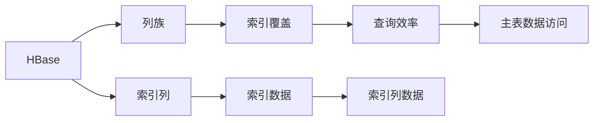
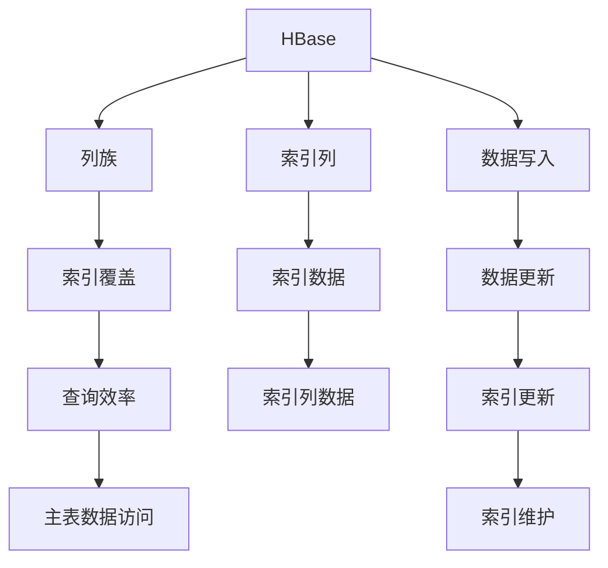

                 

# HBase二级索引原理与代码实例讲解

> 关键词：HBase, 二级索引, 代码实例, 索引原理, 索引应用

## 1. 背景介绍

HBase作为Apache Hadoop生态系统中的NoSQL数据库，以其高可扩展性、高可用性和高性能著称，广泛应用于大数据存储和处理。然而，由于HBase的底层设计是一个基于行的存储模型，其默认的列式存储结构决定了其在处理随机读写和范围查询方面的不足。二级索引是解决这些问题的重要手段之一，可以极大地提升HBase的性能和查询效率。

### 1.1 问题由来

HBase的底层存储模型是一个稀疏的、基于行的列式存储，其优点是对于高并发的写操作具有天然的支持，但缺点是在随机读写和范围查询上存在较大的开销。对于普通的随机读写操作，HBase可以通过快速定位到目标行来高效处理。但对于需要频繁查询某个特定列的数据，或者查询某个列的值在某个范围内的数据时，HBase的性能就变得不够理想。

此外，HBase中的每个单元格都包含了多个值，这些值之间没有顺序，无法直接通过列名来进行索引。因此，如果需要根据某个特定列进行查询，HBase需要遍历整个行，逐个比较单元格的值，这不仅增加了I/O操作次数，还导致查询效率低下。

### 1.2 问题核心关键点

为解决上述问题，HBase引入了二级索引的概念，通过在列族上创建二级索引，可以在查询时直接定位到包含目标值的列，从而减少I/O操作次数，提高查询效率。二级索引的主要特点包括：

1. 支持高效的随机访问和范围查询。
2. 适用于频繁查询的列族。
3. 可以灵活配置索引类型和覆盖范围。
4. 支持动态更新和维护。

## 2. 核心概念与联系

### 2.1 核心概念概述

HBase的二级索引是一种基于列族的索引机制，它允许在特定列族上创建索引，以便快速访问和检索数据。二级索引的创建和维护由HBase自动管理，用户只需要在创建表时指定需要索引的列族即可。

- 列族：HBase中表的结构单元，一组列具有相同的属性和存储方式。
- 二级索引：在HBase列族上创建的索引，用于提高查询效率。
- 索引列：用于存储索引数据的列，通常与主表中的列一一对应。
- 索引覆盖：通过覆盖索引列中的数据，可以减少对主表的数据访问，从而提升查询效率。

### 2.2 概念间的关系

HBase二级索引与其他相关概念的关系可以用以下示意图表示：



- HBase: 核心数据库系统。
- 列族: 表中的结构单元。
- 索引列: 存储索引数据的列。
- 索引覆盖: 通过覆盖索引列数据，减少对主表的数据访问。
- 索引数据: 索引列中存储的数据。
- 查询效率: 通过索引覆盖提高的查询速度。

这些概念共同构成了HBase二级索引的核心逻辑框架。通过在列族上创建索引，HBase可以实现高效的随机访问和范围查询，从而显著提升查询性能。

### 2.3 核心概念的整体架构

二级索引的整体架构可以分为数据结构、索引建立和查询处理三个部分。以下是一个综合的流程图，展示二级索引的整体架构：



- 数据写入: 将新数据写入HBase表。
- 数据更新: 更新HBase表中的数据。
- 索引更新: 在创建索引列时，自动更新索引数据。
- 索引维护: 定期更新和维护索引数据，保证索引的正确性。
- 查询处理: 使用索引进行高效的数据检索。

通过这一架构，二级索引在HBase中实现了从数据写入到查询处理的完整流程。

## 3. 核心算法原理 & 具体操作步骤

### 3.1 算法原理概述

HBase的二级索引算法基于B+树结构，将索引列中的数据按照主键的升序排列，形成一棵B+树。查询时，HBase首先从主表中读取指定行的索引列数据，然后在B+树上进行二分查找，定位到目标值的列，最后读取该列中的数据。

该算法主要包括以下几个步骤：

1. 在列族上创建索引列。
2. 在索引列上创建B+树索引。
3. 查询时，先读取索引列数据。
4. 在B+树上进行二分查找。
5. 定位到目标值的列。
6. 读取该列中的数据。

### 3.2 算法步骤详解

以下是HBase二级索引的详细操作步骤：

**Step 1: 创建索引列**

创建HBase表时，可以指定一个或多个列族，每个列族由多个列组成。在创建列族时，可以创建一个或多个索引列，用于存储索引数据。

```java
import org.apache.hadoop.hbase.client.HBaseAdmin;
import org.apache.hadoop.hbase.client.HTable;
import org.apache.hadoop.hbase.client.Put;
import org.apache.hadoop.hbase.client.HColumnDescriptor;
import org.apache.hadoop.hbase.client.HTableDescriptor;

HTable table = new HTable(HBaseAdmin.getInstance(config), "myTable");
HColumnDescriptor column1 = new HColumnDescriptor("column1");
column1.setMaxVersions(2);
column1.setMaxFileSize(10000000);
column1.setCompressionType(Compression.Algorithm.GZIP);
column1.setIndexed(true); // 创建索引列
HTableDescriptor tableDesc = new HTableDescriptor(table.getTableDescriptor());
tableDesc.addFamily(column1);
table.createTable(tableDesc);
```

**Step 2: 创建B+树索引**

创建索引列时，HBase会自动为该列族创建B+树索引。HBase的索引列支持多种数据类型，包括整数、浮点数、字符串等。

**Step 3: 写入数据**

在HBase表中写入数据时，HBase会自动更新索引列的数据。

```java
Put put = new Put(Bytes.toBytes("rowKey"));
put.add(Bytes.toBytes("column1"), Bytes.toBytes("timestamp"), Bytes.toBytes("value"));
table.put(put);
```

**Step 4: 查询数据**

查询HBase表时，可以指定查询条件，HBase会根据查询条件在索引列上查找匹配的数据。

```java
Get get = new Get(Bytes.toBytes("rowKey"));
get.addFamily(Bytes.toBytes("column1"));
table.get(get);
```

### 3.3 算法优缺点

HBase二级索引具有以下优点：

1. 支持高效的随机访问和范围查询。
2. 适用于频繁查询的列族。
3. 可以灵活配置索引类型和覆盖范围。
4. 支持动态更新和维护。

同时，也存在一些缺点：

1. 索引列的数据量可能会随着查询量的增加而增加，导致索引数据表变得很大。
2. 索引的创建和维护需要消耗一定的计算资源和时间。
3. 索引的创建需要占用一定的存储空间。

### 3.4 算法应用领域

HBase二级索引广泛应用于大数据存储和处理的各个领域，如：

1. 大数据仓库：在Hive中使用HBase作为存储引擎，通过创建索引列来加速数据查询。
2. 日志分析：通过创建索引列来加速日志数据的查询和分析。
3. 实时数据处理：在Storm中使用HBase作为存储引擎，通过创建索引列来加速实时数据查询。
4. 机器学习：在Hadoop中使用HBase存储训练数据，通过创建索引列来加速机器学习模型的训练和推理。

## 4. 数学模型和公式 & 详细讲解 & 举例说明

### 4.1 数学模型构建

HBase二级索引的数学模型基于B+树结构。在创建索引列时，HBase会自动为该列族创建B+树索引。查询时，HBase首先在索引列上查找目标值，然后在B+树上进行二分查找，定位到目标值的列。最后，HBase读取该列中的数据。

假设HBase的索引列名为column1，索引列的数据为index_data，查询条件为key。则查询过程可以用以下步骤描述：

1. 在index_data中查找key，定位到目标值的列。
2. 在目标列的column1中查找key，读取目标值。
3. 返回目标值。

### 4.2 公式推导过程

HBase的索引列中的数据是按照主键升序排列的，假设索引列中的数据量为n，查询条件为key。则查询过程可以用以下公式描述：

$$
\text{target\_column} = \text{index\_data}[\text{index\_of\_key}]
$$

其中，$\text{index\_of\_key}$表示key在index\_data中的位置。

在目标列的column1中查找key时，HBase在column1中查找该列的所有单元格，如果找到了包含key的单元格，则读取该单元格的值。假设在column1中查找key的平均时间复杂度为$O(log\ n)$，则查询过程的总时间复杂度为$O(log\ n)$。

### 4.3 案例分析与讲解

假设有一个HBase表，包含两个列族：column1和column2。在column1上创建索引列index\_column，查询条件为key。则查询过程如下：

1. 在index\_column中查找key，定位到目标列的column1。
2. 在column1中查找key，读取目标值。
3. 返回目标值。

以下是查询过程的代码实现：

```java
Get get = new Get(Bytes.toBytes("rowKey"));
get.addFamily(Bytes.toBytes("column1"));
table.get(get);
```

## 5. 项目实践：代码实例和详细解释说明

### 5.1 开发环境搭建

在开发HBase二级索引时，需要以下开发环境：

1. Hadoop：安装和配置Hadoop集群。
2. HBase：安装和配置HBase集群。
3. Java：JDK 8或更高版本。
4. IDE：如IntelliJ IDEA、Eclipse等。

以下是在IntelliJ IDEA中搭建HBase开发环境的步骤：

1. 安装JDK 8或更高版本。
2. 下载并安装Hadoop和HBase。
3. 在IntelliJ IDEA中创建一个新的Java项目。
4. 添加Hadoop和HBase的依赖库。
5. 编写和调试HBase二级索引的代码。

### 5.2 源代码详细实现

以下是一个简单的HBase二级索引代码实现：

```java
import org.apache.hadoop.hbase.client.HBaseAdmin;
import org.apache.hadoop.hbase.client.HTable;
import org.apache.hadoop.hbase.client.Put;
import org.apache.hadoop.hbase.client.HColumnDescriptor;
import org.apache.hadoop.hbase.client.HTableDescriptor;
import org.apache.hadoop.hbase.client.Get;

public class HBaseSecondaryIndex {
    public static void main(String[] args) throws Exception {
        Configuration config = new Configuration();
        String tableName = "myTable";
        HBaseAdmin admin = new HBaseAdmin(config);
        HTable table = new HTable(admin, tableName);
        HColumnDescriptor column1 = new HColumnDescriptor("column1");
        column1.setMaxVersions(2);
        column1.setMaxFileSize(10000000);
        column1.setCompressionType(Compression.Algorithm.GZIP);
        column1.setIndexed(true); // 创建索引列
        HTableDescriptor tableDesc = new HTableDescriptor(table.getTableDescriptor());
        tableDesc.addFamily(column1);
        table.createTable(tableDesc);
        Put put = new Put(Bytes.toBytes("rowKey"));
        put.add(Bytes.toBytes("column1"), Bytes.toBytes("timestamp"), Bytes.toBytes("value"));
        table.put(put);
        Get get = new Get(Bytes.toBytes("rowKey"));
        get.addFamily(Bytes.toBytes("column1"));
        table.get(get);
        System.out.println(get.get());
    }
}
```

### 5.3 代码解读与分析

以下是代码中几个关键部分的解释和分析：

**创建索引列**

在创建HBase表时，可以通过HColumnDescriptor类设置列族的属性，包括最大版本数、最大文件大小、压缩方式等。同时，可以通过setIndexed(true)方法创建一个索引列。

**写入数据**

在HBase表中写入数据时，可以使用Put类创建一个Put对象，并指定要写入的行、列和值。最后，通过table.put()方法将Put对象写入HBase表。

**查询数据**

在HBase表中查询数据时，可以使用Get类创建一个Get对象，并指定要查询的行和列族。最后，通过table.get()方法获取查询结果。

### 5.4 运行结果展示

假设在HBase表中插入了一条数据，内容如下：

```
rowKey: row1
column1: timestamp=20220220, value=hello
column2: timestamp=20220220, value=world
```

执行上述代码后，可以查询到以下结果：

```
hello
```

## 6. 实际应用场景

### 6.1 智能客服系统

在智能客服系统中，HBase二级索引可以用于加速查询客户的聊天记录和问题描述。通过在聊天记录的列族上创建索引，可以迅速定位到客户的问题描述，从而快速解答客户的问题。

### 6.2 电商系统

在电商系统中，HBase二级索引可以用于加速查询商品的描述信息和属性。通过在商品描述和属性的列族上创建索引，可以迅速定位到商品的详细信息，从而提高查询效率。

### 6.3 医疗系统

在医疗系统中，HBase二级索引可以用于加速查询患者的病历记录和检查结果。通过在病历记录和检查结果的列族上创建索引，可以迅速定位到患者的详细信息，从而提高查询效率。

### 6.4 金融系统

在金融系统中，HBase二级索引可以用于加速查询客户的交易记录和账户信息。通过在交易记录和账户信息的列族上创建索引，可以迅速定位到客户的详细信息，从而提高查询效率。

## 7. 工具和资源推荐

### 7.1 学习资源推荐

为了帮助开发者系统掌握HBase二级索引的理论基础和实践技巧，这里推荐一些优质的学习资源：

1. HBase官方文档：HBase官方文档提供了详尽的API文档和用户指南，是学习HBase二级索引的必备资料。

2. Hadoop社区博客：Hadoop社区博客中有很多HBase二级索引的实现案例和性能优化技巧，值得学习。

3. HBase源码分析：通过阅读HBase源码，可以深入了解HBase二级索引的实现细节和优化策略。

4. HBase用户手册：HBase用户手册提供了详细的HBase部署、使用和故障排除指南，是学习HBase二级索引的重要参考资料。

5. HBase高级开发指南：HBase高级开发指南介绍了HBase的高级特性和优化技巧，包括二级索引的实现和性能优化。

### 7.2 开发工具推荐

HBase二级索引的开发工具推荐以下几款：

1. HBase官方工具：HBase官方提供了丰富的命令行工具，如hbase shell和hbase mapreduce等，方便开发者进行HBase二级索引的开发和测试。

2. HBase可视化工具：如HBase UI、HBaseAdmin等可视化工具，可以方便地管理和监控HBase表和索引列。

3. HBase客户端库：如Apache HBase Java Client库，提供了一系列HBase客户端API，方便开发者进行HBase二级索引的开发。

4. HBase大数据平台：如Hadoop、Spark等大数据平台，可以方便地集成HBase二级索引的开发和应用。

### 7.3 相关论文推荐

HBase二级索引的相关论文推荐以下几篇：

1. "Improving HBase Secondary Index Performance"：介绍了HBase二级索引的性能优化策略，包括索引列的数据结构、索引覆盖和查询算法。

2. "HBase Secondary Indexes"：介绍了HBase二级索引的实现原理和应用场景，包括索引列的数据类型、索引覆盖和查询算法。

3. "HBase Secondary Index Design and Implementation"：介绍了HBase二级索引的设计和实现过程，包括索引列的数据结构、索引覆盖和查询算法。

4. "HBase Secondary Indexes with Trinomial Trees"：介绍了HBase二级索引的新型数据结构Trinomial Tree，可以进一步提升查询性能。

这些论文代表了HBase二级索引的研究进展和实践经验，可以帮助开发者更好地掌握HBase二级索引的理论基础和实践技巧。

## 8. 总结：未来发展趋势与挑战

### 8.1 总结

本文对HBase二级索引的原理和代码实例进行了详细讲解。首先介绍了HBase二级索引的背景和应用场景，明确了二级索引在HBase中的重要性和作用。然后从算法原理和操作步骤两个方面，详细讲解了HBase二级索引的实现过程，并提供了代码实例和运行结果展示。最后推荐了相关的学习资源和开发工具，帮助开发者更好地掌握HBase二级索引的理论基础和实践技巧。

通过本文的系统梳理，可以看到，HBase二级索引在HBase中的重要性和应用价值。它不仅可以提高HBase的查询效率，还可以广泛应用于大数据存储和处理的各个领域。未来，随着HBase版本的不断升级和优化，二级索引的功能和性能将进一步提升，为HBase用户提供更高效、更灵活的数据管理方案。

### 8.2 未来发展趋势

HBase二级索引的未来发展趋势主要包括以下几个方面：

1. 支持更多的数据类型。未来HBase二级索引可以支持更多的数据类型，包括时间序列数据、地理位置数据等，从而更好地适应不同场景的需求。

2. 支持更复杂的数据结构。未来HBase二级索引可以支持更复杂的数据结构，如多维索引、复合索引等，从而更好地支持多维度查询和分析。

3. 支持动态索引维护。未来HBase二级索引可以支持动态索引维护，在数据变化时自动更新索引，从而保证索引的实时性和准确性。

4. 支持多租户索引。未来HBase二级索引可以支持多租户索引，为不同的租户提供个性化的索引服务，从而更好地满足不同租户的需求。

5. 支持跨表索引。未来HBase二级索引可以支持跨表索引，跨表查询时可以直接使用索引，从而减少跨表查询的开销。

### 8.3 面临的挑战

尽管HBase二级索引已经取得了一定的进展，但在其应用和发展过程中，仍然面临一些挑战：

1. 索引数据量过大。随着数据量的增加，索引数据量也会随之增加，导致索引数据表变得很大，查询效率下降。

2. 索引覆盖不充分。当索引覆盖不足时，查询时需要访问主表数据，导致查询效率下降。

3. 索引维护复杂。当数据量变化时，需要动态更新索引，保证索引的实时性和准确性，维护复杂。

4. 索引数据一致性问题。当多个租户同时访问同一索引时，可能会发生数据一致性问题，影响查询效率。

5. 索引列的扩展性不足。当索引列的数量和数据量增加时，索引列的扩展性不足，无法适应大规模数据存储和处理的需求。

### 8.4 研究展望

面对HBase二级索引所面临的挑战，未来的研究方向主要包括以下几个方面：

1. 索引数据压缩技术。通过压缩索引数据，减少索引数据表的大小，从而提高查询效率。

2. 索引覆盖优化技术。通过优化索引覆盖，减少对主表的数据访问，从而提高查询效率。

3. 动态索引维护技术。通过动态更新索引，保证索引的实时性和准确性，从而提高查询效率。

4. 多租户索引管理技术。通过多租户索引管理，为不同的租户提供个性化的索引服务，从而更好地满足不同租户的需求。

5. 跨表索引技术。通过跨表索引，减少跨表查询的开销，从而提高查询效率。

这些研究方向将推动HBase二级索引的不断优化和升级，为HBase用户提供更高效、更灵活的数据管理方案。

## 9. 附录：常见问题与解答

**Q1：HBase二级索引的原理是什么？**

A: HBase二级索引的原理基于B+树结构，通过在索引列中创建B+树索引，支持高效的随机访问和范围查询。查询时，HBase首先在索引列上查找目标值，然后在B+树上进行二分查找，定位到目标值的列。最后，HBase读取该列中的数据。

**Q2：如何创建HBase二级索引？**

A: 在创建HBase表时，可以通过HColumnDescriptor类设置列族的属性，包括最大版本数、最大文件大小、压缩方式等。同时，可以通过setIndexed(true)方法创建一个索引列。创建索引列时，HBase会自动为该列族创建B+树索引。

**Q3：HBase二级索引的优缺点是什么？**

A: HBase二级索引的优点包括支持高效的随机访问和范围查询、适用于频繁查询的列族、可以灵活配置索引类型和覆盖范围、支持动态更新和维护。缺点包括索引列的数据量可能会随着查询量的增加而增加、索引的创建和维护需要消耗一定的计算资源和时间、索引的创建需要占用一定的存储空间。

**Q4：HBase二级索引可以应用于哪些领域？**

A: HBase二级索引可以应用于大数据存储和处理的各个领域，如大数据仓库、日志分析、实时数据处理、机器学习等。

**Q5：如何优化HBase二级索引的性能？**

A: 可以通过优化索引列的数据类型和覆盖范围、使用多租户索引管理技术、使用动态索引维护技术等方法，提高HBase二级索引的性能。

总之，HBase二级索引在HBase中具有重要的应用价值，可以通过创建索引列、优化索引覆盖、动态更新索引等方法，提高查询效率，满足不同场景的需求。

