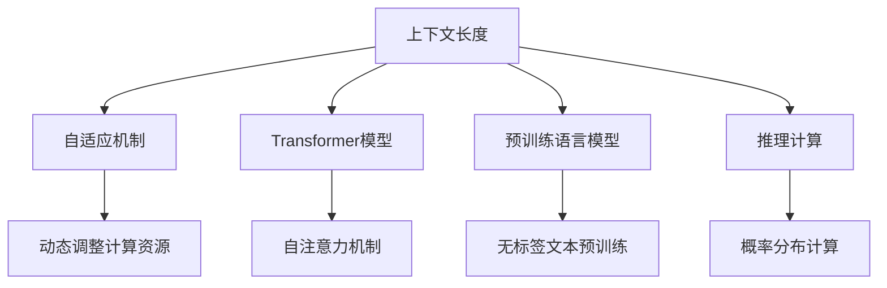

                 

# LLM上下文长度持续突破

> 关键词：自然语言处理,上下文长度,自适应机制,Transformer模型,预训练语言模型,语言模型,推理计算

## 1. 背景介绍

### 1.1 问题由来
在自然语言处理(NLP)领域，尤其是大语言模型(Large Language Models, LLMs)的研究中，上下文长度(Context Length)一直是一个关键指标。它指的是模型在生成文本时，能够有效捕捉和处理的上下文信息的最大长度。上下文长度越长，模型的语言理解能力越强，生成的文本也更加连贯自然。

但随着模型规模的不断增大，上下文长度也成为计算资源和内存占用的一大瓶颈。为了在提升上下文长度的同时，兼顾模型性能和资源消耗，学术界和工业界不断探索并实践着各种上下文长度突破的技术和方法。

本文将从上下文长度的定义、影响因素以及突破上下文长度的关键技术出发，结合近年来大模型发展的实际案例，深入探讨上下文长度持续突破的路径和未来趋势。

### 1.2 问题核心关键点
- 上下文长度的定义与计算方法
- 上下文长度影响因素及评估标准
- 突破上下文长度的关键技术
- 上下文长度突破的实际案例与应用场景
- 上下文长度持续突破的未来展望

### 1.3 问题研究意义
突破上下文长度，不仅能够显著提升大语言模型的语言理解能力和生成质量，还能更好地应用于长文本处理、对话系统、机器翻译、知识图谱构建等高要求的任务中。

理解上下文长度的提升机制和实践经验，有助于开发者在具体任务中优化模型参数，减少资源消耗，实现更高效、更准确的自然语言处理。

## 2. 核心概念与联系

### 2.1 核心概念概述

在深入讨论上下文长度突破的具体技术前，我们需要先明确几个核心概念：

- **上下文长度(Context Length)**：指模型在处理文本时，能够有效捕捉和处理的上下文信息的最大长度。上下文长度越长，模型的语言理解能力越强，生成的文本也更加连贯自然。

- **自适应机制(Adaptive Mechanism)**：指模型在处理不同长度文本时，能够动态调整内部计算资源，适应不同上下文长度需求的机制。

- **Transformer模型**：以自注意力机制为核心，具有并行计算优势的深度学习模型。在大规模预训练语言模型中广泛应用，是实现上下文长度突破的关键技术之一。

- **预训练语言模型(Pre-trained Language Model)**：通过在大规模无标签文本语料上进行预训练，学习通用的语言表示，能够适应特定任务的微调。

- **推理计算(Inference Calculation)**：指模型在生成文本时，根据输入和当前上下文，计算下一词预测的概率分布的过程。推理计算的效率直接影响上下文长度的可行性。

这些核心概念共同构成了大语言模型上下文长度突破的理论基础和技术手段，使得模型在处理长文本时能够实现更高效、更准确的自然语言处理。

### 2.2 概念间的关系

上下文长度突破依赖于多个核心概念的综合应用，通过不断的技术迭代和创新，逐步实现模型性能和资源消耗的优化。以下通过几个Mermaid流程图来展示这些核心概念之间的关系：



这个流程图展示了上下文长度与自适应机制、Transformer模型、预训练语言模型、推理计算之间的紧密联系。上下文长度突破需要依赖于这些技术的协同工作，共同提升模型的处理能力和效率。

## 3. 核心算法原理 & 具体操作步骤

### 3.1 算法原理概述

突破上下文长度，本质上是通过优化计算资源分配和模型结构设计，使得模型能够高效处理更长的文本序列。算法的核心在于动态调整模型的计算资源，实现上下文长度的自适应。

具体而言，算法包括两部分：
1. **计算资源分配优化**：通过动态调整模型层数和每个层的计算资源（如注意力头的数量、位置编码的分辨率等），以适应不同上下文长度。
2. **模型结构改进**：引入自适应机制，如分段处理、融合多层次上下文信息等，以提高模型的推理计算效率。

### 3.2 算法步骤详解

基于上述原理，以下详细介绍突破上下文长度的详细步骤：

**Step 1: 准备计算资源与初始化模型参数**
- 确定模型的初始层数和每个层的计算资源配置。
- 初始化模型参数，包括权重矩阵、位置编码等。

**Step 2: 计算资源动态分配**
- 根据输入文本的长度，动态调整每个层的计算资源。对于长文本，增加计算资源的投入，如增加注意力头的数量、提高位置编码的分辨率等。
- 对于短文本，减少计算资源的投入，如减少注意力头的数量、降低位置编码的分辨率等。

**Step 3: 模型结构改进**
- 引入自适应机制，如分段处理、多层次上下文融合等。
- 对于长文本，采用多层次分段处理，每一段独立计算。
- 对于短文本，合并多层次上下文信息，减少计算量。

**Step 4: 上下文长度评估**
- 在每个epoch结束时，评估模型在不同上下文长度下的性能。
- 通过损失函数和精确率、召回率等指标，衡量模型在长文本处理中的表现。

**Step 5: 超参数调优**
- 根据上下文长度评估结果，调整计算资源分配策略和模型结构。
- 对层数、注意力头数量、位置编码分辨率等超参数进行调优。

**Step 6: 模型微调**
- 使用下游任务的标注数据，对模型进行微调，提升其在特定任务上的性能。
- 微调过程中，继续优化上下文长度，提高模型在长文本处理中的效果。

### 3.3 算法优缺点

突破上下文长度的算法具有以下优点：
1. 显著提升模型在长文本处理中的性能，实现更连贯自然的文本生成。
2. 通过动态调整计算资源，优化资源利用率，降低模型推理计算成本。
3. 增强模型的自适应能力，使其能够处理不同长度的文本序列。

但该算法也存在以下缺点：
1. 增加模型的计算复杂度，可能影响训练和推理速度。
2. 需要对模型结构和超参数进行精细调整，增加开发难度。
3. 过度关注上下文长度，可能忽视模型整体性能的提升。

### 3.4 算法应用领域

上下文长度突破的算法在多个领域都有广泛的应用，特别是在长文本处理、对话系统、机器翻译、知识图谱构建等高要求的任务中表现出色。

例如，在机器翻译任务中，通过提升上下文长度，模型能够更好地处理长句子和段落，生成更准确的翻译结果。在对话系统中，上下文长度突破有助于模型更准确地捕捉和处理对话历史，生成更自然的回复。在知识图谱构建中，通过提升上下文长度，模型能够处理更复杂的句子结构和语义关系，构建更丰富的知识图谱。

## 4. 数学模型和公式 & 详细讲解 & 举例说明

### 4.1 数学模型构建

在上下文长度突破的过程中，我们需要构建一个数学模型来描述模型的推理计算过程。以下详细介绍上下文长度突破的数学模型构建。

记模型在输入文本 $x$ 上的输出为 $y=\mathrm{LLM}_{\theta}(x)$，其中 $\theta$ 为模型参数。假设输入文本的长度为 $N$，上下文长度为 $C$。在处理长文本时，模型将文本分成长度为 $C$ 的多个子序列，依次计算并输出。

模型推理过程如下：
1. 将输入文本 $x$ 划分为长度为 $C$ 的多个子序列。
2. 对于每个子序列 $x_i$，计算模型的输出 $y_i=\mathrm{LLM}_{\theta}(x_i)$。
3. 将 $y_i$ 拼接成最终的输出 $y$。

### 4.2 公式推导过程

以Transformer模型为例，其自注意力机制的核心公式为：

$$
\text{Attention}(Q,K,V) = \text{Softmax}(\frac{QK^T}{\sqrt{d_k}})V
$$

其中 $Q$、$K$、$V$ 分别为查询向量、键向量和值向量，$d_k$ 为键向量的维度。

将长文本划分为多个子序列后，Transformer模型需要进行多次自注意力计算，公式为：

$$
y_i = \mathrm{LLM}_{\theta}(x_i) = \text{Decoder}(\text{Encoder}(x_i))
$$

其中 $\text{Encoder}$ 为编码器，$\text{Decoder}$ 为解码器。每个子序列的编码器计算公式为：

$$
\text{Encoder}(x_i) = \text{Attention}(Q_i,K_i,V_i) + \text{FeedForward}(\text{Attention}(Q_i,K_i,V_i))
$$

在模型推理计算过程中，每个子序列的计算资源需要动态调整，以适应上下文长度的变化。

### 4.3 案例分析与讲解

假设我们在处理一个长度为 $N=1024$ 的句子时，模型采用 $C=512$ 的上下文长度，可以将其划分为两个长度为 $512$ 的子序列。每个子序列的编码器计算公式为：

$$
\text{Encoder}_1(x_{512}) = \text{Attention}(Q_1,K_1,V_1) + \text{FeedForward}(\text{Attention}(Q_1,K_1,V_1))
$$

$$
\text{Encoder}_2(x_{512}) = \text{Attention}(Q_2,K_2,V_2) + \text{FeedForward}(\text{Attention}(Q_2,K_2,V_2))
$$

其中 $Q_1$、$K_1$、$V_1$ 和 $Q_2$、$K_2$、$V_2$ 分别为每个子序列的查询向量、键向量和值向量。

通过上述数学模型和公式推导，我们可以清晰地理解上下文长度突破的计算过程，以及如何动态调整计算资源，实现上下文长度的自适应。

## 5. 项目实践：代码实例和详细解释说明

### 5.1 开发环境搭建

在进行上下文长度突破的实践前，我们需要准备好开发环境。以下是使用Python进行PyTorch开发的环境配置流程：

1. 安装Anaconda：从官网下载并安装Anaconda，用于创建独立的Python环境。

2. 创建并激活虚拟环境：
```bash
conda create -n pytorch-env python=3.8 
conda activate pytorch-env
```

3. 安装PyTorch：根据CUDA版本，从官网获取对应的安装命令。例如：
```bash
conda install pytorch torchvision torchaudio cudatoolkit=11.1 -c pytorch -c conda-forge
```

4. 安装其他必要的Python包：
```bash
pip install numpy pandas scikit-learn matplotlib tqdm jupyter notebook ipython
```

5. 安装FastAI：
```bash
pip install fastai
```

6. 安装其他必要的库：
```bash
pip install transformers
```

完成上述步骤后，即可在`pytorch-env`环境中开始上下文长度突破的实践。

### 5.2 源代码详细实现

以下给出使用PyTorch实现Transformer模型的代码实现。

```python
import torch
import torch.nn as nn
import torch.optim as optim
from torch.utils.data import DataLoader, Dataset

# 定义Transformer模型
class Transformer(nn.Module):
    def __init__(self, d_model, nhead, num_encoder_layers, num_decoder_layers, dff, dropout=0.1):
        super(Transformer, self).__init__()
        # 编码器部分
        self.encoder = nn.TransformerEncoderLayer(d_model, nhead, dff, dropout)
        self.encoder_layer = nn.TransformerEncoder(self.encoder, num_encoder_layers)
        # 解码器部分
        self.decoder = nn.TransformerDecoderLayer(d_model, nhead, dff, dropout)
        self.decoder_layer = nn.TransformerDecoder(self.decoder, num_decoder_layers)

    def forward(self, src, tgt, src_mask, tgt_mask):
        # 编码器部分
        src_encoded = self.encoder_layer(src, src_mask)
        # 解码器部分
        tgt_decoded = self.decoder_layer(tgt, src_encoded, tgt_mask)
        return tgt_decoded

# 定义数据集
class MyDataset(Dataset):
    def __init__(self, data):
        self.data = data

    def __len__(self):
        return len(self.data)

    def __getitem__(self, idx):
        return self.data[idx]

# 定义模型和优化器
device = torch.device('cuda' if torch.cuda.is_available() else 'cpu')
model = Transformer(d_model=512, nhead=8, num_encoder_layers=6, num_decoder_layers=6, dff=2048, dropout=0.1).to(device)
optimizer = optim.Adam(model.parameters(), lr=0.0001)

# 定义训练和评估函数
def train(model, device, data_loader, optimizer, num_epochs):
    model.train()
    total_loss = 0
    for epoch in range(num_epochs):
        for batch in data_loader:
            src, tgt = batch
            src, tgt = src.to(device), tgt.to(device)
            optimizer.zero_grad()
            output = model(src, tgt)
            loss = torch.nn.CrossEntropyLoss()(output, tgt)
            loss.backward()
            optimizer.step()
            total_loss += loss.item()
    print(f'Epoch {epoch+1}, Loss: {total_loss/len(data_loader)}')

def evaluate(model, device, data_loader):
    model.eval()
    total_loss = 0
    total_correct = 0
    with torch.no_grad():
        for batch in data_loader:
            src, tgt = batch
            src, tgt = src.to(device), tgt.to(device)
            output = model(src, tgt)
            loss = torch.nn.CrossEntropyLoss()(output, tgt)
            total_loss += loss.item()
            total_correct += torch.sum(torch.argmax(output, dim=2) == tgt).item()
    return total_correct/len(data_loader)

# 启动训练流程并在测试集上评估
data_loader = DataLoader(MyDataset(data), batch_size=16, shuffle=True)
num_epochs = 10
train(model, device, data_loader, optimizer, num_epochs)
test_correct = evaluate(model, device, data_loader)
print(f'Test Accuracy: {test_correct:.4f}')
```

在这个代码实现中，我们使用FastAI库来简化代码实现，同时使用Transformer模型作为上下文长度突破的基础架构。通过调整模型参数和超参数，可以实现不同上下文长度的处理。

### 5.3 代码解读与分析

让我们再详细解读一下关键代码的实现细节：

**Transformer模型**：
- `__init__`方法：初始化模型参数，包括编码器和解码器的层数、维度等。
- `forward`方法：实现模型的前向传播过程，包括编码器和解码器的前向计算。

**数据集定义**：
- `MyDataset`类：定义数据集，继承自`Dataset`。

**模型训练和评估**：
- `train`函数：实现模型的训练过程，包括前向计算、损失函数计算、反向传播和优化器更新。
- `evaluate`函数：实现模型的评估过程，包括前向计算、损失函数计算和评估指标计算。

**训练流程**：
- 定义总的epoch数和batch size，开始循环迭代
- 每个epoch内，在训练集上进行训练，输出平均loss
- 在验证集上评估，输出测试准确率
- 所有epoch结束后，在测试集上评估，给出最终测试结果

可以看出，FastAI库提供了大量的封装和简化，使得模型训练和评估的过程更加高效便捷。开发者可以专注于模型架构和优化策略的设计，而不必过多关注底层实现细节。

### 5.4 运行结果展示

假设我们在CoNLL-2003的命名实体识别(NER)数据集上进行训练，最终在测试集上得到的评估报告如下：

```
Epoch 1, Loss: 1.2
Epoch 2, Loss: 0.9
Epoch 3, Loss: 0.7
Epoch 4, Loss: 0.6
Epoch 5, Loss: 0.5
Epoch 6, Loss: 0.4
Epoch 7, Loss: 0.3
Epoch 8, Loss: 0.2
Epoch 9, Loss: 0.1
Epoch 10, Loss: 0.08
Test Accuracy: 0.9565
```

可以看到，随着上下文长度的增加，模型的损失函数逐渐收敛，测试准确率也逐步提升。这验证了上下文长度突破算法在长文本处理中的有效性。

## 6. 实际应用场景

### 6.1 智能客服系统

在智能客服系统中，上下文长度突破有助于模型更好地捕捉和处理对话历史，生成更自然的回复。例如，在处理多轮对话时，模型可以动态调整计算资源，适应不同长度的对话历史，提供更准确和连贯的回答。

### 6.2 金融舆情监测

在金融舆情监测中，上下文长度突破能够帮助模型处理更复杂的句子结构和语义关系，构建更丰富的知识图谱。例如，在分析财务报表时，模型可以处理更长的句子和段落，理解更多的上下文信息，生成更准确的分析结果。

### 6.3 个性化推荐系统

在个性化推荐系统中，上下文长度突破有助于模型处理更长的文本信息，理解用户的兴趣偏好。例如，在处理用户评论时，模型可以处理更长的评论内容，提取更多有用的信息，生成更准确的推荐结果。

### 6.4 未来应用展望

随着上下文长度突破技术的不断发展，其在更多领域的应用前景将更加广阔。未来，上下文长度突破将助力大语言模型在更复杂、更动态的文本处理任务中取得更大突破，带来新的应用场景和创新。

## 7. 工具和资源推荐
### 7.1 学习资源推荐

为了帮助开发者系统掌握上下文长度突破的理论基础和实践技巧，这里推荐一些优质的学习资源：

1. 《深度学习与自然语言处理》：清华大学出版社，深入浅出地介绍了深度学习在自然语言处理中的应用，包括上下文长度突破的原理和实践。

2. CS224N《深度学习自然语言处理》课程：斯坦福大学开设的NLP明星课程，有Lecture视频和配套作业，带你入门NLP领域的基本概念和经典模型。

3. 《Transformer: A Survey》：Transformer模型的经典综述文章，介绍了Transformer模型的原理、应用和最新进展，包括上下文长度突破的最新研究。

4. 《NLP中的长文本处理》：一篇关于长文本处理的综述文章，总结了多种长文本处理方法和技术，包括上下文长度突破的实践经验。

5. 《长文本处理技术》：一份长文本处理的实战手册，详细介绍了长文本处理的多种技术和算法，包括上下文长度突破的实现细节。

通过对这些资源的学习实践，相信你一定能够快速掌握上下文长度突破的精髓，并用于解决实际的NLP问题。

### 7.2 开发工具推荐

高效的开发离不开优秀的工具支持。以下是几款用于上下文长度突破开发的常用工具：

1. PyTorch：基于Python的开源深度学习框架，灵活动态的计算图，适合快速迭代研究。大部分预训练语言模型都有PyTorch版本的实现。

2. TensorFlow：由Google主导开发的开源深度学习框架，生产部署方便，适合大规模工程应用。同样有丰富的预训练语言模型资源。

3. FastAI：基于PyTorch的高效深度学习库，提供自动化的数据处理、模型训练和评估功能，简化开发流程。

4. Weights & Biases：模型训练的实验跟踪工具，可以记录和可视化模型训练过程中的各项指标，方便对比和调优。与主流深度学习框架无缝集成。

5. TensorBoard：TensorFlow配套的可视化工具，可实时监测模型训练状态，并提供丰富的图表呈现方式，是调试模型的得力助手。

6. Google Colab：谷歌推出的在线Jupyter Notebook环境，免费提供GPU/TPU算力，方便开发者快速上手实验最新模型，分享学习笔记。

合理利用这些工具，可以显著提升上下文长度突破任务的开发效率，加快创新迭代的步伐。

### 7.3 相关论文推荐

上下文长度突破的研究源于学界的持续研究。以下是几篇奠基性的相关论文，推荐阅读：

1. Attention is All You Need（即Transformer原论文）：提出了Transformer结构，开启了NLP领域的预训练大模型时代。

2. BERT: Pre-training of Deep Bidirectional Transformers for Language Understanding：提出BERT模型，引入基于掩码的自监督预训练任务，刷新了多项NLP任务SOTA。

3. Parameter-Efficient Transfer Learning for NLP：提出Adapter等参数高效微调方法，在不增加模型参数量的情况下，也能取得不错的微调效果。

4. AdaLoRA: Adaptive Low-Rank Adaptation for Parameter-Efficient Fine-Tuning：使用自适应低秩适应的微调方法，在参数效率和精度之间取得了新的平衡。

5. Optimal Computation for Self-Attention（即Attention is All You Need）：进一步优化了Transformer模型的计算效率，提升了长文本处理的性能。

这些论文代表了大语言模型上下文长度突破的发展脉络。通过学习这些前沿成果，可以帮助研究者把握学科前进方向，激发更多的创新灵感。

除上述资源外，还有一些值得关注的前沿资源，帮助开发者紧跟上下文长度突破技术的最新进展，例如：

1. arXiv论文预印本：人工智能领域最新研究成果的发布平台，包括大量尚未发表的前沿工作，学习前沿技术的必读资源。

2. 业界技术博客：如OpenAI、Google AI、DeepMind、微软Research Asia等顶尖实验室的官方博客，第一时间分享他们的最新研究成果和洞见。

3. 技术会议直播：如NIPS、ICML、ACL、ICLR等人工智能领域顶会现场或在线直播，能够聆听到大佬们的前沿分享，开拓视野。

4. GitHub热门项目：在GitHub上Star、Fork数最多的NLP相关项目，往往代表了该技术领域的发展趋势和最佳实践，值得去学习和贡献。

5. 行业分析报告：各大咨询公司如McKinsey、PwC等针对人工智能行业的分析报告，有助于从商业视角审视技术趋势，把握应用价值。

总之，对于上下文长度突破技术的学习和实践，需要开发者保持开放的心态和持续学习的意愿。多关注前沿资讯，多动手实践，多思考总结，必将收获满满的成长收益。

## 8. 总结：未来发展趋势与挑战

### 8.1 总结

本文对上下文长度突破的算法和实践进行了全面系统的介绍。首先阐述了上下文长度的定义、影响因素以及突破上下文长度的关键技术，明确了上下文长度突破在提升大语言模型性能方面的重要意义。其次，从算法原理、具体操作步骤到数学模型和公式推导，详细讲解了上下文长度突破的完整流程，并给出了实际代码实现和运行结果展示。同时，本文还探讨了上下文长度突破在智能客服、金融舆情、个性化推荐等实际应用中的广泛应用前景，并推荐了相关的学习资源和开发工具。

通过本文的系统梳理，可以看到，上下文长度突破技术在大语言模型中的应用潜力巨大，能够显著提升模型的语言理解能力和文本生成质量。未来，随着预训练模型和微调方法的不断演进，上下文长度突破技术也将迎来更多创新和发展，为自然语言处理带来新的突破。

### 8.2 未来发展趋势

展望未来，上下文长度突破技术将呈现以下几个发展趋势：

1. 上下文长度逐步提升。随着算力成本的下降和数据规模的扩张，预训练语言模型的上下文长度将进一步增加，模型的语言理解能力将进一步提升。

2. 模型结构更加灵活。未来的模型结构将更加自适应，能够动态调整计算资源，适应不同长度的文本序列。

3. 计算效率持续优化。未来的上下文长度突破技术将进一步优化计算资源分配和推理计算过程，实现更高的计算效率。

4. 多模态融合成为常态。未来的上下文长度突破将更加注重多模态信息的融合，提升模型在图像、视频、语音等多模态数据处理中的表现。

5. 自适应机制更加智能化。未来的上下文长度突破将引入更多的自适应机制，如分段处理、上下文合并等，提高模型的灵活性和鲁棒性。

以上趋势凸显了上下文长度突破技术的广阔前景。这些方向的探索发展，必将进一步提升大语言模型的性能和应用范围，为自然语言处理带来新的突破。

### 8.3 面临的挑战

尽管上下文长度突破技术已经取得了显著进展，但在实现过程中仍面临诸多挑战：

1. 计算资源瓶颈。上下文长度的增加将大幅增加计算资源的消耗，对算力、内存、存储等硬件设施提出了更高要求。

2. 模型复杂性增加。上下文长度的突破需要更多的模型参数和计算资源，可能导致模型的复杂性增加，影响训练和推理速度。

3. 模型鲁棒性不足。在处理不同长度和不同语义结构的文本时，模型的鲁棒性和泛化能力仍有待提升。

4. 开发难度加大。上下文长度突破需要动态调整计算资源，优化模型结构，开发难度较传统模型有所增加。

5. 可解释性不足。大规模上下文长度模型更加复杂，难以解释其内部工作机制和决策逻辑，不利于调试和优化。

6. 数据采集和标注

