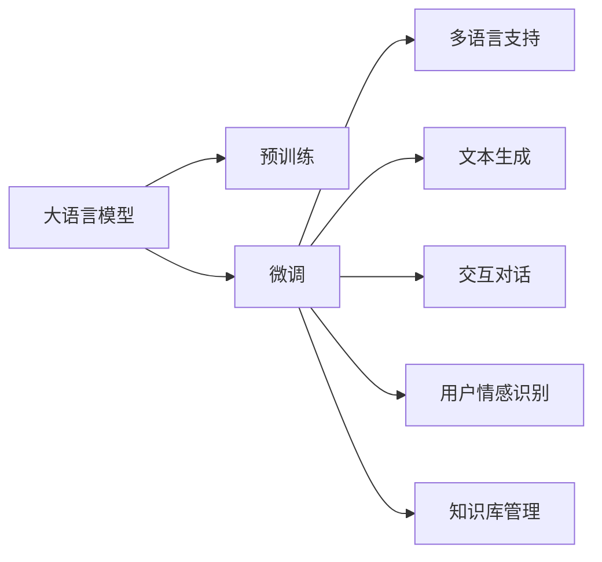
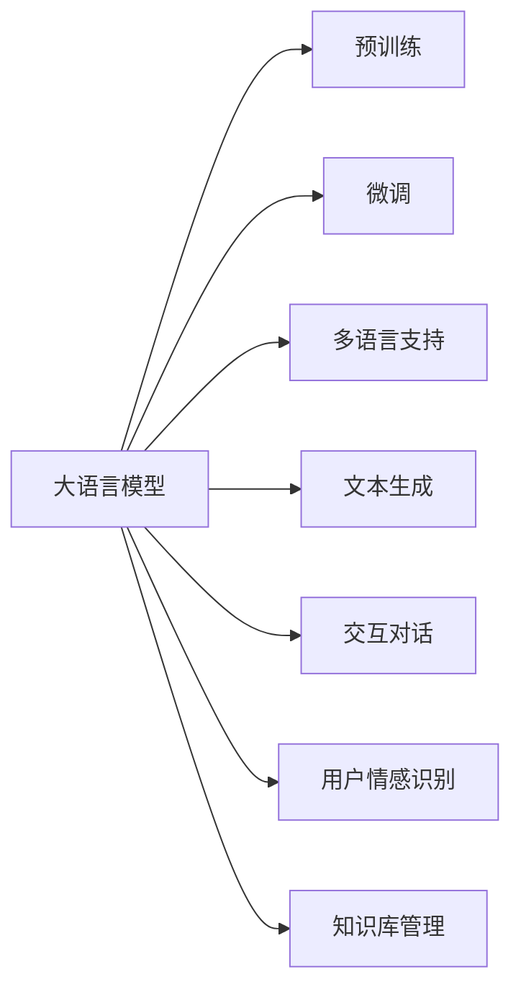
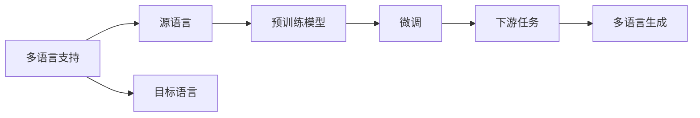
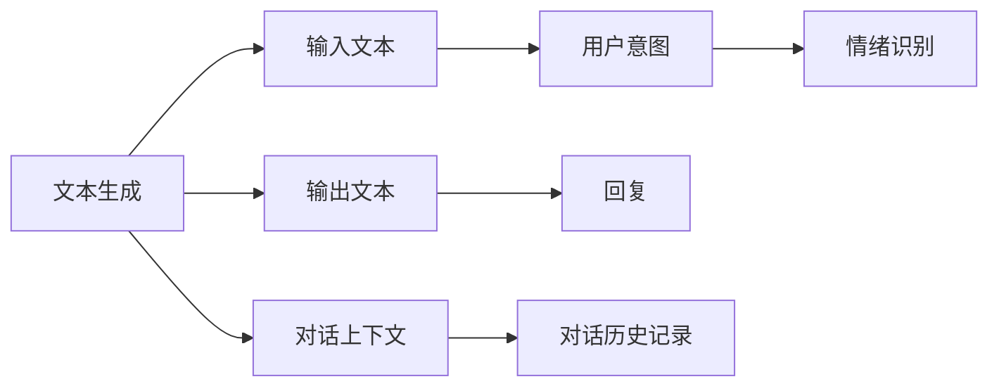
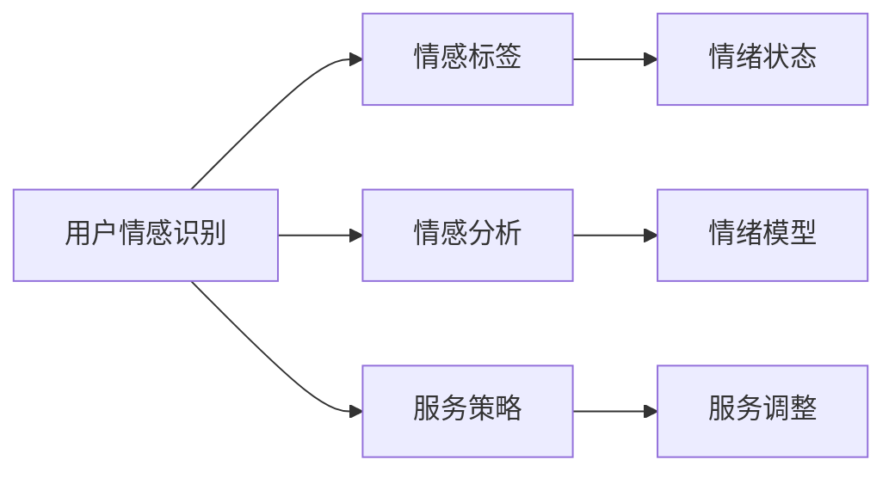
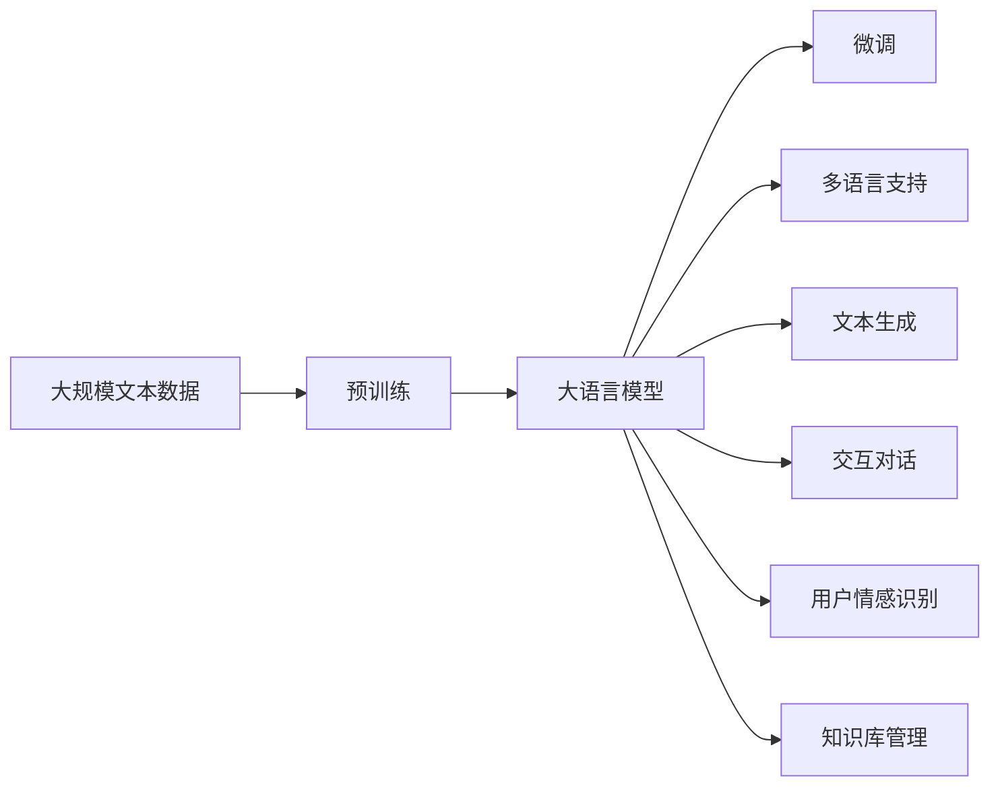

                 

# LLM驱动的智能客户服务：全天候多语言支持

> 关键词：大语言模型(Large Language Model, LLM),自然语言处理(NLP),智能客服,多语言支持,文本生成,交互对话

## 1. 背景介绍

### 1.1 问题由来
智能客服系统的广泛应用，提升了企业的客户服务效率，满足了用户多渠道、多时段的需求。然而，传统客服系统仍存在以下问题：
- **人工成本高**：大量人工客服人员需要配备，特别是在高峰期。
- **响应速度慢**：人工客服往往响应速度受限，不能满足用户即时需求。
- **一致性差**：不同客服人员之间的知识水平和风格差异较大，用户体验参差不齐。

为解决上述问题，基于大语言模型的智能客服系统应运而生。大语言模型，如GPT、BERT等，通过在海量文本数据上进行预训练，学习到通用的语言理解和生成能力，可以自主进行多轮对话，并生成自然流畅的回复。该系统可实现24/7全天候服务，提升客服效率，同时保证服务的一致性和专业性。

### 1.2 问题核心关键点
大语言模型在智能客服系统中的应用主要体现在以下几个方面：

- **自主生成回复**：利用大语言模型生成自然语言响应，无需人工干预，快速高效。
- **多语言支持**：通过多语言模型的微调，系统可以支持多种语言，满足国际化需求。
- **用户情感识别**：通过分析用户的文本输入，识别其情绪状态，适时调整服务策略。
- **知识库管理**：利用知识图谱等结构化数据，提升系统对复杂问题的理解和解答能力。
- **用户交互优化**：通过自动学习和用户反馈，不断优化模型，提升服务质量。

以上关键点相互交织，形成了智能客服系统的核心框架。大语言模型作为系统的大脑，整合了多语言理解、知识库管理、情绪识别和交互优化等多种能力，能够提供高质量、全天候的客户服务体验。

### 1.3 问题研究意义
大语言模型驱动的智能客服系统，对于提升企业客户服务水平，降低运营成本，优化用户体验，具有重要意义：

1. **降低运营成本**：大幅减少人工客服人员需求，降低运营成本，提升企业经济效益。
2. **提升服务效率**：系统可以24/7不间断服务，响应迅速，提升用户满意度。
3. **确保服务一致性**：自动化的服务流程和知识库管理，保证服务的一致性和专业性。
4. **拓展市场覆盖**：多语言支持，满足全球化市场的用户需求，开拓新的市场空间。
5. **促进技术创新**：推动NLP和AI技术的落地应用，促进产业升级。

## 2. 核心概念与联系

### 2.1 核心概念概述

为更好地理解大语言模型在智能客服系统中的应用，本节将介绍几个密切相关的核心概念：

- **大语言模型(Large Language Model, LLM)**：以自回归(如GPT)或自编码(如BERT)模型为代表的大规模预训练语言模型。通过在大规模无标签文本语料上进行预训练，学习通用的语言表示，具备强大的语言理解和生成能力。

- **预训练(Pre-training)**：指在大规模无标签文本语料上，通过自监督学习任务训练通用语言模型的过程。常见的预训练任务包括言语建模、遮挡语言模型等。预训练使得模型学习到语言的通用表示。

- **微调(Fine-tuning)**：指在预训练模型的基础上，使用下游任务的少量标注数据，通过有监督地训练来优化模型在该任务上的性能。通常只需要调整顶层分类器或解码器，并以较小的学习率更新全部或部分的模型参数。

- **多语言支持(Multilingual Support)**：指系统支持多种语言的输入和输出，提供国际化的服务。

- **文本生成(Text Generation)**：指系统能够基于用户输入的文本，自动生成自然流畅的回复或摘要等文本信息。

- **交互对话(Interactive Dialogue)**：指系统能够自主进行多轮对话，理解用户意图，并提供个性化的响应。

- **用户情感识别(User Sentiment Analysis)**：指系统能够识别用户文本输入中的情绪状态，如愤怒、失望等，及时调整服务策略。

- **知识库管理(Knowledge Base Management)**：指系统能够整合结构化数据，如知识图谱、FAQ库等，提升对复杂问题的理解和解答能力。

这些核心概念之间的逻辑关系可以通过以下Mermaid流程图来展示：



这个流程图展示了大语言模型在智能客服系统中的应用框架：

1. 大语言模型通过预训练获得基础能力。
2. 微调模型以适应特定的客服任务。
3. 多语言支持使得系统能够处理多种语言的输入和输出。
4. 文本生成使得系统能够自主回复用户。
5. 交互对话使得系统能够进行多轮对话，理解用户意图。
6. 用户情感识别使得系统能够识别用户情绪，调整服务策略。
7. 知识库管理使得系统能够整合结构化数据，提升问题解答能力。

这些概念共同构成了智能客服系统的核心功能，使得系统能够高效、智能地服务于全球用户。

### 2.2 概念间的关系

这些核心概念之间存在着紧密的联系，形成了智能客服系统的完整生态系统。下面我通过几个Mermaid流程图来展示这些概念之间的关系。

#### 2.2.1 大语言模型的学习范式



这个流程图展示了大语言模型的三种主要学习范式：预训练、微调和多语言支持。预训练主要采用自监督学习方法，而微调则是有监督学习的过程。多语言支持则是在预训练模型的基础上，通过微调来实现。

#### 2.2.2 多语言支持与微调的关系



这个流程图展示了多语言支持的基本原理，以及它与微调的关系。多语言支持涉及源语言和目标语言，预训练模型在源语言上学习，然后通过微调适应多种目标语言的生成任务。

#### 2.2.3 文本生成与交互对话的关系



这个流程图展示了文本生成和交互对话的基本过程。文本生成基于用户输入文本，生成自然语言回复。交互对话则通过多轮对话，理解用户意图，生成回复。

#### 2.2.4 用户情感识别与知识库管理的关系



这个流程图展示了用户情感识别和知识库管理的基本过程。用户情感识别通过分析文本输入，识别出用户情绪状态。知识库管理则通过整合结构化数据，提升问题解答能力。

### 2.3 核心概念的整体架构

最后，我们用一个综合的流程图来展示这些核心概念在大语言模型微调过程中的整体架构：



这个综合流程图展示了从预训练到微调，再到多语言支持、文本生成、交互对话、用户情感识别和知识库管理等功能的完整过程。大语言模型首先在大规模文本数据上进行预训练，然后通过微调（包括多语言支持和文本生成等）来适应多种任务和功能，最终在智能客服系统中发挥强大的语言理解和生成能力。

## 3. 核心算法原理 & 具体操作步骤
### 3.1 算法原理概述

大语言模型驱动的智能客服系统，本质上是一个有监督的细粒度迁移学习过程。其核心思想是：将预训练的大语言模型视作一个强大的"特征提取器"，通过在有标注的客服对话数据上进行有监督的微调，使得模型输出能够匹配任务标签，从而获得针对特定客服任务的优化模型。

形式化地，假设预训练语言模型为 $M_{\theta}$，其中 $\theta$ 为预训练得到的模型参数。给定客服任务 $T$ 的标注数据集 $D=\{(x_i, y_i)\}_{i=1}^N$，微调的目标是找到新的模型参数 $\hat{\theta}$，使得：

$$
\hat{\theta}=\mathop{\arg\min}_{\theta} \mathcal{L}(M_{\theta},D)
$$

其中 $\mathcal{L}$ 为针对任务 $T$ 设计的损失函数，用于衡量模型预测输出与真实标签之间的差异。常见的损失函数包括交叉熵损失、均方误差损失等。

通过梯度下降等优化算法，微调过程不断更新模型参数 $\theta$，最小化损失函数 $\mathcal{L}$，使得模型输出逼近真实标签。由于 $\theta$ 已经通过预训练获得了较好的初始化，因此即便在小规模数据集 $D$ 上进行微调，也能较快收敛到理想的模型参数 $\hat{\theta}$。

### 3.2 算法步骤详解

基于大语言模型的智能客服系统微调一般包括以下几个关键步骤：

**Step 1: 准备预训练模型和数据集**
- 选择合适的预训练语言模型 $M_{\theta}$ 作为初始化参数，如 BERT、GPT等。
- 准备客服任务 $T$ 的标注数据集 $D$，划分为训练集、验证集和测试集。一般要求标注数据与预训练数据的分布不要差异过大。

**Step 2: 添加任务适配层**
- 根据任务类型，在预训练模型顶层设计合适的输出层和损失函数。
- 对于多轮对话任务，通常在顶层添加多轮对话生成器。
- 对于问题-回答对，通常使用语言模型的解码器输出概率分布，并以负对数似然为损失函数。

**Step 3: 设置微调超参数**
- 选择合适的优化算法及其参数，如 AdamW、SGD 等，设置学习率、批大小、迭代轮数等。
- 设置正则化技术及强度，包括权重衰减、Dropout、Early Stopping等。
- 确定冻结预训练参数的策略，如仅微调顶层，或全部参数都参与微调。

**Step 4: 执行梯度训练**
- 将训练集数据分批次输入模型，前向传播计算损失函数。
- 反向传播计算参数梯度，根据设定的优化算法和学习率更新模型参数。
- 周期性在验证集上评估模型性能，根据性能指标决定是否触发 Early Stopping。
- 重复上述步骤直到满足预设的迭代轮数或 Early Stopping 条件。

**Step 5: 测试和部署**
- 在测试集上评估微调后模型 $M_{\hat{\theta}}$ 的性能，对比微调前后的精度提升。
- 使用微调后的模型对新样本进行推理预测，集成到实际的应用系统中。
- 持续收集新的数据，定期重新微调模型，以适应数据分布的变化。

以上是基于监督学习微调大语言模型的一般流程。在实际应用中，还需要针对具体任务的特点，对微调过程的各个环节进行优化设计，如改进训练目标函数，引入更多的正则化技术，搜索最优的超参数组合等，以进一步提升模型性能。

### 3.3 算法优缺点

基于大语言模型的智能客服系统微调方法具有以下优点：
1. 简单高效。只需准备少量标注数据，即可对预训练模型进行快速适配，获得较大的性能提升。
2. 通用适用。适用于各种客服任务，设计简单的任务适配层即可实现微调。
3. 参数高效。利用参数高效微调技术，在固定大部分预训练参数的情况下，仍可取得不错的提升。
4. 效果显著。在学术界和工业界的诸多任务上，基于微调的方法已经刷新了最先进的性能指标。

同时，该方法也存在一定的局限性：
1. 依赖标注数据。微调的效果很大程度上取决于标注数据的质量和数量，获取高质量标注数据的成本较高。
2. 迁移能力有限。当目标任务与预训练数据的分布差异较大时，微调的性能提升有限。
3. 负面效果传递。预训练模型的固有偏见、有害信息等，可能通过微调传递到下游任务，造成负面影响。
4. 可解释性不足。微调模型的决策过程通常缺乏可解释性，难以对其推理逻辑进行分析和调试。

尽管存在这些局限性，但就目前而言，基于监督学习的微调方法仍是大语言模型应用的最主流范式。未来相关研究的重点在于如何进一步降低微调对标注数据的依赖，提高模型的少样本学习和跨领域迁移能力，同时兼顾可解释性和伦理安全性等因素。

### 3.4 算法应用领域

基于大语言模型微调的智能客服系统已经在多个行业得到应用，例如：

- **电信行业**：通过智能客服系统，提高用户咨询的响应速度和质量，优化用户服务体验。
- **金融行业**：应用于在线客服，解答用户关于金融产品、服务流程等方面的咨询，提升服务效率。
- **电子商务**：协助在线客服解决用户关于订单、支付、物流等问题的疑问，提升用户体验和满意度。
- **医疗行业**：构建医疗问答系统，帮助用户快速查询疾病信息、治疗方案等，提升医疗服务的可及性和便捷性。
- **旅游行业**：提供在线客服，解答用户关于旅游路线、酒店预订、行程安排等问题，提升旅游服务的精准度和用户满意度。

除了上述这些经典行业外，智能客服系统还在教育、政府、保险等多个领域得到应用，为各行各业提供了高效、智能的客户服务解决方案。随着预训练模型和微调方法的不断进步，基于大语言模型的智能客服系统必将在更多领域发挥重要作用。

## 4. 数学模型和公式 & 详细讲解 & 举例说明

### 4.1 数学模型构建

本节将使用数学语言对基于监督学习的大语言模型微调过程进行更加严格的刻画。

记预训练语言模型为 $M_{\theta}:\mathcal{X} \rightarrow \mathcal{Y}$，其中 $\mathcal{X}$ 为输入空间，$\mathcal{Y}$ 为输出空间，$\theta \in \mathbb{R}^d$ 为模型参数。假设微调任务的训练集为 $D=\{(x_i,y_i)\}_{i=1}^N, x_i \in \mathcal{X}, y_i \in \mathcal{Y}$。

定义模型 $M_{\theta}$ 在数据样本 $(x,y)$ 上的损失函数为 $\ell(M_{\theta}(x),y)$，则在数据集 $D$ 上的经验风险为：

$$
\mathcal{L}(\theta) = \frac{1}{N} \sum_{i=1}^N \ell(M_{\theta}(x_i),y_i)
$$

微调的优化目标是最小化经验风险，即找到最优参数：

$$
\theta^* = \mathop{\arg\min}_{\theta} \mathcal{L}(\theta)
$$

在实践中，我们通常使用基于梯度的优化算法（如SGD、Adam等）来近似求解上述最优化问题。设 $\eta$ 为学习率，$\lambda$ 为正则化系数，则参数的更新公式为：

$$
\theta \leftarrow \theta - \eta \nabla_{\theta}\mathcal{L}(\theta) - \eta\lambda\theta
$$

其中 $\nabla_{\theta}\mathcal{L}(\theta)$ 为损失函数对参数 $\theta$ 的梯度，可通过反向传播算法高效计算。

### 4.2 公式推导过程

以下我们以多轮对话任务为例，推导基于大语言模型的智能客服系统的数学模型和训练过程。

假设模型 $M_{\theta}$ 在输入 $x$ 上的输出为 $\hat{x}=M_{\theta}(x) \in [0,1]$，表示样本属于某个实体的概率。真实标签 $y \in \{0,1\}$。则多轮对话任务的交叉熵损失函数定义为：

$$
\ell(M_{\theta}(x),y) = -[y\log \hat{y} + (1-y)\log (1-\hat{y})]
$$

将其代入经验风险公式，得：

$$
\mathcal{L}(\theta) = -\frac{1}{N}\sum_{i=1}^N [y_i\log M_{\theta}(x_i)+(1-y_i)\log(1-M_{\theta}(x_i))]
$$

根据链式法则，损失函数对参数 $\theta_k$ 的梯度为：

$$
\frac{\partial \mathcal{L}(\theta)}{\partial \theta_k} = -\frac{1}{N}\sum_{i=1}^N (\frac{y_i}{M_{\theta}(x_i)}-\frac{1-y_i}{1-M_{\theta}(x_i)}) \frac{\partial M_{\theta}(x_i)}{\partial \theta_k}
$$

其中 $\frac{\partial M_{\theta}(x_i)}{\partial \theta_k}$ 可进一步递归展开，利用自动微分技术完成计算。

在得到损失函数的梯度后，即可带入参数更新公式，完成模型的迭代优化。重复上述过程直至收敛，最终得到适应客服任务的最优模型参数 $\theta^*$。

### 4.3 案例分析与讲解

我们以在线客服系统为例，分析基于大语言模型的智能客服系统的应用案例。

#### 4.3.1 案例背景

某电商平台需要构建智能客服系统，以提升用户咨询体验，解决用户关于商品、订单、支付等问题的疑问。系统需要能够处理多种语言的输入，自动生成自然语言回复，并提供情绪识别和个性化服务。

#### 4.3.2 数据集准备

- **训练集**：收集平台用户的历史客服记录，标注出用户输入和客服回复。每个对话记录由多轮问答组成，标注出每个回答的实体类型和情感状态。
- **验证集和测试集**：划分训练集，用于模型训练过程中的超参数调优和最终模型评估。

#### 4.3.3 模型训练

- **模型选择**：选用BERT或GPT作为预训练模型，进行微调。
- **适配层设计**：在预训练模型的顶层添加多轮对话生成器，用于处理多轮对话输入。
- **损失函数**：使用多轮对话的交叉熵损失函数，结合情绪识别和实体识别的损失，计算最终损失。
- **优化器选择**：使用AdamW优化器，设置学习率为2e-5。
- **训练过程**：在训练集上进行前向传播和反向传播，更新模型参数。每轮训练后，在验证集上进行评估，调整学习率。

#### 4.3.4 模型评估

- **自动评估**：在测试集上对模型进行自动评估，包括精确率、召回率、F1分数等指标。
- **人工评估**：邀请真人客服对系统生成的回复进行人工评估，给出满意度评分。

#### 4.3.5 实际应用

- **系统部署**：将训练好的模型部署到生产环境，进行24/7在线客服。
- **用户反馈**：收集用户对系统回复的反馈，持续改进模型。
- **知识库管理**：定期更新知识库，提升系统对新问题和复杂问题的处理能力。

## 5. 项目实践：代码实例和详细解释说明

### 5.1 开发环境搭建

在进行微调实践前，我们需要准备好开发环境。以下是使用Python进行PyTorch开发的环境配置流程：

1. 安装Anaconda：从官网下载并安装Anaconda，用于创建独立的Python环境。

2. 创建并激活虚拟环境：
```bash
conda create -n pytorch-env python=3.8 
conda activate pytorch-env
```

3. 安装PyTorch：根据CUDA版本，从官网获取对应的安装命令。例如：
```bash
conda install pytorch torchvision torchaudio cudatoolkit=11.1 -c pytorch -c conda-forge
```

4. 安装Transformers库：
```bash
pip install transformers
```

5. 安装各类工具包：
```bash
pip install numpy pandas scikit-learn matplotlib tqdm jupyter notebook ipython
```

完成上述步骤后，即可在`pytorch-env`环境中开始微调实践。

### 5.2 源代码详细实现

下面我以智能客服系统为例，给出使用Transformers库对BERT模型进行微调的PyTorch代码实现。

首先，定义多轮对话任务的输入输出结构：

```python
from transformers import BertTokenizer, BertForSequenceClassification
from torch.utils.data import Dataset, DataLoader

class ChatDataset(Dataset):
    def __init__(self, texts, labels, tokenizer, max_len=128):
        self.texts = texts
        self.labels = labels
        self.tokenizer = tokenizer
        self.max_len = max_len
        
    def __len__(self):
        return len(self.texts)
    
    def __getitem__(self, item):
        text = self.texts[item]
        label = self.labels[item]
        
        encoding = self.tokenizer(text, return_tensors='pt', max_length=self.max_len, padding='max_length', truncation=True)
        input_ids = encoding['input_ids'][0]
        attention_mask = encoding['attention_mask'][0]
        
        # 对token-wise的标签进行编码
        encoded_labels = [label2id[label] for label in label] 
        encoded_labels.extend([label2id['O']] * (self.max_len - len(encoded_labels)))
        labels = torch.tensor(encoded_labels, dtype=torch.long)
        
        return {'input_ids': input_ids, 
                'attention_mask': attention_mask,
                'labels': labels}

# 标签与id的映射
label2id = {'O': 0, 'A': 1, 'B': 2, 'I': 3}
id2label = {v: k for k, v in label2id.items()}
```

然后，定义模型和优化器：

```python
from transformers import AdamW

model = BertForSequenceClassification.from_pretrained('bert-base-cased', num_labels=len(label2id))

optimizer = AdamW(model.parameters(), lr=2e-5)
```

接着，定义训练和评估函数：

```python
from tqdm import tqdm
from sklearn.metrics import classification_report

device = torch.device('cuda') if torch.cuda.is_available() else torch.device('cpu')
model.to(device)

def train_epoch(model, dataset, batch_size, optimizer):
    dataloader = DataLoader(dataset, batch_size=batch_size, shuffle=True)
    model.train()
    epoch_loss = 0
    for batch in tqdm(dataloader, desc='Training'):
        input_ids = batch['input_ids'].to(device)
        attention_mask = batch['attention_mask'].to(device)
        labels = batch['labels'].to(device)
        model.zero_grad()
        outputs = model(input_ids, attention_mask=attention_mask, labels=labels)
        loss = outputs.loss
        epoch_loss += loss.item()
        loss.backward()
        optimizer.step()
    return epoch_loss / len(dataloader)

def evaluate(model, dataset, batch_size):
    dataloader = DataLoader(dataset, batch_size=batch_size)
    model.eval()
    preds, labels = [], []
    with torch.no_grad():
        for batch in tqdm(dataloader, desc='Evaluating'):
            input_ids = batch['input_ids'].to(device)
            attention_mask = batch['attention_mask'].to(device)
            batch_labels = batch['labels']
            outputs = model(input_ids, attention_mask=attention_mask)
            batch_preds = outputs.logits.argmax(dim=2).to('cpu').tolist()
            batch_labels = batch_labels.to('cpu').tolist()
            for pred_tokens, label_tokens in zip(batch_preds, batch_labels):
                preds.append(pred_tokens[:len(label_tokens)])
                labels.append(label_tokens)
                
    print(classification_report(labels, preds))
```

最后，启动训练流程并在测试集上评估：

```python
epochs = 5
batch_size = 16

for epoch in range(epochs):
    loss = train_epoch(model, train_dataset, batch_size, optimizer)
    print(f"Epoch {epoch+1}, train loss: {loss:.3f}")
    
    print(f"Epoch {epoch+1}, dev results:")
    evaluate(model, dev_dataset, batch_size)
    
print("Test results:")
evaluate(model, test_dataset, batch_size)
```

以上就是使用PyTorch对BERT进行多轮对话任务微调的完整代码实现。可以看到，得益于Transformers库的强大封装，我们可以用相对简洁的代码完成BERT模型的加载和微调。

### 5.3 代码解读与分析

让我们再

