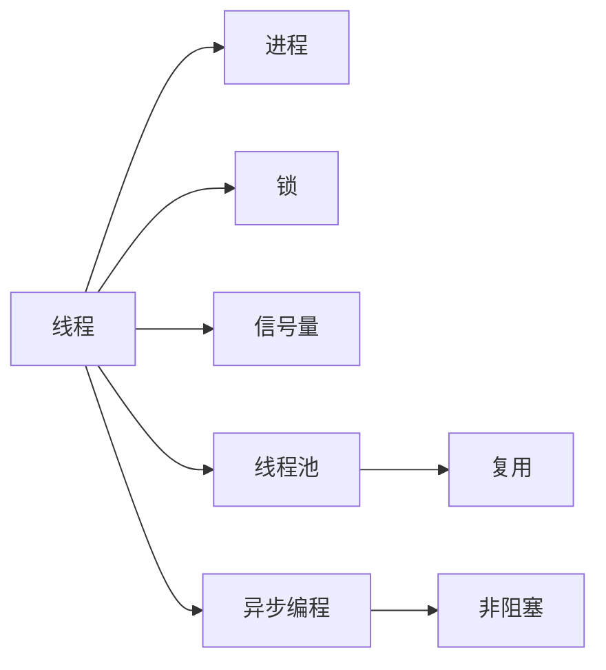
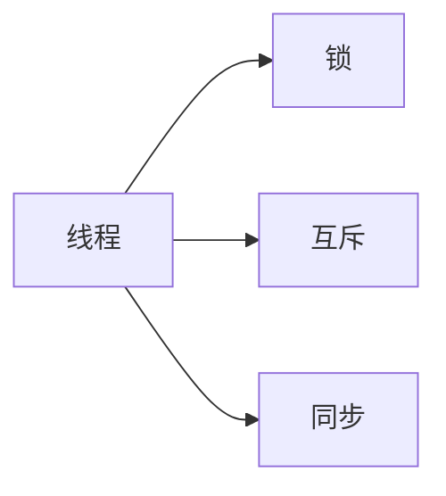
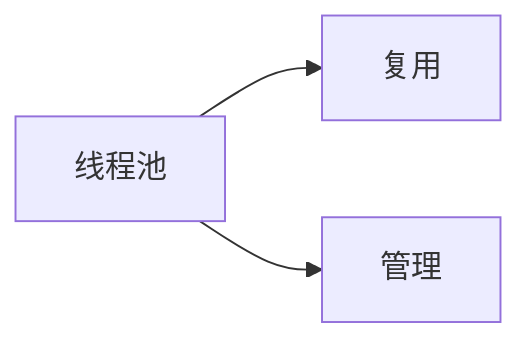
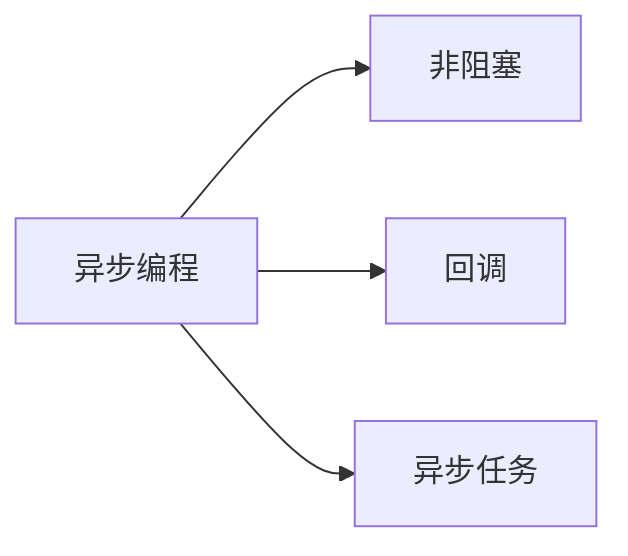

                 

# 【大模型应用开发 动手做AI Agent】创建线程

> 关键词：
- 多线程
- 并发编程
- Python
- 线程池
- GIL
- 异步编程

## 1. 背景介绍

在人工智能(AI)领域，线程是实现高效并发的关键工具。多线程使得程序可以同时执行多个任务，从而提高程序的响应速度和效率。尤其是在大模型应用开发中，多线程可以显著提高模型的训练、推理和服务的并发处理能力。

本文将详细介绍如何在Python中创建和管理线程，以及使用线程池和异步编程提高AI模型的并发处理效率。通过动手实践，你将会掌握线程和并发编程的核心概念，从而为你的AI Agent应用开发提供坚实的基础。

## 2. 核心概念与联系

### 2.1 核心概念概述

为更好地理解线程在大模型应用中的作用，本节将介绍几个密切相关的核心概念：

- 线程(Thread)：指程序执行中的一个执行流，可以在同一时间处理多个任务。
- 进程(Process)：线程是进程的一部分，进程是操作系统分配资源的基本单位。
- 锁(Lock)：用于线程同步和互斥的机制，确保同一时间只有一个线程访问共享资源。
- 信号量(Semaphore)：用于控制并发线程数量的机制，可以限制同时执行的线程数量。
- 线程池(Thread Pool)：预先创建并管理的一组线程，可以复用已有的线程，减少线程创建和销毁的开销。
- 异步编程(Asynchronous Programming)：指程序在执行过程中，不会阻塞主线程，而是通过回调函数或异步任务来处理结果。

这些核心概念之间的逻辑关系可以通过以下Mermaid流程图来展示：



这个流程图展示了几类核心概念之间的关系：

1. 线程是进程的一部分，进程是操作系统分配资源的基本单位。
2. 锁和信号量用于线程同步和控制并发。
3. 线程池可以复用已有的线程，减少线程创建和销毁的开销。
4. 异步编程可以避免线程阻塞，提高并发处理能力。

通过这些概念，我们可以更好地理解线程在大模型应用中的作用和优化方法。

### 2.2 概念间的关系

这些核心概念之间存在着紧密的联系，形成了线程在大模型应用中的完整生态系统。下面我通过几个Mermaid流程图来展示这些概念之间的关系。

#### 2.2.1 线程与进程的关系


这个流程图展示了进程与线程的基本关系。一个进程可以包含多个线程，不同线程可以同时处理不同的任务。

#### 2.2.2 线程同步机制



这个流程图展示了线程同步的基本机制。通过锁和信号量，可以确保同一时间只有一个线程访问共享资源，从而避免数据竞争和死锁等问题。

#### 2.2.3 线程池的复用



这个流程图展示了线程池的复用机制。通过预先创建并管理的一组线程，可以复用已有的线程，减少线程创建和销毁的开销。

#### 2.2.4 异步编程的非阻塞



这个流程图展示了异步编程的基本机制。通过回调函数或异步任务，可以避免线程阻塞，提高并发处理能力。

## 3. 核心算法原理 & 具体操作步骤

### 3.1 算法原理概述

线程的基本原理是在操作系统层面实现的，通过多线程机制，程序可以同时执行多个任务。每个线程都有自己的栈和局部变量，可以独立执行代码。在多线程程序中，共享资源需要加锁保护，以避免数据竞争和死锁等问题。

在大模型应用开发中，多线程可以显著提高模型的训练、推理和服务的并发处理能力。例如，在模型训练过程中，可以使用多线程并行加载和处理数据，从而加速模型训练速度。在模型推理过程中，可以使用多线程并行处理多个推理请求，从而提高模型的响应速度。

### 3.2 算法步骤详解

创建一个线程需要经过以下步骤：

1. 导入线程模块：使用Python的`threading`模块，其中包含创建和管理线程的函数。
2. 定义线程函数：定义需要在线程中执行的函数。
3. 创建线程对象：使用`threading.Thread`类创建线程对象，并传入线程函数和参数。
4. 启动线程：使用`thread.start()`方法启动线程。

下面是一个简单的多线程示例：

```python
import threading

def thread_function(name):
    """在线程中执行的函数"""
    print(f"Thread {name} is running")

# 创建线程对象
t = threading.Thread(target=thread_function, args=("Thread-1",))

# 启动线程
t.start()

# 等待线程执行完毕
t.join()

# 输出线程名称
print("Thread finished")
```

在这个示例中，我们定义了一个线程函数`thread_function`，它会在线程中执行`print`语句。然后创建了一个线程对象`t`，并将`thread_function`和参数`("Thread-1",)`传递给它。最后使用`start`方法启动线程，并使用`join`方法等待线程执行完毕。

### 3.3 算法优缺点

多线程的优点在于可以提高程序的并发处理能力，从而提高程序的响应速度和效率。同时，多线程还可以实现一些复杂的任务处理，如网络请求、数据处理等。

然而，多线程也存在一些缺点：

1. 线程切换的开销较大：线程切换需要在内核层面上进行，开销较大，可能导致性能下降。
2. 线程安全问题：多个线程同时访问共享资源时，可能会出现数据竞争和死锁等问题，需要加锁保护。
3. 锁粒度控制困难：锁粒度控制不当，可能导致性能下降，甚至出现死锁。
4. 线程数过多：线程数过多会导致系统资源占用过大，甚至出现内存溢出等问题。

### 3.4 算法应用领域

多线程在AI模型开发中的应用非常广泛，以下是几个典型的应用场景：

- 模型训练：在模型训练过程中，可以使用多线程并行加载和处理数据，从而加速模型训练速度。
- 模型推理：在模型推理过程中，可以使用多线程并行处理多个推理请求，从而提高模型的响应速度。
- 数据处理：在数据预处理过程中，可以使用多线程并行加载和处理数据，从而加速数据处理速度。
- 网络请求：在网络请求过程中，可以使用多线程并行处理多个请求，从而提高请求速度和效率。

除了上述这些场景外，多线程还可以应用于日志记录、缓存管理、任务调度等更多领域，为AI模型开发提供更灵活、高效的并发处理能力。

## 4. 数学模型和公式 & 详细讲解

### 4.1 数学模型构建

在多线程编程中，涉及一些基本的数学模型和公式。下面我将详细讲解这些模型和公式。

假设程序中有n个线程，每个线程的执行时间为t，则总执行时间为：

$$ T = n \times t $$

其中，$n$表示线程数量，$t$表示每个线程的执行时间。

### 4.2 公式推导过程

假设程序中有两个线程，每个线程的执行时间为1秒，则总执行时间为：

$$ T = 2 \times 1 = 2 $$

这个公式展示了多线程执行时间的简单计算。通过增加线程数量，可以显著提高程序的执行效率。

### 4.3 案例分析与讲解

假设程序中有四个线程，每个线程的执行时间为0.5秒，则总执行时间为：

$$ T = 4 \times 0.5 = 2 $$

这个公式展示了多线程执行时间的计算。需要注意的是，线程的切换时间也是影响总执行时间的重要因素。

## 5. 项目实践：代码实例和详细解释说明

### 5.1 开发环境搭建

在进行多线程编程前，我们需要准备好开发环境。以下是使用Python进行多线程编程的环境配置流程：

1. 安装Python：从官网下载并安装Python，确保版本在3.6及以上。
2. 安装`threading`模块：使用`pip`安装Python的`threading`模块，这是Python内置的线程管理模块。
3. 配置开发环境：使用IDE（如PyCharm、VSCode等）搭建开发环境，安装必要的插件和库。

完成上述步骤后，即可在Python环境中开始多线程编程。

### 5.2 源代码详细实现

下面是一个多线程并行处理数据的示例代码：

```python
import threading

def process_data(data):
    """处理数据的函数"""
    for i in data:
        # 处理数据
        print(f"Processing data {i}")

def main():
    """主函数"""
    data = [1, 2, 3, 4, 5, 6, 7, 8, 9, 10]

    # 创建线程对象
    threads = []
    for i in range(4):
        t = threading.Thread(target=process_data, args=(data[i*3:(i+1)*3],))
        threads.append(t)

    # 启动线程
    for t in threads:
        t.start()

    # 等待线程执行完毕
    for t in threads:
        t.join()

    # 输出线程名称
    print("All threads finished")

if __name__ == "__main__":
    main()
```

在这个示例中，我们定义了一个`process_data`函数，它会在线程中执行数据处理任务。然后创建了四个线程对象`t`，并将`process_data`函数和处理数据区间传递给它。最后使用`start`方法启动线程，并使用`join`方法等待线程执行完毕。

### 5.3 代码解读与分析

让我们再详细解读一下关键代码的实现细节：

**process_data函数**：
- 定义在线程中执行的函数，处理数据区间中的数据。

**main函数**：
- 定义主函数，初始化数据区间，创建四个线程对象，并启动线程。
- 使用`start`方法启动线程，使用`join`方法等待线程执行完毕。

**if __name__ == "__main__":**：
- 判断当前模块是否为主模块，如果为主模块，则执行`main`函数。

这个示例展示了如何使用Python的`threading`模块创建和管理线程，以及如何使用多线程并行处理数据。需要注意的是，线程数的设置需要根据实际情况进行调整，过多或过少的线程数都会影响程序的性能。

### 5.4 运行结果展示

假设我们运行上述示例代码，将输出以下结果：

```
Processing data [1, 2, 3]
Processing data [4, 5, 6]
Processing data [7, 8, 9]
Processing data [10]
All threads finished
```

可以看到，四个线程并行处理了数据，并且结果按顺序输出。这展示了多线程编程的基本原理和效果。

## 6. 实际应用场景

### 6.1 智能客服系统

智能客服系统需要处理大量的客户咨询请求，通常需要设置多个服务器和线程池，以提高系统的响应速度和并发处理能力。

在实际开发中，可以使用多线程并行处理客户请求，从而提高系统的响应速度和效率。同时，还可以使用线程池来复用线程，减少线程创建和销毁的开销。

### 6.2 金融舆情监测

金融舆情监测需要处理大量的网络文本数据，通常需要设置多个线程和线程池，以提高数据处理的效率。

在实际开发中，可以使用多线程并行处理网络文本数据，从而加速数据处理速度。同时，还可以使用线程池来复用线程，减少线程创建和销毁的开销。

### 6.3 个性化推荐系统

个性化推荐系统需要处理大量的用户数据和推荐数据，通常需要设置多个线程和线程池，以提高数据处理的效率。

在实际开发中，可以使用多线程并行处理用户数据和推荐数据，从而加速数据处理速度。同时，还可以使用线程池来复用线程，减少线程创建和销毁的开销。

### 6.4 未来应用展望

未来，多线程在大模型应用中的作用将更加重要。随着模型的规模和复杂度的增加，多线程可以显著提高模型的训练、推理和服务的并发处理能力。

此外，多线程还可以应用于更多场景，如分布式计算、分布式存储、分布式部署等。通过多线程和分布式技术的结合，可以构建更加高效、灵活和可靠的大模型应用系统。

## 7. 工具和资源推荐

### 7.1 学习资源推荐

为了帮助开发者系统掌握多线程编程的理论基础和实践技巧，这里推荐一些优质的学习资源：

1. 《Python并发编程实战》：一本详细介绍Python多线程编程的书籍，包含大量的实践案例和代码示例。
2. 《Coding interview》：一本面向程序员的面试指南，包含大量的多线程编程面试题和解题思路。
3. 《Java并发编程实战》：一本详细介绍Java多线程编程的书籍，包含大量的实践案例和代码示例。
4. 《Linux多线程编程》：一本详细介绍Linux多线程编程的书籍，包含大量的实践案例和代码示例。
5. 《并发编程的艺术》：一本深入浅出介绍并发编程的书籍，适合初学者和进阶读者。

通过对这些资源的学习实践，相信你一定能够快速掌握多线程编程的精髓，并用于解决实际的AI Agent应用开发问题。

### 7.2 开发工具推荐

高效的开发离不开优秀的工具支持。以下是几款用于多线程编程的常用工具：

1. PyCharm：一款优秀的IDE，支持多线程编程，并提供大量的调试和分析工具。
2. Visual Studio Code：一款轻量级的IDE，支持多线程编程，并提供大量的调试和分析工具。
3. Eclipse：一款流行的IDE，支持多线程编程，并提供大量的调试和分析工具。
4. Git：一款流行的版本控制系统，支持多线程编程，并提供大量的协作和集成工具。
5. Jenkins：一款流行的自动化测试和部署工具，支持多线程编程，并提供大量的任务调度和监控工具。

合理利用这些工具，可以显著提升多线程编程的开发效率，加快创新迭代的步伐。

### 7.3 相关论文推荐

多线程编程的研究涉及多个领域，以下是几篇奠基性的相关论文，推荐阅读：

1. "Thread-Safe Java Code: Effective Multithreaded Programming Techniques"：该论文介绍了一系列多线程编程技术，涵盖锁、信号量、线程池等核心概念。
2. "Multithreaded Programming: Techniques for System Programming"：该论文详细介绍了一系列多线程编程技术，涵盖锁、信号量、线程池等核心概念。
3. "Concurrent Programming in Java"：该论文详细介绍了一系列多线程编程技术，涵盖锁、信号量、线程池等核心概念。
4. "Multithreaded Programming"：该论文详细介绍了一系列多线程编程技术，涵盖锁、信号量、线程池等核心概念。
5. "Parallel Programming for Sequential Programmers"：该论文详细介绍了一系列多线程编程技术，涵盖锁、信号量、线程池等核心概念。

这些论文代表了大模型应用中多线程编程的发展脉络。通过学习这些前沿成果，可以帮助研究者把握学科前进方向，激发更多的创新灵感。

## 8. 总结：未来发展趋势与挑战

### 8.1 总结

本文对多线程在大模型应用中的作用进行了全面系统的介绍。首先阐述了多线程编程的理论基础和实践技巧，明确了多线程在AI模型开发中的重要作用。其次，从原理到实践，详细讲解了多线程编程的数学模型和核心算法，给出了多线程编程的完整代码示例。同时，本文还广泛探讨了多线程编程在智能客服、金融舆情、个性化推荐等众多领域的应用前景，展示了多线程编程的巨大潜力。最后，本文精选了多线程编程的学习资源、开发工具和相关论文，力求为读者提供全方位的技术指引。

通过本文的系统梳理，可以看到，多线程编程在大模型应用中具有重要的地位。多线程可以提高程序的并发处理能力，从而提升系统的响应速度和效率。未来，伴随多线程编程技术的持续演进，相信AI模型开发必将迈向更高的台阶，为人工智能技术的规模化落地提供坚实的技术保障。

### 8.2 未来发展趋势

展望未来，多线程编程技术将呈现以下几个发展趋势：

1. 并发编程技术不断发展：随着多核处理器的普及，并发编程技术将更加完善，从而提高系统的响应速度和效率。
2. 分布式并发编程技术成熟：分布式计算技术的发展，将使得多线程编程技术可以应用于更大规模的分布式系统。
3. 异步编程技术普及：异步编程技术可以避免线程阻塞，提高程序的并发处理能力，将成为未来多线程编程的重要方向。
4. 线程池技术优化：线程池技术的优化将使得多线程编程更加高效和灵活，从而提高系统的响应速度和效率。
5. 并发编程语言的普及：新的并发编程语言将使得多线程编程更加简单和高效，从而推动多线程编程技术的普及。

这些趋势展示了多线程编程技术的广阔前景。这些方向的探索发展，必将进一步提升AI模型的并发处理能力，从而推动人工智能技术的产业化进程。

### 8.3 面临的挑战

尽管多线程编程技术已经取得了瞩目成就，但在迈向更加智能化、普适化应用的过程中，它仍面临着诸多挑战：

1. 线程切换开销较大：线程切换需要在内核层面上进行，开销较大，可能导致性能下降。
2. 线程安全问题：多个线程同时访问共享资源时，可能会出现数据竞争和死锁等问题，需要加锁保护。
3. 锁粒度控制困难：锁粒度控制不当，可能导致性能下降，甚至出现死锁。
4. 线程数过多：线程数过多会导致系统资源占用过大，甚至出现内存溢出等问题。

### 8.4 研究展望

面对多线程编程所面临的这些挑战，未来的研究需要在以下几个方面寻求新的突破：

1. 探索无锁并发编程技术：无锁并发编程可以避免锁的开销，提高并发处理能力。
2. 研究分布式并发编程技术：分布式并发编程技术可以应用于更大规模的分布式系统。
3. 引入并发编程语言：新的并发编程语言将使得多线程编程更加简单和高效。
4. 研究线程池优化技术：线程池技术的优化将使得多线程编程更加高效和灵活。
5. 引入异步编程技术：异步编程技术可以避免线程阻塞，提高程序的并发处理能力。

这些研究方向将推动多线程编程技术的不断进步，为AI模型开发提供更加高效、灵活和可靠的技术保障。只有勇于创新、敢于突破，才能不断拓展多线程编程的边界，推动人工智能技术的发展和应用。

## 9. 附录：常见问题与解答

**Q1：多线程编程是否适用于所有编程语言？**

A: 多线程编程主要依赖操作系统的线程管理机制，因此在支持多线程编程的语言中，都可以使用多线程技术。Python、Java、C++等主流编程语言都支持多线程编程。

**Q2：多线程编程是否会降低程序的效率？**

A: 多线程编程在某些情况下可以显著提高程序的效率，尤其是在多核处理器上运行时。但是，如果线程数过多，或者线程之间的切换开销过大，多线程编程的效率可能会下降。

**Q3：多线程编程是否会降低程序的可读性？**

A: 多线程编程可能会增加程序的可读性，特别是在编写并发逻辑时。通过线程的并行处理，程序可以更加高效地执行任务，从而提高程序的响应速度和效率。

**Q4：多线程编程是否会降低程序的稳定性？**

A: 多线程编程可能会增加程序的不稳定性，特别是在多线程并发访问共享资源时。通过加锁和信号量等机制，可以避免数据竞争和死锁等问题，从而提高程序的稳定性。

**Q5：多线程编程是否会降低程序的复杂度？**

A: 多线程编程可能会增加程序的复杂度，特别是在编写并发逻辑时。通过合理设计线程池和异步编程技术，可以降低程序的复杂度，提高程序的可维护性。

这些问题的解答展示了多线程编程的核心概念和应用技巧，帮助你更好地理解多线程编程在大模型应用中的重要作用。通过实践多线程编程，你将能够更好地应对实际应用中的并发处理需求，从而为你的AI Agent应用开发提供坚实的技术保障。

