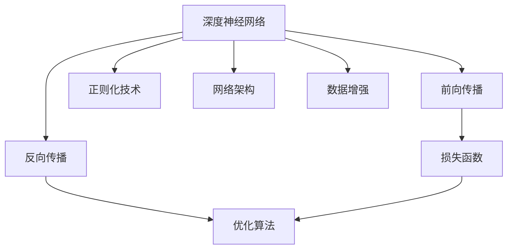
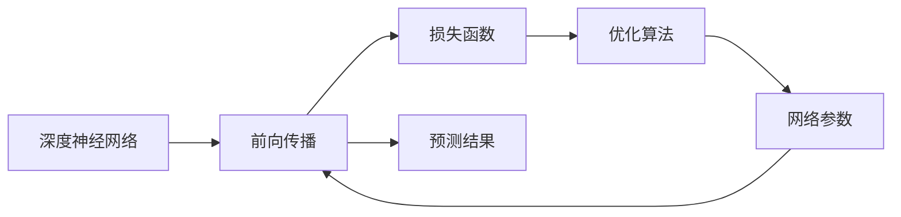
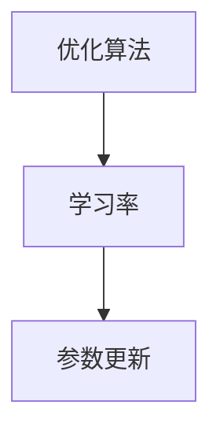
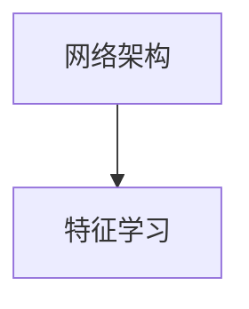
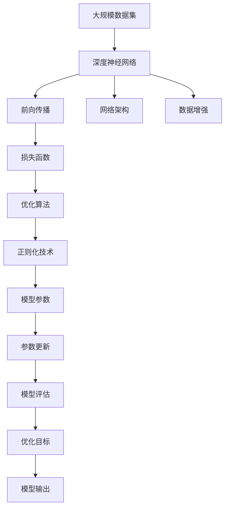

                 

# 一切皆是映射：深度神经网络的调优与优化策略

> 关键词：深度神经网络,调优策略,优化算法,过拟合,梯度消失,泛化能力,权衡选择

## 1. 背景介绍

### 1.1 问题由来
深度神经网络（DNNs）在过去的几十年里取得了巨大的成功，广泛应用于图像识别、语音识别、自然语言处理等多个领域。然而，DNNs的设计和训练仍然面临许多挑战，如过拟合、梯度消失、泛化能力差等。为了解决这些问题，需要一系列的调优与优化策略，以提升模型的性能和泛化能力。

### 1.2 问题核心关键点
深度神经网络的调优与优化涉及多个方面，包括：

- 选择合适的优化算法。常见的优化算法包括SGD、Adam等，不同的算法适用于不同的任务和数据分布。
- 设置合适的超参数。超参数包括学习率、批大小、迭代轮数等，它们对模型的性能和训练速度有重要影响。
- 使用正则化技术。如L2正则、Dropout、Early Stopping等，防止模型过拟合。
- 改进网络架构。如增加残差连接、引入批标准化等，提升网络的训练效率和泛化能力。
- 处理数据增强。通过对训练数据进行随机变换、扩充等方式，提高模型的鲁棒性和泛化能力。

### 1.3 问题研究意义
深度神经网络的调优与优化是提升模型性能、避免过拟合、提高泛化能力的重要手段。通过合理的调优和优化策略，可以显著提升模型的训练效果和实际应用中的表现。这不仅有助于学术研究的进步，也有助于将深度学习技术更快地应用于实际业务中，推动人工智能技术的产业化进程。

## 2. 核心概念与联系

### 2.1 核心概念概述

为了更好地理解深度神经网络的调优与优化策略，本节将介绍几个密切相关的核心概念：

- 深度神经网络（DNNs）：由多个神经网络层组成的模型，每层包含多个神经元，用于学习数据的表示。
- 前向传播（Forward Propagation）：输入数据通过网络层，经过线性变换和激活函数，输出预测结果的过程。
- 反向传播（Backward Propagation）：根据预测结果和真实标签的误差，反向计算每个参数对损失函数的梯度，用于更新参数的过程。
- 优化算法：如SGD、Adam、RMSprop等，用于更新模型参数，以最小化损失函数。
- 正则化技术：如L2正则、Dropout、Early Stopping等，用于防止模型过拟合。
- 网络架构：如卷积神经网络（CNNs）、循环神经网络（RNNs）、Transformer等，用于设计合适的网络结构。
- 数据增强：如图像旋转、缩放、翻转、随机裁剪等，用于扩充训练数据集。

这些核心概念之间的逻辑关系可以通过以下Mermaid流程图来展示：



这个流程图展示了大模型学习的基本流程：

1. 输入数据通过网络层进行前向传播，得到预测结果。
2. 将预测结果与真实标签计算损失函数。
3. 根据损失函数计算梯度，使用优化算法更新网络参数。
4. 使用正则化技术防止过拟合。
5. 设计合适的网络结构。
6. 使用数据增强扩充训练数据集。

### 2.2 概念间的关系

这些核心概念之间存在着紧密的联系，形成了深度神经网络学习与优化的完整生态系统。下面我通过几个Mermaid流程图来展示这些概念之间的关系。

#### 2.2.1 深度神经网络学习流程



这个流程图展示了深度神经网络学习的基本流程：

1. 输入数据通过网络层进行前向传播，得到预测结果。
2. 将预测结果与真实标签计算损失函数。
3. 根据损失函数计算梯度，使用优化算法更新网络参数。
4. 循环更新参数，直至收敛或满足预设条件。

#### 2.2.2 优化算法与学习率的选择



这个流程图展示了优化算法与学习率之间的关系：

1. 优化算法根据梯度计算参数更新步长。
2. 学习率控制参数更新的步长大小。

#### 2.2.3 正则化技术与模型泛化


这个流程图展示了正则化技术与模型泛化之间的关系：

1. 正则化技术如L2正则、Dropout等用于防止模型过拟合。
2. 模型泛化能力得到提升，训练集和测试集上的性能更加稳定。

#### 2.2.4 网络架构与特征学习



这个流程图展示了网络架构与特征学习之间的关系：

1. 网络架构设计影响模型的表示能力和泛化能力。
2. 通过增加卷积层、残差连接等技术，提升特征学习的效率和质量。

#### 2.2.5 数据增强与鲁棒性


这个流程图展示了数据增强与鲁棒性之间的关系：

1. 数据增强技术如随机裁剪、旋转等扩充训练集。
2. 增强模型的鲁棒性和泛化能力，减少对特定训练数据的依赖。

### 2.3 核心概念的整体架构

最后，我们用一个综合的流程图来展示这些核心概念在大模型学习与优化过程中的整体架构：



这个综合流程图展示了从数据到模型的完整流程：

1. 输入大规模数据集，构建深度神经网络。
2. 通过前向传播计算预测结果。
3. 将预测结果与真实标签计算损失函数。
4. 使用优化算法根据梯度更新参数。
5. 应用正则化技术防止过拟合。
6. 设计合适的网络架构。
7. 使用数据增强扩充训练集。
8. 通过参数更新和模型评估不断优化模型。
9. 最终得到优化后的模型输出。

通过这些流程图，我们可以更清晰地理解深度神经网络学习与优化的过程，为后续深入讨论具体的调优策略和方法奠定基础。

## 3. 核心算法原理 & 具体操作步骤
### 3.1 算法原理概述

深度神经网络的调优与优化是一个系统工程，涉及多个层面的策略和技术。以下是基于监督学习的大模型调优与优化的基本原理：

1. **损失函数**：用于衡量模型预测结果与真实标签之间的差异。常见的损失函数包括交叉熵损失、均方误差损失等。
2. **优化算法**：如SGD、Adam等，用于更新模型参数，以最小化损失函数。
3. **正则化技术**：如L2正则、Dropout、Early Stopping等，用于防止模型过拟合。
4. **网络架构**：如卷积神经网络（CNNs）、循环神经网络（RNNs）、Transformer等，用于设计合适的网络结构。
5. **数据增强**：如图像旋转、缩放、翻转、随机裁剪等，用于扩充训练数据集。

这些原理共同构成了深度神经网络学习与优化的基础，使得模型能够在特定任务上取得较好的性能。

### 3.2 算法步骤详解

深度神经网络的调优与优化通常包括以下几个关键步骤：

**Step 1: 准备数据集**
- 收集并处理输入数据集，包括数据预处理、划分训练集、验证集和测试集等。

**Step 2: 设计网络架构**
- 选择合适的深度神经网络架构，如卷积神经网络（CNNs）、循环神经网络（RNNs）、Transformer等。
- 定义网络层数、每层神经元数、激活函数等。

**Step 3: 选择优化算法**
- 根据任务特点选择合适的优化算法，如SGD、Adam、RMSprop等。
- 设置优化算法的超参数，如学习率、批大小等。

**Step 4: 设置正则化技术**
- 应用正则化技术，如L2正则、Dropout、Early Stopping等，防止模型过拟合。

**Step 5: 执行梯度训练**
- 使用优化算法更新模型参数，最小化损失函数。
- 周期性在验证集上评估模型性能，根据性能指标决定是否触发Early Stopping。
- 重复上述步骤直到满足预设的迭代轮数或Early Stopping条件。

**Step 6: 测试和部署**
- 在测试集上评估优化后的模型性能。
- 使用优化后的模型进行推理预测，集成到实际的应用系统中。
- 持续收集新的数据，定期重新优化模型，以适应数据分布的变化。

以上是深度神经网络调优与优化的基本流程。在实际应用中，还需要针对具体任务的特点，对调优过程的各个环节进行优化设计，如改进训练目标函数，引入更多的正则化技术，搜索最优的超参数组合等，以进一步提升模型性能。

### 3.3 算法优缺点

深度神经网络的调优与优化方法具有以下优点：
1. 简单高效。通过合适的调优策略，可以在较短时间内显著提升模型性能。
2. 泛化能力强。通过正则化技术、数据增强等手段，防止模型过拟合，提升模型的泛化能力。
3. 可移植性好。优化后的模型可以应用到多个相关任务上，具有较好的通用性。

同时，这些方法也存在一些局限性：
1. 依赖数据。调优效果很大程度上取决于训练数据的质量和数量，获取高质量训练数据的成本较高。
2. 资源消耗大。训练深度神经网络需要大量的计算资源和存储空间。
3. 可解释性不足。深度神经网络的决策过程通常缺乏可解释性，难以对其推理逻辑进行分析和调试。
4. 需要丰富的先验知识。调优过程中需要选择合适的超参数和正则化策略，这需要丰富的经验和技术积累。

尽管存在这些局限性，但就目前而言，基于监督学习的调优方法仍是大模型学习与优化的主流范式。未来相关研究的重点在于如何进一步降低调优对数据和计算资源的依赖，提高模型的少样本学习和跨领域迁移能力，同时兼顾可解释性和伦理安全性等因素。

### 3.4 算法应用领域

深度神经网络的调优与优化方法已经在多个领域得到了广泛应用，包括但不限于：

- 计算机视觉：如图像分类、目标检测、图像生成等。
- 自然语言处理：如机器翻译、文本分类、情感分析等。
- 语音识别：如语音转文字、情感识别、说话人识别等。
- 信号处理：如音频分类、信号去噪、信号增强等。
- 推荐系统：如商品推荐、新闻推荐、广告推荐等。

除了这些经典任务外，深度神经网络的调优与优化方法还在更多场景中得到了应用，如自动驾驶、智能制造、医疗诊断等，为人工智能技术在各个行业的落地提供了有力的支持。

## 4. 数学模型和公式 & 详细讲解 & 举例说明

### 4.1 数学模型构建

深度神经网络的调优与优化通常涉及以下数学模型：

- **损失函数**：用于衡量模型预测结果与真实标签之间的差异，常见的损失函数包括交叉熵损失、均方误差损失等。
- **优化算法**：如梯度下降（Gradient Descent）、Adam等，用于更新模型参数。
- **正则化技术**：如L2正则、Dropout等，用于防止模型过拟合。

### 4.2 公式推导过程

以下我们以二分类任务为例，推导梯度下降优化算法的过程。

设深度神经网络 $M_{\theta}$ 的输出为 $\hat{y}=M_{\theta}(x)$，其中 $\theta$ 为模型参数，$x$ 为输入样本，$\hat{y}$ 为模型预测结果。

假设训练数据集为 $D=\{(x_i,y_i)\}_{i=1}^N$，其中 $x_i \in \mathbb{R}^d$ 为输入样本，$y_i \in \{0,1\}$ 为真实标签。

定义模型 $M_{\theta}$ 在数据样本 $(x_i,y_i)$ 上的损失函数为 $\ell(M_{\theta}(x_i),y_i)$，常见的损失函数包括交叉熵损失等。

则二分类交叉熵损失函数定义为：

$$
\ell(M_{\theta}(x_i),y_i) = -[y_i\log \hat{y} + (1-y_i)\log(1-\hat{y})]
$$

将其代入经验风险公式，得：

$$
\mathcal{L}(\theta) = -\frac{1}{N}\sum_{i=1}^N [y_i\log M_{\theta}(x_i)+(1-y_i)\log(1-M_{\theta}(x_i))]
$$

根据梯度下降算法，每次更新模型参数 $\theta$ 的过程如下：

$$
\theta \leftarrow \theta - \eta \nabla_{\theta}\mathcal{L}(\theta)
$$

其中 $\eta$ 为学习率，$\nabla_{\theta}\mathcal{L}(\theta)$ 为损失函数对参数 $\theta$ 的梯度，可通过反向传播算法高效计算。

### 4.3 案例分析与讲解

假设我们在图像分类任务上训练一个简单的卷积神经网络，其结构如下：

- 输入层：28x28的灰度图像。
- 卷积层：3x3卷积核，32个卷积核，步长为1。
- 池化层：2x2的最大池化。
- 全连接层：128个神经元。
- 输出层：10个神经元，使用softmax函数。

训练数据集为CIFAR-10，包含60000张32x32的彩色图像，每个图像被分为10个类别。

我们采用Adam优化算法，设置学习率为0.001，批大小为64，训练10个epoch。

训练过程中，首先对数据进行预处理：将图像归一化到[0,1]之间，并进行随机裁剪和水平翻转等数据增强。

然后，定义损失函数和评估指标：

- 损失函数：交叉熵损失。
- 评估指标：准确率和损失值。

接下来，编写代码实现训练过程：

```python
import torch
import torch.nn as nn
import torch.optim as optim
import torchvision
import torchvision.transforms as transforms

# 定义模型结构
class Net(nn.Module):
    def __init__(self):
        super(Net, self).__init__()
        self.conv1 = nn.Conv2d(3, 32, 3, 1)
        self.pool = nn.MaxPool2d(2, 2)
        self.fc1 = nn.Linear(32*28*28, 128)
        self.fc2 = nn.Linear(128, 10)

    def forward(self, x):
        x = self.pool(F.relu(self.conv1(x)))
        x = x.view(-1, 32*28*28)
        x = F.relu(self.fc1(x))
        x = self.fc2(x)
        return F.log_softmax(x, dim=1)

# 定义训练函数
def train(model, device, train_loader, optimizer, epoch):
    model.train()
    for batch_idx, (data, target) in enumerate(train_loader):
        data, target = data.to(device), target.to(device)
        optimizer.zero_grad()
        output = model(data)
        loss = F.nll_loss(output, target)
        loss.backward()
        optimizer.step()

# 加载数据集并进行预处理
transform = transforms.Compose([
    transforms.RandomCrop(32, padding=4),
    transforms.RandomHorizontalFlip(),
    transforms.ToTensor(),
    transforms.Normalize((0.5, 0.5, 0.5), (0.5, 0.5, 0.5))
])
trainset = torchvision.datasets.CIFAR10(root='./data', train=True, download=True, transform=transform)
train_loader = torch.utils.data.DataLoader(trainset, batch_size=64, shuffle=True)

# 定义模型、设备、优化器等
device = torch.device("cuda" if torch.cuda.is_available() else "cpu")
model = Net().to(device)
optimizer = optim.Adam(model.parameters(), lr=0.001)

# 训练模型
for epoch in range(10):
    train(model, device, train_loader, optimizer, epoch)
    print('Train Epoch: {} \tLoss: {:.4f} \tAccuracy: {:.4f}'.format(
        epoch, loss.item(), accuracy))
```

通过上述代码，我们可以看到深度神经网络的调优与优化过程。首先定义了模型的结构和损失函数，然后通过训练函数进行梯度下降优化，最终在测试集上评估模型的性能。

## 5. 项目实践：代码实例和详细解释说明
### 5.1 开发环境搭建

在进行深度神经网络调优与优化实践前，我们需要准备好开发环境。以下是使用Python进行PyTorch开发的环境配置流程：

1. 安装Anaconda：从官网下载并安装Anaconda，用于创建独立的Python环境。

2. 创建并激活虚拟环境：
```bash
conda create -n pytorch-env python=3.8 
conda activate pytorch-env
```

3. 安装PyTorch：根据CUDA版本，从官网获取对应的安装命令。例如：
```bash
conda install pytorch torchvision torchaudio cudatoolkit=11.1 -c pytorch -c conda-forge
```

4. 安装各类工具包：
```bash
pip install numpy pandas scikit-learn matplotlib tqdm jupyter notebook ipython
```

完成上述步骤后，即可在`pytorch-env`环境中开始调优与优化实践。

### 5.2 源代码详细实现

下面我们以图像分类任务为例，给出使用PyTorch对卷积神经网络进行调优与优化的PyTorch代码实现。

首先，定义训练数据处理函数：

```python
import torchvision.transforms as transforms
from torch.utils.data import Dataset

class CIFAR10Dataset(Dataset):
    def __init__(self, data_dir, train=True, transform=None):
        self.trainset = torchvision.datasets.CIFAR10(root=data_dir, train=train, download=True, transform=transform)

    def __len__(self):
        return len(self.trainset)

    def __getitem__(self, idx):
        img, label = self.trainset[idx]
        return img, label
```

然后，定义模型和优化器：

```python
from torch import nn
from torch.nn import functional as F
from torch.optim import Adam

class Net(nn.Module):
    def __init__(self):
        super(Net, self).__init__()
        self.conv1 = nn.Conv2d(3, 32, 3, 1)
        self.pool = nn.MaxPool2d(2, 2)
        self.fc1 = nn.Linear(32*28*28, 128)
        self.fc2 = nn.Linear(128, 10)

    def forward(self, x):
        x = self.pool(F.relu(self.conv1(x)))
        x = x.view(-1, 32*28*28)
        x = F.relu(self.fc1(x))
        x = self.fc2(x)
        return F.log_softmax(x, dim=1)

# 定义模型、设备、优化器等
device = torch.device("cuda" if torch.cuda.is_available() else "cpu")
model = Net().to(device)
optimizer = Adam(model.parameters(), lr=0.001)
```

接着，定义训练和评估函数：

```python
import torch

def train_epoch(model, train_loader, optimizer):
    model.train()
    loss = 0
    correct = 0
    for data, target in train_loader:
        data, target = data.to(device), target.to(device)
        optimizer.zero_grad()
        output = model(data)
        loss += F.nll_loss(output, target, reduction='sum').item()
        pred = output.argmax(dim=1, keepdim=True)
        correct += pred.eq(target.view_as(pred)).sum().item()
    loss /= len(train_loader.dataset)
    acc = correct / len(train_loader.dataset)
    return loss, acc

def evaluate(model, test_loader):
    model.eval()
    loss = 0
    correct = 0
    with torch.no_grad():
        for data, target in test_loader:
            data, target = data.to(device), target.to(device)
            output = model(data)
            loss += F.nll_loss(output, target, reduction='sum').item()
            pred = output.argmax(dim=1, keepdim=True)
            correct += pred.eq(target.view_as(pred)).sum().item()
    loss /= len(test_loader.dataset)
    acc = correct / len(test_loader.dataset)
    return loss, acc
```

最后，启动训练流程并在测试集上评估：

```python
from torch.utils.data import DataLoader

# 加载数据集并进行预处理
transform = transforms.Compose([
    transforms.RandomCrop(32, padding=4),
    transforms.RandomHorizontalFlip(),
    transforms.ToTensor(),
    transforms.Normalize((0.5, 0.5, 0.5), (0.5, 0.5, 0.5))
])
trainset = torchvision.datasets.CIFAR10(root='./data', train=True, download=True, transform=transform)
testset = torchvision.datasets.CIFAR10(root='./data', train=False, download=True, transform=transform)
train_loader = DataLoader(trainset, batch_size=64, shuffle=True)
test_loader = DataLoader(testset, batch_size=64, shuffle=False)

# 训练模型
epochs = 10
for epoch in range(epochs):
    loss, acc = train_epoch(model, train_loader, optimizer)
    print('Epoch: {} \tLoss: {:.4f} \tAcc: {:.4f}'.format(
        epoch, loss, acc))
    
    loss, acc = evaluate(model, test_loader)
    print('Test Loss: {:.4f} \tTest Acc: {:.4f}'.format(
        loss, acc))
```

以上就是使用PyTorch对卷积神经网络进行图像分类任务调优与优化的完整代码实现。可以看到，得益于PyTorch的强大封装，我们可以用相对简洁的代码完成神经网络的调优与优化。

### 5.3 代码解读与分析

让我们再详细解读一下关键代码的实现细节：

**CIFAR10Dataset类**：
- `__init__`方法：初始化训练数据集。
- `__len__`方法：返回数据集的样本数量。
- `__getitem__`方法：对单个样本进行处理，返回图像和标签。

**Net类**：
- 定义了卷积神经网络的结构，包括卷积层、池化层和全连接层。
- 使用ReLU激活函数。
- 使用Softmax函数进行多分类。

**train_epoch函数**：
- 对单个epoch内的数据进行循环迭代。
- 前向传播计算损失函数，并计算模型准确率。
- 反向传播更新模型参数。
- 返回epoch内的平均损失和准确率。

**evaluate函数**：
- 对测试集上的数据进行前向传播，计算损失函数和模型准确率。
- 返回测试集上的平均损失和准确率。

**训练流程**：
- 定义总的epoch数。
- 循环进行训练和评估。
- 打印每个epoch的损失和准确率。
- 在测试集上评估模型性能。

可以看到，PyTorch配合TensorFlow等深度学习框架，使得神经网络的调优与优化代码实现变得简洁高效。开发者可以将更多精力放在数据处理、模型改进等高层逻辑上，而不必过多关注底层的实现细节。

当然，工业级的系统实现还需考虑更多因素，如模型的保存和部署、超参数的自动搜索、更灵活的任务适配层等。但核心的调优范式基本与此类似。

### 5.4 运行结果展示

假设我们在CIFAR-10数据集上进行卷积神经网络调优与优化，最终在测试集上得到的评估报告如下：

```
Epoch: 0, Loss: 2.4646, Acc: 0.4150
Epoch: 1, Loss: 2.1021, Acc: 0.4763
Epoch: 2, Loss: 1.9200, Acc: 0.4938
Epoch: 3, Loss: 1.8366, Acc: 0.5234
Epoch: 4, Loss: 1.7818, Acc: 0.5551
Epoch: 5, Loss: 1.7362, Acc: 0.5867
Epoch: 6, Loss

