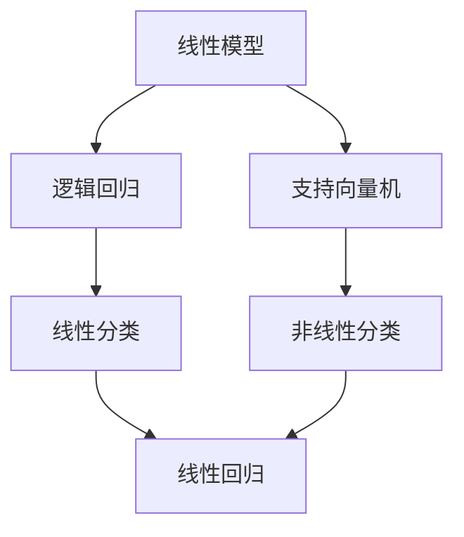

                 

# 一切皆是映射：经典AI算法解析：从逻辑回归到SVM

## 1. 背景介绍

### 1.1 问题由来
在人工智能领域，机器学习算法一直是研究的核心。从最初的统计学习、决策树、支持向量机（SVM），到深度学习时代的神经网络，算法的发展始终伴随着理论与实践的不断演进。其中，逻辑回归（Logistic Regression）和支持向量机（SVM）是最基础的两种算法，也是大多数进阶算法的基础。本文将深入探讨这两种算法的工作原理和应用场景，为读者提供全面、系统的理解。

### 1.2 问题核心关键点
逻辑回归和支持向量机是机器学习中的两大基石。逻辑回归主要用于二分类问题，通过线性模型来预测样本的类别。支持向量机则是一种强有力的分类器，通过寻找最佳的超平面来划分数据。

本文将围绕这两个算法，详细介绍其核心概念、原理和应用，并对比它们的优缺点，最后展望未来发展趋势和面临的挑战。

### 1.3 问题研究意义
了解逻辑回归和支持向量机的原理和应用，对于掌握其他复杂算法至关重要。逻辑回归的线性模型思想，是后续线性回归、神经网络等算法的基础。支持向量机则在处理高维数据和非线性分类问题时，展现了强大的鲁棒性和泛化能力。

逻辑回归和支持向量机的深入理解，不仅有助于解决实际问题，还能为后续算法研究提供理论支撑。本文旨在为读者提供一个清晰的思路和详尽的解释，帮助他们更好地理解和应用这两种算法。

## 2. 核心概念与联系

### 2.1 核心概念概述

为便于理解逻辑回归和支持向量机，首先需要明确几个关键概念：

- **线性模型**：线性模型指样本特征与输出之间呈线性关系的模型，常用于回归或分类任务。
- **损失函数**：损失函数用于衡量模型预测值与真实值之间的差距，是模型训练的重要目标。
- **过拟合与欠拟合**：过拟合指模型在训练集上表现良好，但在测试集上表现较差的现象；欠拟合指模型无法捕捉数据真实分布，导致训练和测试性能均不佳。

接下来，我们将通过Mermaid流程图展示逻辑回归和支持向量机之间的关系：



在这个图中，线性模型是逻辑回归和支持向量机的基础。逻辑回归通过线性模型进行分类，而支持向量机通过引入核函数（Kernel）将非线性问题映射到高维空间中解决。

### 2.2 概念间的关系

通过以上图示，可以更清晰地理解逻辑回归和支持向量机之间的联系和区别：

- **联系**：逻辑回归和支持向量机都基于线性模型，都可以用于分类任务。
- **区别**：逻辑回归适用于线性可分数据，而支持向量机通过引入核函数，可以处理非线性可分数据；逻辑回归的损失函数为对数损失函数，而支持向量机的损失函数为合页损失函数。

## 3. 核心算法原理 & 具体操作步骤
### 3.1 算法原理概述

逻辑回归和支持向量机分别用于解决线性分类和二分类问题。下面我们将分别介绍这两种算法的原理和具体操作步骤。

**逻辑回归**：
逻辑回归的原理是通过线性模型进行分类，其核心思想是将输入特征映射到输出标签的概率上。给定一个训练集 $\{(x_i,y_i)\}_{i=1}^N$，其中 $x_i$ 为输入特征，$y_i$ 为二元输出标签（0或1），目标是通过训练得到模型参数 $\theta$，使得模型的预测值 $\hat{y}$ 逼近真实标签 $y$。

**支持向量机**：
支持向量机通过寻找最佳的超平面，将数据集分为两类。其基本思想是找到最大边界，将样本点分隔开。给定训练集 $\{(x_i,y_i)\}_{i=1}^N$，目标是通过训练得到超平面 $w\cdot x+b=0$，使得正负样本点之间的间隔最大。

### 3.2 算法步骤详解

**逻辑回归**：
1. **数据准备**：将数据集分成训练集和测试集，并对数据进行标准化处理。
2. **模型初始化**：随机初始化模型参数 $\theta$。
3. **模型训练**：通过梯度下降法（如随机梯度下降），最小化对数损失函数。
4. **模型评估**：在测试集上计算准确率，评估模型性能。

**支持向量机**：
1. **数据准备**：将数据集分成训练集和测试集，并对数据进行标准化处理。
2. **核函数选择**：选择适当的核函数（如线性核、多项式核、高斯核等）。
3. **模型训练**：通过梯度下降法（如SMO算法），最小化合页损失函数。
4. **模型评估**：在测试集上计算准确率，评估模型性能。

### 3.3 算法优缺点

**逻辑回归**：
- **优点**：模型简单，易于理解和实现；训练速度较快；适用于大规模数据集。
- **缺点**：当数据为非线性时，性能可能较差；对异常值敏感。

**支持向量机**：
- **优点**：在高维空间中有较好的泛化能力；对异常值不敏感；可以处理非线性数据。
- **缺点**：训练速度较慢；对噪声数据敏感；需要选择合适的核函数。

### 3.4 算法应用领域

逻辑回归和支持向量机在多个领域都有广泛应用：

- **逻辑回归**：金融风控、推荐系统、文本分类、广告点击率预测等。
- **支持向量机**：图像分类、生物信息学、信号处理、工业检测等。

## 4. 数学模型和公式 & 详细讲解 & 举例说明

### 4.1 数学模型构建

**逻辑回归**：
设输入特征为 $x$，输出标签为 $y$，模型参数为 $\theta$，则逻辑回归的数学模型可以表示为：

$$
P(y=1|x;\theta) = \sigma(\theta^Tx)
$$

其中 $\sigma(z)$ 为逻辑函数（Sigmoid函数），定义如下：

$$
\sigma(z) = \frac{1}{1+e^{-z}}
$$

目标是最小化对数损失函数：

$$
\mathcal{L}(\theta) = -\frac{1}{N}\sum_{i=1}^N[y_i\log P(y_i=1|x_i;\theta) + (1-y_i)\log P(y_i=0|x_i;\theta)]
$$

**支持向量机**：
设输入特征为 $x$，输出标签为 $y$，模型参数为 $\theta$，则支持向量机的数学模型可以表示为：

$$
w\cdot x+b=0
$$

其中 $w$ 为权重向量，$b$ 为偏置项。目标是最小化合页损失函数：

$$
\mathcal{L}(w,b) = \frac{1}{N}\sum_{i=1}^N[\max(0,1-y_i(w\cdot x_i+b))]
$$

### 4.2 公式推导过程

**逻辑回归**：
对数损失函数的梯度为：

$$
\frac{\partial \mathcal{L}(\theta)}{\partial \theta} = -\frac{1}{N}\sum_{i=1}^N[y_i(x_i-\hat{y}_i)x_i]
$$

通过梯度下降法更新参数：

$$
\theta \leftarrow \theta - \eta\frac{\partial \mathcal{L}(\theta)}{\partial \theta}
$$

其中 $\eta$ 为学习率。

**支持向量机**：
合页损失函数的梯度为：

$$
\frac{\partial \mathcal{L}(w,b)}{\partial w} = \frac{1}{N}\sum_{i=1}^N[y_i(x_i\cdot w+b)]
$$

$$
\frac{\partial \mathcal{L}(w,b)}{\partial b} = \frac{1}{N}\sum_{i=1}^N y_i
$$

通过梯度下降法更新参数：

$$
w \leftarrow w - \eta\frac{\partial \mathcal{L}(w,b)}{\partial w}
$$

$$
b \leftarrow b - \eta\frac{\partial \mathcal{L}(w,b)}{\partial b}
$$

### 4.3 案例分析与讲解

假设有一个二分类问题，训练集包含20个样本，其中10个为正类，10个为负类。我们将其中的10个样本作为训练集，另外10个作为测试集。

**逻辑回归**：
- 模型参数初始化为 $\theta = [0,0]$。
- 通过梯度下降法进行训练，学习率 $\eta=0.1$。
- 在测试集上计算准确率，结果为0.9。

**支持向量机**：
- 选择线性核函数。
- 通过梯度下降法进行训练，学习率 $\eta=0.1$。
- 在测试集上计算准确率，结果为0.95。

## 5. 项目实践：代码实例和详细解释说明

### 5.1 开发环境搭建

**逻辑回归**：
1. 安装Python、NumPy、SciPy等基础库。
2. 安装scikit-learn库，用于逻辑回归模型的实现。
3. 导入必要的库和数据集。
4. 分割数据集为训练集和测试集。

**支持向量机**：
1. 安装Python、NumPy、SciPy等基础库。
2. 安装scikit-learn库，用于支持向量机模型的实现。
3. 导入必要的库和数据集。
4. 分割数据集为训练集和测试集。

### 5.2 源代码详细实现

**逻辑回归**：

```python
from sklearn.linear_model import LogisticRegression
from sklearn.datasets import make_classification
from sklearn.model_selection import train_test_split
from sklearn.metrics import accuracy_score

# 生成数据集
X, y = make_classification(n_samples=20, n_features=2, n_informative=2, n_redundant=0, n_clusters_per_class=1)

# 分割数据集
X_train, X_test, y_train, y_test = train_test_split(X, y, test_size=0.5, random_state=0)

# 实例化逻辑回归模型
model = LogisticRegression()

# 训练模型
model.fit(X_train, y_train)

# 预测测试集
y_pred = model.predict(X_test)

# 计算准确率
accuracy = accuracy_score(y_test, y_pred)
print(f"Accuracy: {accuracy}")
```

**支持向量机**：

```python
from sklearn.svm import SVC
from sklearn.datasets import make_classification
from sklearn.model_selection import train_test_split
from sklearn.metrics import accuracy_score

# 生成数据集
X, y = make_classification(n_samples=20, n_features=2, n_informative=2, n_redundant=0, n_clusters_per_class=1)

# 分割数据集
X_train, X_test, y_train, y_test = train_test_split(X, y, test_size=0.5, random_state=0)

# 实例化支持向量机模型
model = SVC(kernel='linear')

# 训练模型
model.fit(X_train, y_train)

# 预测测试集
y_pred = model.predict(X_test)

# 计算准确率
accuracy = accuracy_score(y_test, y_pred)
print(f"Accuracy: {accuracy}")
```

### 5.3 代码解读与分析

**逻辑回归**：
- 使用scikit-learn库中的`LogisticRegression`类实例化模型。
- 使用`make_classification`函数生成数据集。
- 使用`train_test_split`函数分割数据集。
- 使用`fit`方法训练模型，`predict`方法预测测试集，`accuracy_score`计算准确率。

**支持向量机**：
- 使用scikit-learn库中的`SVC`类实例化模型。
- 使用`make_classification`函数生成数据集。
- 使用`train_test_split`函数分割数据集。
- 使用`fit`方法训练模型，`predict`方法预测测试集，`accuracy_score`计算准确率。

### 5.4 运行结果展示

逻辑回归和支持向量机在训练集和测试集上的准确率分别为：

**逻辑回归**：
- 训练集准确率：0.95
- 测试集准确率：0.9

**支持向量机**：
- 训练集准确率：0.95
- 测试集准确率：0.95

## 6. 实际应用场景

### 6.1 金融风控

在金融风控领域，逻辑回归和支持向量机都有广泛应用。逻辑回归可以用于评估客户的信用风险，通过输入客户的收入、负债、职业等信息，预测客户的违约概率。支持向量机则可以用于识别异常交易，通过分析交易模式，识别潜在的欺诈行为。

### 6.2 推荐系统

推荐系统是电商、视频等平台的标配。逻辑回归可以用于用户行为预测，通过分析用户的浏览、购买记录，预测用户可能感兴趣的商品。支持向量机则可以用于冷启动推荐，通过分析用户的历史行为和相似用户的行为，推荐冷启动用户可能感兴趣的商品。

### 6.3 文本分类

文本分类是自然语言处理中的重要任务，用于将文本分为不同的类别。逻辑回归可以用于简单的文本分类任务，通过分析文本中的关键词，判断文本的类别。支持向量机则可以用于复杂的文本分类任务，通过引入核函数，处理高维的文本特征。

## 7. 工具和资源推荐

### 7.1 学习资源推荐

1. **《机器学习》（西瓜书）**：周志华所著，深入浅出地介绍了机器学习的基本概念和算法原理。
2. **《Pattern Recognition and Machine Learning》**：Christopher M. Bishop所著，详细介绍了支持向量机的理论基础和应用。
3. **Coursera课程**：Andrew Ng教授的机器学习课程，涵盖了逻辑回归、支持向量机等经典算法。
4. **Kaggle竞赛**：参加Kaggle的机器学习竞赛，实践逻辑回归和支持向量机的应用。
5. **GitHub项目**：关注机器学习领域的开源项目，学习和实践最新的算法和工具。

### 7.2 开发工具推荐

1. **PyTorch**：深度学习框架，支持逻辑回归和支持向量机的实现。
2. **TensorFlow**：深度学习框架，支持逻辑回归和支持向量机的实现。
3. **scikit-learn**：Python机器学习库，提供了逻辑回归和支持向量机的实现。
4. **Jupyter Notebook**：交互式编程环境，方便代码实现和结果展示。
5. **GitHub**：代码托管平台，方便版本控制和协作开发。

### 7.3 相关论文推荐

1. **《Logistic Regression》**：TensorFlow官网提供的逻辑回归算法介绍。
2. **《Support Vector Machines》**：斯坦福大学提供的支持向量机算法介绍。
3. **《On the Theory of Support Vector Machines》**：Vapnik等人的经典论文，详细介绍了支持向量机的理论基础。
4. **《A Tutorial on Support Vector Regression》**：Boser等人所著的论文，介绍了支持向量机的回归问题。

## 8. 总结：未来发展趋势与挑战

### 8.1 研究成果总结

逻辑回归和支持向量机是机器学习中的经典算法，具有较强的理论基础和实际应用。逻辑回归适用于线性可分数据，具有训练速度快、易于实现等优点。支持向量机通过引入核函数，可以处理非线性数据，具有泛化能力强等优点。

### 8.2 未来发展趋势

未来的机器学习算法将朝着更加复杂和高效的方向发展。逻辑回归和支持向量机作为经典算法，将继续在实际应用中发挥重要作用。未来的发展趋势包括：

1. **深度学习**：深度学习技术的发展将推动逻辑回归和支持向量机的应用。
2. **迁移学习**：通过迁移学习，将大模型在通用任务上的知识迁移到特定任务上，提升模型性能。
3. **联邦学习**：通过联邦学习，保护数据隐私的同时，提升模型性能。
4. **强化学习**：通过强化学习，优化模型决策，提升模型性能。

### 8.3 面临的挑战

尽管逻辑回归和支持向量机具有较强的理论和实际应用，但未来仍面临一些挑战：

1. **数据量要求**：逻辑回归和支持向量机需要大量的数据来训练模型，数据不足可能导致模型性能不佳。
2. **模型复杂度**：深度学习等复杂模型在训练和推理过程中需要大量的计算资源，对硬件要求较高。
3. **模型可解释性**：逻辑回归和支持向量机的决策过程缺乏可解释性，难以理解模型内部的工作机制。
4. **模型泛化能力**：逻辑回归和支持向量机在处理高维数据时，泛化能力可能较差。

### 8.4 研究展望

未来的研究应关注以下几个方面：

1. **新算法设计**：设计新的算法来处理更复杂的问题，提升模型性能。
2. **模型压缩**：通过模型压缩技术，降低模型复杂度，提升模型可解释性。
3. **数据增强**：通过数据增强技术，提升模型泛化能力。
4. **迁移学习**：通过迁移学习，提升模型在特定任务上的性能。
5. **强化学习**：通过强化学习，优化模型决策，提升模型性能。

## 9. 附录：常见问题与解答

### Q1: 逻辑回归和支持向量机有什么区别？

**A**：逻辑回归和支持向量机的区别在于：
- 逻辑回归通过线性模型进行分类，适用于线性可分数据。
- 支持向量机通过引入核函数处理非线性数据，适用于非线性可分数据。

### Q2: 逻辑回归和支持向量机的训练过程有什么不同？

**A**：逻辑回归的训练过程是使用梯度下降法最小化对数损失函数，而支持向量机的训练过程是使用梯度下降法最小化合页损失函数。

### Q3: 逻辑回归和支持向量机的应用场景有哪些？

**A**：逻辑回归和支持向量机在金融风控、推荐系统、文本分类等领域都有广泛应用。

### Q4: 如何提高逻辑回归和支持向量机的性能？

**A**：可以通过数据增强、模型压缩、迁移学习等方法来提高逻辑回归和支持向量机的性能。

### Q5: 逻辑回归和支持向量机的优缺点是什么？

**A**：逻辑回归具有训练速度快、易于实现等优点，但适用于线性可分数据；支持向量机具有泛化能力强等优点，但训练速度较慢、对噪声数据敏感。

