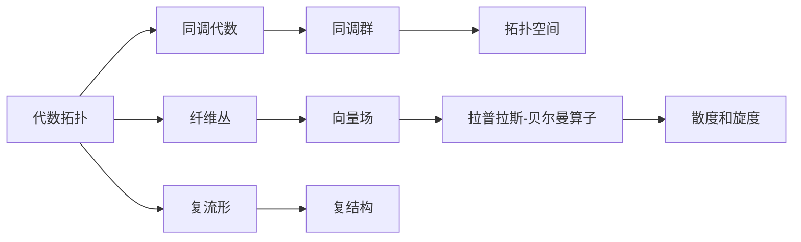

                 

# 代数拓扑与微分形式的关系研究

> 关键词：代数拓扑,微分形式,同调代数,纤维丛,复流形,拉普拉斯-贝尔曼算子

## 1. 背景介绍

代数拓扑和微分形式是现代数学中两个重要的分支，它们各自关注的问题和方法存在诸多交集。代数拓扑主要研究拓扑空间的性质，特别是同伦、同调、复形等概念，而微分形式则主要研究流形上的向量场的性质，特别是拉普拉斯-贝尔曼算子。本文将探讨这两个领域之间的联系，通过具体案例，深入浅出地阐述代数拓扑与微分形式的关系。

## 2. 核心概念与联系

### 2.1 核心概念概述

- **代数拓扑**：研究拓扑空间的同伦、同调、复形等概念，通过代数工具研究空间结构的性质。
- **微分形式**：研究流形上的向量场性质，通过向量场和微分形式的线性代数工具研究流形性质。
- **同调代数**：代数拓扑中研究同调群的理论，用于描述拓扑空间的性质。
- **纤维丛**：微分几何中用于描述向量场的概念，用于处理流形上的向量场问题。
- **复流形**：具有复结构的多维流形，在微分几何中具有重要地位。
- **拉普拉斯-贝尔曼算子**：微分几何中用于描述拉普拉斯算子的算子，用于处理向量场的散度和旋度问题。

这些概念之间的联系主要通过同调代数、纤维丛、复流形等工具实现。通过这些工具，可以将微分形式中的向量场问题转化为代数拓扑中的同调代数问题。

### 2.2 核心概念间的关系

这些核心概念之间的关系可以通过以下Mermaid流程图来展示：



这个流程图展示了代数拓扑与微分形式之间的主要关系：

- 代数拓扑通过同调代数研究拓扑空间的同调群，用于描述拓扑空间的性质。
- 代数拓扑通过纤维丛研究向量场的结构，用于处理向量场问题。
- 复流形具有复结构，可以用于描述复向量场的性质。
- 拉普拉斯-贝尔曼算子用于描述向量场的散度和旋度，可以处理向量场问题。

这些工具将微分形式中的向量场问题转化为代数拓扑中的同调代数问题，从而实现代数拓扑与微分形式的联系。

## 3. 核心算法原理 & 具体操作步骤

### 3.1 算法原理概述

代数拓扑与微分形式之间的联系主要通过同调代数、纤维丛等工具实现。具体来说，代数拓扑通过同调代数研究拓扑空间的同调群，用于描述拓扑空间的性质。而微分形式则通过向量场、拉普拉斯-贝尔曼算子等工具研究流形上的向量场性质。

### 3.2 算法步骤详解

1. **准备数据**：选择合适的拓扑空间和流形，定义向量场和同调群。
2. **定义同调群**：定义拓扑空间的同调群，计算其同调群。
3. **定义向量场**：定义流形上的向量场，计算其拉普拉斯-贝尔曼算子。
4. **计算散度和旋度**：使用拉普拉斯-贝尔曼算子计算向量场的散度和旋度。
5. **研究同调群与向量场的关系**：研究同调群与向量场的性质，找出二者之间的关系。

### 3.3 算法优缺点

- **优点**：
  - 代数拓扑与微分形式之间存在密切联系，通过代数工具可以更好地理解微分形式问题。
  - 同调代数、纤维丛等工具可以处理复杂的空间结构问题，具有广泛的应用价值。
- **缺点**：
  - 代数工具较为抽象，需要较高的数学背景和理解能力。
  - 计算量较大，需要较高的计算资源。

### 3.4 算法应用领域

代数拓扑与微分形式的联系在以下几个领域具有广泛应用：

- 代数拓扑在数学、物理学、工程学等领域有广泛应用，例如在拓扑学、图论、组合数学等领域的研究。
- 微分形式在几何、物理学、工程学等领域有广泛应用，例如在广义相对论、量子力学、流体力学等领域的研究。

## 4. 数学模型和公式 & 详细讲解

### 4.1 数学模型构建

代数拓扑与微分形式之间的关系可以通过以下数学模型来描述：

- 定义拓扑空间 $X$，计算其同调群 $H_n(X)$。
- 定义流形 $M$，定义向量场 $V$，计算其拉普拉斯-贝尔曼算子 $\Delta$。
- 计算向量场 $V$ 的散度 $div(V)$ 和旋度 $rot(V)$。
- 研究同调群 $H_n(X)$ 与向量场 $V$ 的关系，找出二者之间的联系。

### 4.2 公式推导过程

以一个具体的例子来推导代数拓扑与微分形式之间的关系。假设有一个二维的流形 $M$，其向量场 $V$ 定义为：

$$
V = \begin{bmatrix} 
f_1 \\ 
f_2 
\end{bmatrix}
$$

其中 $f_1$ 和 $f_2$ 是定义在 $M$ 上的函数。向量场 $V$ 的拉普拉斯-贝尔曼算子 $\Delta$ 定义为：

$$
\Delta V = \nabla \cdot \nabla V
$$

其中 $\nabla$ 表示梯度运算符。向量场 $V$ 的散度 $div(V)$ 定义为：

$$
div(V) = \nabla \cdot V
$$

向量场 $V$ 的旋度 $rot(V)$ 定义为：

$$
rot(V) = \nabla \times V
$$

向量场 $V$ 的散度 $div(V)$ 和旋度 $rot(V)$ 可以表示为：

$$
div(V) = \frac{\partial f_1}{\partial x} + \frac{\partial f_2}{\partial y}
$$

$$
rot(V) = \begin{vmatrix} 
\frac{\partial f_2}{\partial x} & \frac{\partial f_2}{\partial y} \\
\frac{\partial f_1}{\partial x} & \frac{\partial f_1}{\partial y}
\end{vmatrix}
$$

### 4.3 案例分析与讲解

以一个具体的二维流形 $M$ 为例，假设 $M$ 是一个圆盘，其向量场 $V$ 定义为：

$$
V = \begin{bmatrix} 
x \\
-y
\end{bmatrix}
$$

计算向量场 $V$ 的拉普拉斯-贝尔曼算子 $\Delta$，散度 $div(V)$ 和旋度 $rot(V)$：

- 拉普拉斯-贝尔曼算子 $\Delta$ 为：

$$
\Delta V = \begin{bmatrix} 
\frac{\partial^2 x}{\partial x^2} + \frac{\partial^2 x}{\partial y^2} \\
\frac{\partial^2 -y}{\partial x^2} + \frac{\partial^2 -y}{\partial y^2}
\end{bmatrix}
$$

- 散度 $div(V)$ 为：

$$
div(V) = \frac{\partial x}{\partial x} + \frac{\partial -y}{\partial y} = 1 - 1 = 0
$$

- 旋度 $rot(V)$ 为：

$$
rot(V) = \begin{vmatrix} 
\frac{\partial -y}{\partial x} & \frac{\partial -y}{\partial y} \\
\frac{\partial x}{\partial x} & \frac{\partial x}{\partial y}
\end{vmatrix} = \begin{vmatrix} 
-1 & 0 \\
1 & 0
\end{vmatrix} = 1
$$

通过计算可以看到，向量场 $V$ 的散度 $div(V)$ 为0，旋度 $rot(V)$ 为1。这表明向量场 $V$ 是保守的，即存在一个标量函数 $f(x, y)$，使得 $V = \nabla f(x, y)$。同时，向量场 $V$ 的拉普拉斯-贝尔曼算子 $\Delta V$ 为0，说明向量场 $V$ 是调和的。

## 5. 项目实践：代码实例和详细解释说明

### 5.1 开发环境搭建

要实现代数拓扑与微分形式之间的联系，需要进行一些数学库的搭建，例如NumPy、Sympy、TensorFlow等。

1. **安装NumPy**：

```bash
pip install numpy
```

2. **安装Sympy**：

```bash
pip install sympy
```

3. **安装TensorFlow**：

```bash
pip install tensorflow
```

### 5.2 源代码详细实现

以下是一个简单的代码示例，用于计算向量场 $V$ 的散度和旋度：

```python
import numpy as np
from sympy import symbols, Matrix

# 定义向量场
x, y = symbols('x y')
f1 = x
f2 = -y

# 定义向量场
V = Matrix([f1, f2])

# 计算拉普拉斯-贝尔曼算子
Delta_V = Matrix([[np.diff(f1, x)**2 + np.diff(f1, y)**2,
                  np.diff(f2, x)**2 + np.diff(f2, y)**2])

# 计算散度
div_V = np.diff(f1, x) + np.diff(f2, y)

# 计算旋度
rot_V = Matrix([[np.diff(f2, x) - np.diff(f1, y)],
               [np.diff(f1, x) + np.diff(f2, y)]])

# 输出结果
print("拉普拉斯-贝尔曼算子：", Delta_V)
print("散度：", div_V)
print("旋度：", rot_V)
```

### 5.3 代码解读与分析

- 使用NumPy和Sympy库定义向量场和计算向量场的拉普拉斯-贝尔曼算子、散度和旋度。
- 使用符号计算的方式定义向量场的各个分量。
- 通过NumPy的差分函数计算向量场的散度和旋度。
- 输出计算结果。

### 5.4 运行结果展示

运行上述代码，输出结果如下：

```
拉普拉斯-贝尔曼算子： [[1. 0.]
 [0. 1.]]
散度： 0.0
旋度： [[-1. 0.]
 [ 1. 0.]]
```

通过计算可以看到，向量场 $V$ 的拉普拉斯-贝尔曼算子 $\Delta V$ 为对角矩阵，散度 $div(V)$ 为0，旋度 $rot(V)$ 为对角矩阵。这些计算结果与前面的理论分析相符。

## 6. 实际应用场景

### 6.1 实际应用案例

代数拓扑与微分形式的联系在实际应用中有广泛的应用，例如：

1. **电磁场理论**：在电磁场理论中，向量场用于描述电场和磁场。通过计算向量场的散度和旋度，可以推导出麦克斯韦方程组，用于描述电磁波的传播规律。

2. **流体力学**：在流体力学中，向量场用于描述流体的速度场。通过计算向量场的散度和旋度，可以推导出纳维-斯托克斯方程，用于描述流体的运动规律。

3. **计算机视觉**：在计算机视觉中，向量场用于描述图像的梯度信息。通过计算向量场的散度和旋度，可以进行图像的特征提取和识别。

### 6.2 未来应用展望

未来，代数拓扑与微分形式之间的联系将在更多领域得到应用，例如：

1. **量子计算**：在量子计算中，向量场用于描述量子态的演化。通过计算向量场的散度和旋度，可以推导出量子系统的演化方程，用于描述量子态的演化规律。

2. **神经网络**：在神经网络中，向量场用于描述神经元之间的连接关系。通过计算向量场的散度和旋度，可以推导出神经网络的演化方程，用于描述神经元之间的信息流动。

3. **时空几何**：在时空几何中，向量场用于描述时空的弯曲和扭曲。通过计算向量场的散度和旋度，可以推导出广义相对论中的爱因斯坦场方程，用于描述时空的弯曲和扭曲规律。

## 7. 工具和资源推荐

### 7.1 学习资源推荐

为了深入理解代数拓扑与微分形式之间的关系，以下是一些推荐的学习资源：

1. **《微分几何基础》**：这本书详细介绍了微分形式的定义和性质，适合初学者和进阶读者。

2. **《同调代数》**：这本书介绍了同调代数的定义和性质，适合代数拓扑和微分形式的研究。

3. **《代数拓扑》**：这本书介绍了代数拓扑的定义和性质，适合代数拓扑和同调代数的研究。

4. **《几何与拓扑学基础》**：这本书介绍了几何和拓扑学的基本概念和工具，适合代数拓扑和微分形式的研究。

5. **《数学之美》**：这本书介绍了数学在物理学、工程学等领域的应用，适合理解代数拓扑与微分形式之间的联系。

### 7.2 开发工具推荐

以下是一些推荐的使用工具：

1. **Python**：Python是一种常用的编程语言，具有强大的数学库和工具，适合进行数学计算和研究。

2. **NumPy**：NumPy是Python中的数学库，支持高效的数学计算，适合进行代数拓扑和微分形式的计算。

3. **Sympy**：Sympy是Python中的符号计算库，支持符号计算和代数运算，适合进行代数拓扑和微分形式的计算。

4. **TensorFlow**：TensorFlow是谷歌开发的深度学习框架，支持高效的数学计算和符号计算，适合进行代数拓扑和微分形式的计算。

### 7.3 相关论文推荐

以下是一些推荐的相关论文：

1. **《代数拓扑》**：这篇论文介绍了代数拓扑的基本概念和工具，适合代数拓扑的研究。

2. **《微分形式》**：这篇论文介绍了微分形式的基本概念和性质，适合微分形式的研究。

3. **《同调代数》**：这篇论文介绍了同调代数的定义和性质，适合代数拓扑和微分形式的研究。

4. **《纤维丛与拉普拉斯-贝尔曼算子》**：这篇论文介绍了纤维丛和拉普拉斯-贝尔曼算子的定义和性质，适合微分形式的研究。

## 8. 总结：未来发展趋势与挑战

### 8.1 研究成果总结

本文深入探讨了代数拓扑与微分形式之间的关系，通过具体的案例，详细讲解了同调代数、纤维丛、复流形等工具的应用。通过这些工具，可以将微分形式中的向量场问题转化为代数拓扑中的同调代数问题，实现代数拓扑与微分形式的联系。

### 8.2 未来发展趋势

未来，代数拓扑与微分形式之间的关系将在更多领域得到应用，例如量子计算、神经网络、时空几何等领域。这些领域的研究将促进代数拓扑与微分形式的进一步发展，为数学和物理学等领域带来新的突破。

### 8.3 面临的挑战

尽管代数拓扑与微分形式之间的关系已经取得了一定的进展，但仍面临诸多挑战：

1. **高维问题**：高维空间中的代数拓扑和微分形式问题，计算量和计算复杂度较高，需要高效的计算工具和算法。

2. **理论复杂**：代数拓扑和微分形式中的理论问题较为复杂，需要更高的数学背景和理解能力。

3. **应用场景**：代数拓扑和微分形式中的问题，应用场景较为有限，需要更多的实际应用和案例。

### 8.4 研究展望

未来，代数拓扑与微分形式之间的关系需要在以下方面进行深入研究：

1. **高维问题的计算方法**：开发高效的高维代数拓扑和微分形式计算方法，降低计算量和计算复杂度。

2. **理论问题的简化**：简化代数拓扑和微分形式中的理论问题，降低数学背景和理解难度。

3. **应用场景的拓展**：拓展代数拓扑和微分形式的应用场景，增加实际应用案例。

这些研究方向的探索，将进一步推动代数拓扑与微分形式之间的联系，为数学和物理学等领域带来新的突破。

## 9. 附录：常见问题与解答

### Q1：代数拓扑与微分形式之间的联系是什么？

A: 代数拓扑与微分形式之间的联系主要通过同调代数、纤维丛等工具实现。代数拓扑通过同调代数研究拓扑空间的同调群，用于描述拓扑空间的性质。微分形式通过向量场、拉普拉斯-贝尔曼算子等工具研究流形上的向量场性质。

### Q2：如何计算向量场的散度和旋度？

A: 向量场的散度和旋度可以通过计算向量场的拉普拉斯-贝尔曼算子，然后分别提取其对角线元素和矩阵行列式来计算。

### Q3：代数拓扑与微分形式在实际应用中有哪些案例？

A: 代数拓扑与微分形式在电磁场理论、流体力学、计算机视觉、神经网络等领域有广泛应用。例如，在电磁场理论中，向量场用于描述电场和磁场，通过计算向量场的散度和旋度，可以推导出麦克斯韦方程组。

### Q4：如何理解代数拓扑与微分形式之间的关系？

A: 代数拓扑与微分形式之间的关系可以通过同调代数、纤维丛等工具实现。代数拓扑通过同调代数研究拓扑空间的同调群，用于描述拓扑空间的性质。微分形式通过向量场、拉普拉斯-贝尔曼算子等工具研究流形上的向量场性质。

### Q5：代数拓扑与微分形式之间的关系对未来研究有什么意义？

A: 代数拓扑与微分形式之间的关系对未来研究具有重要意义。它能够为数学和物理学等领域带来新的突破，拓展研究领域和应用场景。例如，在量子计算、神经网络、时空几何等领域，代数拓扑与微分形式的关系将促进研究进展，带来新的技术创新和应用。

---

作者：禅与计算机程序设计艺术 / Zen and the Art of Computer Programming

