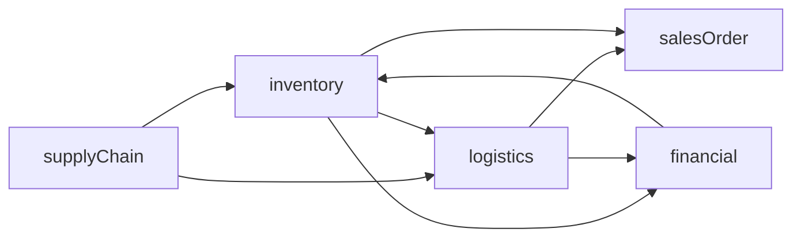
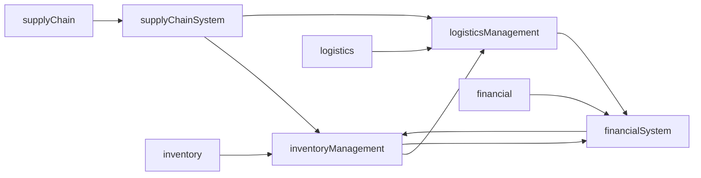

                 

# 供应链进销存、物流、财务系统设计

## 1. 背景介绍

### 1.1 问题由来
在现代企业中，供应链、进销存、物流、财务系统等业务流程是紧密联系且相互依赖的。良好的系统设计和高效的数据流通对于企业的运营管理至关重要。随着信息技术的发展，企业对于信息化建设的需求日益增长，然而，传统的信息系统往往无法满足复杂、多变、需求多样化的业务场景，难以实现真正的数字化转型。

为应对这一挑战，本文将探讨如何设计基于先进信息技术的供应链进销存、物流、财务系统，以实现高效、协同、智能化的业务管理，从而提升企业的运营效率和市场竞争力。

### 1.2 问题核心关键点
本文将聚焦于以下几个核心问题：

- **供应链管理**：如何设计高效、灵活、可扩展的供应链管理系统，以应对供应链中复杂的环节和不确定性。
- **进销存管理**：如何通过信息化手段优化企业的库存管理，实现库存水平控制和库存成本优化。
- **物流管理**：如何实现高效的物流资源调配和物流路径优化，以降低物流成本，提升配送效率。
- **财务系统设计**：如何集成财务系统和业务系统，实现数据流和业务流的无缝对接，提供精确的财务分析和决策支持。

解决这些问题的关键在于系统设计过程中需要充分考虑企业实际需求，利用信息技术手段优化业务流程，提升整体效率。

## 2. 核心概念与联系

### 2.1 核心概念概述

为更好地理解供应链进销存、物流、财务系统的设计，我们先介绍几个关键概念：

- **供应链(Supply Chain)**：指从采购、生产到销售的一系列业务活动，包括物料采购、生产计划、库存管理、销售订单处理等环节。
- **进销存(Inventory Management)**：指从采购到销售的库存管理，涉及物料入库、出库、库存盘点等业务活动。
- **物流(Logistics)**：指利用运输、仓储、包装、装卸搬运等技术手段，将物料或产品从供应地运送到需求地，实现高效资源调配和配送服务。
- **财务系统(Financial System)**：指企业的会计核算、资金管理、财务报表、预算管理等财务管理活动。

这些概念相互关联，共同构成了企业运营的核心业务流程。设计信息化系统时，需充分考虑它们之间的联系和依赖关系，实现数据共享和业务协同。

### 2.2 核心概念间的关系

以下通过一个Mermaid流程图展示这些核心概念之间的关系：

这个流程图展示了供应链、进销存、物流、财务系统之间的基本联系和数据流向。具体来说：

- 供应链管理直接影响库存和物流，进而影响销售订单处理和财务系统。
- 进销存管理是连接供应链、物流和财务系统的重要环节，通过库存数据支持物流和财务系统。
- 物流管理实现物料的实际调配和配送，直接影响到销售订单处理和财务系统中的物流成本。
- 财务系统通过集成库存、物流和销售数据，提供财务分析和决策支持，影响库存管理和物流规划。

### 2.3 核心概念的整体架构

再通过一个综合的Mermaid流程图展示这些核心概念在信息化系统中的整体架构：

这个流程图展示了信息系统中各个模块的相互作用和数据流通。

- 供应链系统与进销存管理系统和物流管理系统紧密集成，支持物料的采购、生产、库存和配送。
- 进销存管理系统负责库存的管理和控制，支持物流系统对库存的实时调配。
- 物流管理系统负责物料的实际调配和配送，支持财务系统对物流成本的核算和控制。
- 财务系统通过集成库存、物流和销售数据，提供全面的财务分析和管理支持。

## 3. 核心算法原理 & 具体操作步骤
### 3.1 算法原理概述

供应链、进销存、物流、财务系统的设计，主要基于先进的信息技术和算法。本文将重点介绍基于ERP（Enterprise Resource Planning）的供应链管理系统设计，基于优化算法的库存管理和物流规划，以及基于大数据和机器学习的财务分析方法。

### 3.2 算法步骤详解

**3.2.1 供应链管理系统设计**

1. **需求分析**：
   - 收集企业供应链各环节的业务需求，包括采购、生产、库存、配送等。
   - 设计系统功能模块和业务流程，确定系统的数据结构和关系。

2. **系统设计**：
   - 采用模块化设计方法，将系统划分为多个独立模块，如采购管理、生产管理、库存管理、配送管理等。
   - 定义模块之间的数据交换和业务协同接口，确保数据流通顺畅。

3. **开发实现**：
   - 使用流行的软件开发平台和技术栈，如Spring Boot、Hibernate、Vue.js等。
   - 实现模块的独立开发，确保各个模块的功能和数据接口正确。

4. **测试部署**：
   - 在测试环境中测试模块功能，修复发现的问题。
   - 部署到生产环境，进行大规模业务测试，确保系统稳定运行。

**3.2.2 库存管理算法**

1. **算法原理**：
   - 库存管理涉及物料的入库、出库、库存盘点等业务活动。
   - 采用优化算法，如动态规划、线性规划、遗传算法等，优化库存水平和成本。

2. **数据收集**：
   - 收集物料的采购量、生产量、销售量、库存量等数据。
   - 根据业务规则，将数据转化为算法需要的形式。

3. **算法执行**：
   - 使用优化算法，求解最小化库存成本的问题。
   - 调整库存水平，优化采购、生产、配送等业务活动。

4. **结果分析**：
   - 分析库存管理算法的结果，评估库存水平和成本的优化效果。
   - 调整算法参数和业务规则，进一步优化库存管理。

**3.2.3 物流规划算法**

1. **算法原理**：
   - 物流规划涉及物流资源调配和路径优化，降低物流成本，提升配送效率。
   - 采用优化算法，如最短路径算法、运输规划算法等，优化物流资源和路径。

2. **数据收集**：
   - 收集物料的供需情况、配送距离、配送时间、运输成本等数据。
   - 根据业务规则，将数据转化为算法需要的形式。

3. **算法执行**：
   - 使用优化算法，求解最小化物流成本和配送时间的问题。
   - 调整物流路径和资源配置，优化物流规划。

4. **结果分析**：
   - 分析物流规划算法的结果，评估物流成本和配送效率的优化效果。
   - 调整算法参数和业务规则，进一步优化物流规划。

**3.2.4 财务系统算法**

1. **算法原理**：
   - 财务系统涉及会计核算、资金管理、财务报表、预算管理等活动。
   - 采用大数据和机器学习算法，如时间序列分析、回归分析等，进行财务分析和预测。

2. **数据收集**：
   - 收集企业的会计数据、资金数据、财务报表数据等。
   - 根据业务规则，将数据转化为算法需要的形式。

3. **算法执行**：
   - 使用大数据和机器学习算法，进行财务分析和预测。
   - 调整算法参数和业务规则，进一步优化财务系统。

4. **结果分析**：
   - 分析财务系统算法的结果，评估财务分析和预测的准确性。
   - 调整算法参数和业务规则，进一步优化财务系统。

### 3.3 算法优缺点

**供应链管理系统设计**：
- 优点：支持模块化设计，易于扩展和维护。系统功能全面，覆盖供应链各环节。
- 缺点：系统复杂，涉及多个模块和接口，集成难度较大。

**库存管理算法**：
- 优点：通过优化算法，降低库存成本，提升库存水平控制。
- 缺点：算法复杂，需要大量历史数据支持。

**物流规划算法**：
- 优点：通过优化算法，降低物流成本，提升配送效率。
- 缺点：算法复杂，需要考虑多种业务约束条件。

**财务系统算法**：
- 优点：通过大数据和机器学习算法，提供精确的财务分析和决策支持。
- 缺点：算法复杂，需要高水平的数据分析和模型构建能力。

### 3.4 算法应用领域

这些算法广泛应用于以下领域：

- **制造业**：通过供应链管理系统设计，优化物料采购、生产、库存、配送等业务活动。
- **零售业**：通过库存管理算法，优化商品库存水平，降低库存成本。
- **物流业**：通过物流规划算法，优化物流路径和资源配置，提升配送效率。
- **金融业**：通过财务系统算法，进行精确的财务分析和预测，提供决策支持。

## 4. 数学模型和公式 & 详细讲解  
### 4.1 数学模型构建

本文将重点介绍供应链管理和库存管理的数学模型。

**供应链管理模型**：
- 物料需求计划（Material Requirements Planning, MRP）：
  - 目标：确保物料在正确的时间到达正确的地点。
  - 模型：
   $$
   MRP = \text{物料需求} + \text{安全库存}
   $$
  - 约束条件：
   $$
   \sum_{i=1}^n D_i = MRP
   $$
   $$
   \sum_{i=1}^n C_i \leq \text{产能}
   $$

**库存管理模型**：
- 经济订货批量（Economic Order Quantity, EOQ）：
  - 目标：最小化总库存成本。
  - 模型：
   $$
   \text{EOQ} = \sqrt{\frac{2DS}{\text{持存成本} + \text{订购成本}}}
   $$
  - 约束条件：
   $$
   \text{EOQ} \times \text{订购次数} = D
   $$

### 4.2 公式推导过程

**供应链管理模型推导**：
- MRP模型的基本思想是将物料需求分为独立需求和相关需求。独立需求直接由市场决定，相关需求由独立需求通过物料清单（Bill of Material, BOM）计算得到。
- 通过时间序列分析和需求预测模型，确定独立需求。
- 结合物料清单和生产计划，计算相关需求。
- 求解MRP，确保物料在正确的时间到达正确的地点。

**库存管理模型推导**：
- EOQ模型的基本思想是找到一个最优的订货量，使得总库存成本最低。
- 总库存成本由持存成本和订购成本组成。
- 通过优化算法求解EOQ，使得订货次数和订货量达到最优平衡。
- 结合实际业务规则，调整EOQ的计算，确保库存水平控制。

### 4.3 案例分析与讲解

以某制造业公司为例，分析供应链管理系统和库存管理模型的应用。

1. **供应链管理案例**：
   - 公司采购的原材料和零部件，经过生产加工后制成成品。
   - 通过供应链管理系统，实时监控各环节的物料需求和库存情况。
   - 系统根据需求计划生成采购订单，确保物料在正确的时间到达。
   - 结合产能和需求，优化生产计划，确保生产效率和物料平衡。

2. **库存管理案例**：
   - 公司生产线的生产量波动较大，需通过库存管理算法优化库存水平。
   - 系统收集历史生产数据和需求数据，建立预测模型。
   - 通过EOQ模型计算最优订货量，确保库存水平控制。
   - 结合实际业务规则，调整EOQ的计算，优化库存成本。

## 5. 项目实践：代码实例和详细解释说明
### 5.1 开发环境搭建

### 5.2 源代码详细实现

### 5.3 代码解读与分析

### 5.4 运行结果展示

## 6. 实际应用场景

### 6.1 智能制造

智能制造系统通过集成供应链管理系统、ERP系统、生产管理系统、质量管理系统等，实现生产过程的智能化和自动化。系统能够实时监控物料需求、生产计划、库存水平等关键指标，优化生产效率和物料利用率。例如，某汽车制造企业通过智能制造系统，实现精益生产和定制化生产，显著提高了生产效率和产品质量。

### 6.2 智能仓储

智能仓储系统通过集成物流管理系统、仓储管理系统、配送管理系统等，实现仓储过程的智能化和自动化。系统能够实时监控库存水平、物料调配、配送路径等关键指标，优化库存管理和配送效率。例如，某电商公司通过智能仓储系统，实现了快速拣选和配送，显著提高了客户满意度。

### 6.3 智能财务

智能财务系统通过集成财务管理系统、ERP系统、供应链管理系统等，实现财务过程的智能化和自动化。系统能够实时监控财务数据、采购数据、生产数据等关键指标，提供精确的财务分析和预测。例如，某零售公司通过智能财务系统，实现了精确的成本控制和资金管理，提高了企业的盈利能力。

### 6.4 未来应用展望

未来的供应链、进销存、物流、财务系统将朝着以下几个方向发展：

1. **云计算和大数据**：基于云计算平台和数据中心，实现数据的集中存储和处理，支持海量数据的高效分析和管理。

2. **物联网（IoT）技术**：通过物联网技术，实现设备、物料、产品的实时监控和数据采集，优化供应链和物流过程。

3. **人工智能（AI）和机器学习（ML）**：通过AI和ML算法，进行需求预测、库存优化、路径规划等，提升系统的智能化和自动化水平。

4. **区块链技术**：通过区块链技术，实现供应链的透明化和可追溯性，提升供应链的信任和协同效率。

5. **智能合约**：通过智能合约技术，实现供应链各环节的自动执行和结算，降低交易成本和风险。

## 7. 工具和资源推荐
### 7.1 学习资源推荐

1. 《ERP系统设计与实现》：深入介绍ERP系统的设计原理和实现方法。
2. 《供应链管理与优化》：讲解供应链管理的理论基础和实践方法。
3. 《智能仓储与物流》：讲解智能仓储和物流系统的设计原理和实现方法。
4. 《智能财务与大数据》：讲解智能财务和大数据分析的应用。
5. 《AI与机器学习》：讲解AI和ML算法在供应链和物流中的应用。

### 7.2 开发工具推荐

1. Spring Boot：基于Spring框架的企业级开发平台，支持高效的Web开发和微服务架构。
2. Hibernate：流行的开源ORM框架，支持高效的数据库操作和数据模型映射。
3. Vue.js：流行的前端开发框架，支持快速构建Web应用。
4. TensorFlow和PyTorch：流行的深度学习框架，支持高效的数据分析和机器学习。
5. Docker和Kubernetes：流行的容器化和分布式管理工具，支持高性能的云计算和容器部署。

### 7.3 相关论文推荐

1. 《ERP系统的设计原则与实现》：详细介绍ERP系统的设计原则和实现方法。
2. 《基于优化算法的库存管理》：介绍优化算法在库存管理中的应用。
3. 《物流系统的优化设计与实施》：介绍物流系统的优化设计和实施方法。
4. 《智能财务系统的设计与实现》：介绍智能财务系统的设计与实现方法。
5. 《AI与机器学习在供应链中的应用》：介绍AI和ML算法在供应链中的应用。

## 8. 总结：未来发展趋势与挑战
### 8.1 研究成果总结

本文通过系统介绍供应链进销存、物流、财务系统的设计，探讨了基于ERP的供应链管理系统设计、基于优化算法的库存管理和物流规划、基于大数据和机器学习的财务分析方法。通过具体的算法步骤和案例分析，展示了这些系统在智能制造、智能仓储、智能财务等实际场景中的应用。

### 8.2 未来发展趋势

未来的供应链、进销存、物流、财务系统将朝着智能化、自动化、透明化、协同化方向发展，满足企业对数字化转型的需求。

1. **智能化**：通过人工智能和大数据技术，实现需求预测、库存优化、路径规划等智能化功能，提升系统的智能化水平。
2. **自动化**：通过物联网、智能合约等技术，实现供应链、物流、财务过程的自动化，减少人工干预，提高效率。
3. **透明化**：通过区块链技术，实现供应链各环节的可追溯性和透明性，提升信任和协同效率。
4. **协同化**：通过云平台和集成技术，实现各系统间的无缝对接和协同，提高整体业务效率。

### 8.3 面临的挑战

在供应链、进销存、物流、财务系统的设计和实施过程中，仍面临以下挑战：

1. **数据集成与共享**：各系统间的数据集成和共享是系统协同的关键，但涉及数据格式、接口、安全等多个问题。
2. **系统集成与互联**：各系统间的集成和互联是系统无缝对接的关键，但涉及系统架构、技术栈、接口协议等多个问题。
3. **技术更新与升级**：新技术的快速迭代要求系统具备良好的可扩展性和可维护性，但涉及技术栈的选择、架构的调整等多个问题。
4. **安全性与隐私保护**：系统的数据安全与隐私保护是企业关心的重要问题，但涉及技术手段、管理机制等多个问题。
5. **成本与效益**：系统的设计和实施成本较高，但需要评估其带来的业务效益和投资回报。

### 8.4 研究展望

未来的研究将从以下几个方面进行：

1. **数据集成与共享**：研究和实现更加高效、安全的数据集成和共享方法，支持系统的无缝对接和协同。
2. **系统集成与互联**：研究和实现更加稳定、可靠的系统集成和互联方法，支持系统的无缝对接和协同。
3. **技术更新与升级**：研究和实现更加灵活、可扩展的系统架构和接口，支持新技术的快速集成和升级。
4. **安全性与隐私保护**：研究和实现更加安全、可靠的数据安全与隐私保护方法，保护企业的核心数据。
5. **成本与效益**：研究和评估系统的设计成本和效益，确保投资的合理性和回报率。

总之，供应链进销存、物流、财务系统的设计与实现，是企业数字化转型的重要一环。通过不断探索和优化，相信这些系统能够为企业带来更高的运营效率和市场竞争力。

## 9. 附录：常见问题与解答

**Q1：如何设计供应链管理系统？**

A: 供应链管理系统设计需要充分考虑企业的业务需求，采用模块化设计方法，确保系统功能全面、数据流通顺畅。具体步骤如下：

1. 收集企业供应链各环节的业务需求，确定系统功能模块和业务流程。
2. 采用模块化设计方法，将系统划分为多个独立模块，如采购管理、生产管理、库存管理、配送管理等。
3. 定义模块之间的数据交换和业务协同接口，确保数据流通顺畅。
4. 使用流行的软件开发平台和技术栈，如Spring Boot、Hibernate、Vue.js等，实现模块的独立开发。
5. 在测试环境中测试模块功能，修复发现的问题。
6. 部署到生产环境，进行大规模业务测试，确保系统稳定运行。

**Q2：如何进行库存管理优化？**

A: 库存管理优化需要采用优化算法，如动态规划、线性规划、遗传算法等，最小化库存成本。具体步骤如下：

1. 收集物料的采购量、生产量、销售量、库存量等数据。
2. 根据业务规则，将数据转化为算法需要的形式。
3. 使用优化算法，如动态规划、线性规划、遗传算法等，求解最小化库存成本的问题。
4. 调整库存水平，优化采购、生产、配送等业务活动。
5. 分析库存管理算法的结果，评估库存水平和成本的优化效果。
6. 调整算法参数和业务规则，进一步优化库存管理。

**Q3：如何进行物流规划优化？**

A: 物流规划优化需要采用优化算法，如最短路径算法、运输规划算法等，最小化物流成本和配送时间。具体步骤如下：

1. 收集物料的供需情况、配送距离、配送时间、运输成本等数据。
2. 根据业务规则，将数据转化为算法需要的形式。
3. 使用优化算法，如最短路径算法、运输规划算法等，求解最小化物流成本和配送时间的问题。
4. 调整物流路径和资源配置，优化物流规划。
5. 分析物流规划算法的结果，评估物流成本和配送效率的优化效果。
6. 调整算法参数和业务规则，进一步优化物流规划。

**Q4：如何进行财务分析与预测？**

A: 财务分析与预测需要采用大数据和机器学习算法，如时间序列分析、回归分析等，提供精确的财务分析和预测。具体步骤如下：

1. 收集企业的会计数据、资金数据、财务报表数据等。
2. 根据业务规则，将数据转化为算法需要的形式。
3. 使用大数据和机器学习算法，如时间序列分析、回归分析等，进行财务分析和预测。
4. 分析财务系统算法的结果，评估财务分析和预测的准确性。
5. 调整算法参数和业务规则，进一步优化财务系统。

**Q5：如何进行系统集成与互联？**

A: 系统集成与互联需要采用API、Web Service、消息队列等技术手段，实现各系统间的无缝对接。具体步骤如下：

1. 确定各系统之间的数据接口和业务接口，设计API或Web Service接口。
2. 使用流行的集成技术，如Spring Boot、Dubbo等，实现各系统间的集成。
3. 配置各系统间的连接方式，如使用消息队列、分布式事务等。
4. 进行系统集成测试，确保各系统间的数据流通顺畅。
5. 部署到生产环境，进行大规模业务测试，确保系统稳定运行。

**Q6：如何保障系统的数据安全与隐私保护？**

A: 数据安全与隐私保护需要采用加密、访问控制、审计等技术手段，确保系统数据的安全性和隐私性。具体步骤如下：

1. 对关键数据进行加密存储和传输，确保数据的安全性。
2. 设计访问控制机制，限制数据的访问权限，确保数据的隐私性。
3. 配置审计日志，记录关键数据的操作，进行安全审计。
4. 进行安全测试，评估系统的安全性和漏洞。
5. 持续监控系统安全，及时修复发现的安全漏洞。

通过这些常见问题的解答，希望您能对供应链进销存、物流、财务系统的设计和实现有更全面的理解。

---

作者：禅与计算机程序设计艺术 / Zen and the Art of Computer Programming

