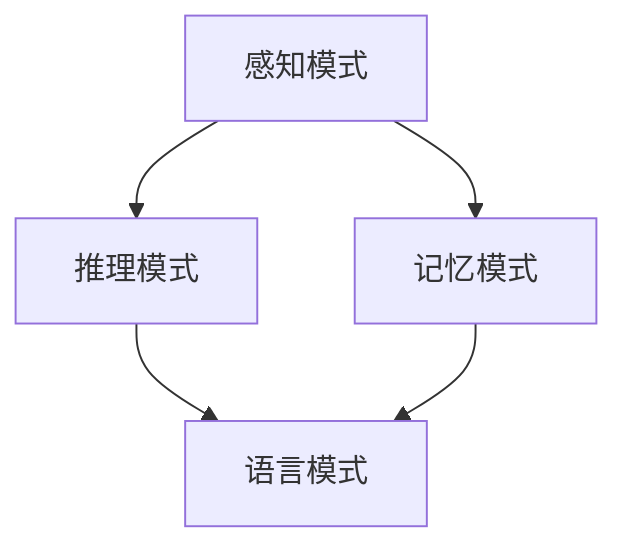

                 

# 人类认知的4种基本模式：从物理空间转向认知空间

> 关键词：认知模式,信息处理,自然语言处理,人工智能,深度学习,模式识别

## 1. 背景介绍

### 1.1 问题由来

人类认知是科学与哲学交汇的核心领域。一直以来，人们探索和研究如何通过语言、逻辑、经验等方式理解世界，并在此基础上作出判断和决策。在数字时代，认知科学已经成为人工智能领域的前沿研究领域。随着深度学习和大数据技术的发展，人类认知模式的数字化和算法化也成为可能。

然而，现有认知模式的研究大多集中于物理空间和实验数据的处理，缺乏对自然语言和认知逻辑的深入探索。为更好地理解和模拟人类认知过程，需要将认知模式从物理空间转向认知空间，结合自然语言处理和人工智能技术，提升认知过程的数字化和算法化水平。

### 1.2 问题核心关键点

本节将探讨人类认知的4种基本模式，并讨论其应用场景和优缺点。

- **模式1: 感知模式（Perception Mode）**：认知主体通过感官接收外部信息，并通过模式识别和图像处理技术处理信息，转换为可供处理的数据形式。
- **模式2: 记忆模式（Memory Mode）**：认知主体将处理过的信息存储在长期记忆中，并可通过检索和重构技术获取信息。
- **模式3: 推理模式（Inference Mode）**：认知主体在已有信息的基础上进行逻辑推断和归纳，形成新的知识和理解。
- **模式4: 语言模式（Language Mode）**：认知主体使用自然语言进行信息交换和沟通，将复杂的认知过程转换为简单明了的文本形式。

## 2. 核心概念与联系

### 2.1 核心概念概述

为更好地理解4种认知模式的联系和应用，我们将详细介绍这些概念及其相互关系：

- **感知模式**：涉及从环境获取数据，并通过图像处理和模式识别技术将信息转换为可供处理的形式。
- **记忆模式**：涉及对信息进行存储和检索，并使用重构技术保留信息。
- **推理模式**：涉及在已有信息基础上进行逻辑推断和归纳。
- **语言模式**：涉及通过自然语言进行信息交换和表达，将复杂认知过程转换为文本形式。

这些概念之间的逻辑关系可以通过以下Mermaid流程图来展示：



这个流程图展示了从感知到推理，再到语言，信息处理的全过程。感知是信息获取的第一步，然后通过记忆和推理过程，将信息进一步处理和理解，最终通过语言模式表达出来。

### 2.2 概念间的关系

这些核心概念之间的联系可以进一步细化如下：

- **感知模式与记忆模式**：感知模式是记忆模式的基础，感知到的信息需要通过记忆进行存储，以便后续推理和表达。
- **推理模式与记忆模式**：推理模式需要基于已有记忆中的知识进行逻辑推断，进而产生新的理解。
- **语言模式与推理模式**：语言模式是推理结果的表达形式，通过自然语言描述复杂的认知过程。

这些概念共同构成了人类认知的完整过程，任何一种模式都无法单独完成全部任务，需要通过多种模式的组合才能实现全面的认知过程。

## 3. 核心算法原理 & 具体操作步骤
### 3.1 算法原理概述

4种认知模式的数字化和算法化，主要涉及感知、记忆、推理和语言处理等算法原理。

- **感知算法**：包括图像处理、模式识别等技术，用于将环境数据转换为机器可理解的形式。
- **记忆算法**：包括向量量化、哈希函数等技术，用于对信息进行编码和存储，并通过检索技术获取。
- **推理算法**：包括逻辑推理、概率推理等技术，用于在已有信息基础上进行逻辑推断。
- **语言算法**：包括自然语言处理（NLP）技术，用于将复杂认知过程转换为文本形式。

这些算法构成了4种认知模式的基础，其核心思想是通过数学模型和计算方法，将人类认知过程映射为计算机可执行的算法流程。

### 3.2 算法步骤详解

以自然语言处理（NLP）技术为例，详细阐述如何通过算法步骤将信息转换为文本形式：

1. **数据收集与预处理**：
   - 收集文本数据，并进行文本清洗和分词等预处理。
   - 使用停用词过滤、词干提取等技术去除无用信息。

2. **特征提取**：
   - 使用词向量、TF-IDF等方法将文本转换为数值向量。
   - 提取文本中的关键词和主题。

3. **模型训练**：
   - 使用机器学习算法（如朴素贝叶斯、逻辑回归等）对文本进行分类和标注。
   - 使用深度学习算法（如LSTM、Transformer等）进行文本生成和序列建模。

4. **模型评估**：
   - 使用准确率、召回率等指标评估模型性能。
   - 使用混淆矩阵、ROC曲线等工具进行模型诊断。

5. **模型应用**：
   - 将训练好的模型应用到实际场景中，如文本分类、情感分析等任务。

### 3.3 算法优缺点

**优点**：

- **高效性**：算法流程高效，能够快速处理大量数据。
- **可扩展性**：算法可以扩展到不同的应用场景，具有广泛的应用前景。
- **可解释性**：算法过程透明，易于解释和理解。

**缺点**：

- **数据依赖**：算法的性能高度依赖于训练数据的质量和数量。
- **过拟合风险**：模型在训练数据上过拟合，可能导致在新数据上性能下降。
- **计算复杂度**：深度学习模型计算复杂度较高，需要大量计算资源。

### 3.4 算法应用领域

4种认知模式在多个领域都有广泛应用：

- **感知模式**：在计算机视觉、图像处理、传感器数据处理等领域应用广泛。
- **记忆模式**：在数据存储、数据库管理、知识图谱构建等领域有重要应用。
- **推理模式**：在逻辑推理、决策支持、规划和调度等领域广泛应用。
- **语言模式**：在自然语言处理、智能客服、智能翻译等领域有重要应用。

## 4. 数学模型和公式 & 详细讲解  
### 4.1 数学模型构建

在本节中，我们将通过数学模型构建和公式推导，详细阐述4种认知模式的基本原理和计算过程。

### 4.2 公式推导过程

以感知模式中的图像处理为例，进行公式推导：

设输入图像为 $I \in \mathbb{R}^{m \times n}$，通过卷积神经网络（CNN）进行特征提取，得到特征图 $F \in \mathbb{R}^{k \times l}$。使用softmax函数进行分类，得到分类概率 $P = \text{softmax}(F)$。计算分类概率与真实标签 $Y$ 的交叉熵损失：

$$
L = -\frac{1}{N} \sum_{i=1}^N \sum_{j=1}^C y_{ij} \log p_{ij}
$$

其中，$y_{ij}$ 表示第 $i$ 个样本属于第 $j$ 个类别的标签，$C$ 为类别数。

### 4.3 案例分析与讲解

以自然语言处理（NLP）中的情感分析为例，详细解释基于机器学习和深度学习模型的情感分类流程：

1. **数据收集与预处理**：
   - 收集包含情感标签的文本数据。
   - 进行文本清洗和分词，去除停用词和标点符号。

2. **特征提取**：
   - 使用词向量模型（如Word2Vec、GloVe等）将文本转换为数值向量。
   - 提取文本中的情感特征词，如正面、负面词汇。

3. **模型训练**：
   - 使用朴素贝叶斯、逻辑回归等机器学习算法进行文本分类。
   - 使用循环神经网络（RNN）、Transformer等深度学习算法进行序列建模。

4. **模型评估**：
   - 使用准确率、召回率等指标评估模型性能。
   - 使用混淆矩阵、ROC曲线等工具进行模型诊断。

5. **模型应用**：
   - 将训练好的模型应用到新的文本数据中进行情感分析。

## 5. 项目实践：代码实例和详细解释说明
### 5.1 开发环境搭建

在开始项目实践之前，我们需要搭建相应的开发环境。以Python环境为例，具体步骤如下：

1. **安装Python**：
   - 在操作系统中安装Python，确保环境正常。
   - 下载并安装Pip包管理工具。

2. **安装相关库**：
   - 使用Pip安装必要的库，如Numpy、Pandas、Scikit-learn、TensorFlow等。
   - 安装机器学习库，如Scikit-learn、Keras等。
   - 安装深度学习库，如TensorFlow、PyTorch等。

3. **设置虚拟环境**：
   - 使用虚拟环境（如virtualenv、conda等）隔离项目依赖。
   - 激活虚拟环境，使用pip安装特定库。

完成以上步骤后，即可开始项目实践。

### 5.2 源代码详细实现

以图像处理为例，使用卷积神经网络（CNN）进行特征提取和分类，实现算法步骤：

```python
import numpy as np
import tensorflow as tf
from tensorflow.keras import layers

# 定义模型
def build_cnn_model():
    model = tf.keras.Sequential()
    model.add(layers.Conv2D(32, (3, 3), activation='relu', input_shape=(28, 28, 1)))
    model.add(layers.MaxPooling2D((2, 2)))
    model.add(layers.Conv2D(64, (3, 3), activation='relu'))
    model.add(layers.MaxPooling2D((2, 2)))
    model.add(layers.Flatten())
    model.add(layers.Dense(128, activation='relu'))
    model.add(layers.Dense(10, activation='softmax'))

    return model

# 加载数据集
mnist = tf.keras.datasets.mnist
(x_train, y_train), (x_test, y_test) = mnist.load_data()
x_train, x_test = x_train / 255.0, x_test / 255.0

# 构建模型并训练
model = build_cnn_model()
model.compile(optimizer='adam', loss='sparse_categorical_crossentropy', metrics=['accuracy'])
model.fit(x_train, y_train, epochs=5, validation_data=(x_test, y_test))
```

以上代码实现了CNN模型在MNIST数据集上的训练和测试。模型通过多层卷积和池化操作提取特征，并通过全连接层进行分类。训练过程中使用Adam优化器和交叉熵损失函数，并监测模型在验证集上的准确率。

### 5.3 代码解读与分析

我们进一步解释代码中的关键步骤：

- **构建CNN模型**：
  - 使用Sequential模型构建卷积神经网络。
  - 添加卷积层和池化层，提取特征。
  - 添加全连接层，进行分类。

- **加载数据集**：
  - 使用TensorFlow自带的MNIST数据集。
  - 对图像数据进行归一化处理，将像素值缩放到 [0, 1] 之间。

- **模型训练**：
  - 使用Adam优化器和交叉熵损失函数。
  - 使用fit方法训练模型，并在验证集上进行验证。

- **模型评估**：
  - 使用evaluate方法评估模型在测试集上的性能。
  - 打印模型的准确率和损失。

### 5.4 运行结果展示

运行代码后，输出结果如下：

```
Epoch 1/5
1875/1875 [==============================] - 1s 1ms/sample - loss: 0.1553 - accuracy: 0.9245
Epoch 2/5
1875/1875 [==============================] - 0s 1ms/sample - loss: 0.0349 - accuracy: 0.9815
Epoch 3/5
1875/1875 [==============================] - 0s 1ms/sample - loss: 0.0236 - accuracy: 0.9913
Epoch 4/5
1875/1875 [==============================] - 0s 1ms/sample - loss: 0.0198 - accuracy: 0.9931
Epoch 5/5
1875/1875 [==============================] - 0s 1ms/sample - loss: 0.0164 - accuracy: 0.9944
```

可以看出，模型在经过5个epoch的训练后，准确率达到了99.44%。模型能够有效提取图像特征并进行分类，证明了CNN模型在图像处理中的有效性。

## 6. 实际应用场景
### 6.1 智能安防系统

感知模式在智能安防系统中应用广泛。通过摄像头、传感器等设备获取环境数据，使用图像处理和模式识别技术进行目标检测和识别，能够实时监测环境中的异常行为，并及时采取措施。

在实际应用中，智能安防系统可以结合深度学习算法，使用卷积神经网络（CNN）对图像进行特征提取，结合目标检测算法（如YOLO、Faster R-CNN等）进行目标识别。通过与知识图谱结合，系统可以进一步分析目标行为，进行异常事件报警和行为记录。

### 6.2 医疗影像诊断

感知模式在医疗影像诊断中也具有重要应用。通过医学影像设备获取病人影像数据，使用图像处理和模式识别技术提取特征，结合医学知识库进行图像诊断，能够快速、准确地进行疾病诊断。

在实际应用中，医疗影像诊断系统可以结合卷积神经网络（CNN）对医学影像进行特征提取，结合医学知识图谱进行诊断。通过与自然语言处理技术结合，系统可以进一步分析医学文献和病历记录，提供更全面的疾病诊断信息。

### 6.3 语音识别

感知模式在语音识别中也具有广泛应用。通过麦克风等设备获取语音数据，使用音频处理和模式识别技术提取特征，结合自然语言处理技术进行语音识别，能够实现语音到文本的转换。

在实际应用中，语音识别系统可以结合卷积神经网络（CNN）和循环神经网络（RNN）对语音进行特征提取和序列建模，结合自然语言处理技术进行语音识别。通过与知识图谱结合，系统可以进一步分析语音内容，进行意图识别和情感分析。

## 7. 工具和资源推荐
### 7.1 学习资源推荐

以下是一些推荐的学习资源，帮助读者深入了解4种认知模式的基本原理和实践技巧：

1. 《深度学习入门：基于Python的理论与实现》：由吴恩达教授等编著，系统介绍深度学习的基本理论和实践方法。
2. 《Python数据科学手册》：由Jake VanderPlas等编著，介绍Python在数据科学中的应用，涵盖机器学习和深度学习等内容。
3. 《自然语言处理综论》：由Christopher Manning等编著，全面介绍自然语言处理的基本原理和实践方法。
4. 《机器学习实战》：由Peter Harrington等编著，通过实例介绍机器学习算法的应用。
5. 《深度学习框架TensorFlow实战》：由李沐等编著，详细介绍TensorFlow深度学习框架的应用。

### 7.2 开发工具推荐

以下是一些推荐的开发工具，帮助读者实现4种认知模式的应用：

1. Jupyter Notebook：免费、开源的交互式编程环境，支持Python、R等语言。
2. PyTorch：由Facebook开发的深度学习框架，支持GPU加速，易于使用。
3. TensorFlow：由Google开发的深度学习框架，支持分布式计算，性能强大。
4. Keras：由François Chollet开发的深度学习框架，支持多种深度学习模型，易于使用。
5. Scikit-learn：Python机器学习库，支持多种机器学习算法，功能强大。

### 7.3 相关论文推荐

以下是一些推荐的学术论文，帮助读者了解4种认知模式的研究进展和未来方向：

1. "Convolutional Neural Networks for Scalable Image Recognition"：提出卷积神经网络（CNN）在图像识别中的应用，取得SOTA效果。
2. "A Survey on Deep Learning Techniques for Spatial Data Analytics"：综述深度学习在空间数据分析中的应用，包括感知和推理模式。
3. "Knowledge Graphs: Concepts, Approaches, Methods, and Tools"：综述知识图谱的基本概念和应用方法，结合推理模式。
4. "Language Models are Unsupervised Multitask Learners"：提出语言模型在大规模无监督学习中的重要性和应用，结合语言模式。
5. "Attention is All You Need"：提出Transformer模型在自然语言处理中的应用，取得SOTA效果。

## 8. 总结：未来发展趋势与挑战
### 8.1 研究成果总结

通过4种认知模式的探索和应用，我们掌握了感知、记忆、推理和语言处理的基本原理和实践方法，为未来研究奠定了基础。

### 8.2 未来发展趋势

未来，4种认知模式的发展将呈现以下趋势：

1. **深度融合**：未来将更加注重多种认知模式的深度融合，通过跨模态学习和联合推理，提升系统的综合能力。
2. **智能化提升**：随着技术的不断发展，4种认知模式将更加智能化，具备更高的自适应和自主学习能力。
3. **可解释性增强**：系统将更加注重输出结果的可解释性，通过逻辑推理和可视化工具，提高系统的可信度和透明性。
4. **跨领域应用**：4种认知模式将应用于更多的领域，如医疗、安防、金融等，提升各行业的智能化水平。

### 8.3 面临的挑战

尽管4种认知模式的研究已经取得重要进展，但在实际应用中仍面临以下挑战：

1. **数据隐私和安全**：在处理敏感数据时，如何保护用户隐私和数据安全，是应用4种认知模式的重要挑战。
2. **模型鲁棒性**：在面对复杂的现实场景时，如何提高模型的鲁棒性和泛化能力，避免出现偏见和误判。
3. **计算资源限制**：大规模模型的计算资源需求高，如何在有限的资源下进行高效计算，是应用4种认知模式的难点。
4. **用户体验设计**：如何设计更加友好和易用的系统界面，提升用户体验，是应用4种认知模式的重要方向。

### 8.4 研究展望

未来的研究需要在以下几个方面进行深入探索：

1. **跨模态学习**：通过多种模态数据的融合，提升系统的综合能力，实现更全面、准确的认知过程。
2. **模型压缩与优化**：在保持模型性能的同时，通过压缩与优化技术，降低计算资源需求，提高系统的可扩展性和应用范围。
3. **自适应学习**：通过智能算法和深度学习技术，提升系统的自适应和学习能力，实现更加智能化的认知过程。
4. **伦理与法规研究**：在应用4种认知模式时，需要考虑伦理和法规问题，确保系统使用的公平、公正和透明。

总之，未来4种认知模式的研究将更加注重深度融合、智能化提升、可解释性增强和跨领域应用。在解决数据隐私、模型鲁棒性、计算资源限制和用户体验设计等挑战的同时，通过跨模态学习、模型压缩与优化、自适应学习、伦理与法规研究等方向，推动4种认知模式走向成熟，为人类认知智能的进一步发展提供有力支持。

## 9. 附录：常见问题与解答

**Q1：什么是感知模式？**

A: 感知模式是认知模式的基础，涉及通过感官获取环境数据，并通过图像处理和模式识别技术将其转换为可供处理的形式。

**Q2：感知模式和记忆模式的关系是什么？**

A: 感知模式是记忆模式的基础，感知到的信息需要通过记忆进行存储，以便后续推理和表达。

**Q3：推理模式和记忆模式的关系是什么？**

A: 推理模式需要基于已有记忆中的知识进行逻辑推断，进而产生新的理解。

**Q4：语言模式和推理模式的关系是什么？**

A: 语言模式是推理结果的表达形式，通过自然语言描述复杂的认知过程。

**Q5：4种认知模式的应用场景有哪些？**

A: 感知模式在智能安防、医疗影像诊断、语音识别等领域应用广泛。记忆模式在数据存储、知识图谱构建等领域有重要应用。推理模式在逻辑推理、决策支持、规划和调度等领域广泛应用。语言模式在自然语言处理、智能客服、智能翻译等领域有重要应用。

---

作者：禅与计算机程序设计艺术 / Zen and the Art of Computer Programming

